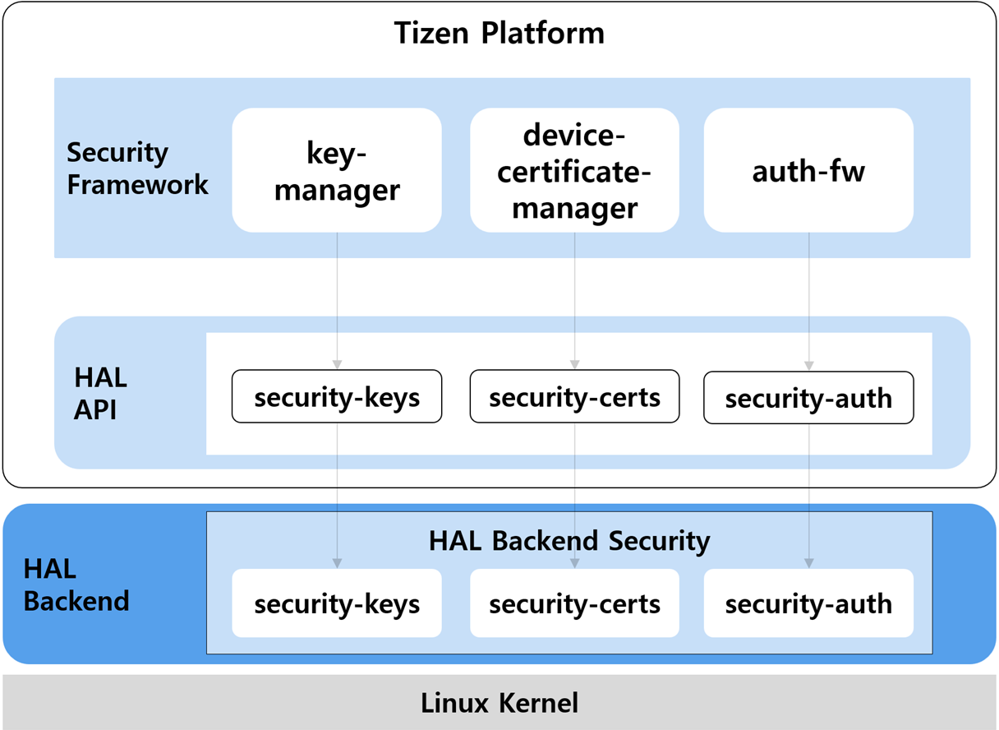

# Security

HAL modules related to the Security framework support below features.
- Security Auth
- Security Certs
- Security Keys

**Figure: Tizen Security HAL hierarchy**

## Security Auth

The Security Auth provides functions to handle the authentication per user.

The Security Auth functions provide methods to:
- Create password file
- Write password auth parameters from memory to file
- Write the number of attempts to enter password auth till now
- Set a new password auth context
- Check if the entered password auth context is the same as the current password
- Set the maximum number of history size to store password context in the past
- Get the maximum number of history size
- Get the expire time period in days
- Set the expire time period in days
- Get the expire time left in seconds
- Set the expire time left in seconds
- Get the accumulated attempt number for user's password auth tries
- Reset the accumulated attempt number for user's password auth tries
- Increase the accumulated attempt number for user's password auth tries
- Get the limited maximum attempt number of user's password auth tries
- Set the limited maximum attempt number of user's password auth tries
- Get the active status of user's password auth context
- Check if the entered password context has the previously-used history
- Check if the password auth context has expired
- Check if the accumulated attempt number for user's password auth try exceeds the limited maximum attempt
- Check if the new attempt interval elapsed the ignore period(ex. RETRY_TIMEOUT = 0.5 secs)
- Check if the history for storing the previous password context is activated
- Get the password type regarding to the user

## Security Certs

The Security Certs provides functions for device certificates and signing operations.

The Security Certs functions provide methods to:
- Load/Unload for certs hal-backend module
- Create/Free a key context based on specific key type
- Request a certificate chain which was pre-injected in device
- Create a signature on a given data using a private key
- Get key type (UNKNOWN, RSA or ECDSA)
- Get key length in bits
- Call extended API method
- Get extended API privilege

## Security Keys

The Security Keys provides functions to handle keys and data related operations.

The Security Keys functions provide methods to:
- Create initialization vector
- Create/Destroy keys (AES, RSA, DSA, ECDSA, KEM)
- Import/Export wrapped keys
- Encapsulate/Decapsulate KEM keys
- Import/Export data
- Wrap/Unwrap concatenated data
- Encrypt/Decrypt data using selected key and algorithm
- Initialize and perform symmetric encryption or decryption operations
- Create and verify signature for a given message using a private/public key
- Derive keys (ECDH, KBKDF, KBKDF hybrid)
- Get key chunk size
- Create DBP key
- Encrypt data with DBP key