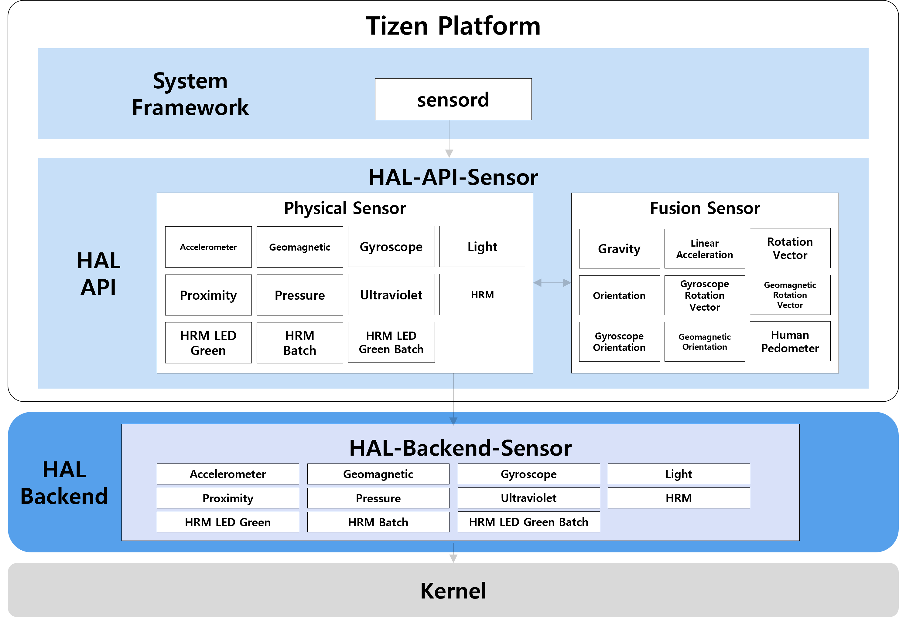
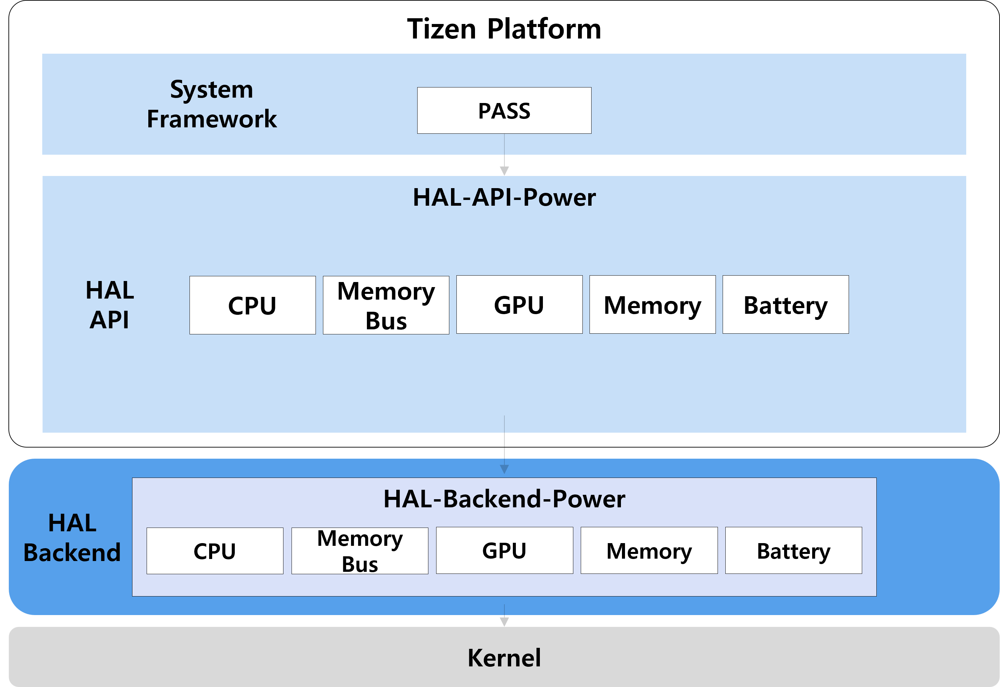

# System

## Sensor Resource Management

The Tizen supports various sensors such as accelerometers, gyroscopes, and magnetometers. These sensors are used by applications to provide a variety of services, such as motion detection, gesture recognition, and location tracking. To manage these sensors efficiently, the Tizen platform uses a sensor resource management framework.
The Tizen uses HAL architecture to abstract the hardware-specific details of sensor devices. Below figure shows the sensor HAL architecture in Tizen.

**Figure: Sensor HAL architecture**

### Sensor descriptions and combinations
Sensor|Description|Sensor combinations
---|---|---
SENSOR_ACCELEROMETER|Accelerometer|Physical Sensor
SENSOR_GRAVITY|Gravitational Accelerometer|SENSOR_ACCELEROMETER + SENSOR_GYROSCOPE SENSOR_ACCELEROMETER + lowpass filter
SENSOR_LINEAR_ACCELERATION|Accelerometer without Gravity|SENSOR_ACCELEROMETER - SENSOR_GRAVITY
SENSOR_MAGNETIC|Geomagnetic field|Physical Sensor
SENSOR_ROTATION_VECTOR|Rotation of device|SENSOR_ACCELEROMETER + SENSOR_GYROSCOPE + SENSOR_MAGNETIC
SENSOR_ORIENTATION|Orientation of device(Azimuth, Pitch, Roll|SENSOR_ROTATION_VECTOR(Convert (x,y,x) to (Azimuth, Pitch, Roll))
SENSOR_GYROSCOPE|Gyroscope|Physical Sensor
SENSOR_LIGHT|Light intensity|Physical Sensor
SENSOR_PROXIMITY|Proximity detection|Physical Sensor
SENSOR_PRESSURE|Atmospheric pressure|Physical Sensor
SENSOR_ULTRAVIOLET|Ultraviolet ray|Physical Sensor
SENSOR_HRM|Heart rate monitor(per minute)|Physical Sensor
SENSOR_HRM_LED_GREEN|Green LED light for HRM|Physical Sensor
SENSOR_GYROSCOPE_ROTATION_VECTOR|Rotation of device(x, y, z)|SENSOR_ACCELEROMETER + SENSOR_GYROSCOPE
SENSOR_GEOMAGNETIC_ROTATION_VECTOR|Rotation of device(x, y, z)|SENSOR_ACCELEROMETER + SENSOR_MAGNETIC
SENSOR_GYROSCOPE_ORIENTATION|Rotation of device(Azimuth, Pitch, Roll)|SENSOR_GYROSCOPE_ROTATION_VECTOR(Convert (x,y,x) to (Azimuth, Pitch, Roll))
SENSOR_GEOMAGNETIC_ORIENTATION|Rotation of device(Azimuth, Pitch, Roll)|SENSOR_GEOMAGNETIC_ROTATION_VECTOR(Convert (x,y,x) to (Azimuth, Pitch, Roll))
SENSOR_HRM_BATCH|Batch data of Heart rate monitor (provide datas saved in buffer)|Physical Sensor
SENSOR_HRM_LED_GREEN_BATCH|Batch data of Green LED light for HRM (provide datas saved in buffer)|Physical Sensor
SENSOR_HUMAN_PEDOMETER|Pedometer(steps)|SENSOR_ACCELEROMETER

## Power Resource Management
It includes PASS (system daemon), hal-api-power, and hal-backend-power.

PASS (Power-Aware System Service) is a daemon that handles devices such as CPU, memory bus, GPU, memory, and battery.
Hal-api-power is an interface to connect pass and hal-backend-power.
Hal-backend-power requests the control of the device to Linux kernel.

**Figure: Power Resource Management HAL hierarchy**

These are supported HAL API Device modules
- CPU
- Memory Bus
- GPU
- Memory
- Battery

### CPU
The CPU HAL module provides management of CPU frequency, thermal, and CPU hotplug. 

### Memory Bus
The memory bus module provides management of Device Frequency Scaling (devfreq) and thermal of memory bus.  

### GPU
The GPU module provides management of GPU frequency and thermal.

### Memory
The Memory module provides management of physical memory size during a page fault.

### Battery
The battery module provides management of battery such as thermal, charging status, and charging current.
