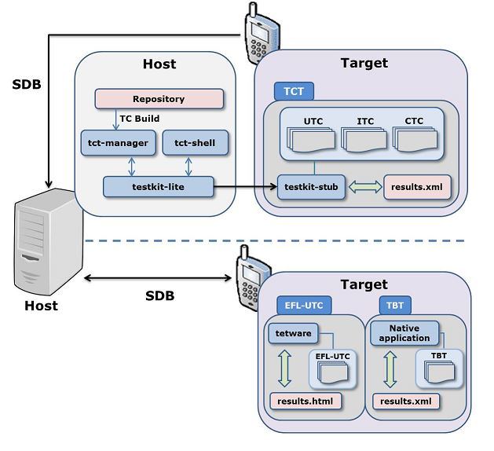
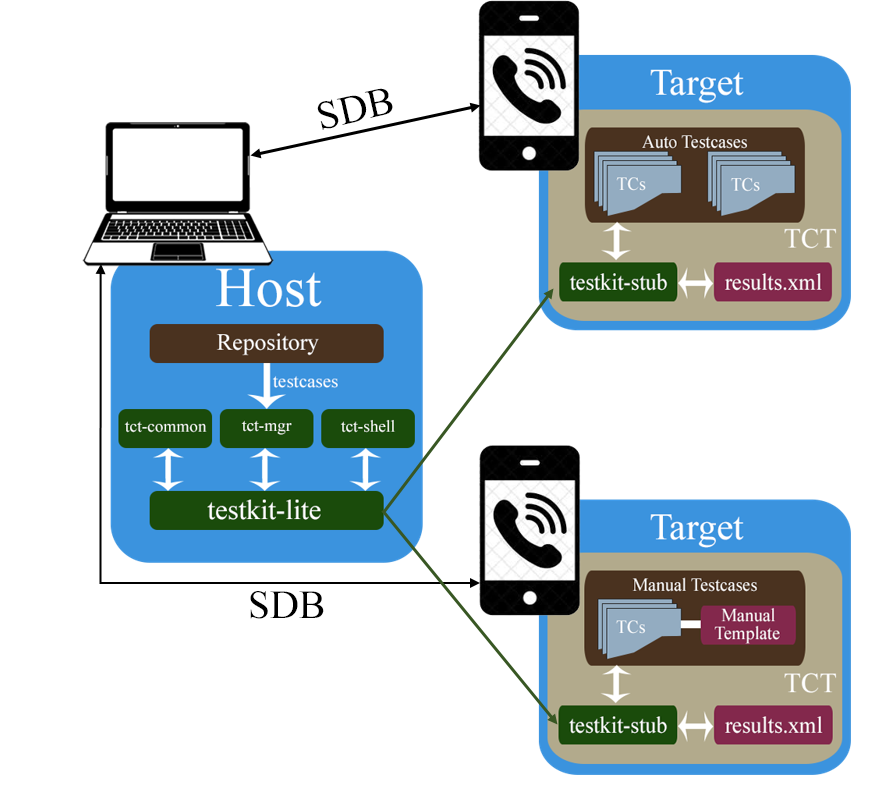

# Tizen Compliance Tests

Tizen Compliance Tests (TCT) verify conformance to the [Tizen Compliance Specification](compliance-specification.md) (TCS). These tests are intended to be used by Tizen device implementers to build a Tizen-compliant development environment for Tizen application developers.

TCT consists of the Web TCT and the Native TCT, which include test suites and tools for testing on the Tizen Web stack and Native stack, respectively.

## Web TCT

Web TCT is a set of tools and test suites to test the Web requirements defined in the Tizen Compliance Specification. It includes:

- Web Test Suites cover Tizen Web Device APIs, Tizen Advanced UI Framework, W3C/HTML5 and Supplementaries and device capability features.
- Web TCT Manager is a GUI tool that runs on the host machine, managing the whole testing procedure, from plan to test report, supporting both automated and manual Web testing.
- Web TCT Behavior Test tool is used to test behavior of hardware and software features in interactive mode.
- Web TCT Shell is a lightweight console tool that runs on the host machine, allowing users to debug single failed test cases or trigger TCT testing with an existing test plan. Web TCT Shell is an optional tool.
- User guide documents and installation scripts.

**Figure: Web TCT workflow**

### Using Web TCT

Before starting, make sure the following prerequisites are met:

- Host machine with 1 of the following Linux distribution versions installed:
  - Ubuntu 12.04 (32-bit)
  - Ubuntu 12.04 (64-bit)
  - Ubuntu 12.10 (32-bit)
  - Ubuntu 12.10 (64-bit)
- Host machine is connected to the Internet through Ethernet or Wi-Fi, and attached to the target device through USB.
- Target device is installed with a Tizen image and is bootable.
- Target device supports unzipping packages.

To install and use Web TCT:

- Download the Web TCT tarball package to the host machine.
- Untar the Web TCT tarball under your work folder on the host machine.
- Follow the instructions in the `Web_TCT_<version>_User_Guide_v1.0.pdf` file in the `./doc/` folder to set up a host machine and a target device, and run Web TCT.
- Use Web TCT Manager to run all Web TCT tests and show the test results automatically.
- Use Web TCT Behavior Test tool on a target device to run manual test cases step by step.

## Native TCT

Native TCT is a set of tools and test cases to test native requirements defined in the Tizen Compliance Specification (TCS). It includes:

- Native TCT covers Signature, Native API, App Control, Privilege, Resource, Device Capability features.
- Native TCT consists of TCT, TBT (Tizen Behavior Test), and EFL-UTC packages.
- TCT manager is a GUI tool to manage whole tests, from planning to results.
- TCT package includes Unit Test Case, Integration Test Case, and Compatibility Test Case TCT.
- There are separate TBT (Tizen Behavior Test) and EFL-UTC applications to test the behavior of hardware and software features in interactive mode.

**Figure: Native TCT workflow**

### Using Native TCT

Before starting, make sure the following prerequisites are met:

- Make a USB connection between the target and the host.
- The target device is installed with a Tizen image and is bootable.
- The target device supports the sdb commands.

To install and use Native TCT:

- Download the Native TCT, TBT, and EFL-UTC packages.
- Follow the User Guide PDF in each projects' folder to set up the host and the target, and then run Native TCT.  
  The TCT manager runs all the TCT TCs and shows test results automatically.
- Install Native TBT onto the target and run manual test cases step by step.
- Install Native EFL-UTC onto the target and run automated test cases.

## Csharp TCT

CSharp TCT is a set of tools and test cases to test the CSharp requirements defined in the Tizen Compliance Specification (TCS). It includes:

-	CSharp TCT covers CSharp Apis, App Control, Network, Privilege, Resource, Device Capability features.
-	CSharp TCT Manager is a GUI tool that runs on the host machine, managing the whole testing procedure, from plan to test report, supporting both automated and manual C# testing
-	TCT package includes Unit Test Case automation and manual
-	CSharp TCT Manual Test template tool is used to test behavior and events of hardware and software features in interactive mode.
-	User guide documents and installation scripts.

**Figure: CSharp TCT workflow**

### Using CSharp TCT

Before starting, make sure the following prerequisites are met:

-	Host machine is a linux OS which use version from 12.04
-	The target device is installed with a Tizen image and is bootable.
-	The host and the target device supports the sdb commands.
-	Make a USB connection between the target and the host.

To install and use CSharp TCT:

- Download the C# tct to the host machine.
- Un-tar the C# tct under your work folder on the host machine.
- Follow the User Guide PDF in each projects’ folder to set up the host and the target, and then run C# tct.
- The tct manager runs all the tct testcases and shows test results automatically.
- Use C# TCT Manual Test template tool on a target device to run manual test cases step by step

## TCT Report Submission

TCT will generate following test reports:

- Web TCT Test Report
- Web TCT Behavior Test Report
- Native TCT Test Report
- Native TBT Test Report
- Native EFL Test Report
- CSharp TCT Test Report
- CSharp TCT Behavior Test Report

Follow the [Compliance Program Steps](compliance-program.md) to submit the test reports above.

## TCT Releases

To access TCT releases, go to:

- [http://download.tizen.org/tct/](http://download.tizen.org/tct/)

