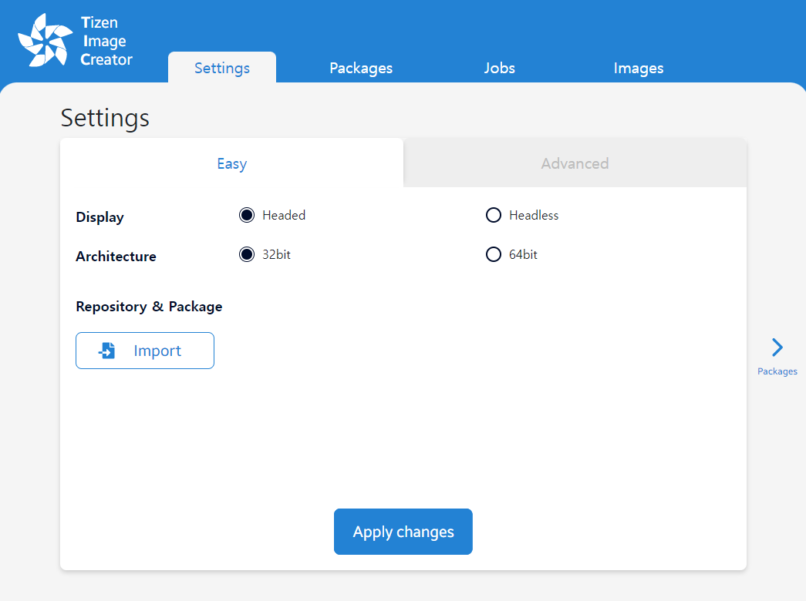

# Create Tizen Images with Tizen Image Creator (TIC)

This topic provides information on how to create a Tizen image with TIC.

To use TIC, you have to set up the docker initially. For information on docker setup, see [Set up docker](../reference/set-up-docker.md).

## Tizen Image Creator

TIC is an image creator tool used to create images for Tizen. The main features of TIC are as follows:

- Provides web-based user interface
- Easy installation with the docker image
- Supports YAML style recipe

### Supported environment

- Ubuntu 16.04 LTS or higher

### Set up TIC on your PC

1. Download the pre-configured docker-compose file, [TIC docker-compose](https://s3-us-west-1.amazonaws.com/tizenschool/257/docker-compose.yaml).

2. Run the TIC docker container as a service:

   ```shell
      docker login -u [DockerHub_Username] -p [DockerHub_Password]
      docker-compose pull
      docker-compose up -d
   ```

### Connect to the TIC web-service

Open the web browser and enter `http://127.0.0.1:8088` in the address bar. The TIC web UI screen appears:

  

Once the Tizen image is created, the final step is to flash the image to a target device for verification. For more information, see [Flashing an Image to RPI](flashing-rpi.md).

[TIC Frequently Asked Questions](../reference/tic-faq.md) describes frequently asked questions and known issues.
