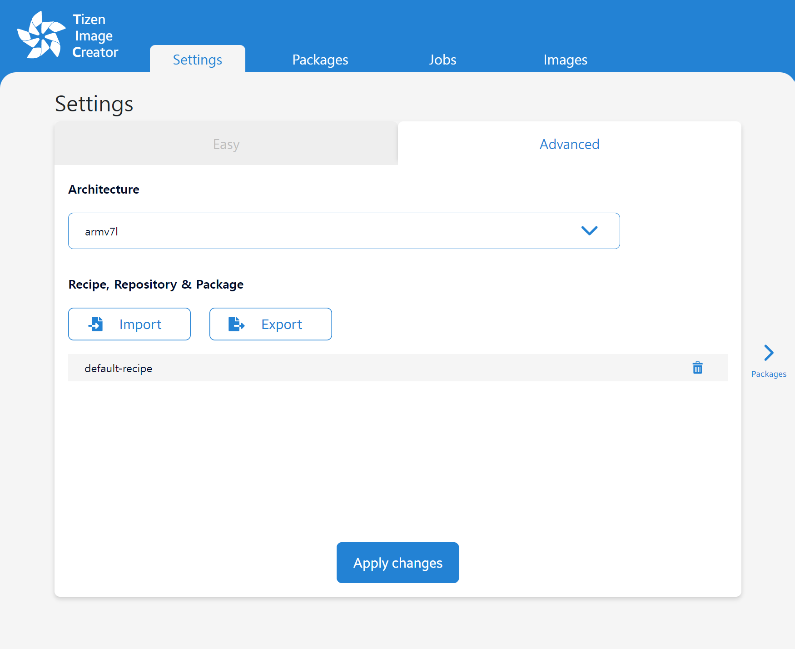
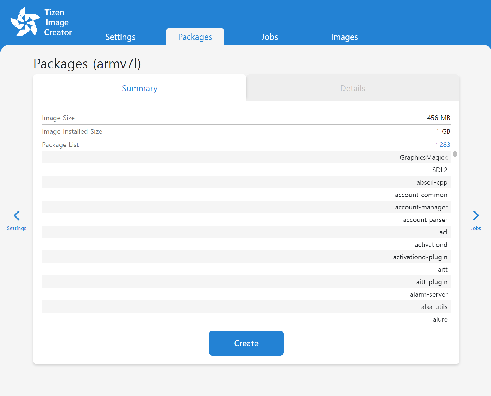
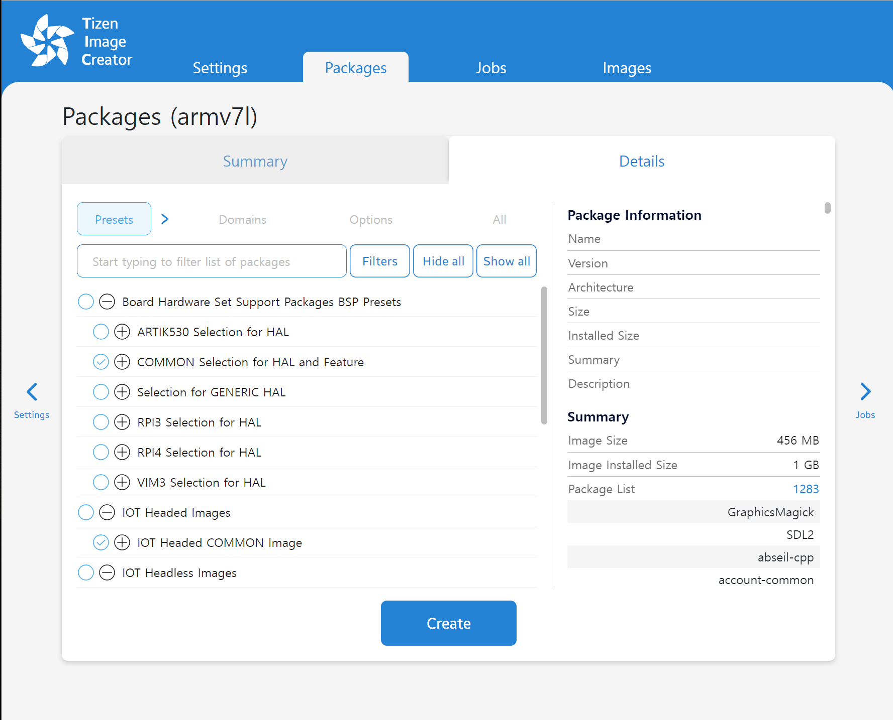
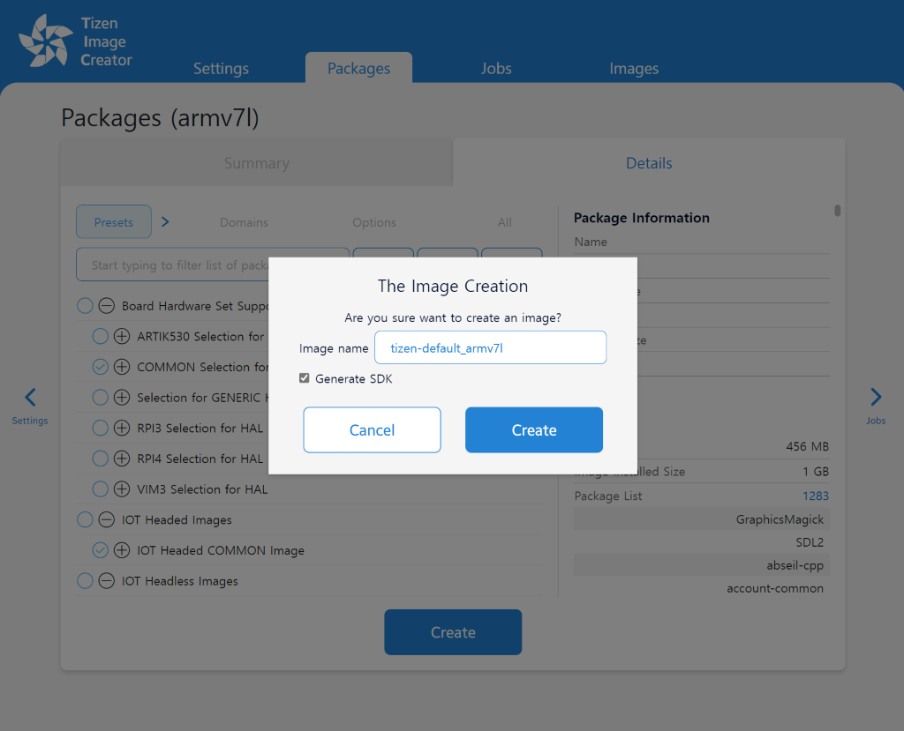
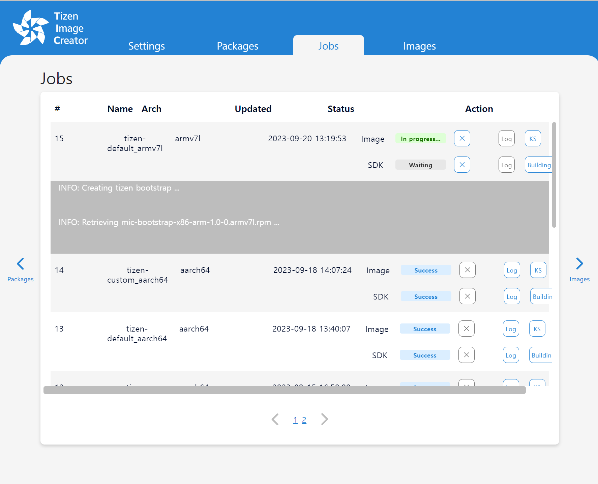
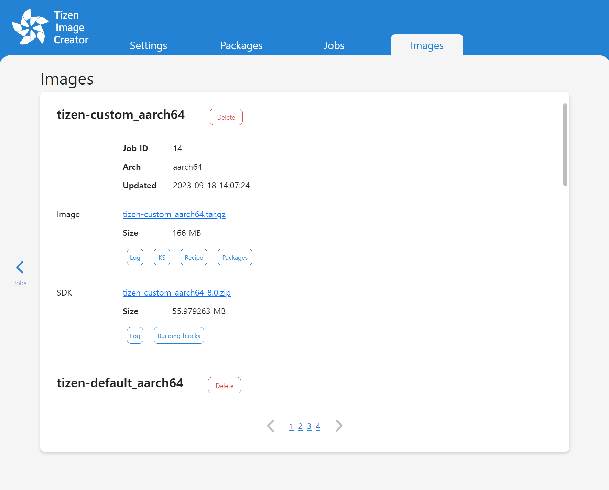

# Create Tizen Images with Tizen Image Creator (TIC)

This topic provides information on how to create a Tizen image with TIC.

To use TIC, you have to set up the docker initially. For information on docker setup, see [Set up docker](../reference/set-up-docker.md).

## Tizen Image Creator

TIC is an image creator tool used to create images for Tizen. The main features of TIC are as follows:

- Provides web-based user interface
- Easy installation with the docker image
- Supports YAML style recipe

### Supported environment

- Ubuntu 16.04 LTS or higher

### Set up TIC on your PC

1. Download the pre-configured docker-compose file, [TIC docker-compose](https://raw.githubusercontent.com/Samsung/tizen-docs/master/docs/platform/developing/media/docker-compose.yaml).

2. Run the TIC docker container as a service:

   ```shell
      mkdir -p $HOME/tic-artifacts
      docker login -u [DockerHub_Username] -p [DockerHub_Password]
      docker-compose pull
      docker-compose up -d
   ```

### Connect to the TIC web-service

   * Open the web browser and enter `http://127.0.0.1:8088` in the address bar. The TIC web UI screen appears:
   

### Create a new Tizen image and SDK package

#### Settings
   * Easy
     * Select predefined set of images
     * Click `Apply changes` button
     

   * Advanced
     * Select `Architecture`
     * Import your own `Recipe, Repository & Package` (optional)
     * Click `Apply changes` button
     

#### Packages
   * If you select `Easy` mode, in Settings stage, you can see `Summary` of the image to be generated.
      

   * If you select `Advanced` mode, in Settings stage, you can see `Details` tab.
   
     * Select `packages` to be included in the image that will be created.
   * Click `Create` button
   
     * Enter an image name.
     * Check `Generate SDK` checkbox, if you want to generate SDK package.
   * Click `Create` button again.

#### Jobs
   * You can see the list of image creation jobs and their progress.
   
   * Click `X` button if you want to cancel the job.

#### Images
   * You can see the list of images.
   
   * Click the link of the image or SDK to download them.

To flash the generated image by TIC to a target device for verification, see [Flashing an Image to RPI](flashing-rpi.md).

To use the generated SDK to develope applications with Tizen Studio, see [Configuring the Package Manager](../../application/tizen-studio/setup/advanced-configuration.md) and [Configurable SDK](../../application/tizen-studio/configurable-sdk/configurable-sdk.md).

[TIC Frequently Asked Questions](../reference/tic-faq.md) describes frequently asked questions and known issues.
