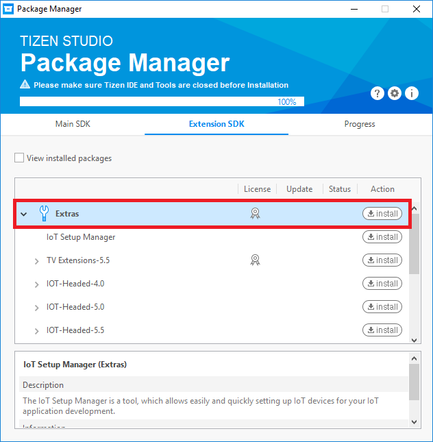
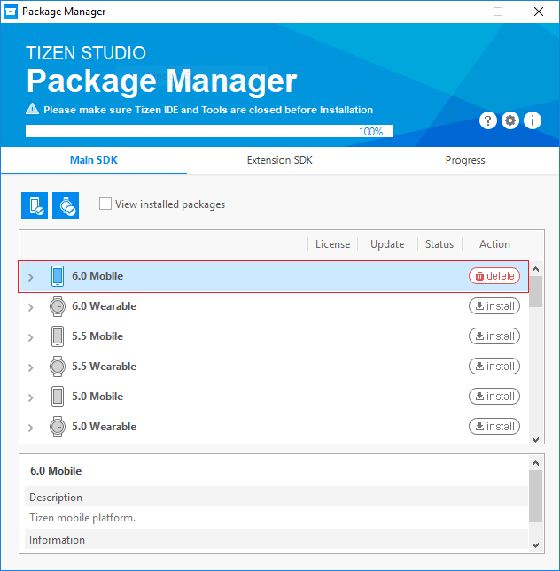
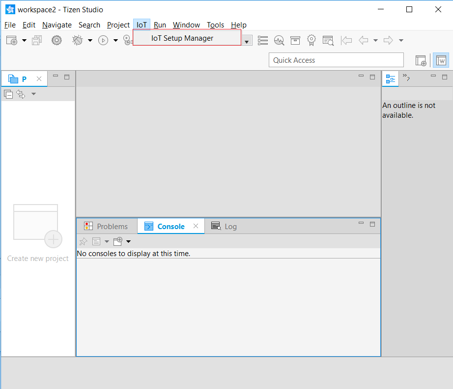
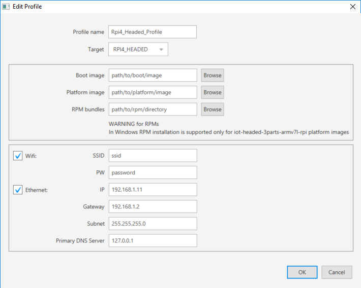
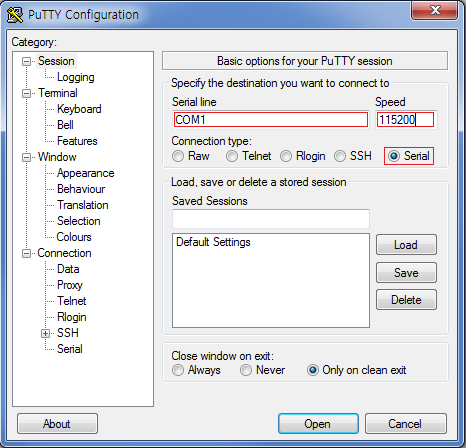
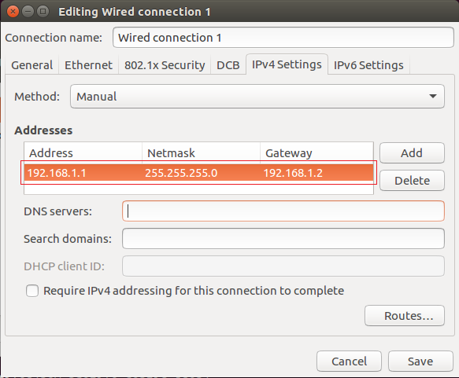
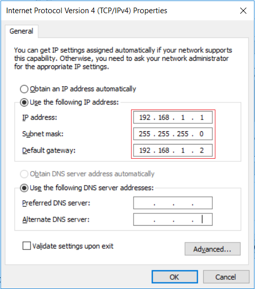

# Flashing an Image to RPI

This topic describes how to flash Tizen on SD card with or without IoT Setup Manager and setting up Raspberry Pi 3 or 4.

## Supported systems

|Division	|Ubuntu	|Windows	|
|:---:		|:---:	|:---:		|
|Headless 32-bit|Yes	|No			|
|Headed 32-bit|Yes	|Yes		|
|Headed 64-bit|Yes	|No			|

>    [!NOTE]
>
>    In windows, only EXT4 type file of rootfs.img is supported to flash rpm bundles. (While using Headed 64-bit image and Headless 32-bit image, RPMs cannot be installed through IOT setup manager because rootsfs.img is of BTRFS type file.)

## Prerequisites

### Operating system

IoT Setup Manager supports the following operating systems:

-   Windows 7 and later (64-bit and 32-bit)
-   Ubuntu 14.04 LTS and later (64-bit and 32-bit)

### Ubuntu tools

If you are using Ubuntu, the following packages must be installed in addition to the IoT Setup Manager:

-   rpm2cpio
-   cpio

If the packages are not installed, run the following command to install a package:

```
sudo apt-get install <package-name>
```

### Download binaries

You must have the supported binary images in your computer. You can download the binary images from:

1.   To Download images visit [Downloads](http://download.tizen.org/releases/milestone/tizen)
2.   Click on 6.0-unified (or "unified" whichever is present) > latest > images > standard.
3.   For different devices or profiles download the compressed file from:

     1.   RPI3 Headless 32-bit:
          1.    Boot Image: iot-boot-armv7l-rpi3/
          2.   Platform Image:	iot-headless-2parts-armv7l-btrfs-rootfs-rpi/

     2.   RPI3 Headed 32-bit:
          1.    Boot Image:	iot-boot-armv7l-rpi3/
          2.   Platform Image: iot-headed-3parts-armv7l-rpi/

     3.   RPI4 Headless 32-bit:
          1.    Boot Image: iot-boot-armv7l-rpi4/
          2.   Platform Image: iot-headless-2parts-armv7l-btrfs-rootfs-rpi/

     4.   RPI4 Headed 32-bit:
          1.    Boot Image: iot-boot-armv7l-rpi4/
          2.   Platform Image: iot-headed-3parts-armv7l-rpi/

     5.   RPI3 Headed 64-bit:
          1.    Boot Image:	iot-boot-arm64-rpi3/
          2.   Platform Image:	iot-headed-3parts-aarch64-rpi/

     6.   RPI4 Headed 64-bit:
          1.    Boot Image:	iot-boot-arm64-rpi4/
          2.   Platform Image:	iot-headed-3parts-aarch64-rpi/

## Install tizen studio

>    [!NOTE]
>
>    You can skip this section, if you have already installed latest Tizen Studio 4.0 and installed the **6.0 Mobile** profile for the **Main SDK** and the **IoT Setup Manager**, **IoT-Headed-6.0** and **IoT-Headless-6.0** profiles for the **Extension SDK**.

To install Tizen Studio and the required profiles for IoT development, follow these steps:

1.  Download and install Tizen Studio 4.0 for your operating system from [Tizen developer site](https://developer.tizen.org/development/tizen-studio/download).
2.  Open Tizen Studio and go to **Tools > Package Manager**.
3.  Click **Extension SDK** and verify whether the IoT Setup Manager appears in the list of available packages.
4.  Click **install** for **IoT Setup Manager** to install the IoT Setup Manager Extension.

    
	
5.  Click **Main SDK** tab, and install the **6.0 Mobile** profile:

    
	
    >    [!NOTE]
    >
    >    **Extension SDK** should be updated to the latest version.


## Flash tizen images with IoT setup manager

IoT Setup Manager helps you to easily install Tizen on your IoT device using your computer. It helps to get your device running and connected to the local network. After your device is connected to the local network, you can start developing and testing the Tizen IoT applications.

### Launch IoT setup manager

You can launch the IoT Setup Manager with or without using Tizen Studio:

#### Launch using tizen studio

From Tizen Studio, you can launch the IoT Setup Manager in the following two ways:

-   On the menu bar, go to **IoT > IoT Setup Manager**.
-   On the toolbar, click the IoT Setup Manager icon as shown in the following image:

    

#### Launch without using tizen studio

During installation, the Package Manager creates shortcuts for IoT Setup Manager, which are used to launch the IoT Setup Manager as a standalone application. To launch the IoT Setup Manager for:

-   Windows, go to **Start Menu > Programs > Tizen Studio > Tools > IoT Setup Manager**.
-   Ubuntu, go to **Dash (equivalent to Start Menu) > Applications > IoT Setup Manager**.

    

### Flash SD card using IoT setup manager

To flash Tizen on your SD card using the IoT Setup Manager:

Profiles are an easy way to store image paths and network configuration information. After you save a profile, you can use it to flash your SD Card instead of specifying all information again.

1.  Create a profile:
    1.   Click **Create** to create a profile. The **Edit Profile** window appears.
      
         

    2.   Provide the required information such as target, local paths to boot and platform image, and so on.

         1.   **Profile name**: Enter a profile name, for example, Rpi4_Headed_Profile.
         2.   **Target**: Select the board and image type from the drop-down list. For example, RPI4_HEADED.
         3.   **Boot image**: Browse for the Tizen Boot image available on your hard drive. You must select proper images depending on the board. For more information, see [Downlaod Guide](#download-binaries).
         4.   **Platform image**: Browse for the Tizen Platform image available on your hard drive. You must select proper images depending on the board. For more information, see [Downlaod Guide](#download-binaries).
         5.   **RPM bundles**: 
              -   Add the bundle directory to the Bundles panel.
              -   Use this to install Wi-Fi plugin. Download using [Installing Drivers](#installing-drivers). Unzip and add path to 32-bit rpm or 64-bit rpm according to image to install.
              -   Leave blank if no rpm installation required.
         6.   **WiFi**: Enter the SSID and password to connect automatically to Wi-Fi. (Wi-Fi plugin installation is required). If Wi-Fi or ethernet is not required, you can clear the respective check box.
         7.   **Ethernet**:
              -   **IP**: 192.168.1.11
              -   **Gateway**: 192.168.1.2
              -   **Subnet**: 255.255.255.0
              -   **Primary DNS Server**: 127.0.0.1

     3. Click **OK** to save.

2. Select the SD card on which you want to burn Tizen:
      1. Insert your SD Card into your computer.
      2. Select the appropriate SD Card from the drop-down list. For Example, `/dev/sdx` on Ubuntu and `F:` on Windows.

      >    [!NOTE]
      >
      >    Currently, the USB SD card reader is only supported. The internal PC SD slot is not supported.
      >    Also, if the **Select Drive** does not show anything, detach and insert the SD card again into the computer, or close and restart IoT Setup Manager.

3. Burn Tizen on your SD Card:
      1. Click **Burn** to burn Tizen to your SD Card. This takes about two minutes to complete and you may have to enter your supervisor password, which is required to access the SD card.
	
#### Precaution while flashing image

-   While creating or editing a profile, ensure that the boot images, platform images, and the RPMs (if selected) match the target device.
-   Ensure that there are no white spaces in the boot image, platform image, and the RPM folder paths.
-   Place RPMs in a separate directory, which does not contain any other files or directories and select the directory path for creating the profile.

#### IoT setup manager features

-   **Saved Profiles:** You can save and retrieve the configuration profiles for easy flashing.
-   **Three Steps Flashing:**
    1.  Select the profile.
    2.  Select your SD Card.
    3.  Click **Burn**.

## Setting up Raspberry Pi 3 or 4

### Connecting the board to the PC

To configure the Raspberry Pi board:

1.  Insert the SD card, in which Tizen IoT binaries and the drivers are flashed into the Raspberry Pi board.
2.  For the serial communication connection:
    1.  Connect the host computer to the Raspberry Pi with a **UART-to-USB** dongle such as PL2303 or FT232 USB UART board.

        To use the PL2303, connect the Raspberry Pi TXD0 pin (pin 8) to RXD on the UART board, RXD0 (pin 10) to TXD on the UART board, and the ground (pin 6) to GND on the UART board, and set the jumper switch to 3.3V (pin 1).

        >    [!NOTE]
        >
        >    Before using a UART-to-USB dongle, familiarize yourself with any hardware limitations it has by visiting the manufacturer's website.

    2.  Execute a terminal program such as Minicom or PuTTY.

        -   Minicom example:

            Minicom can be used in Linux computer. Run the following command to run Minicom:

            ```
            $ sudo minicom -c on
            ```

            To configure Minicom:

            1.   Go to the Minicom configuration settings menu by consecutively pressing `Ctrl + A`, `Z`, and `O` (the letter O).
            2.  In the `Serial Device` field, set the correct USB port for serial communication. The format is `/dev/ttyUSBX` where `X` equals the number of the port.
            3. Modify the `Hardware Flow Control` field to `No`.

            ```
            +-----------------------------------------------------------------------+
            | A -    Serial Device      : /dev/ttyUSBX                              |
            | B - Lockfile Location     : /var/lock                                 |
            | C -   Callin Program      :                                           |
            | D -  Callout Program      :                                           |
            | E -    Bps/Par/Bits       : 115200 8N1                                |
            | F - Hardware Flow Control : No                                        |
            | G - Software Flow Control : No                                        |
            ```

            In the serial shell, log in with `root/tizen`:

            ```
            localhost login: root
            Password: tizen
            Welcome to Tizen
            ```

        -   PuTTY example:

            Download PuTTY from the Internet and launch PuTTY.

            

            To configure PuTTY:

            1.   Select `Serial` connection type.
            2.   Enter the serial line number for the board connected to your computer (it can be COM`N` where `N` is a natural number such as COM1, COM4, and so on) in the `Serial line` field.
            3.   Type 115200 in the `Speed` field.
            4.   Click `Open`.

            In the serial shell, log in with `root/tizen`:

            ```
            localhost login: root
            Password: tizen
            Welcome to Tizen
            ```

3.  For the SDB connection:
    1.  Connect the host computer to the Pi through an Ethernet cable.

        >    [!NOTE]
        >
        >    If Ethernet ports are not available in the host computer or the Pi, you can also use an `Ethernet-to-USB` dongle.

    2.  Set a new network interface in the host computer as shown in the following figures. This is a one time activity:

         -   Linux computer:

             

         -   Windows computer:

             

         If you are using the **Ethernet-to-USB** dongle, you must install the proper driver for the dongle. If the network cable is connected correctly, you can find a new connection in Network and Sharing Center. In the new connection, enter Properties of IPv4, and configure as shown in the Windows computer figure.

4.  Verify the IP address for eth0.

    ```
    ifconfig
    ```

    If the IP address for eth0 is 192.168.1.11, go to step 5. If not, set an IP address for the SDB connection in the serial shell of the Pi using the `ifconfig` command:

    ```
    ifconfig eth0 192.168.1.11
    ```

5.  Connect Smart Development Bridge (SDB) in the Linux shell (Linux) or Command window (Windows) of the host computer:

    ```
    sdb connect 192.168.1.11
    sdb root on
    ```

    For example, for Linux computer:

    ```
    ~$ sdb connect 192.168.1.11
    * server not running. starting it now on port 26099 *
    * server started successfully *
    connecting to 192.168.1.11:26101 ...
    connected to 192.168.1.11:26101
    ~$ sdb root on
    Switched to 'root' account mode
    ~$
    ```

6.  Enter the `sdb help` command in the Linux shell (Linux) or Command window (Windows) of the host computer, for more information.

    >    [!NOTE]
    >
    >    `sdb` execution file is available in the `tools` sub-directory of the directory where Tizen Studio is installed.


### Installing drivers

1.  Connect Smart Development Bridge (SDB) as described in [Connecting the board to the PC](#connecting-the-board-to-the-pc).
2.  Install the connectivity drivers for each board:
    -   **Raspberry Pi 3/4**
        1.  Download the plugin zip file from the **Raspberry Pi 3/4(6.0) Plugin** section at <http://developer.samsung.com/tizendevice/firmware> and follow the instructions.

        2.  For the case of the Linux shell (Linux), run the `sh` script given in the instructions. For example:

            ```
            $ ./install_with_SDB.sh
            ```

        3.  For the case of the Command window (Windows), run the `bat` script given in the instructions. For example:

            ```
            > install_with_SDB.bat
            ```
## Flashing through command line

You can also flash the SD card through command-line in Linux computer instead of using IoT Setup Manager.
To flash the SD card for Raspberry Pi 3 (or 4) without IoT setup Manager:

1.  Complete the following prerequisites:
    1.  Install the `pv` package in the Linux computer:

        ```
        $ sudo apt-get install pv
        ```

    2.  Ensure that you have an SD card of 8 GB or more.
    3.  Verify whether the binary image files are in your computer. .
    4.  Fusing-script for Raspberry Pi 3 (fusing script is same for RPI3 and RPI4):

        ```
        $ wget https://git.tizen.org/cgit/platform/kernel/u-boot/plain/scripts/tizen/sd_fusing_rpi3.sh?h=tizen --output-document=sd_fusing_rpi3.sh
        $ chmod 755 sd_fusing_rpi3.sh
        ```

2.  Flash the SD card to ensure it is ready to be used for Tizen:
    1.  Insert an SD card to the Linux computer and verify its device node.

        >    [!NOTE]
        >
        >    To verify the device node:
        >
        >    1.  Run the following command before inserting the SD card into the Linux computer:
        >
        >        ```
        >        $ ls -al /dev/sd*
        >
        >        ```
        >
        >        For example:
        >
        >        ```
        >        $ ls -al /dev/sd*
        >        brw-rw---- 1 root disk 8, 0  9 18 09:08 /dev/sda
        >        brw-rw---- 1 root disk 8, 1  9 18 09:08 /dev/sda1
        >        brw-rw---- 1 root disk 8, 2  9 18 09:08 /dev/sda2
        >        brw-rw---- 1 root disk 8, 5  9 18 09:08 /dev/sda5
        >        ```
        >
        >    2.  Insert the SD card and type the same command again:
        >   
        >        ```
        >        $ ls -al /dev/sd*
        >
        >        ```
        >
        >        For example:
        >
        >        ```
        >        $ ls -al /dev/sd*
        >        brw-rw---- 1 root disk 8,  0  9 18 09:08 /dev/sda
        >        brw-rw---- 1 root disk 8,  1  9 18 09:08 /dev/sda1
        >        brw-rw---- 1 root disk 8,  2  9 18 09:08 /dev/sda2
        >        brw-rw---- 1 root disk 8,  5  9 18 09:08 /dev/sda5
        >        brw-rw---- 1 root disk 8, 16  9 22 14:59 /dev/sdb
        >        brw-rw---- 1 root disk 8, 17  9 22 14:59 /dev/sdb1
        >        brw-rw---- 1 root disk 8, 18  9 22 14:59 /dev/sdb2
        >        brw-rw---- 1 root disk 8, 19  9 22 14:59 /dev/sdb3
        >        brw-rw---- 1 root disk 8, 20  9 22 14:59 /dev/sdb4
        >        brw-rw---- 1 root disk 8, 21  9 22 14:59 /dev/sdb5
        >        brw-rw---- 1 root disk 8, 22  9 22 14:59 /dev/sdb6
        >        brw-rw---- 1 root disk 8, 23  9 22 14:59 /dev/sdb7
        >        ```
        >
        >        The new `sdX` node (where X is a letter) is the device node for the SD card.
        >
        >        In this example, the device node for the SD card is `sdb`.

	2.  [Download](#download-binaries) compatible boot and platform image according to target device.
	3.  Run the following commands:
	
        ```
        $ sudo ./sd_fusing_rpi3.sh -d <SD card device node> --format
        $ sudo ./sd_fusing_rpi3.sh -d <SD card device node> -b <Boot Image path> <Platform Image path>
        ```
		
        For example:
		
        ```
        $ sudo ./sd_fusing_rpi3.sh -d /dev/sdb
        $ sudo ./sd_fusing_rpi3.sh -d /dev/sdb -b tizen-unified_20201007.2_iot-boot-armv7l-rpi3.tar.gz tizen-unified_20201007.2_iot-headed-3parts-armv7l-rpi.tar.gz
        ```

3.  Open the Smart Development Bridge (SDB) connection. For more information, see [Setting up Raspberry Pi 3 or 4](#setting-up-raspberry-pi-3-or-4).

    >    [!NOTE]
    >
    >    Repeat `sdb connect 192.168.1.11` in the Linux shell (Linux) or the command window (Windows) whenever you power cycle the device, in order to reconnect the SDB tool.

## Setting up Wi-Fi

This section is not applicable if you want to connect your device to the SmartThings Cloud. In case of SmartThings devices, the device enables SoftAP mode during setup, therefore, you need not switch to Wi-Fi separately.

You can set up a Wi-Fi connection by running `wifi_manager_test` and entering the options `1 > 3 > 9 > b > c`. If you set up the connection once, it reconnects automatically the next time you power cycle the device.

```
# wifi_manager_test
Test Thread created...<Enter>
Event received from stdin
Network Connection API Test App
Options..
1   - Wi-Fi init and set callbacks
2   - Wi-Fi deinit(unset callbacks automatically)
3   - Activate Wi-Fi device
4   - Deactivate Wi-Fi device
5   - Is Wi-Fi activated?
6   - Get connection state
7   - Get MAC address
8   - Get Wi-Fi interface name
9   - Scan request
a   - Get Connected AP
b   - Get AP list
c   - Connect
d   - Disconnect
e   - Connect by wps pbc
f   - Forget an AP
g   - Set & connect EAP
h   - Set IP method type
i   - Set Proxy method type
j   - Get Ap info
k   - Connect Specific AP
l   - Load configuration
m   - Save configuration
n   - Remove configuration
o   - TDLS Discover
p   - TDLS Connect
q   - TDLS Connected peer
r   - TDLS Disconnect
s   - Connect Hidden AP
t   - Connect WPS PBC without SSID
u   - Connect WPS PIN without SSID
v   - Cancel WPS Request
w   - Set Auto Scan Enable-Disable
x   - Set Auto Scan Mode
y   - Get wifi scanning state
z   - Get Auto Scan Enable-Disable
A   - Get Auto Scan Mode
B   - Enable TDLS Channel Switch Request
C   - Disable TDLS Channel Switch Request
D   - Get Wi-Fi Module State
E   - BSSID Scan
F   - Add VSIE
G   - Get VSIE
H   - Remove VSIE
I   - Start Multi Scan
J   - Flush BSS
K   - Set auto connect mode
L   - Get auto connect mode
0   - Exit
ENTER  - Show options menu.......
Operation succeeded!
1
Event received from stdin
Wifi init succeeded
Operation succeeded!
3
Event received from stdin
Wi-Fi Activation Succeeded
Operation succeeded!
9
Event received from stdin
Interface name : wlan0
Operation succeeded!
b
Event received from stdin
AP name : crash_messaging, state : Disconnected
AP name : dnet1, state : Disconnected
... < list of APs > ...
Get AP list finished
Operation succeeded!
Background Scan Completed, error code : NONE
c
Event received from stdin
Input a part of AP name to connect : <AP name>
Passphrase required : TRUE
Input passphrase for dnet1 : <Password>
```

