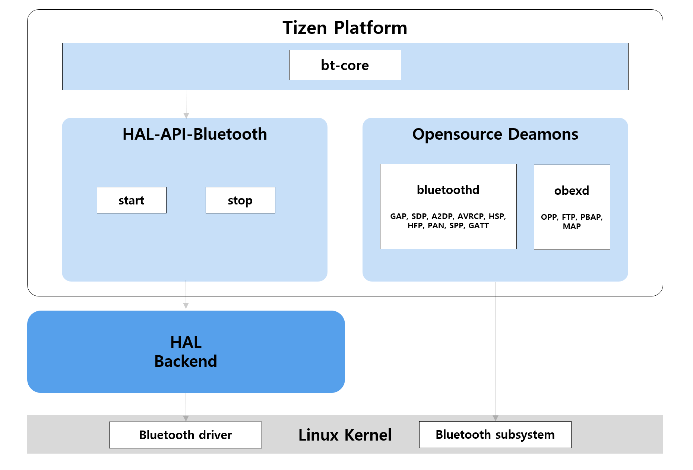
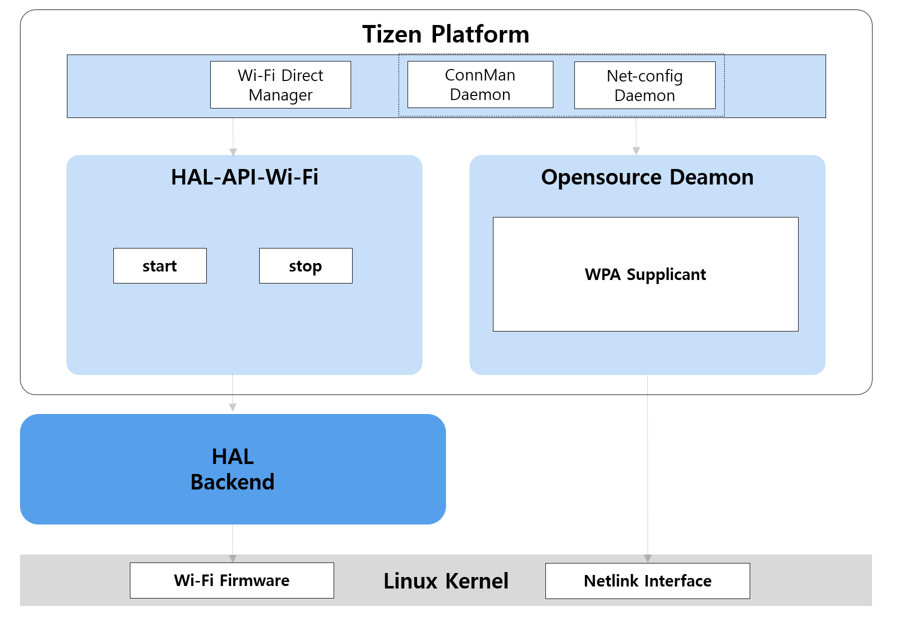

# Connectivity

You can implement various connectivity features, such as Bluetooth, WLAN, and NFC.

## Bluetooth

Bluetooth is a short range communication protocol used to communicate between 2 devices. Tizen uses open source Bluetooth components, such as BlueZ and ObexD. Bluez and ObexD run as a daemon and an interface library, Bluetooth Framework, is used for applications to access them over the D-Bus interface.

This section explains the Bluetooth architecture on the Tizen platform and how Tizen can be ported, along with the configuration parameters and their values.

**Figure: Tizen Bluetooth architecture**



The Bluetooth framework provides a dialogue for the user to control the BlueZ, ObexD, and PulseAudio daemons. Bluetooth provides a standard interface between the Bluetooth chip and AP, called the HCI (Host Controller Interface). HCI can be implemented on USB, UART, and SDIO, but for the mobile environment, UART is the most common. HCI activation can differ depending on the chip vendor. The vendor provides the HCI configuration and the initial scripts. For example, Broadcom and Spreadtrum provide firmware and a loading tool. Tizen supports Bluetooth version 4.2, and the GATT, FTP, OPP, MAP, PBAP, A2DP, AVRCP, HSP/HFP, RFCOMM, HID, HDP, and PAN profiles. Bluetooth Low Energy functions have been implemented in BlueZ and `bluetooth-frwk`.

The Tizen Bluetooth framework is based on the open source BlueZ project. BlueZ provides the DBUS API and based on it, Tizen Bluetooth framework provides the C Language API. Using the Tizen Bluetooth framework is recommended.

The following components are necessary for Bluetooth:

- Application
  - User dialogue that controls the BlueZ, ObexD, and PulseAudio daemons
- ObexD
  - Open source component
  - Object exchange daemon
  - Supports OPP, FTP, PBAP, SYNC, and MAP profile stack
- BluetoothD
  - BluetoothD is the open source component, BlueZ 5.37 is supported
  - Bluetooth central daemon
  - Supports GAP, SDP, A2DP, AVRCP, HFP, HSP, and GATT profile stack
- Bluetooth subsystem
  - Provides the BT unix socket. Each protocol can be accessed by its socket.
  - Supports the L2CAP, RFCOMM, SCO, and HCI protocols
- Bluetooth driver
  - BT Chip driver
  - For UART, the interface is provided by the [Linux](https://wiki.tizen.org/Linux) kernel.
  - GPIO configuration, `rfkill` (radio frequency management), and power management can be handled by both the vendor and the porting engineer
- Bluetooth firmware loading module
  - Depending on the environment, it loads the Bluetooth firmware to the Bluetooth chip
  - Tizen and the chipset vendor need to implement this together
  - Package: `bluetooth-tools`

### Porting the OAL interface

The following OAL scripts are run during the Bluetooth stack start and end sequences. These scripts invoke the Bluetooth chip-specific (such as Broadcom and Spreadtrum) scripts, provided by the chipset vendor, to perform chip-specific configuration. These scripts are available in the `bluetooth-dev-tools.under` package. When this package is installed, it copies the following scripts in the `/usr/etc/Bluetooth/` directory:

- `bt-stack-up.sh`
- `bt-stack-down.sh`
- `bt-reset-env.sh`

#### Tizen BT Obex profiles

In Tizen, the open source ObexD is used for the `obex`-based profiles:

- BT Obex profiles server (`obexd`)
- BT Obex profiles client (`obex-client`)


### Configuration

There are a few configuration changes that need to be made to enable the specific chipset and the scripts and other chipset-specific configuration information, such as UART speed and UART terminal (`tty`). These changes must be provided by the chipset vendor.

- Configuration for the Broadcomm BCM4358 Bluetooth chipset:
  - `hciattach`  
    The `bluez/tools/hciattach.c` file is patched to enable the `hciattach` tool specific to the BCM4358 chipset. This service attaches the BT UART HCI interface to the Bluetooth stack at a baud rate of 3000000. It is also responsible for loading the Bluetooth firmware on BCM4358.
  - Bluetooth UART used is `/dev/ttySAC3`
  - Broadcom firmware used is `BCM4358A1_001.002.005.0032.0066.hcd`
  - UART speed configuration for BCM4358A1 is 3000000
  - `bcmtool` used is `bcmtool_4358a1`
  - `.bd_addr` contains the unique Bluetooth address, which is generated during the first Bluetooth activation
  - Register the Bluetooth device:
    ```
    bcmtool_4358a1 /dev/ttySAC0 -FILE=BCM4358A1_001.002.005.0032.0066.hcd -BAUD=3000000 -ADDR=/csa/bluetooth/.bd_addr -SETSCO=0,0,0,0,0,0,0,3,3,0 -LP
    ```
  - Attach a serial device to the Bluetooth stack using the UART HCI for a Broadcomm device:
    ```
    hciattach /dev/ttySAC3 -S 3000000 bcm2035 3000000 flow
    ```
  - Run the Bluetooth daemon version 5.37:
    ```
    bluetoothd
    ```
  - Bring the device up, set up the device name, and enable the SSP mode:
    ```
    hciconfig hci0 up
    hciconfig hci0 name "Tizen-Mobile"
    hciconfig hci0 sspmode 1
    ```
  - Switch on the Bluetooth radio:
    ```
    rfkill unblock bluetooth
    ```
  - Switch off the Bluetooth radio:
    ```
    rfkill block bluetooth
    ```
- Configuration for the Spreadtrum sc2331 Bluetooth chipset
  - `hciattach`  
    The `bluez/tools/hciattach.c` file is patched to enable the `hciattach` tool specific to the sc2331 chipset. This service attaches the BT UART HCI interface to the Bluetooth stack at a baud rate of 3000000. It is also responsible for loading the Bluetooth firmware on sc2331.
  - Register the Bluetooth device:  
    The `cp2-download` tool is provided for downloading the Spreadtrum firmware. This tool also downloads the Wi-Fi firmware at boot time.
  - Install the following files in the target's `/usr/lib/firmware` directory:
    ```
    sc2331_fdl.bin
    sc2331_fw.bin
    scx35_pikeavivaltove_3M_MARLIN_connectivity_calibration.ini
    scx35_pikeavivaltove_3M_MARLIN_connectivity_configure.ini
    ```
  - Bluetooth UART used is `/dev/ttyS0`
  - UART speed configuration for sc233 is 3000000
  - Attach a serial device to the Bluetooth stack using the UART HCI:
    ```
    hciattach -s 3000000 /dev/ttyS0 sprd 3000000 flow
    ```
  - Run the bluetooth daemon version 5.37:
    ```
    bluetoothd
    ```
  - Bring the device up, set up the device name, and enable the SSP mode:
    ```
    hciconfig hci0 up
    hciconfig hci0 name "Tizen-Mobile"
    hciconfig hci0 sspmode 1
    ```

### References

Open source component version: BlueZ 5.37

For more information, see [http://www.bluez.org/](http://www.bluez.org/).

The reference kernel configuration for Bluetooth:

- The following kernel `.config` lines are enabled for Broadcom Bluetooth support:
  ```
  CONFIG_BT=y
  CONFIG_BT_L2CAP=y
  CONFIG_BT_RFCOMM=y
  CONFIG_BT_RFCOMM_TTY=y
  CONFIG_BT_BNEP=y
  CONFIG_BT_HIDP=y
  CONFIG_BT_HCIUART=y
  CONFIG_BT_HCIUART_H4=y
  CONFIG_BCM4330=y
  CONFIG_RFKILL=y
  CONFIG_RFKILL_INPUT=y
  CONFIG_RXTRA_FIRMWARE_BCM4330="BCM4330.hcd"
  ```
- The following kernel `.config` lines are enabled for Bluetooth AVRCP support:
  ```
  CONFIG_INPUT_MISC=y
  CONFIG_INPUT_UINPUT=y
  ```
- The following kernel `.config` lines are enabled for Bluetooth HID support:
  ```
  CONFIG_INPUT_GP2A=y
  CONFIG_INPUT_KR3DH=y
  ```
- The following kernel `.config` lines are enabled for Bluetooth Audio (SCO-over-PCM) support:
  ```
  CONFIG_BT_SCO=y
  CONFIG_INPUT_GP2A=y
  CONFIG_INPUT_KR3DH=y
  ```


## WLAN

This section provides a step-by-step explanation of what is involved in adding a new Wi-Fi driver and making Wi-Fi work.

**Figure: Tizen Wi-FI architecture**



Feature overview:

- WLAN (802.11 b/g/n)
- WPS PBC
- EAP (PEAP, TTLS)

Tizen uses `wpa_supplicant` as the platform interface to Wi-Fi devices. Your Wi-Fi driver must be compatible with the standard `wpa_supplicant`.

The Tizen WLAN architecture is centered on the Linux wireless (IEEE-802.11) subsystem. The Linux wireless SW stack defines the WLAN hardware adaptation software interfaces that need to be used in Tizen. In practice, the required interfaces are defined by cfg80211 for FullMAC WLAN devices and by mac80211 for SoftMAC WLAN devices. In addition, a Linux network interface needs to be supported towards the Linux TCP/IP stack.

The Connection Manager (ConnMan) is a daemon for managing Internet connections within embedded devices running the Linux operating system.

The `wpa_supplicant` interface is a WPA Supplicant with support for WPA and WPA2 (IEEE 802.11i / RSN). WPA Supplicant is the IEEE 802.1X/WPA component that is used in the client stations. It implements key negotiation with a WPA Authenticator, and it controls roaming and the IEEE 802.11 authentication/association of the WLAN driver.

### Porting the OAL interface

The WLAN driver plugin is specific to a Wi-Fi chipset. This includes firmware and chipset-specific tools. Wi-Fi chipset firmware and tool files must be copied to the WLAN driver plugin directory, built, and installed before testing the Wi-Fi functionality. Because of Tizen platform requirements, the Wi-Fi driver must create the `/opt/etc/.mac.info` file, which has the device MAC address.

When the Wi-Fi activation function is called, the request is sent to the NET-CONFIG daemon to call the Wi-Fi start function in HAL_API Wi-Fi. Similarly, the Wi-Fi deactivation function calls the Wi-Fi stop function through NET_CONFIG daemon. In case of Wi-Fi Direct&reg;, the Wi-Fi Direct activation and deactivation functions make the Wi-Fi Direct manager load or unload the Wi-Fi driver using the `wpa_supplicant`.

All other Wi-Fi related functionality is handled by the ConnMan daemon.

### References

- Linux wireless (IEEE-802.11) subsystem: [https://wireless.wiki.kernel.org](https://wireless.wiki.kernel.org)
- Information on Linux WPA/WPA2/IEEE 802.1X Supplicant: [http://hostap.epitest.fi/wpa_supplicant/](http://hostap.epitest.fi/wpa_supplicant/)
- Latest ConnMan release: [http://git.kernel.org/?p=network/connman/connman.git;a=summary](http://git.kernel.org/?p=network/connman/connman.git;a=summary)
- WLAN driver plugin Git path: `/adaptation/devices/wlandrv-plugin-tizen-bcm43xx`
- Reference kernel configurations
- The following options must be enabled if the driver supports the cfg802.11 configuration API, instead of the wireless extension API. For more information, see [https://wireless.wiki.kernel.org](http://wireless.wiki.kernel.org/):
  ```
  CONFIG_CFG80211
  CONFIG_LIB80211
  CONFIG_MAC80211 (Enable this flag, if the driver supports the softMAC feature)
  ```
- The following configuration options must be enabled in the kernel if the driver supports wireless extension APIs:
  ```
  CONFIG_WIRELESS_EXT=y
  CONFIG_WEXT_CORE=y
  CONFIG_WEXT_PROC=y
  CONFIG_WEXT_PRIV=y
  CONFIG_WEXT_SPY=y
  CONFIG_WIRELESS_EXT_SYSFS=y
  ```

## NFC

The NFC application enables the user to:
- Read and import the content written on an NFC tag.
- Edit the content written on an NFC tag.
- Write and save data on an NFC tag.
- Load and save the NFC data from or in a file.

**Figure: NFC architecture**


The NFC implementation has the following main components:

- **Tizen NFC Framework** contains the NFC manager API layer, the NFC common library and the NFC manager daemon. The `nfc-manager` is the main interface, which actually deals with NFC physical tags, creates a connection with tags, and detects it. It is a daemon process to control the NFC chipset (such as NXP pn544). It provides the read and write service and basic P2P communication service, as well as the basic API for the client application.
- **NFC HAL** contains the NFC HAL API, and the OAL layer. The NFC HAL acts as an interface between the NFC chipset with the NFC framework (`nfc-manager`). It must be implemented according to the interface provided by the `nfc-manager`.

### Porting the OAL interface

The NFC HAL is implemented as a shared library and it interfaces the Tizen NFC Framework and the vendor NFC chip. The NFC manager loads the `libnfc-common.so` library at runtime. Any vendor-specific function is installed within the same path. The library must be written with predefined OAL API interfaces.

During initialization, the `nfc-manager` loads the `/hal/api/nfc` library, searches for the NFC controller onload function, and calls the NFC backend function which creates an interface structure instance for mapping all the OAL interfaces. These OAL/OEM interfaces are implemented according to the underlying NFC chipset. Once the mapping is done, the NFC manager interacts with `/hal/api/nfc`, which implements the vendor-specific OAL interfaces.

The `_hal_backend_nfc_funcs` struct is exported in the `/hal/api/nfc`. Using this interface structure, the `nfc-manager` communicates with the OAL interfaces at runtime. The NFC HAL loads when the `nfc-manager` is started and the NFC start function is called to initialize the NFC module.

Pay attention to the following:

- Sending the notification to the upper layer (NFC service)  
See the `phdal4nfc_message_glib.c` file. The `g_idle_add_full` is used for handling the message in the NFC service. You can use the callback client asynchronously in the client context. Post a message in queue, and the message is processed by a client thread.
- Reference implementation of the NFC plugin  
Sample code snippets cannot be reproduced. Code is proprietary. For reference, see the `nfc-plugin-emul` files.

### References

Enable the following configuration options in the kernel `.config` file:

```
Using Pn544: CONFIG_PN544_NFC
Using Pn65n: CONFIG_PN65N_NFC
```

For more information, see [http://nfc-forum.org/](http://nfc-forum.org/).