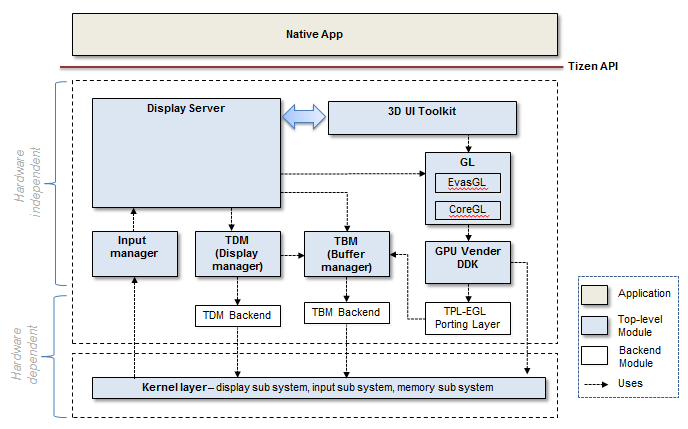
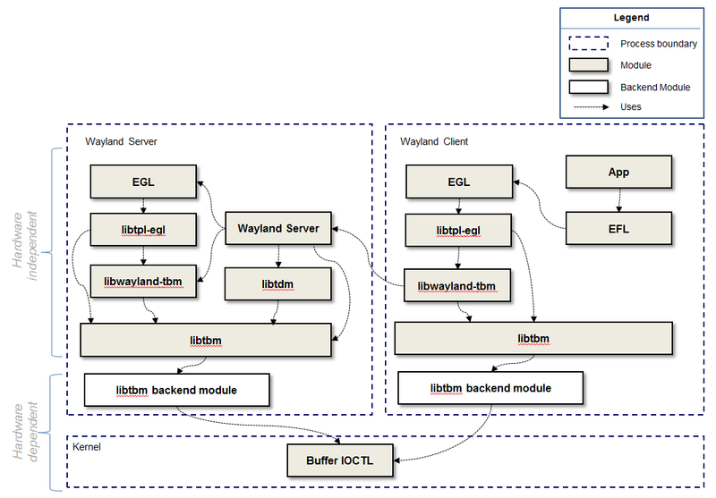
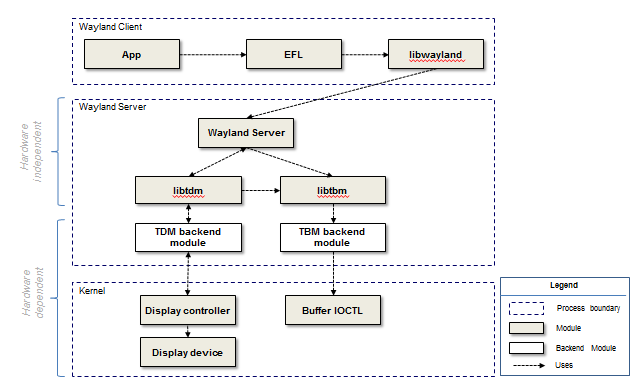
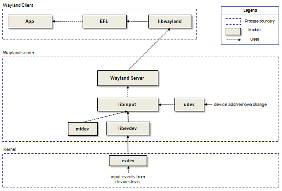
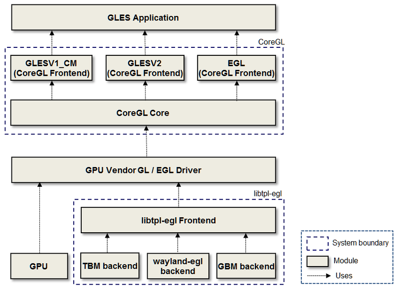
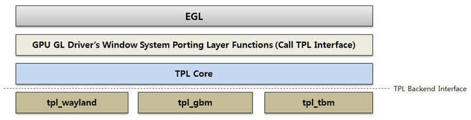
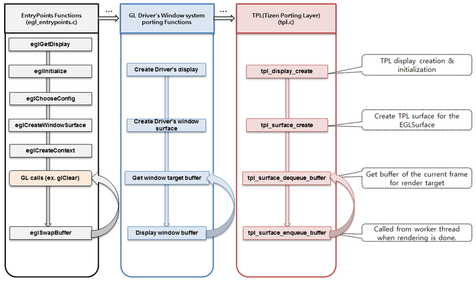
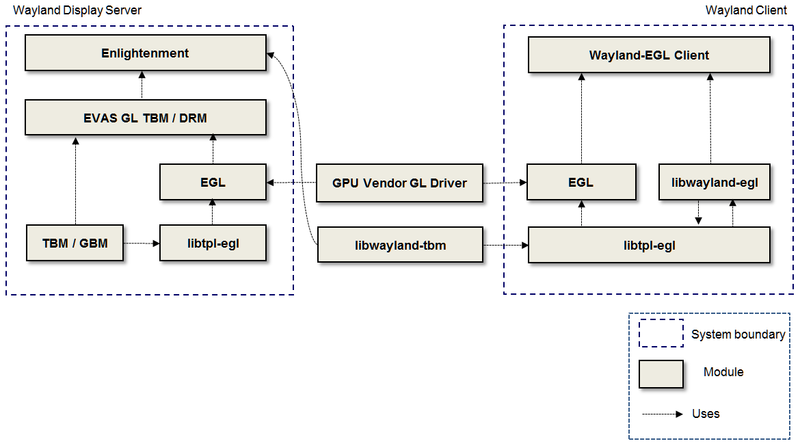
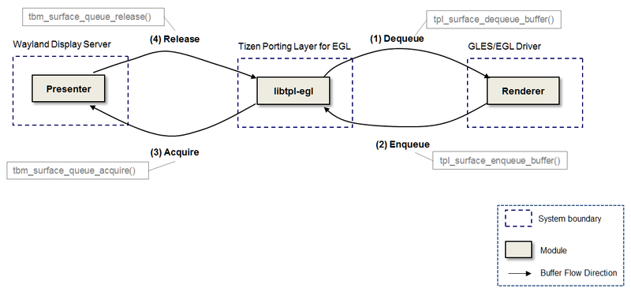

# Graphics and UI

The application composes the graphic user interface by creating a window with a toolkit. The display server composites an application's windows and shows the result on the screen. For this procedure, the graphics and UI middleware offers the following 3 modules for both client and server:

- [Tizen Buffer Manager (TBM)](https://wiki.tizen.org/TBM)
- [Tizen Display Manager (TDM)](https://wiki.tizen.org/TDM)
- [TPL-EGL](https://wiki.tizen.org/3.0_Porting_Guide/Graphics_and_UI/OpenGL)

**Figure: Graphics UI diagram**



The modules are hardware abstraction layers for graphics and UI. They allow the client and server to render with the GPU, share buffers with other processes, and organize hardware output devices for various chipsets. Their backend module needs to be implemented for the new hardware device.

- TBM provides an abstraction interface for the Tizen graphic buffer manager.
- TDM provides an abstraction interface for a display server, such as X or Wayland, to allow direct access to graphics hardware in a safe and efficient manner as a display HAL.
- TPL-EGL is an abstraction layer for surface and buffer management on the Tizen platform aimed to implement the EGL&trade; porting layer of the OpenGL&reg; ES driver over various display protocols.

For an application to handle input device events, the [Input Manager](https://wiki.tizen.org/3.0_Porting_Guide/Graphics_and_UI/Input) is provided, and is mainly comprised of `libinput` and a thin wrapper around it. It handles input events in Wayland compositors and communicates with Wayland clients.

## Buffer Management

TBM has a frontend library and a backend module. The TBM frontend library is hardware-independent and provides a generic buffer interface. On the other hand, the TBM backend module is hardware-dependent and provides a buffer interface dependent on the target system. Chipset vendors have to provide their own backend modules in order for TBM to work well on the Tizen platform. This is because the way each vendor manages the graphic buffers can be different between various chipset devices. TBM already has several reference backends, such as `libtbm-dumb`, and `libtbm-shm`.

**Figure: TBM backend**



With TBM, the client and server can allocate buffers and share buffers between them. For example, a client allocates a graphic buffer, draws something on it with GL and sends it to the display server for displaying it on the screen without buffer copying. The TBM backend module is implemented as a shared library and the TBM frontend finds the `libtbm-default.so` file and loads it from the `/usr/lib/bufmgr` directory at runtime.

```
sh-3.2# ls -al
lrwxrwxrwx  1 root root    14 Jul 28  2016 libtbm_default.so -> libtbm_sprd.so
lrwxrwxrwx  1 root root    20 Jul 28  2016 libtbm_sprd.so -> libtbm_sprd.so.0.0.0
lrwxrwxrwx  1 root root    20 Jul 28  2016 libtbm_sprd.so.0 -> libtbm_sprd.so.0.0.0
-rwxr-xr-x  1 root root 26728 Jun 29  2016 libtbm_sprd.so.0.0.0
```

### Initializing TBM Backend Module

The TBM backend module must define the global data symbol with the name, `tbm_backend_module_data`. The TBM frontend reads the global data symbol at the initialization time. In addition, the TBM backend module calls `init()` of `tbm_backend_module_data`. For more information, see [tbm_backend.h](https://review.tizen.org/gerrit/gitweb?p=platform/core/uifw/libtbm.git;a=tree;h=refs/heads/tizen;hb=refs/heads/tizen).

```cpp
typedef struct _tbm_backend_module {
	const char *name;           /**< The module name of a backend module */
	const char *vendor;         /**< The vendor name of a backend module */
	unsigned long abi_version;  /**< The ABI version of a backend module */
	/**
	 * @brief The init function of a backend module
	 * @param[in] bufmgr A tbm buffer manager object
	 * @return The backend module data
	 * @see tbm_backend_bufmgr_data
	 */
	tbm_backend_bufmgr_data *(*init)(tbm_bufmgr bufmgr, tbm_error_e *error);
	/**
	* @brief deinitialize the bufmgr private data
	* @param[in] bufmgr_data : The backend module data
	*/
	void (*deinit)(tbm_backend_bufmgr_data *bufmgr_data);
} tbm_backend_module;
```

```cpp
#include <tbm_backend.h>

static tbm_backend_bufmgr_data *bufmgr_data;

tbm_backend_bufmgr_data*
tbm_shm_init(tbm_bufmgr bufmgr, tbm_error_e *error)
{
    bufmgr_data = calloc(1, sizeof(tbm_backend_bufmgr_data));

    return (tbm_backend_bufmgr_data*)bufmgr_data;
}

void
tbm_shm_deinit(tbm_backend_bufmgr_data *bufmgr_data)
{
    free(bufmgr_data);
}

tbm_backend_module tbm_backend_module_data = {
	"shm",
	"Samsung",
	TBM_BACKEND_ABI_VERSION_3_0,
	tbm_shm_init,
	tbm_shm_deinit
};
```

The TBM backend must register `tbm_backend_bufmgr_func` and `tbm_backend_bo_func` with `tbm_backend_bufmgr_register_bufmgr_func()` and `tbm_backend_bufmgr_alloc_bo_func()` in `init()` of `tbm_backend_module`.

```cpp
#include <tbm_backend.h>

tbm_backend_bufmgr_data*
tbm_shm_init(tbm_bufmgr bufmgr, tbm_error_e *error)
{
	bufmgr_func->bufmgr_get_capabilities = tbm_shm_bufmgr_get_capabilities;
	bufmgr_func->bufmgr_bind_native_display = tbm_shm_bufmgr_bind_native_display;
	bufmgr_func->bufmgr_get_supported_formats = tbm_shm_bufmgr_get_supported_formats;
	bufmgr_func->bufmgr_get_plane_data = tbm_shm_bufmgr_get_plane_data;
	bufmgr_func->bufmgr_alloc_bo = tbm_shm_bufmgr_alloc_bo;
	bufmgr_func->bufmgr_alloc_bo_with_format = NULL;
	bufmgr_func->bufmgr_import_fd = tbm_shm_bufmgr_import_fd;
	bufmgr_func->bufmgr_import_key = NULL;

	err = tbm_backend_bufmgr_register_bufmgr_func(bufmgr, bufmgr_func);
	if (err != TBM_ERROR_NONE) {
		TBM_ERR("fail to register bufmgr_func! err(%d)\n", err);
		if (error)
			*error = TBM_ERROR_INVALID_OPERATION;
		goto fail_register_bufmgr_func;
	}
	bufmgr_shm->bufmgr_func = bufmgr_func;

	bo_func->bo_free = tbm_shm_bo_free;
	bo_func->bo_get_size = tbm_shm_bo_get_size;
	bo_func->bo_get_memory_types = tbm_shm_bo_get_memory_type;
	bo_func->bo_get_handle = tbm_shm_bo_get_handle;
	bo_func->bo_map = tbm_shm_bo_map;
	bo_func->bo_unmap = tbm_shm_bo_unmap;
	bo_func->bo_lock = NULL;
	bo_func->bo_unlock = NULL;
	bo_func->bo_export_fd = tbm_sprd_bo_export_fd;
	bo_func->bo_export_key = NULL;

	err = tbm_backend_bufmgr_register_bo_func(bufmgr, bo_func);
	if (err != TBM_ERROR_NONE) {
		TBM_ERR("fail to register bo_func! err(%d)\n", err);
		if (error)
			*error = TBM_ERROR_INVALID_OPERATION;
		goto fail_register_bo_func;
	}
	bufmgr_shm->bo_func = bo_func;

	return (tbm_backend_bufmgr_data *)bufmgr_shm;
}
```


### Porting OAL Interface

TBM provides the header files to implement the TBM backend module.

**Table: TBM backend module header files**

| Header file                              | Description                              |
| ---------------------------------------- | ---------------------------------------- |
| [tbm_backend.h](https://review.tizen.org/gerrit/gitweb?p=platform/core/uifw/libtbm.git;a=tree;h=refs/heads/tizen;hb=refs/heads/tizen) | This file includes information on implementing the TBM backend module. |
| [tbm_drm_helper.h](https://review.tizen.org/gerrit/gitweb?p=platform/core/uifw/libtbm.git;a=tree;h=refs/heads/tizen;hb=refs/heads/tizenn) | This file includes helper functions for the DRM interface backend module. |
| [tbm_type_common.h](https://review.tizen.org/gerrit/gitweb?p=platform/core/uifw/libtbm.git;a=tree;h=refs/heads/tizen;hb=refs/heads/tizen) | This is the user header file including general information on how to use the TBM. |

#### TBM Backend Interface

The following table lists the `bufmgr` backend interface functions of the `tbm_backend_module`. For more information, see [tbm_backend.h](https://review.tizen.org/gerrit/gitweb?p=platform/core/uifw/libtbm.git;a=tree;h=refs/heads/tizen;hb=refs/heads/tizen):

**Table: bufmgr functions**

| Function          | Description                              | Mandatory                                |
| ----------------- | ---------------------------------------- | ---------------------------------------- |
| `bufmgr_get_capabilities()`           | Get the capabilities of a buffer manager. The backend must support TBM_BUFMGR_CAPABILITY_SHARE_FD and TBM_BUFMGR_CAPABILITY_SHARE_KEY. `TBM_BUFMGR_CAPABILITY_SHARE_FD` is an ability to generate `tbm_fd` which is the dmabuf fd and which is associated with the `tbm_bo` memory in the system. `TBM_BUFMGR_CAPABILITY_SHARE_KEY` is an ability to generate `tbm_key` which the unique identification of the `tbm_bo` memory in the system. | Yes |
| `bufmgr_bind_native_display()`        | Set (bind) the native display. If the backend needs to get the native display, use this backend function. | Yes |
| `bufmgr_get_supported_formats()`      | Get the formats list and the num to be supported by backend. | Yes |
| `bufmgr_get_plane_data()`             | Get the plane data of the plane_idx according to the color format. | Yes |
| `bufmgr_alloc_bo()`                   | Allocate `tbm_backend_bo_data` of the `tbm_backend_module`. `tbm_backend_bo_data` is a pointer. | Yes |
| `bufmgr_alloc_bo_with_format()`       | Allocate `tbm_backend_bo_data` of the bo index according to the color format. `tbm_backend_bo_data` is a pointer. | Yes |
| `bufmgr_alloc_bo_with_tiled_format()` | Allocate `tbm_backend_bo_data` for GPU that supports the tiled format. `tbm_backend_bo_data` is a pointer. | Yes |
| `bufmgr_import_fd()`                  | Import `tbm_backend_bo_data` associated with the prime `fd`. `tbm_fd` must be freed by you. If the backend does not support buffer sharing by `tbm_fd`, the function pointer must be set to `NULL`. | Yes (Must support buffer sharing by `tbm_fd`.)  |
| `bufmgr_import_key()`                 | Import `tbm_backend_bo_data` associated with the key. If the backend does not support buffer sharing by the `tbm_fd`, the function pointer must be set to `NULL`. | Yes |

The following table lists the `bo` backend interface functions of the `tbm_backend_module`. For more information, see [tbm_backend.h](https://review.tizen.org/gerrit/gitweb?p=platform/core/uifw/libtbm.git;a=tree;h=refs/heads/tizen;hb=refs/heads/tizen):

**Table: bo functions**

| Function                     | Description                              | Mandatory          |
| ---------------------------- | ---------------------------------------- | ------------------ |
| `bo_free()`             | Free `tbm_backend_bo_data`. | Yes |
| `bo_get_size()`         | Get the size of `tbm_backend_bo_data`. | Yes |
| `bo_get_memory_types()` | Get `tbm_bo_memory_type`. | Yes |
| `bo_get_handle()`       | Get `tbm_bo_handle` according to `tbm_bo_device_type`. | Yes |
| `bo_map()`              | Map `tbm_backend_bo_data` according to `tbm_bo_device_type` and `tbm_bo_access_option`. | Yes |
| `bo_unmap()`            | Unmap `tbm_backend_bo_data`. | Yes |
| `bo_lock()`             | Lock `tbm_backend_bo_data` with a device and an opt. | No |
| `bo_unlock()`           | Unlock `tbm_backend_bo_data`. | No |
| `bo_export_fd()`        | Export the `tbm_backend_bo_data` to `tdm_fd` (prime fd). The `tbm_fd` must be freed by the user. If the backend does not support a buffer sharing by `tdm_fd`, the function pointer must be set to `NULL`. | Yes |
| `bo_export_key()`       | Export `tbm_backend_bo_data` to `tdm_key`. If the backend does not support a buffer sharing by `tdm_key`, the function pointer must be set to `NULL`. | Yes |

The following table lists the TBM bufmgr capability, `tbm_bufmgr_capability`:

| Buffer capability                    | Description                              |
| ------------------------------------ | ---------------------------------------- |
| `TBM_BUFMGR_CAPABILITY_NONE`         | Does not support TBM buffer capability.  |
| `TBM_BUFMGR_CAPABILITY_SHARE_KEY`    | Supports sharing buffer by `tbm_key`.      |
| `TBM_BUFMGR_CAPABILITY_SHARE_FD`     | Supports sharing buffer by `tbm_fd`.       |
| `TBM_BUFMGR_CAPABILITY_TBM_SYNC`     | Supports timeline sync.                  |
| `TBM_BUFMGR_CAPABILITY_TILED_MEMORY` | Supports tiled memory.                   |

The following table lists the TBM buffer memory types, `tbm_bo_memory_type`:

| Buffer memory type   | Description                                     |
| -------------------- | ----------------------------------------------- |
| `TBM_BO_DEFAULT`     | Default memory: it depends on the backend.       |
| `TBM_BO_SCANOUT`     | Scanout memory.                                  |
| `TBM_BO_NONCACHABLE` | Non-cachable memory.                             |
| `TBM_BO_WC`          | Write-combine memory.                            |
| `TBM_BO_VENDOR`      | Vendor specific memory (depends on the backend). |

The following table lists the TBM buffer device types, `tbm_bo_device_type`:

| Device type          | Description                              |
| -------------------- | ---------------------------------------- |
| `TBM_DEVICE_DEFAULT` | Device type to get the default handle:    |
| `TBM_DEVICE_CPU`     | Device type to get the virtual memory:    |
| `TBM_DEVICE_2D`      | Device type to get the 2D memory handle:  |
| `TBM_DEVICE_3D`      | Device type to get the 3D memory handle:  |
| `TBM_DEVICE_MM`      | Device type to get the multimedia handle: |

The following table lists the TBM buffer access options, `tbm_bo_access_option`.

| Access option       | Description                                        |
| ------------------- | -------------------------------------------------- |
| `TBM_OPTION_READ`   | Access option to read                              |
| `TBM_OPTION_WRITE`  | Access option to write                             |
| `TBM_OPTION_VENDOR` | Vendor-specific option that depends on the backend |

#### TBM DRM Helper Functions

If the target uses the `drm` interface, the client needs to get the authenticated `fd` from the display server and the display server must share the `drm` master `fd` with the TDM backend module. The TBM frontend provides the helper functions for `drm` authentication with the Wayland protocol and shares the master `fd` with the TDM backend module.

**Table: DRM helper functions**

| Function                                 | Description                              |
| ---------------------------------------- | ---------------------------------------- |
| `tbm_drm_helper_wl_auth_server_init()`   | If the TBM backend module need to use the authentication server, the backend module must call this function in the display server. |
| `tbm_drm_helper_wl_auth_server_deinit()` | Deinitializes the `drm` authentication in the display server. |
| `tbm_drm_helper_get_master_fd()`         | If the TDM backend module already has a `drm` master `fd`, the TBM backend module can get the master `fd` from this function. |
| `tbm_drm_helper_set_tbm_master_fd()`     | If the TBM backend module opens the `drm` master `fd`, this function has to be called for sharing the `drm` master `fd` with TDM. |
| `tbm_drm_helper_unset_tbm_master_fd()`   | If the TBM backend module is opened and does not use the `drm` master `fd`, this function has to be called. |
| `tbm_drm_helper_get_auth_info()`         | Client gets the authenticated `fd` and device info from the display server. |

### TBM Backends

The following table lists the TBM backends.

**Table: TBM backends**

| Backend         | Project ([http://review.tizen.org](http://review.tizen.org/)) | Description                              |
| --------------- | ---------------------------------------- | ---------------------------------------- |
| `libtbm-shm`    | [platform/adaptation/libtbm-shm](https://review.tizen.org/gerrit/gitweb?p=platform/adaptation/libtbm-shm.git;a=summary) | Backend for a target device which supports the SHM memory interface. The SHM backend module uses the XSI shared memory segment and does not have hardware dependencies. |
| `libtbm-dumb`   | [platform/adaptation/libtbm-dumb](https://review.tizen.org/gerrit/gitweb?p=platform/adaptation/libtbm-dumb.git;a=summary) | Backend for a target device which supports the DUMB memory interface. If the target kernel supports the `drm` interface, the target can use the `dumb` backend because the DUMB memory interface is the default `drm` memory interface. |
| `libtbm-sprd`   | [platform/adaptation/spreadtrum/libtbm-sprd](https://review.tizen.org/gerrit/gitweb?p=platform/adaptation/spreadtrum/libtbm-sprd.git;a=summary) | Backend for a target device which uses the Spreadtrum chipset only. The `sprd` backend module uses the `drm` gem memory interface but some `ioctl` are only provided by the `sprd drm` kernel. |
| `libtbm-exynos` | [platform/adaptation/samsung_exynos/libtbm-exynos](https://review.tizen.org/gerrit/gitweb?p=platform/adaptation/samsung_exynos/libtbm-exynos.git;a=summary) | Backend for a target device which uses the exynos chipset only. The `exynos` backend module uses the `drm` gem memory interface but some `ioctl` are only provided by `exynos drm` kernel. |
| `libtbm-vigs`   | [platform/adaptation/emulator/libtbm-vigs](https://review.tizen.org/gerrit/gitweb?p=platform/adaptation/emulator/libtbm-vigs.git;a=summary) | Backend for a target device which supports the VIGS interface. The `vigs` backend is used by the emulator target. |

### Testing the Porting Result

TBM offers `tbm-haltests` that allows you to test and verify the porting result. The `tbm-haltests` tool is included in the `libtbm-haltests` package that can be downloaded from the [platform binary's snapshot repository](https://download.tizen.org/snapshots/tizen/unified/latest/repos/standard/packages/). It depends on the `gtest` package and it can be downloaded from the [platform's snapshot repository](https://download.tizen.org/snapshots/tizen/unified/latest/repos/standard/packages/).

### Checking TDM Log Messages

TBM uses dlog to print the debug messages. To show the TBM run time log, use the following message:

```
$ dlogutil -v threadtime TBM
```

### Reference

For more information about TBM and TBM backend, see [Tizen Buffer Manager (TBM)](https://wiki.tizen.org/TBM).

## Display Management

The display server composites and shows the client's buffers on screen. The display server sometimes needs to convert or scale an image to a different size or format. To make it possible for various chipset devices, the display server needs the display hardware resource information and control over the resources. Tizen Display Manager (TDM) offers these functionalities for the display server with the unified interface for various chipset devices.

**Figure: TDM backend**



With TDM, the display server can perform mode setting, DPMS control, and showing a buffer (framebuffer or video buffer) on the screen in the most efficient way. If the hardware supports the m2m converting and capture device, the display server can also convert an image and dump a screen including all hardware overlays with no compositing.

The vendor has to implement the TDM backend module. The TDM backend module has the responsibility to let the TDM frontend know the display hardware resource information. The display server gets this information and controls hardware devices through the TDM frontend APIs. TDM already has several backends for reference, such as `libtdm-drm` and `libtdm-fbdev`.

The TDM backend is implemented as a shared library. The TDM frontend finds the `libtdm-default.so` file and loads it in the `/usr/lib/tdm` directory at runtime.

```
sh-3.2# ls -l /usr/lib/tdm
total 40
lrwxrwxrwx 1 root root    14 Jul 28  2016 libtdm-default.so -> libtdm-drm.so
-rwxr-xr-x 1 root root 37152 Jul 12  2016 libtdm-drm.so
```

### Initializing TDM Backend Module

The TDM backend module must define the global data symbol with the name `tdm_backend_module_data`. The TDM frontend reads this symbol at the initialization time. TDM calls the `init()` function of the `tdm_backend_module_data`. For more information, see [tdm_backend.h](https://review.tizen.org/gerrit/gitweb?p=platform/core/uifw/libtdm.git;a=tree;h=refs/heads/tizen;hb=refs/heads/tizen).

```cpp
typedef struct _tdm_backend_module {
    const char *name; /* The module name of the backend module */
    const char *vendor; /* The vendor name of the backend module */
    unsigned long abi_version; /* The ABI version of the backend module */
    tdm_backend_data *(*init)(tdm_display *dpy, tdm_error *error);
    void (*deinit)(tdm_backend_data *bdata);
} tdm_backend_module;
```

```cpp
#include <tdm_backend.h>

static tdm_drm_data *drm_data;

tdm_backend_data*
tdm_drm_init(tdm_display *dpy, tdm_error *error) {
    drm_data = calloc(1, sizeof(tdm_drm_data));

    return (tdm_backend_data*)drm_data;
}

void
tdm_drm_deinit(tdm_backend_data *bdata) {
    free(bdata);
}

tdm_backend_module tdm_backend_module_data = {
    "drm",
    "Samsung",
    TDM_BACKEND_SET_ABI_VERSION(2,0),
    tdm_drm_init,
    tdm_drm_deinit
};
```

The TDM backend must register the `tdm_func_display()`, `tdm_func_output()`, and `tdm_func_layer()` functions with the `tdm_backend_register_func_display()`, `tdm_backend_register_func_output()`, and `tdm_backend_register_func_layer()` functions in the `tdm_backend_module_data` `init()` function.

```cpp
#include <tdm_backend.h>

tdm_backend_data*
tdm_drm_init(tdm_display *dpy, tdm_error *error) {
    memset(&drm_func_display, 0, sizeof(drm_func_display));
    drm_func_display.display_get_capability = drm_display_get_capability;
    drm_func_display.display_get_pp_capability = drm_display_get_pp_capability;
    drm_func_display.display_get_outputs = drm_display_get_outputs;
    drm_func_display.display_get_fd = drm_display_get_fd;
    drm_func_display.display_handle_events = drm_display_handle_events;
    drm_func_display.display_create_pp = drm_display_create_pp;
    ret = tdm_backend_register_func_display(dpy, &drm_func_display);
    if (ret != TDM_ERROR_NONE)
        goto failed;

    memset(&drm_func_output, 0, sizeof(drm_func_output));
    drm_func_output.output_get_capability = drm_output_get_capability;

    ret = tdm_backend_register_func_output(dpy, &drm_func_output);
    if (ret != TDM_ERROR_NONE)
        goto failed;

    memset(&drm_func_layer, 0, sizeof(drm_func_layer));
    drm_func_layer.layer_get_capability = drm_layer_get_capability;

    ret = tdm_backend_register_func_layer(dpy, &drm_func_layer);
    if (ret != TDM_ERROR_NONE)
        goto failed;

    return (tdm_backend_data*)drm_data;
}
```

After loading the TDM backend module, the TDM frontend calls `display_get_capability()`, `display_get_outputs()`, and `output_get_capability()` to get the specific hardware information. The TDM backend module has to set TDM_OUTPUT_CAPABILITY_HWC on the output, when TDM_OUTPUT_CAPABILITY_HWC supports TDM HardWare Compositing (HWC). In the latest version (supports version 2.9) of libtdm, TDM recommends that the TDM backend module supports TDM HWC, which means that TDM has to register `tdm_func_hwc` and `tdm_func_hwc_window`. If the TDM backend module does not support TDM HWC, the TDM backend module implements `output_get_layers()` and `layer_get_capability()`, and also registers `tdm_func_layer()`.

In addition, if a target has a memory-to-memory converting hardware device and the capture hardware device, the TDM backend module can register the `tdm_func_pp()` and `tdm_func_capture()` functions with the `tdm_backend_register_func_pp()` and `tdm_backend_register_func_capture()` functions.

### Porting the OAL Interface

TDM provides the header files to implement the TDM backend module.

**Table: TDM backend module header files**

| Header file                              | Description                              |
| ---------------------------------------- | ---------------------------------------- |
| [tdm_backend.h](https://review.tizen.org/gerrit/gitweb?p=platform/core/uifw/libtdm.git;a=tree;h=refs/heads/tizen;hb=refs/heads/tizen) | This file defines the TDM backend interface. |
| [tdm_log.h](https://review.tizen.org/gerrit/gitweb?p=platform/core/uifw/libtdm.git;a=tree;h=refs/heads/tizen;hb=refs/heads/tizen) | This file includes functions to print logs in frontend and backend modules. |
| [tdm_helper.h](https://review.tizen.org/gerrit/gitweb?p=platform/core/uifw/libtdm.git;a=tree;h=refs/heads/tizen;hb=refs/heads/tizen) | This file includes helper functions for the TDM frontend and backend. |

The display backend interface is mandatory. For more information, see [tdm_backend.h](https://review.tizen.org/gerrit/gitweb?p=platform/core/uifw/libtdm.git;a=tree;h=refs/heads/tizen;hb=refs/heads/tizen).

**Table: Display backend interface functions**

| Function                           | Description                              | Mandatory        |
| ---------------------------------- | ---------------------------------------- | --------- |
| `display_get_capability()`         | Gets the display capabilities of the backend module. TDM calls this function not only at initialization, but also when a new output is connected. If the hardware has a maximum usable layer count restriction, the backend module can set the max count in the `max_layer_count` element of the `tdm_caps_display` structure. Otherwise, it is set to -1. | Yes |
| `display_get_pp_capability()`      | Gets the `pp` capabilities of the backend module. TDM calls this function not only at initialization, but also when a new output is connected. The backend module does not need to implement this function if the hardware does not have a memory-to-memory converting device. If it does, the backend module must fill the `tdm_caps_pp` data, which contains the hardware restriction information which a converting device can handle, such as format and size. | No  |
| `display_get_capture_capability()` | Gets the capture capabilities of the backend module. TDM calls this function not only at initialization, but also when a new output is connected. The backend module does not need to implement this function if the hardware does not have a capture device. If it does, the backend module must fill the `tdm_caps_capture` data, which contains the hardware restriction information which a capture device can handle, such as format and size. | No  |
| `display_get_outputs()`            | Gets an output array of the backend module. TDM calls this function not only at initialization, but also when a new output is connected. The backend module must return the newly-allocated array which contains `tdm_output*` data. It is freed in the frontend. | Yes |
| `display_get_fd()`                 | Gets the file descriptor of the backend module. The backend module can return the epoll's `fd`. | No  |
| `display_handle_events()`          | Handles the events which happen on the `fd` of the backend module. | No  |
| `display_create_pp()`              | Creates a `pp` object of the backend module. The backend module does not need to implement this function if the hardware does not have a memory-to-memory converting device | No  |

The output backend interface is mandatory. For more information, see [tdm_backend.h](https://review.tizen.org/gerrit/gitweb?p=platform/core/uifw/libtdm.git;a=tree;h=refs/heads/tizen;hb=refs/heads/tizen).

**Table: Output backend interface functions**

| Function                      | Description                              | Mandatory          |
| ----------------------------- | ---------------------------------------- | --------- |
| `output_get_capability()`     | Gets the capabilities of an output object. TDM calls this function not only at initialization, but also when a new output is connected. The `tdm_caps_output` contains connection status, modes, available properties, and size restriction information. | Yes |
| `output_get_layers()`         | Gets the layer array of an output object. TDM calls this function not only at initialization, but also when a new output is connected. The backend module must return the newly-allocated array which contains `tdm_layer*` data. It is freed in the frontend. | Yes |
| `output_set_property()`       | Sets the property with a given ID.       | No  |
| `output_get_property()`       | Gets the property with a given ID.       | No  |
| `output_wait_vblank()`        | Waits for `VBLANK`. If this function returns `TDM_ERROR_NONE`, the backend module must call a user `vblank` handler with the user data of this function after `vblanks` interval. | Yes |
| `output_set_vblank_handler()` | Sets the user `vblank` handler.          | Yes |
| `output_commit()`             | Commits the changes for an output object. When this function is called, the backend module must apply all changes of the given output object to the screen as well as the layer changes of this output. If this function returns `TDM_ERROR_NONE`, the backend module must call a user commit handler with the user data of this function after all changes of the given output object are applied. | Yes |
| `output_set_commit_handler()` | Sets a user commit handler.              | Yes |
| `output_set_dpms()`           | Sets the DPMS of an output object.       | No  |
| `output_get_dpms()`           | Gets the DPMS of an output object.       | No  |
| `output_set_mode()`           | Sets 1 of the available modes of an output object. | Yes |
| `output_create_capture()`     | Creates a capture object of an output object. The backend module does not need to implement this function if the hardware does not have a capture device. | No  |
| `output_set_status_handler()` | Sets an output connection status handler. The backend module must call the output status handler when the output connection status has been changed to let the TDM frontend know of the change. | No  |
| `output_set_dpms_handler()`   | Sets an output DPMS handler. The backend module must call the output DPMS handler when the output DPMS has been changed to let the TDM frontend know of the change. | No  |
| `output_get_hwc()`            | Gets a HWC object of an output object. The backend module returns the HWC object when the output has TDM_OUTPUT_CAPABILITY_HWC. | Yes  |

The HWC backend interface is mandatory. For more information, see [tdm_backend.h](https://review.tizen.org/gerrit/gitweb?p=platform/core/uifw/libtdm.git;a=tree;h=refs/heads/tizen;hb=refs/heads/tizen).

**Table: HWC backend interface functions**

| Function                   | Description                              | Mandatory          |
| -------------------------- | ---------------------------------------- | --------- |
| `hwc_create_window()`                  | Creates a new window on the given HWC. The backend module must implement `hwc_create_window()`. In addition, the backend module creates a private `tdm_hwc_window` and returns its handle. | Yes |
| `hwc_get_video_supported_formats()`    | Gets the video supported format array for the hwc windows of a HWC object. | Yes  |
| `hwc_get_video_available_properties()` | Gets the available video property array of a hwc object. The backend returns the video properties that are predefined in the backend module. | Yes  |
| `hwc_get_capabilities()`               | Gets the hwc capabilities. The backend returns the multiple of `tdm_hwc_capability` that the backend can support. | Yes |
| `hwc_get_available_properties()`       | Gets the available property array of a HWC object. The backend returns the properties that are predefined in the backend module. | Yes |
| `hwc_get_client_target_buffer_queue()` | Gets a target buffer queue. The backend returns `tbm_surface_queue_h`. | Yes |
| `hwc_set_client_target_buffer()`       | Sets the client (relative to TDM) target buffer. The target buffer is from `tbm_surface_queue_h` that contains the result of the gl composition with `tdm_hwc_window`s. | Yes |
| `hwc_validate()`                       | Validates HWC. The backend inspects all the hardware layer state and determines whether there are any composition type changes necessary before committing HWC. | Yes  |
| `hwc_get_changed_composition_types()`  | Gets the changed composition types. The backend returns `tdm_hwc_window`s and the `tdm_hwc_window`s composition type is changed through `hwc_validate`. | Yes  |
| `hwc_accept_validation()`              | Accepts the validation required by the backend. The backend can identify the decided `tdm_hwc_window_composition`s at the required validation. The backend can commit the set of `tdm_hwc_window`s with this accepted `tdm_hwc_window_composition`s. | Yes  |
| `hwc_commit()`                         | Commits changes for an HWC object. The backend can commit output (layers), associated with the accepted validation of the HWC object on the display output device. | Yes  |
| `hwc_set_commit_handler()`             | Sets a user commit handler. The backend has to call `tdm_hwc_commit_handler` after finishing `hwc_commit`. | Yes  |
| `hwc_set_property()`                   | Sets the property that has a given property ID by the backend on the HWC object. | Yes  |
| `hwc_get_property()`                   | Gets the property that has a given property ID by the backend on the HWC object. | Yes  |

The hwc_window backend interface is mandatory. For more information, see [tdm_backend.h](https://review.tizen.org/gerrit/gitweb?p=platform/core/uifw/libtdm.git;a=tree;h=refs/heads/tizen;hb=refs/heads/tizen).

**Table: HWC backend interface functions**

| Function                   | Description                              | Mandatory          |
| -------------------------- | ---------------------------------------- | --------- |
| `hwc_window_destroy()`              | Destroys `tdm_hwc_window`. The backend module must implement this function. The backend destroys a private `tdm_hwc_window`. | Yes |
| `hwc_window_acquire_buffer_queue()` | Acquires a buffer queue associated with `tdm_hwc_window`. This function can be used when the backend has TDM_HWC_WIN_CONSTRAINT_BUFFER_QUEUE. | No  |
| `hwc_window_release_buffer_queue()` | Releases a buffer queue assoicated with `tdm_hwc_window`. This function can be used when the backend has TDM_HWC_WIN_CONSTRAINT_BUFFER_QUEUE. | No  |
| `hwc_window_set_composition_type()` | Gets the composition type of `tdm_hwc_window`. The backend sets `tdm_hwc_window_composition`.| Yes |
| `hwc_window_set_buffer_damage()`    | Sets the buffer damage. The backend sets the buffer damage. | Yes |
| `hwc_window_set_info()`             | Sets the information to `tdm_hwc_window`. The information will be applied when the HWC object is committed. | Yes |
| `hwc_window_set_buffer()`           | Sets a TDM buffer to `tdm_hwc_window`. A TDM buffer will be applied when the HWC object is committed. | Yes |
| `hwc_window_set_property()`         | Sets the property which has a given property ID by the backend. | Yes  |
| `hwc_window_get_property()`         | Gets the property which has a given property ID by the backend. | Yes  |
| `hwc_window_get_constraints()`      | Gets the constraints of `tdm_hwc_window`. The backend returns `tdm_hwc_window_constraint`. | Yes  |
| `hwc_window_set_name()`             | Sets the name of `tdm_hwc_window`. The backend can get the name of `tdm_hwc_window`.| Yes  |
| `hwc_window_set_cursor_image()`     | Sets the cursor memory information associated with `tdm_hwc_window`.	 | Yes  |

The layer backend interface is mandatory. For more information, see [tdm_backend.h](https://review.tizen.org/gerrit/gitweb?p=platform/core/uifw/libtdm.git;a=tree;h=refs/heads/tizen;hb=refs/heads/tizen).

**Table: Layer backend interface functions**

| Function                   | Description                              | Mandatory          |
| -------------------------- | ---------------------------------------- | --------- |
| `layer_get_capability()`   | Get the capabilities of a layer object. The backend module must implement this function. TDM calls this function not only at initialization, but also when a new output is connected. The `tdm_caps_layer` contains the available formats/properties and `zpos` information. | Yes |
| `layer_set_property()`     | Sets the property with a given ID.       | No  |
| `layer_get_property()`     | Gets the property with a given ID.       | No  |
| `layer_set_info()`         | Sets the geometry information to a layer object. The backend module applies the geometry information when the output object of a layer object is committed. | Yes |
| `layer_get_info()`         | Gets the geometry information of a layer object. | Yes |
| `layer_set_buffer()`       | Sets a TDM buffer to a layer object. The backend module shows a TDM buffer on the screen when the output object of a layer object is committed. | Yes |
| `layer_unset_buffer()`     | Unsets a TDM buffer from a layer object. The backend module must remove the currently-showing buffer from the screen. | Yes |
| `layer_set_video_pos()`    | Sets the `zpos` for a video layer object. The backend module does not need to implement this function if the backend module does not have video layers. The `zpos` of the video layer is changeable. | No  |
| `layer_create_capture()`   | Creates a capture object of a layer object. The backend module does not need to implement this function if the hardware does not have a capture device. | No  |
| `layer_get_buffer_flags()` | Gets the buffer flags which the layer can support. | No  |

The `pp` backend interface is optional. For more information, see [tdm_backend.h](https://review.tizen.org/gerrit/gitweb?p=platform/core/uifw/libtdm.git;a=tree;h=refs/heads/tizen;hb=refs/heads/tizen).

**Table: pp backend interface functions**

| Function                | Description                              |
| ----------------------- | ---------------------------------------- |
| `pp_destroy()`          | Destroys a `pp` object.                  |
| `pp_set_info()`         | Sets the geometry information to a `pp` object. The backend module applies the geometry information when committed. |
| `pp_attach()`           | Attaches a source buffer and a destination buffer to a `pp` object. The backend module converts the image of a source buffer to a destination buffer when committed. The size/crop/transform information is set using the `pp_set_info()` function of `tdm_func_pp`. When done, the backend module must return the source/destination buffer using the `tdm_pp_done_handler()` function. |
| `pp_commit()`           | Commits changes for a `pp` object.       |
| `pp_set_done_handler()` | Sets a user done handler to a `pp` object. The backend module must call the `tdm_pp_done_handler()` function when image conversion is done. |

The capture backend interface is optional. For more information, see [tdm_backend.h](https://review.tizen.org/gerrit/gitweb?p=platform/core/uifw/libtdm.git;a=tree;h=refs/heads/tizen;hb=refs/heads/tizen).

**Table: Capture backend interface functions**

| Function                     | Description                              |
| ---------------------------- | ---------------------------------------- |
| `capture_destroy()`          | Destroys a capture object.               |
| `capture_set_info()`         | Sets the geometry information to a capture object. The backend module applies the geometry information when committed. |
| `capture_attach()`           | Attaches a TDM buffer to a capture object. When the `capture_commit()` function is called, the backend module starts to dump an output or a layer to a TDM buffer. The backend module starts to dump an output or a layer to a TDM buffer when committed. The size/crop/transform information is set using the `capture_set_info()` function of the `tdm_func_capture`. When done, the backend module must return the TDM buffer using the `tdm_capture_done_handler()` function. |
| `capture_commit()`           | Commits changes for a capture object.    |
| `capture_set_done_handler()` | Sets a user done handler to a capture object. The backend module must call the `tdm_capture_done_handler()` function when the capture operation is done. |

### TDM backends

There are several backends which can be used as reference when implementing the TDM backend.

**Table: TDM backends**

| Backend         | Project ([http://review.tizen.org](http://review.tizen.org/)) | Description                              |
| --------------- | ---------------------------------------- | ---------------------------------------- |
| `libtdm-drm`    | [platform/adaptation/libtdm-drm](https://review.tizen.org/gerrit/gitweb?p=platform/adaptation/libtdm-drm.git;a=summary) | Backend for a target device which supports the DRM interface, such as the Tizen SDK emulator. No PP or capture capability. |
| `libtdm-fbdev`  | [platform/adaptation/libtdm-fbdev](https://review.tizen.org/gerrit/gitweb?p=platform%2Fadaptation%2Flibtdm-fbdev.git;a=summary) | Backend for a target device which supports the FBDEV interface. No PP or capture capability. |
| `libtdm-exynos` | [platform/adaptation/samsung_exynos/libtdm-exynos](https://review.tizen.org/gerrit/gitweb?p=platform%2Fadaptation%2Fsamsung_exynos%2Flibtdm-exynos.git;a=summary) | Backend for a target device which uses the `exynos` chipset using the DRM interface. Has PP and capture capability, using the exynos-specific DRM interface to support PP. |
| `libtdm-sprd`   | [platform/adaptation/spreadtrum/libtdm-sprd](https://review.tizen.org/gerrit/gitweb?p=platform%2Fadaptation%2Fspreadtrum%2Flibtdm-sprd.git;a=summary) | Backend for a target device which uses the Spreadtrum chipset using the Spreadtrum-specific `ioctl`. Uses the DRM interface to support `vblank`. Has PP capability, but no capture capability. |

### Testing the Porting Result

TDM offers `tdm-haltests` that allows you to test and verify the porting result. The `tdm-haltests` tool is included in the libtdm-haltests package that can be downloaded from the [platform binary's snapshot repository](https://download.tizen.org/snapshots/tizen/unified/latest/repos/standard/packages/). It depends on `gtest` package and it can be downloaded from the [platform's snapshot repository](https://download.tizen.org/snapshots/tizen/unified/latest/repos/standard/packages/).

### Checking TDM Log Messages

TDM uses dlog to print debug messages. To show TDM runtime log messages:

```
$ dlogutil -v threadtime TDM
```

### References

For detailed information about TDM and the TDM backend, see [Tizen Display Manager (TDM)](https://wiki.tizen.org/TDM).

## Input Management

The input manager supports a `libinput`-based input device backend. `libinput` is a common input library for the Wayland compositor. With `libinput`, the input stack is simpler without the Xorg input drivers. Since Tizen 3.0, the input manager is not a HAL component.

**Figure: Tizen 3.0 input management**



### libinput

The `libinput` library handles input devices for display servers and other applications that need to directly deal with input devices:

- Device detection
- Device handling
- Input device event processing
- Scaling touch coordinates
- Generating pointer events from touchpads
- Pointer acceleration

For more information, see the [libinput wiki](https://freedesktop.org/wiki/Software/libinput/).

### libevdev

The `libevdev` library handles evdev kernel devices. It abstracts the evdev ioctls through type-safe interfaces and provides functions to change the appearance of the device. For more information, see [https://en.wikipedia.org/wiki/Evdev](https://en.wikipedia.org/wiki/Evdev).

### mtdev

The `mtdev` standalone library transforms all variants of kernel MT events to the slotted type B protocol. For more information, see [http://www.linuxfromscratch.org/blfs/view/svn/general/mtdev.html](http://www.linuxfromscratch.org/blfs/view/svn/general/mtdev.html).

### libinput Backends

`libinput: platform/upstream/libinput`

## OpenGL&reg;

This section describes the essential elements of the Tizen platform-level graphics architecture related to OpenGL&reg; ES and EGL&trade;, and how it is used by the application framework and the display server. The focus is on how graphical data buffers move through the system.

The Tizen platform requires the OpenGL&reg; ES driver for the acceleration of the Wayland display server and the `wayland-egl` client. This platform demands an OpenGL&reg; ES and EGL&trade; driver which is implemented by the Tizen EGL Porting Layer.

### Tizen OpenGL&reg; ES and EGL&trade; Architecture

The following figure illustrates the Tizen OpenGL&reg; ES and EGL&trade; architecture.

**Figure: Tizen OpenGL&reg; ES architecture**



- CoreGL

  An injection layer of OpenGL&reg; ES that provides the following capabilities:

  - Support for driver-independent optimization (FastPath)
  - EGL&trade;/OpenGL&reg; ES debugging
  - Performance logging
  - Supported versions
    - EGL&trade; 1.4
    - OpenGL&reg; ES 1.1, 2.0, 3.0, 3.1

  CoreGL loads the manufacturer's OpenGL&reg; ES driver from the `/usr/lib/driver` directory. CoreGL provides the `libEGL.so`, `libGLESv1_CM.so`, and `libGLESvs.so` driver files in the `/usr/lib` directory.
- GPU vendor GL/EGL&trade; driver

  The Tizen platform demands that the GPU vendor implements the GL and EGL&trade; driver using `libtpl-egl`. The GPU vendor GL/EGL&trade; driver (`libEGL.so`, `libGLESv1_CM.so`, `libGLESv2.so`) must be installed in the `/usr/lib/driver` path.


### Tizen Porting Layer (TPL) for EGL&trade;

TPL-EGL is an abstraction layer for surface and buffer management on the Tizen platform. It is used for implementation of the EGL&trade; platform functions.

**Figure: TPL architecture**



The background for the Tizen EGL Porting Layer for EGL&trade; is in various window system protocols in Tizen. There was a need for separating common layer and backend.

Tizen uses the Tizen Porting Layer for EGL&trade;, as the TPL-EGL API prevents burdens of the EGL&trade; porting on various window system protocols. The GPU GL Driver's Window System Porting Layer can be implemented by TPL-EGL APIs which are the corresponding window system APIs. The TBM, Wayland, and GBM backends are supported.

### Tizen Porting Layer for the EGL&trade; Object Model

TPL-EGL provides interfaces based on an object-driven model. Every TPL-EGL object can be represented as a generic `tpl_object_t`, which is reference-counted and provides common functions. Currently, display and surface types of TPL-EGL objects are provided. A display, like a normal display, represents a display system which is usually used for connecting to the server. A surface corresponds to a native surface, such as `wl_surface`. Surfaces can be configured to use N-buffers, but are usually double-buffered or triple-buffered. A buffer is what you render on, usually a set of pixels or a block of memory. For these 2 objects, the Wayland, GBM, TBM backend are defined, and they correspond to their own window systems. This means that you do not need to care about the window systems.

The TPL-EGL has the following core objects:

- TPL-EGL Object

  Base class for all TPL-EGL objects.

- TPL-EGL Display

  Encapsulates the native display object (`Display *`, `wl_display`). Like a normal display, this represents a display system which is usually used for connecting to the server, scope for other objects.

- TPL-EGL Surface

  Encapsulates the native drawable object (`Window`, `Pixmap`, `wl_surface`). The surface corresponds to a native surface, such as `tbm_surface_queue` or `wl_surface`. A surface can be configured to use N-buffers, but they are usually double-buffered or triple-buffered.

#### TPL-EGL Objects and Corresponding EGL&trade; Objects

Both TPL-EGL and vendor OpenGL&reg; ES/EGL&trade; driver handles a `tbm_surface` as the corresponding TPL surface buffer. It is represented by the `TBM_Surface` part in the following figure.

**Figure: TPL-EGL architecture**


The following figure illustrates the OpenGL&reg; ES drawing API flow.

**Figure: OpenGL&reg; ES drawing API flow**



#### TPL-EGL Frontend API

**TPL-EGL Object** is a base class for all TPL-EGL objects. It provides common functionalities to all TPL-EGL objects.

**Table: TPL-EGL Object functions**

| Function                     | Description                              |
| ---------------------------- | ---------------------------------------- |
| `tpl_object_reference()`     | Increases the reference count of a TPL-EGL object. All TPL-EGL objects are reference-counted with a reference count 1 on creation. When the reference count drops to 0, the object is freed. |
| `tpl_object_unreference()`   | Decreases the reference count and destroys the object if it becomes 0. |
| `tpl_object_get_reference()` | Gets the reference count of the given TPL-EGL object. |
| `tpl_object_get_type()`      | Gets the type of the object (display, surface, or buffer). |
| `tpl_object_set_user_data()` | Sets the user data to a TPL-EGL object. If the user wants to relate some data with a TPL-EGL object, this function allows them to register a pointer to such data, which can be retrieved later using the `tpl_object_get_user_data()` function. The key is the pointer value itself as a key. |
| `tpl_object_get_user_data()` | Gets the registered user data of a TPL-EGL object. |

**TPL-EGL Display** encapsulates the native display object (`Display *`, `wl_display`). Any other objects created from TPL-EGL Display inherit its backend type.

**Table: TPL-EGL Display functions**

| Function                                 | Description                              |
| ---------------------------------------- | ---------------------------------------- |
| `tpl_display_create()`                   | Creates the TPL-EGL display object for the given native display if there is no existing TPL-EGL display for that native display. If given `NULL` for `native_dpy`, this function returns the default display. |
| `tpl_display_get()`                      | Gets the TPL-EGL display object for the given native display if one exists for it. |
| `tpl_display_get_native_handle()`        | Gets the native display handle which the given TPL-EGL display is created for. |
| `tpl_display_query_config()`             | Queries the supported pixel formats for the given TPL-EGL display. If any pixel format values are acceptable, use the `TPL_DONT_CARE` value for the size values . |
| `tpl_display_filter_config()`            | Filters the configuration according to a given TPL-EGL display. This function modifies current config specific to the current given TPL-EGL display. |
| `tpl_display_get_native_window_info()`   | Queries information on the given native window. |
| `tpl_display_get_native_pixmap_info()`   | Queries information on the given native pixmap. |
| `tpl_display_get_buffer_from_native_pixmap()` | Gets the native buffer from the given native pixmap. |

**TPL-EGL Surface** encapsulates the native drawable object (`Window`, `Pixmap`, `wl_surface`). The main features of the class are retrieving the buffer for a frame and posting the surface to a screen.

**Table: TPL-EGL Surface functions**

| Function                                 | Description                              |
| ---------------------------------------- | ---------------------------------------- |
| `tpl_surface_create()`                   | Creates a TPL-EGL surface for the given native surface. |
| `tpl_surface_get_display()`              | Gets the TPL-EGL display where the given TPL-EGL surface was created from. |
| `tpl_surface_get_native_handle()`        | Gets the native surface handle of the given TPL-EGL surface. |
| `tpl_surface_get_type()`                 | Gets the type of the given TPL surface.  |
| `tpl_surface_get_size()`                 | Gets the current size of the given TPL-EGL surface. The size of a surface can change when a user or the server resizes the window. TPL-EGL updates the size information every time when a buffer is queried using the `tpl_surface_dequeue_buffer()` function. Note that there can still be mismatch between actual surface size and the cached one. |
| `tpl_surface_validate()`                 | Validates the current frame of the given TPL-EGL surface. Call this function before getting the final render target buffer, as calling the `tpl_surface_dequeue_buffer()` function after calling this function can give output values different to earlier ones. A buffer returned after calling this function is guaranteed not to change further. |
| `tpl_surface_dequeue_buffer()`           | Gets the buffer of the current frame for the given TPL-EGL surface. Depending on the backend, communication with the server can be required. Returned buffers are used for rendering the target to draw the current frame. Returned buffers are valid until the next `tpl_surface_dequeue_buffer()` function call. If the `tpl_surface_validate()` function returns `TPL_FALSE`, the previously returned buffers must no longer be used. Instead, this function must called again before drawing, returning a valid buffer. |
| `tpl_surface_enqueue_buffer()`           | Posts a given `tbm_surface`. This function requests the display server to post a frame. This is the function which can enqueue a buffer to the `tbm_surface_queue`. Make sure this function is called exactly once for a frame. Scheduling post calls on a separate thread is recommended. |
| `tpl_surface_enqueue_buffer_with_damage()` | Posts a given `tbm_surface` with region of damage. Damage information is used for reducing number of pixels composited in the compositor. Setting the `num_rects` to 0 or `rects` to `NULL` means entire area is damaged. This function requests a server to post a frame. This function is identical with the `tpl_surface_enqueue_buffer()` function except for delivering the damage information for updating. Make sure this function is called exactly once for a frame. Scheduling post calls on a separate thread is recommended. |
| `tpl_surface_set_post_interval()`        | Sets the frame interval of the given TPL-EGL surface, which ensures that only a single frame is posted within the specified vsync intervals. When a frame ends, the frame interval is set to the surface's current interval. |
| `tpl_surface_get_post_interval()`        | Gets the frame interval of the given TPL-EGL surface. |

The following code snippet shows a simple example of the Tizen Porting Layer:

```cpp
dpy = tpl_display_create(...);
sfc = tpl_surface_create(dpy, ...);

while (1) {
    buf = tpl_surface_dequeue_buffer(sfc);

    /* Draw something */

    tpl_surface_enqueue_buffer(sfc, buf);
}
```

In the GPU vendor driver, the GPU frame builder handles the drawing. TPL-EGL exposes the native platform buffer identifiers and managers so that the buffer can be used in other modules. Currently, `dma_buf/DRM` is supported for these purposes. The EGL porting layer calls TPL-EGL functions to execute commands requested of it, and returns the results to the GPU vendor driver. TPL-EGL performs all protocol-dependent actions. Such protocol-dependent parts can be separated into TPL-EGL backends. TPL-EGL backend can also be configured at runtime, and you can specify which type of backend to use when initializing a display object.

#### TPL-EGL and Wayland Server and Client

Tizen uses the `wl_tbm` protocol instead of `wl_drm`. The `wl_tbm` protocol is designed for sharing the buffer (`tbm_surface`) between the `wayland_client` and `wayland_server`. Although the `wayland_tbm_server_init` and `wayland_tbm_client_init` pair is a role for the `eglBindWaylandDisplayWL`, the EGL&trade; driver is required to implement the entry points for the `eglBindWaylandDisplayWL` and `eglUnbindWaylandDisplayWL` as dummy. For more information, see [https://cgit.freedesktop.org/mesa/mesa/tree/docs/specs/WL_bind_wayland_display.spec](https://cgit.freedesktop.org/mesa/mesa/tree/docs/specs/WL_bind_wayland_display.spec).

**Figure: TPL-EGL and Wayland**



#### Buffer Flow Between the Wayland Server and OpenGL&reg; ES/EGL&trade; Driver

The following figure shows the buffer flow between the Wayland server and the OpenGL&reg; ES/EGL&trade; driver. The passed buffer is of the `tbm_surface` type.

**Figure: Buffer flow between Wayland server and OpenGL&reg; ES/EGL&trade; driver**



### Project Git Repository

The following table lists the available project Git repositories.

**Table: Git repositories**

| Project         | Repository                               | Description                              |
| --------------- | ---------------------------------------- | ---------------------------------------- |
| `libtpl-egl`    | `platform/core/uifw/libtpl-egl`          | Tizen Porting Layer for EGL&trade;       |
| `libtbm`        | `platform/core/uifw/libtbm`              | Library for the Tizen Buffer Manager |
| `coregl`        | `platform/core/uifw/coregl`              | Injection layer of OpenGL&reg; ES / EGL&trade;    |
| `wayland-tbm`   | `platform/core/uifw/wayland-tbm`         | Protocol for graphics memory management for Tizen |
| `emulator-yagl` | `platform/adaptation/emulator/emulator-yagl` | OpenGL&reg; ES / EGL&trade; driver for the emulator  |
| `tpl-novice`    | `platform/core/uifw/ws-testcase`         | Novice test framework for TPL            |

### libtpl-egl Reference Driver

The Emulator YAGL (OpenGL&reg; ES / EGL&trade; driver for the emulator) is implemented by `libtpl-egl`.

The following commit explains how to port the driver with `libtpl-egl` from the traditional drm-based driver:

- Porting YAGL to the Tizen platform [https://review.tizen.org/gerrit/#/c/67921/](https://review.tizen.org/gerrit/#/c/67921/)
- Porting MESA to the Tizen platform [https://review.tizen.org/gerrit/#/c/203119/](https://review.tizen.org/gerrit/#/c/203119/)

### Testing and Verifying the OpenGL&reg; ES Driver

The Khronos OpenGL&reg; ES CTS supports `wayland-egl`. `libtpl-egl` has a test case for the `libtpl-egl`. The `ws-testcase`'s `tpl-novice` has sample code for the `libtpl-egl`.

