# Graphics and UI

The application composes the graphic user interface by creating a window with a toolkit. The display server composites an application's windows and shows the result on the screen. For this procedure, the graphics and UI middleware offers the following 3 modules for both client and server:

- [Tizen Buffer Manager (TBM)](https://wiki.tizen.org/TBM)
- [Tizen Display Manager (TDM)](https://wiki.tizen.org/TDM)
- [TPL-EGL](https://wiki.tizen.org/3.0_Porting_Guide/Graphics_and_UI/OpenGL)

**Figure: Graphics UI diagram**

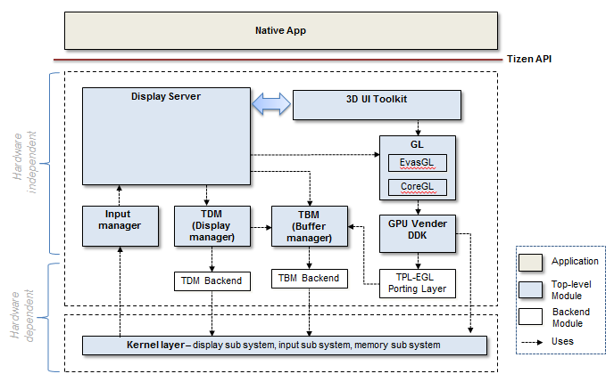

The modules are hardware abstraction layers for graphics and UI. They allow the client and server to render with the GPU, share buffers with other processes, and organize hardware output devices for various chipsets. Their backend module needs to be implemented for the new hardware device:

- TBM provides an abstraction interface for the Tizen graphic buffer manager.
- TDM provides an abstraction interface for a display server, such as X or Wayland, to allow direct access to graphics hardware in a safe and efficient manner as a display HAL.
- TPL-EGL is an abstraction layer for surface and buffer management on the Tizen platform, aimed to implement the EGL porting layer of the OpenGL ES driver over various display protocols.

For an application to handle input device events, the [Input Manager](https://wiki.tizen.org/3.0_Porting_Guide/Graphics_and_UI/Input) is provided, and is mainly comprised of `libinput` and a thin wrapper around it. It handles input events in Wayland compositors and communicates with Wayland clients.

## Buffer management

TBM has a frontend library and a backend module. The TBM frontend library is hardware-independent and provides a generic buffer interface. On the other hand, the TBM backend module is hardware-dependent and provides a buffer interface dependent on the target system. Chipset vendors have to provide their own backend modules in order for TBM to work well on the Tizen platform. This is because the way each vendor manages the graphic buffers can be different between various chipset devices. TBM already has several reference backends, such as `libtbm-dumb`, and `libtbm-shm`.

**Figure: TBM backend**

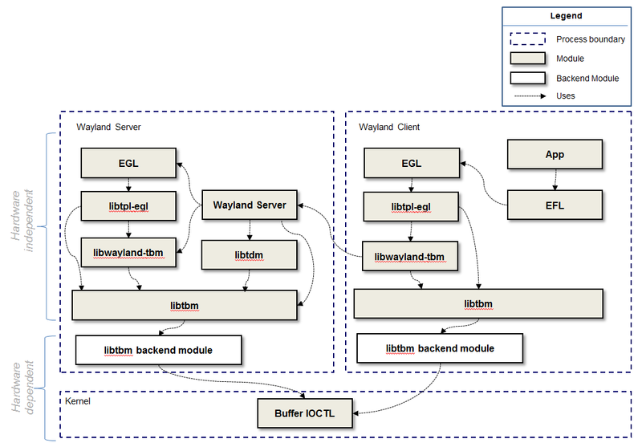

With TBM, the client and server can allocate buffers and share buffers between them. For example, a client allocates a graphic buffer, draws something on it with GL and sends it to the display server for displaying it on the screen without buffer copying. The TBM backend module is implemented as a shared library and the TBM frontend finds the `libtbm-default.so` file and loads it from the `/usr/lib/bufmgr` directory at runtime:

```
sh-3.2# ls -al
lrwxrwxrwx  1 root root    14 Jul 28  2016 libtbm_default.so -> libtbm_sprd.so
lrwxrwxrwx  1 root root    20 Jul 28  2016 libtbm_sprd.so -> libtbm_sprd.so.0.0.0
lrwxrwxrwx  1 root root    20 Jul 28  2016 libtbm_sprd.so.0 -> libtbm_sprd.so.0.0.0
-rwxr-xr-x  1 root root 26728 Jun 29  2016 libtbm_sprd.so.0.0.0
```

### Initializing TBM backend module

The TBM backend module must define the global data symbol with the name, `tbm_backend_module_data`. The TBM frontend reads the global data symbol at the initialization time. In addition, the TBM backend module calls `init()` of `tbm_backend_module_data`. For more information, see [tbm_backend.h](https://review.tizen.org/gerrit/gitweb?p=platform/core/uifw/libtbm.git;a=tree;h=refs/heads/tizen;hb=refs/heads/tizen):

```cpp
typedef struct _tbm_backend_module {
	const char *name;           /**< The module name of the backend module */
	const char *vendor;         /**< The vendor name of the backend module */
	unsigned long abi_version;  /**< The ABI version of the backend module */
	/**
	 * @brief The init function of the backend module
	 * @param[in] bufmgr: A TBM buffer manager object
	 * @return The backend module data
	 * @see tbm_backend_bufmgr_data
	 */
	tbm_backend_bufmgr_data *(*init)(tbm_bufmgr bufmgr, tbm_error_e *error);
	/**
	* @brief deinitialize the bufmgr private data
	* @param[in] bufmgr_data : The backend module data
	*/
	void (*deinit)(tbm_backend_bufmgr_data *bufmgr_data);
} tbm_backend_module;
```

```cpp
#include <tbm_backend.h>

static tbm_backend_bufmgr_data *bufmgr_data;

tbm_backend_bufmgr_data*
tbm_shm_init(tbm_bufmgr bufmgr, tbm_error_e *error)
{
    bufmgr_data = calloc(1, sizeof(tbm_backend_bufmgr_data));

    return (tbm_backend_bufmgr_data*)bufmgr_data;
}

void
tbm_shm_deinit(tbm_backend_bufmgr_data *bufmgr_data)
{
    free(bufmgr_data);
}

tbm_backend_module tbm_backend_module_data = {
	"shm",
	"Samsung",
	TBM_BACKEND_ABI_VERSION_3_0,
	tbm_shm_init,
	tbm_shm_deinit
};
```

The TBM backend must register `tbm_backend_bufmgr_func` and `tbm_backend_bo_func` with `tbm_backend_bufmgr_register_bufmgr_func()` and `tbm_backend_bufmgr_alloc_bo_func()` in `init()` of `tbm_backend_module`:

```cpp
#include <tbm_backend.h>

tbm_backend_bufmgr_data*
tbm_shm_init(tbm_bufmgr bufmgr, tbm_error_e *error)
{
	bufmgr_func->bufmgr_get_capabilities = tbm_shm_bufmgr_get_capabilities;
	bufmgr_func->bufmgr_bind_native_display = tbm_shm_bufmgr_bind_native_display;
	bufmgr_func->bufmgr_get_supported_formats = tbm_shm_bufmgr_get_supported_formats;
	bufmgr_func->bufmgr_get_plane_data = tbm_shm_bufmgr_get_plane_data;
	bufmgr_func->bufmgr_alloc_bo = tbm_shm_bufmgr_alloc_bo;
	bufmgr_func->bufmgr_alloc_bo_with_format = NULL;
	bufmgr_func->bufmgr_import_fd = tbm_shm_bufmgr_import_fd;
	bufmgr_func->bufmgr_import_key = NULL;

	err = tbm_backend_bufmgr_register_bufmgr_func(bufmgr, bufmgr_func);
	if (err != TBM_ERROR_NONE) {
		TBM_ERR("fail to register bufmgr_func! err(%d)\n", err);
		if (error)
			*error = TBM_ERROR_INVALID_OPERATION;
		goto fail_register_bufmgr_func;
	}
	bufmgr_shm->bufmgr_func = bufmgr_func;

	bo_func->bo_free = tbm_shm_bo_free;
	bo_func->bo_get_size = tbm_shm_bo_get_size;
	bo_func->bo_get_memory_types = tbm_shm_bo_get_memory_type;
	bo_func->bo_get_handle = tbm_shm_bo_get_handle;
	bo_func->bo_map = tbm_shm_bo_map;
	bo_func->bo_unmap = tbm_shm_bo_unmap;
	bo_func->bo_lock = NULL;
	bo_func->bo_unlock = NULL;
	bo_func->bo_export_fd = tbm_sprd_bo_export_fd;
	bo_func->bo_export_key = NULL;

	err = tbm_backend_bufmgr_register_bo_func(bufmgr, bo_func);
	if (err != TBM_ERROR_NONE) {
		TBM_ERR("fail to register bo_func! err(%d)\n", err);
		if (error)
			*error = TBM_ERROR_INVALID_OPERATION;
		goto fail_register_bo_func;
	}
	bufmgr_shm->bo_func = bo_func;

	return (tbm_backend_bufmgr_data *)bufmgr_shm;
}
```


### Porting OAL interface

TBM provides the header files to implement the TBM backend module.

**Table: TBM backend module header files**

| Header file                              | Description                              |
| ---------------------------------------- | ---------------------------------------- |
| [tbm_backend.h](https://review.tizen.org/gerrit/gitweb?p=platform/core/uifw/libtbm.git;a=blob;f=include/tbm_backend.h;h=5a274838222a85d6756d34ad9bcfe96e28dbf347;hb=refs/heads/tizen) | This file includes information on implementing the TBM backend module. |
| [tbm_drm_helper.h](https://review.tizen.org/gerrit/gitweb?p=platform/core/uifw/libtbm.git;a=blob;f=include/tbm_drm_helper.h;h=9204b43793c9ede6409096157354c6280c024ed1;hb=refs/heads/tizen) | This file includes helper functions for the DRM interface backend module. |
| [tbm_type_common.h](https://review.tizen.org/gerrit/gitweb?p=platform/core/uifw/libtbm.git;a=blob;f=include/tbm_type_common.h;h=068d19b9514a9241cbdd442a310c423e086be60d;hb=refs/heads/tizen) | This is the user header file including general information on how to use TBM. |

#### TBM backend interface

The following table lists the `bufmgr` backend interface functions of `tbm_backend_module`. For more information, see [tbm_backend.h](https://review.tizen.org/gerrit/gitweb?p=platform/core/uifw/libtbm.git;a=tree;h=refs/heads/tizen;hb=refs/heads/tizen):

**Table: bufmgr functions**

| Function          | Description                              | Mandatory                                |
| ----------------- | ---------------------------------------- | ---------------------------------------- |
| `bufmgr_get_capabilities()`           | Gets the capabilities of a buffer manager. | Yes |
| `bufmgr_bind_native_display()`        | Sets (bind) the native display. If the backend needs to get the native display, use this backend function. | Yes |
| `bufmgr_get_supported_formats()`      | Gets the format list and the number to be supported by the backend. | Yes |
| `bufmgr_get_plane_data()`             | Gets the plane data of `plane_idx` according to the color format. | Yes |
| `bufmgr_alloc_bo()`                   | Allocates `tbm_backend_bo_data` of `tbm_backend_module`. `tbm_backend_bo_data` is a pointer. | Yes |
| `bufmgr_alloc_bo_with_format()`       | Allocates `tbm_backend_bo_data` of the `bo` index according to the color format. `tbm_backend_bo_data` is a pointer. Implement this function if your backend needs to allocate buffers with specific format and bo index information. | No |
| `bufmgr_alloc_bo_with_tiled_format()` | Allocates `tbm_backend_bo_data` for GPU that supports the tiled format. `tbm_backend_bo_data` is a pointer. Implement this function if your backend supports tiled memory allocation for GPU optimization. | No |
| `bufmgr_import_fd()`                  | Imports `tbm_backend_bo_data` associated with the prime `fd`. `tbm_fd` must be freed by you. If the backend does not support buffer sharing by `tbm_fd`, the function pointer must be set to `NULL`. | Yes (Must support buffer sharing by `tbm_fd`.)  |
| `bufmgr_import_key()`                 | Imports `tbm_backend_bo_data` associated with the key. If the backend does not support buffer sharing by `tbm_fd`, the function pointer must be set to `NULL`. | Yes |

The following table lists the `bo` backend interface functions of `tbm_backend_module`. For more information, see [tbm_backend.h](https://review.tizen.org/gerrit/gitweb?p=platform/core/uifw/libtbm.git;a=tree;h=refs/heads/tizen;hb=refs/heads/tizen):

**Table: bo functions**

| Function                     | Description                              | Mandatory          |
| ---------------------------- | ---------------------------------------- | ------------------ |
| `bo_free()`             | Frees `tbm_backend_bo_data`. | Yes |
| `bo_get_size()`         | Gets the size of `tbm_backend_bo_data`. | Yes |
| `bo_get_memory_types()` | Gets `tbm_bo_memory_type`. | Yes |
| `bo_get_handle()`       | Gets `tbm_bo_handle` according to `tbm_bo_device_type`. | Yes |
| `bo_map()`              | Maps `tbm_backend_bo_data` according to `tbm_bo_device_type` and `tbm_bo_access_option`. | Yes |
| `bo_unmap()`            | Unmaps `tbm_backend_bo_data`. | Yes |
| `bo_lock()`             | Locks `tbm_backend_bo_data` with a device and an option. | No |
| `bo_unlock()`           | Unlocks `tbm_backend_bo_data`. | No |
| `bo_export_fd()`        | Exports `tbm_backend_bo_data` to `tdm_fd` (prime fd). `tbm_fd` must be freed by the user. If the backend does not support a buffer sharing by `tdm_fd`, the function pointer must be set to `NULL`. | Yes |
| `bo_export_key()`       | Exports `tbm_backend_bo_data` to `tdm_key`. If the backend does not support a buffer sharing by `tdm_key`, the function pointer must be set to `NULL`. | Yes |

The following table lists the TBM buffer manager capability, `tbm_bufmgr_capability`:

| Buffer capability                    | Description                              |
| ------------------------------------ | ---------------------------------------- |
| `TBM_BUFMGR_CAPABILITY_NONE`         | Does not support TBM buffer capability.  |
| `TBM_BUFMGR_CAPABILITY_SHARE_KEY`    | Supports sharing buffer by `tbm_key`.      |
| `TBM_BUFMGR_CAPABILITY_SHARE_FD`     | Supports sharing buffer by `tbm_fd`.       |
| `TBM_BUFMGR_CAPABILITY_TBM_SYNC`     | Supports timeline sync.                  |
| `TBM_BUFMGR_CAPABILITY_TILED_MEMORY` | Supports tiled memory.                   |
| `TBM_BUFMGR_CAPABILITY_SHARE_SURFACE` | Supports sharing surface by buffer data. |

The following table lists the TBM buffer memory types, `tbm_bo_memory_type`:

| Buffer memory type   | Description                                     |
| -------------------- | ----------------------------------------------- |
| `TBM_BO_DEFAULT`     | Default memory: It depends on the backend.       |
| `TBM_BO_SCANOUT`     | Scanout memory                                  |
| `TBM_BO_NONCACHABLE` | Non-cacheable memory                             |
| `TBM_BO_WC`          | Write-combined memory                            |
| `TBM_BO_TILED`       | Tiled memory                                    |
| `TBM_BO_PROTECTED`   | Protected memory                                 |
| `TBM_BO_VENDOR`      | Vendor specific memory: It depends on the backend. |

The following table lists the TBM buffer device types, `tbm_bo_device_type`:

| Device type          | Description                              |
| -------------------- | ---------------------------------------- |
| `TBM_DEVICE_DEFAULT` | Device type to get the default handle    |
| `TBM_DEVICE_CPU`     | Device type to get the virtual memory    |
| `TBM_DEVICE_2D`      | Device type to get the 2D memory handle  |
| `TBM_DEVICE_3D`      | Device type to get the 3D memory handle  |
| `TBM_DEVICE_MM`      | Device type to get the multimedia handle |

The following table lists the TBM buffer access options, `tbm_bo_access_option`:

| Access option       | Description                                        |
| ------------------- | -------------------------------------------------- |
| `TBM_OPTION_READ`   | Access option to read                              |
| `TBM_OPTION_WRITE`  | Access option to write                             |
| `TBM_OPTION_VENDOR` | Vendor-specific option that depends on the backend |

#### Surface Buffer Data Structure

TBM provides a surface buffer data structure for sharing surface information between processes. This structure is used for surface import and export operations.

```cpp
typedef struct _tbm_surface_buffer_data {
    int *fds;                       /**< an array of dmabuf fds */
    unsigned int num_fds;           /**< the number of dmabuf fds */
    int *meta_data;                 /**< an array of meta data */
    unsigned int num_meta_data;     /**< the number of meta data */
    void *reserved1;                /**< reserved data1 */
    void *reserved2;                /**< reserved data2 */
} tbm_surface_buffer_data;
```

**Table: Surface Buffer Data fields**

| Field | Description |
| ----- | ----------- |
| `fds` | An array of dmabuf file descriptors for the surface planes |
| `num_fds` | The number of dmabuf file descriptors in the array |
| `meta_data` | An array of metadata associated with the surface |
| `num_meta_data` | The number of metadata items in the array |
| `reserved1` | Reserved for future use |
| `reserved2` | Reserved for future use |

This structure enables efficient surface sharing between processes by providing all necessary buffer information in a standardized format.

#### TBM DRM helper functions

If the target uses the `drm` interface, the client needs to get the authenticated `fd` from the display server and the display server must share the `drm` master `fd` with the TDM backend module. The TBM frontend provides the helper functions for `drm` authentication with the Wayland protocol and shares the master `fd` with the TDM backend module.

**Table: DRM helper functions**

| Function                                 | Description                              |
| ---------------------------------------- | ---------------------------------------- |
| `tbm_drm_helper_wl_auth_server_init()`   | If the TBM backend module needs to use the authentication server, the backend module must call this function in the display server. |
| `tbm_drm_helper_wl_auth_server_deinit()` | Deinitializes the `drm` authentication in the display server. |
| `tbm_drm_helper_get_master_fd()`         | If the TDM backend module already has a `drm` master `fd`, the TBM backend module can get the master `fd` from this function. |
| `tbm_drm_helper_set_tbm_master_fd()`     | If the TBM backend module opens the `drm` master `fd`, this function has to be called for sharing the `drm` master `fd` with TDM. |
| `tbm_drm_helper_unset_tbm_master_fd()`   | If the TBM backend module is opened and does not use the `drm` master `fd`, this function has to be called. |
| `tbm_drm_helper_get_auth_info()`         | Client gets the authenticated `fd` and device info from the display server. |

### TBM backends

The following table lists the TBM backends.

**Table: TBM backends**

| Backend         | Project ([http://review.tizen.org](http://review.tizen.org/)) | Description                              |
| --------------- | ---------------------------------------- | ---------------------------------------- |
| `libtbm-shm`    | [platform/adaptation/libtbm-shm](https://review.tizen.org/gerrit/gitweb?p=platform/adaptation/libtbm-shm.git;a=summary) | Backend for a target device which supports the SHM memory interface. The SHM backend module uses the XSI shared memory segment and does not have hardware dependencies. |
| `libtbm-dumb`   | [platform/adaptation/libtbm-dumb](https://review.tizen.org/gerrit/gitweb?p=platform/adaptation/libtbm-dumb.git;a=summary) | Backend for a target device which supports the DUMB memory interface. If the target kernel supports the `drm` interface, the target can use the `dumb` backend because the DUMB memory interface is the default `drm` memory interface. |
| `libtbm-sprd`   | [platform/adaptation/spreadtrum/libtbm-sprd](https://review.tizen.org/gerrit/gitweb?p=platform/adaptation/spreadtrum/libtbm-sprd.git;a=summary) | Backend for a target device which uses the Spreadtrum chipset only. The `sprd` backend module uses the `drm` gem memory interface but some `ioctl` are only provided by the `sprd drm` kernel. |
| `libtbm-exynos` | [platform/adaptation/samsung_exynos/libtbm-exynos](https://review.tizen.org/gerrit/gitweb?p=platform/adaptation/samsung_exynos/libtbm-exynos.git;a=summary) | Backend for a target device which uses the exynos chipset only. The `exynos` backend module uses the `drm` gem memory interface but some `ioctl` are only provided by `exynos drm` kernel. |
| `libtbm-vigs`   | [platform/adaptation/emulator/libtbm-vigs](https://review.tizen.org/gerrit/gitweb?p=platform/adaptation/emulator/libtbm-vigs.git;a=summary) | Backend for a target device which supports the VIGS interface. The `vigs` backend is used by the emulator target. |

### Testing porting result

TBM offers `tbm-haltests` that allows you to test and verify the porting result. The `tbm-haltests` tool is included in the `libtbm-haltests` package that can be downloaded from the [platform binary's snapshot repository](https://download.tizen.org/snapshots/tizen/unified/latest/repos/standard/packages/). It depends on the `gtest` package and it can be downloaded from the [platform's snapshot repository](https://download.tizen.org/snapshots/tizen/unified/latest/repos/standard/packages/).

### Checking TBM log messages

TBM uses `dlog` to print the debug messages. To show the TBM run time log, use the following message:

```
$ dlogutil -v threadtime TBM
```

### Reference

For more information about TBM and TBM backend, see [Tizen Buffer Manager (TBM)](https://wiki.tizen.org/TBM).

## Display management

The display server composites and shows the client's buffers on screen. The display server sometimes needs to convert or scale an image to a different size or format. To make it possible for various chipset devices, the display server needs the display hardware resource information and control over the resources. Tizen Display Manager (TDM) offers these functionalities for the display server with the unified interface for various chipset devices.

**Figure: TDM backend**

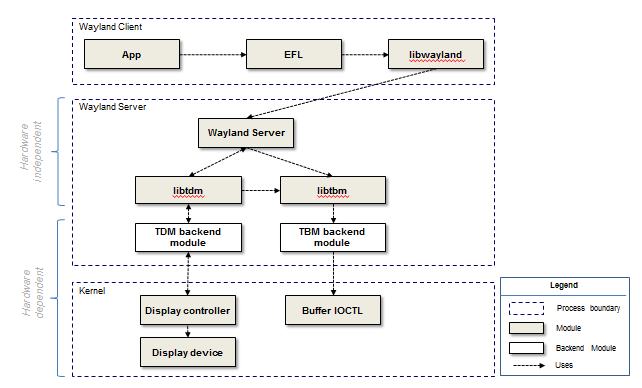

With TDM, the display server can perform mode setting, DPMS control, and showing a buffer (framebuffer or video buffer) on the screen in the most efficient way. If the hardware supports the m2m converting and capture device, the display server can also convert an image and dump a screen including all hardware overlays with no compositing.

The vendor has to implement the TDM backend module. The TDM backend module has the responsibility to let the TDM frontend know the display hardware resource information. The display server gets this information and controls hardware devices through the TDM frontend APIs. TDM already has several backends for reference, such as `libtdm-drm` and `libtdm-fbdev`.

The TDM backend is implemented as a shared library. The TDM frontend finds the `libtdm-default.so` file and loads it in the `/usr/lib/tdm` directory at runtime:

```
sh-3.2# ls -l /usr/lib/tdm
total 40
lrwxrwxrwx 1 root root    14 Jul 28  2016 libtdm-default.so -> libtdm-drm.so
-rwxr-xr-x 1 root root 37152 Jul 12  2016 libtdm-drm.so
```

### Initializing TDM backend module

The TDM backend module must define the global data symbol with the name `tdm_backend_module_data`. The TDM frontend reads this symbol at the initialization time. TDM calls the `init()` function of the `tdm_backend_module_data`. For more information, see [tdm_backend.h](https://review.tizen.org/gerrit/gitweb?p=platform/core/uifw/libtdm.git;a=tree;h=refs/heads/tizen;hb=refs/heads/tizen):

```cpp
typedef struct _tdm_backend_module {
    char *name;           /**< The module name of a backend module */
    char *vendor;         /**< The vendor name of a backend module */
    unsigned long abi_version;  /**< The ABI version of a backend module */
    /**
     * @brief The init function of a backend module
     * @param[in] dpy A display object
     * @param[out] error #TDM_ERROR_NONE if success. Otherwise, error value.
     * @return The backend module data
     * @see tdm_backend_data
     */
    tdm_backend_data *(*init)(tdm_display *dpy, tdm_error *error);
    /**
     * @brief The deinit function of a backend module
     * @param[in] bdata The backend module data
     */
    void (*deinit)(tdm_backend_data *bdata);
} tdm_backend_module;
```

```cpp
#include <tdm_backend.h>

static tdm_drm_data *drm_data;

tdm_backend_data*
tdm_drm_init(tdm_display *dpy, tdm_error *error) {
    drm_data = calloc(1, sizeof(tdm_drm_data));

    return (tdm_backend_data*)drm_data;
}

void
tdm_drm_deinit(tdm_backend_data *bdata) {
    free(bdata);
}

tdm_backend_module tdm_backend_module_data = {
    "drm",
    "Samsung",
    TDM_BACKEND_SET_ABI_VERSION(2,0),
    tdm_drm_init,
    tdm_drm_deinit
};
```

The TDM backend must register the `tdm_func_display()`, `tdm_func_output()`, `tdm_func_hwc()`, and `tdm_func_hwc_window()` functions with the `tdm_backend_register_func_display()`, `tdm_backend_register_func_output()`, `tdm_backend_register_func_hwc()`, and `tdm_backend_register_func_hwc_window()` functions in the `tdm_backend_module_data` `init()` function:

```cpp
#include <tdm_backend.h>

tdm_backend_data*
tdm_drm_init(tdm_display *dpy, tdm_error *error) {
    memset(&drm_func_display, 0, sizeof(drm_func_display));
    drm_func_display.display_get_capability = drm_display_get_capability;
    drm_func_display.display_get_pp_capability = drm_display_get_pp_capability;
    drm_func_display.display_get_outputs = drm_display_get_outputs;
    drm_func_display.display_get_fd = drm_display_get_fd;
    drm_func_display.display_handle_events = drm_display_handle_events;
    drm_func_display.display_create_pp = drm_display_create_pp;
    ret = tdm_backend_register_func_display(dpy, &drm_func_display);
    if (ret != TDM_ERROR_NONE)
        goto failed;

    memset(&drm_func_output, 0, sizeof(drm_func_output));
    drm_func_output.output_get_capability = drm_output_get_capability;
    drm_func_output.output_wait_vblank = drm_output_wait_vblank;
    drm_func_output.output_set_vblank_handler = drm_output_set_vblank_handler;
    drm_func_output.output_set_mode = drm_output_set_mode;
    drm_func_output.output_get_mode = drm_output_get_mode;
    drm_func_output.output_get_hwc = drm_output_get_hwc;

    ret = tdm_backend_register_func_output(dpy, &drm_func_output);
    if (ret != TDM_ERROR_NONE)
        goto failed;

    memset(&drm_func_hwc, 0, sizeof(drm_func_hwc));
    drm_func_hwc.hwc_create_window = drm_hwc_create_window;
    drm_func_hwc.hwc_get_video_supported_formats = drm_hwc_get_video_supported_formats;
    drm_func_hwc.hwc_get_capabilities = drm_hwc_get_capabilities;
    drm_func_hwc.hwc_get_available_properties = drm_hwc_get_available_properties;
    drm_func_hwc.hwc_get_client_target_buffer_queue = drm_hwc_get_client_target_buffer_queue;
    drm_func_hwc.hwc_set_client_target_buffer = drm_hwc_set_client_target_buffer;
    drm_func_hwc.hwc_validate = drm_hwc_validate;
    drm_func_hwc.hwc_get_changed_composition_types = drm_hwc_get_changed_composition_types;
    drm_func_hwc.hwc_accept_validation = drm_hwc_accept_validation;
    drm_func_hwc.hwc_commit = drm_hwc_commit;
    drm_func_hwc.hwc_set_commit_handler = drm_hwc_set_commit_handler;

    ret = tdm_backend_register_func_hwc(dpy, &drm_func_hwc);
    if (ret != TDM_ERROR_NONE)
        goto failed;

    memset(&drm_func_hwc_window, 0, sizeof(drm_func_hwc_window));
    drm_func_hwc_window.hwc_window_destroy = drm_hwc_window_destroy;
    drm_func_hwc_window.hwc_window_set_composition_type = drm_hwc_window_set_composition_type;
    drm_func_hwc_window.hwc_window_set_buffer_damage = drm_hwc_window_set_buffer_damage;
    drm_func_hwc_window.hwc_window_set_info = drm_hwc_window_set_info;
    drm_func_hwc_window.hwc_window_set_buffer = drm_hwc_window_set_buffer;
    drm_func_hwc_window.hwc_window_set_property = drm_hwc_window_set_property;
    drm_func_hwc_window.hwc_window_get_property = drm_hwc_window_get_property;
    drm_func_hwc_window.hwc_window_get_constraints = drm_hwc_window_get_constraints;
    drm_func_hwc_window.hwc_window_set_name = drm_hwc_window_set_name;

    ret = tdm_backend_register_func_hwc_window(dpy, &drm_func_hwc_window);
    if (ret != TDM_ERROR_NONE)
        goto failed;

    return (tdm_backend_data*)drm_data;
}
```

After loading the TDM backend module, the TDM frontend calls `display_get_capability()`, `display_get_outputs()`, and `output_get_capability()` to get the specific hardware information. The TDM backend module has to set `TDM_OUTPUT_CAPABILITY_HWC` on the output, when `TDM_OUTPUT_CAPABILITY_HWC` supports TDM HardWare Compositing (HWC). In the latest version (supports version 2.9) of `libtdm`, TDM recommends that the TDM backend module must support TDM HWC, which means that TDM backend has to register `tdm_func_hwc` and `tdm_func_hwc_window`. If the TDM backend module does not support TDM HWC, the TDM backend module implements `output_get_layers()` and `layer_get_capability()`, and also registers `tdm_func_layer()`.

In addition, if a target has a memory-to-memory converting hardware device and the capture hardware device, the TDM backend module can register the `tdm_func_pp()` and `tdm_func_capture()` functions with the `tdm_backend_register_func_pp()` and `tdm_backend_register_func_capture()` functions.

### Porting the OAL interface

TDM provides the header files to implement the TDM backend module.

**Table: TDM backend module header files**

| Header file                              | Description                              |
| ---------------------------------------- | ---------------------------------------- |
| [tdm_backend.h](https://review.tizen.org/gerrit/gitweb?p=platform/core/uifw/libtdm.git;a=tree;h=refs/heads/tizen;hb=refs/heads/tizen) | This file defines the TDM backend interface. |
| [tdm_log.h](https://review.tizen.org/gerrit/gitweb?p=platform/core/uifw/libtdm.git;a=tree;h=refs/heads/tizen;hb=refs/heads/tizen) | This file includes functions to print logs in frontend and backend modules. |
| [tdm_helper.h](https://review.tizen.org/gerrit/gitweb?p=platform/core/uifw/libtdm.git;a=tree;h=refs/heads/tizen;hb=refs/heads/tizen) | This file includes helper functions for the TDM frontend and backend. |

The display backend interface is mandatory. For more information, see [tdm_backend.h](https://review.tizen.org/gerrit/gitweb?p=platform/core/uifw/libtdm.git;a=tree;h=refs/heads/tizen;hb=refs/heads/tizen).

**Table: Display backend interface functions**

| Function                           | Description                              | Mandatory        |
| ---------------------------------- | ---------------------------------------- | --------- |
| `display_get_capability()`         | Gets the display capabilities of the backend module. TDM calls this function not only at initialization, but also when a new output is connected. If the hardware has a maximum usable layer count restriction, the backend module can set the max count in the `max_layer_count` element of the `tdm_caps_display` structure. Otherwise, it is set to -1. | Yes |
| `display_get_pp_capability()`      | Gets the `pp` capabilities of the backend module. TDM calls this function not only at initialization, but also when a new output is connected. The backend module does not need to implement this function if the hardware does not have a memory-to-memory converting device. If it does, the backend module must fill the `tdm_caps_pp` data, which contains the hardware restriction information which a converting device can handle, such as format and size. | No  |
| `display_get_capture_capability()` | Gets the capture capabilities of the backend module. TDM calls this function not only at initialization, but also when a new output is connected. The backend module does not need to implement this function if the hardware does not have a capture device. If it does, the backend module must fill the `tdm_caps_capture` data, which contains the hardware restriction information which a capture device can handle, such as format and size. | No  |
| `display_get_outputs()`            | Gets an output array of the backend module. TDM calls this function not only at initialization, but also when a new output is connected. The backend module must return the newly-allocated array which contains `tdm_output*` data. It is freed in the frontend. | Yes |
| `display_get_fd()`                 | Gets the file descriptor of the backend module. The backend module can return the epoll's `fd`. | No  |
| `display_handle_events()`          | Handles the events which happen on the `fd` of the backend module. | No  |
| `display_create_pp()`              | Creates a `pp` object of the backend module. The backend module does not need to implement this function if the hardware does not have a memory-to-memory converting device | No  |

The output backend interface is mandatory. For more information, see [tdm_backend.h](https://review.tizen.org/gerrit/gitweb?p=platform/core/uifw/libtdm.git;a=tree;h=refs/heads/tizen;hb=refs/heads/tizen).

**Table: Output backend interface functions**

| Function                      | Description                              | Mandatory          |
| ----------------------------- | ---------------------------------------- | --------- |
| `output_get_capability()`     | Gets the capabilities of an output object. TDM calls this function not only at initialization, but also when a new output is connected. The `tdm_caps_output` contains connection status, modes, available properties, and size restriction information. | Yes |
| `output_get_layers()`         | Gets the layer array of an output object. TDM calls this function not only at initialization, but also when a new output is connected. The backend module must return the newly-allocated array which contains `tdm_layer*` data. It is freed in the frontend. | Yes (Deprecated) |
| `output_set_property()`       | Sets the property with a given ID.       | No  |
| `output_get_property()`       | Gets the property with a given ID.       | No  |
| `output_wait_vblank()`        | Waits for `VBLANK`. If this function returns `TDM_ERROR_NONE`, the backend module must call a user `vblank` handler with the user data of this function after `vblanks` interval. | Yes |
| `output_set_vblank_handler()` | Sets the user `vblank` handler.          | Yes |
| `output_commit()`             | Commits the changes for an output object. When this function is called, the backend module must apply all changes of the given output object to the screen as well as the layer changes of this output. If this function returns `TDM_ERROR_NONE`, the backend module must call a user commit handler with the user data of this function after all changes of the given output object are applied. | Yes (Deprecated) |
| `output_set_commit_handler()` | Sets a user commit handler.              | Yes (Deprecated) |
| `output_set_dpms()`           | Sets the DPMS of an output object.       | No  |
| `output_get_dpms()`           | Gets the DPMS of an output object.       | No  |
| `output_set_mode()`           | Sets 1 of the available modes of an output object. | Yes |
| `output_create_capture()`     | Creates a capture object of an output object. The backend module does not need to implement this function if the hardware does not have a capture device. | No  |
| `output_set_status_handler()` | Sets an output connection status handler. The backend module must call the output status handler when the output connection status has been changed to let the TDM frontend know of the change. | No  |
| `output_set_dpms_handler()`   | Sets an output DPMS handler. The backend module must call the output DPMS handler when the output DPMS has been changed to let the TDM frontend know of the change. | No  |
| `output_get_hwc()`            | Gets an hwc object of an output object. The backend module returns the hwc object when the output has `TDM_OUTPUT_CAPABILITY_HWC`. | Yes  |

The HWC backend interface is mandatory. For more information, see [tdm_backend.h](https://review.tizen.org/gerrit/gitweb?p=platform/core/uifw/libtdm.git;a=tree;h=refs/heads/tizen;hb=refs/heads/tizen).

**Table: HWC backend interface functions**

| Function                   | Description                              | Mandatory          |
| -------------------------- | ---------------------------------------- | --------- |
| `hwc_create_window()`                  | Creates a new window on the given HWC. The backend module must implement `hwc_create_window()`. In addition, the backend module creates a private `tdm_hwc_window` and returns its handle. | Yes |
| `hwc_get_video_supported_formats()`    | Gets the video supported format array for the hwc windows of an hwc object. | Yes  |
| `hwc_get_video_available_properties()` | Gets the available video property array of an hwc object. The backend returns the video properties that are predefined in the backend module. | Yes  |
| `hwc_get_capabilities()`               | Gets the hwc capabilities that the backend can support. | Yes |
| `hwc_get_available_properties()`       | Gets the available property array of an hwc object. The backend returns the properties that are predefined in the backend module. | Yes |
| `hwc_get_client_target_buffer_queue()` | Gets a target buffer queue. The backend returns `tbm_surface_queue_h`. | Yes |
| `hwc_set_client_target_buffer()`       | Sets the client (relative to TDM) target buffer. The target buffer is from `tbm_surface_queue_h` that contains the result of the GL composition with `tdm_hwc_window`. | Yes |
| `hwc_validate()`                       | Validates HWC. The backend inspects all the hardware layer states and determines whether there are any composition type changes necessary before committing HWC. | Yes  |
| `hwc_get_changed_composition_types()`  | Gets the changed composition types. The backend returns `tdm_hwc_window` and the `tdm_hwc_window` composition type is changed through `hwc_validate`. | Yes  |
| `hwc_accept_validation()`              | Accepts the validation required by the backend. The backend can identify the decided `tdm_hwc_window_composition` at the required validation. The backend can commit the set of `tdm_hwc_window` with this accepted `tdm_hwc_window_composition`. | Yes  |
| `hwc_commit()`                         | Commits changes for an hwc object. The backend can commit output (layers), associated with the accepted validation of the hwc object on the display output device. | Yes  |
| `hwc_set_commit_handler()`             | Sets a user commit handler. The backend has to call `tdm_hwc_commit_handler` after finishing `hwc_commit`. | Yes  |
| `hwc_set_property()`                   | Sets the property that has a given property ID by the backend on the hwc object. | Yes  |
| `hwc_get_property()`                   | Gets the property that has a given property ID by the backend on the hwc object. | Yes  |

The hwc window backend interface is mandatory. For more information, see [tdm_backend.h](https://review.tizen.org/gerrit/gitweb?p=platform/core/uifw/libtdm.git;a=tree;h=refs/heads/tizen;hb=refs/heads/tizen).

**Table: HWC window backend interface functions**

| Function                   | Description                              | Mandatory          |
| -------------------------- | ---------------------------------------- | --------- |
| `hwc_window_destroy()`              | Destroys `tdm_hwc_window`. The backend module must implement this function. The backend destroys the private window, `tdm_hwc_window`. | Yes |
| `hwc_window_acquire_buffer_queue()` | Acquires a buffer queue associated with `tdm_hwc_window`. This function can be used when the backend has `TDM_HWC_WIN_CONSTRAINT_BUFFER_QUEUE`. | No  |
| `hwc_window_release_buffer_queue()` | Releases a buffer queue associated with `tdm_hwc_window`. This function can be used when the backend has `TDM_HWC_WIN_CONSTRAINT_BUFFER_QUEUE`. | No  |
| `hwc_window_set_composition_type()` | Sets the composition type of `tdm_hwc_window`. The backend sets `tdm_hwc_window_composition`.| Yes |
| `hwc_window_set_buffer_damage()`    | Sets the buffer damage. The backend sets the buffer damage. | Yes |
| `hwc_window_set_info()`             | Sets the information to `tdm_hwc_window`. The information will be applied when the hwc object is committed. | Yes |
| `hwc_window_set_buffer()`           | Sets a TDM buffer to `tdm_hwc_window`. A TDM buffer will be applied when the hwc object is committed. | Yes |
| `hwc_window_set_property()`         | Sets the property that has a given property ID by the backend. | Yes  |
| `hwc_window_get_property()`         | Gets the property that has a given property ID by the backend. | Yes  |
| `hwc_window_get_constraints()`      | Gets the constraints of `tdm_hwc_window`. The backend returns `tdm_hwc_window_constraint`. | Yes  |
| `hwc_window_set_name()`             | Sets the name of `tdm_hwc_window`. The backend can get the name of `tdm_hwc_window`.| Yes  |
| `hwc_window_set_cursor_image()`     | Sets the cursor memory information associated with `tdm_hwc_window`.	 | Yes  |

The layer backend interface is mandatory. For more information, see [tdm_backend.h](https://review.tizen.org/gerrit/gitweb?p=platform/core/uifw/libtdm.git;a=tree;h=refs/heads/tizen;hb=refs/heads/tizen).

**Note:** The entire layer interface is deprecated since TDM 2.0. All layer-related functions, types, and structures are marked as deprecated in `tdm_deprecated.h`. New implementations should use the HWC (Hardware Compositing) interface instead.

**Table: Layer backend interface functions (Deprecated)**

| Function                   | Description                              | Mandatory          |
| -------------------------- | ---------------------------------------- | --------- |
| `layer_get_capability()`   | Gets the capabilities of a layer object. The backend module must implement this function. TDM calls this function not only at initialization, but also when a new output is connected. `tdm_caps_layer` contains the available formats, properties, and `zpos` information. | Yes |
| `layer_set_property()`     | Sets the property with a given ID.       | No  |
| `layer_get_property()`     | Gets the property with a given ID.       | No  |
| `layer_set_info()`         | Sets the geometry information to a layer object. The backend module applies the geometry information when the output object of a layer object is committed. | Yes |
| `layer_get_info()`         | Gets the geometry information of a layer object. | Yes |
| `layer_set_buffer()`       | Sets a TDM buffer to a layer object. The backend module shows a TDM buffer on the screen when the output object of a layer object is committed. | Yes |
| `layer_unset_buffer()`     | Unsets a TDM buffer from a layer object. The backend module must remove the currently-showing buffer from the screen. | Yes |
| `layer_set_video_pos()`    | Sets the `zpos` for a video layer object. The backend module does not need to implement this function if the backend module does not have video layers. The `zpos` of the video layer is changeable. | No  |
| `layer_create_capture()`   | Creates a capture object of a layer object. The backend module does not need to implement this function if the hardware does not have a capture device. | No  |
| `layer_get_buffer_flags()` | Gets the buffer flags which the layer can support. | No  |

The `pp` backend interface is optional. For more information, see [tdm_backend.h](https://review.tizen.org/gerrit/gitweb?p=platform/core/uifw/libtdm.git;a=tree;h=refs/heads/tizen;hb=refs/heads/tizen).

**Table: pp backend interface functions**

| Function                | Description                              |
| ----------------------- | ---------------------------------------- |
| `pp_destroy()`          | Destroys a `pp` object.                  |
| `pp_set_info()`         | Sets the geometry information to a `pp` object. The backend module applies the geometry information when committed. |
| `pp_attach()`           | Attaches a source buffer and a destination buffer to a `pp` object. The backend module converts the image of a source buffer to a destination buffer when committed. The size/crop/transform information is set using the `pp_set_info()` function of `tdm_func_pp`. When done, the backend module must return the source/destination buffer using the `tdm_pp_done_handler()` function. |
| `pp_commit()`           | Commits changes for a `pp` object.       |
| `pp_set_done_handler()` | Sets a user done handler to a `pp` object. The backend module must call the `tdm_pp_done_handler()` function when image conversion is done. |

The capture backend interface is optional. For more information, see [tdm_backend.h](https://review.tizen.org/gerrit/gitweb?p=platform/core/uifw/libtdm.git;a=tree;h=refs/heads/tizen;hb=refs/heads/tizen).

**Table: Capture backend interface functions**

| Function                     | Description                              |
| ---------------------------- | ---------------------------------------- |
| `capture_destroy()`          | Destroys a capture object.               |
| `capture_set_info()`         | Sets the geometry information to a capture object. The backend module applies the geometry information when committed. |
| `capture_attach()`           | Attaches a TDM buffer to a capture object. When the `capture_commit()` function is called, the backend module starts to dump an output or a layer to a TDM buffer. The backend module starts to dump an output or a layer to a TDM buffer when committed. The size/crop/transform information is set using the `capture_set_info()` function of the `tdm_func_capture`. When done, the backend module must return the TDM buffer using the `tdm_capture_done_handler()` function. |
| `capture_commit()`           | Commits changes for a capture object.    |
| `capture_set_done_handler()` | Sets a user done handler to a capture object. The backend module must call the `tdm_capture_done_handler()` function when the capture operation is done. |

### TDM backends

There are several backends which can be used as reference when implementing the TDM backend.

**Table: TDM backends**

| Backend         | Project ([http://review.tizen.org](http://review.tizen.org/)) | Description                              |
| --------------- | ---------------------------------------- | ---------------------------------------- |
| `libtdm-drm`    | [platform/adaptation/libtdm-drm](https://review.tizen.org/gerrit/gitweb?p=platform/adaptation/libtdm-drm.git;a=summary) | Backend for a target device which supports the DRM interface, such as the Tizen Emulator. No PP or capture capability. |
| `libtdm-fbdev`  | [platform/adaptation/libtdm-fbdev](https://review.tizen.org/gerrit/gitweb?p=platform/adaptation/libtdm-fbdev.git;a=summary) | Backend for a target device which supports the FBDEV interface. No PP or capture capability. |
| `libtdm-exynos` | [platform/adaptation/samsung_exynos/libtdm-exynos](https://review.tizen.org/gerrit/gitweb?p=platform/adaptation/samsung_exynos/libtdm-exynos.git;a=summary) | Backend for a target device which uses the `exynos` chipset using the DRM interface. Has PP and capture capability, using the exynos-specific DRM interface to support PP. |
| `libtdm-sprd`   | [platform/adaptation/spreadtrum/libtdm-sprd](https://review.tizen.org/gerrit/gitweb?p=platform/adaptation/spreadtrum/libtdm-sprd.git;a=summary) | Backend for a target device which uses the Spreadtrum chipset using the Spreadtrum-specific `ioctl`. Uses the DRM interface to support `vblank`. Has PP capability, but no capture capability. |

### Testing porting result

TDM offers `tdm-haltests` that allows you to test and verify the porting result. The `tdm-haltests` tool is included in the `libtdm-haltests` package that can be downloaded from the [platform binary's snapshot repository](https://download.tizen.org/snapshots/tizen/unified/latest/repos/standard/packages/). It depends on the `gtest` package, and it can be downloaded from the [platform's snapshot repository](https://download.tizen.org/snapshots/tizen/unified/latest/repos/standard/packages/).

### Checking TDM log messages

TDM uses `dlog` to print debug messages. To show TDM runtime log messages:

```
$ dlogutil -v threadtime TDM
```

### References

For detailed information about TDM and the TDM backend, see [Tizen Display Manager (TDM)](https://wiki.tizen.org/TDM).

## Input management

The input manager supports a `libinput`-based input device backend. `libinput` is a common input library for the Wayland compositor. With `libinput`, the input stack is simpler without the Xorg input drivers. Since Tizen 3.0, the input manager is not a HAL component.

**Figure: Tizen 3.0 input management**

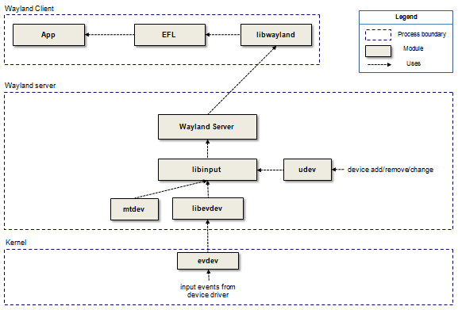

### libinput

The `libinput` library handles input devices for display servers and other applications that need to directly deal with input devices:

- Device detection
- Device handling
- Input device event processing
- Scaling touch coordinates
- Generating pointer events from touchpads
- Pointer acceleration

For more information, see the [libinput wiki](https://freedesktop.org/wiki/Software/libinput/).

### libevdev

The `libevdev` library handles evdev kernel devices. It abstracts the evdev ioctls through type-safe interfaces and provides functions to change the appearance of the device. For more information, see [https://en.wikipedia.org/wiki/Evdev](https://en.wikipedia.org/wiki/Evdev).

### mtdev

The `mtdev` standalone library transforms all variants of kernel MT events to the slotted type B protocol. For more information, see [http://www.linuxfromscratch.org/blfs/view/svn/general/mtdev.html](http://www.linuxfromscratch.org/blfs/view/svn/general/mtdev.html).

### libinput Backends

`libinput: platform/upstream/libinput`

## OpenGL

This section describes the essential elements of the Tizen platform-level graphics architecture related to OpenGL ES and EGL, and how it is used by the application framework and the display server. The focus is on how graphical data buffers move through the system.

The Tizen platform requires the OpenGL ES driver for the acceleration of the Wayland display server and the `wayland-egl` client. This platform demands an OpenGL ES and EGL driver, which are implemented by the Tizen EGL Porting Layer.

### Tizen OpenGL ES and EGL architecture

The following figure illustrates the Tizen OpenGL ES and EGL architecture.

**Figure: Tizen OpenGL ES architecture**

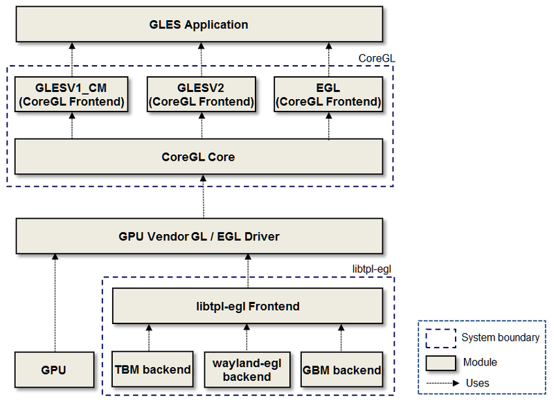

- CoreGL

  An injection layer of OpenGL ES that provides the following capabilities:

  - Support for driver-independent optimization (FastPath)
  - EGL/OpenGL ES debugging
  - Performance logging
  - Supported versions
    - EGL 1.4
    - OpenGL ES 1.1, 2.0, 3.0, 3.1

  CoreGL loads the manufacturer's OpenGL ES driver from the `/usr/lib/driver` directory. CoreGL provides `libEGL.so`, `libGLESv1_CM.so`, and `libGLESvs.so` driver files in the `/usr/lib` directory.
- GPU vendor GL/EGL driver

  The Tizen platform demands that the GPU vendor implements the GL and EGL driver using `libtpl-egl`. The GPU vendor GL/EGL driver (`libEGL.so`, `libGLESv1_CM.so`, `libGLESv2.so`) must be installed in the `/usr/lib/driver` path.


### Tizen Porting Layer (TPL) for EGL

TPL-EGL is an abstraction layer for surface and buffer management on the Tizen platform. It is used for the implementation of the EGL platform functions.

**Figure: TPL architecture**

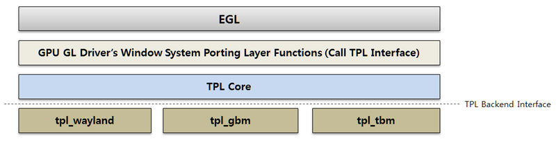

The background for the Tizen EGL Porting Layer for EGL uses various Tizen window system protocols. Therefore, there is a need to separate the common layer and backend.

Tizen uses the Tizen Porting Layer for EGL, as the TPL-EGL API prevents burdens of the EGL porting on various window system protocols. The GPU GL Driver's Window System Porting Layer can be implemented by TPL-EGL APIs, which are the corresponding window system APIs. The TBM, Wayland, Wayland Thread, GBM, and Vulkan WSI backends are supported.

**Table: TPL-EGL Backend Types**

| Backend Type | Description |
| ------------ | ----------- |
| `TPL_BACKEND_WAYLAND` | Wayland EGL backend for standard Wayland protocol |
| `TPL_BACKEND_WAYLAND_THREAD` | Wayland EGL backend with thread support for improved performance |
| `TPL_BACKEND_GBM` | Generic Buffer Manager backend for DRM-based systems |
| `TPL_BACKEND_TBM` | Tizen Buffer Manager backend for TBM protocol |
| `TPL_BACKEND_WAYLAND_VULKAN_WSI` | Wayland Vulkan WSI backend for Vulkan support |
| `TPL_BACKEND_WAYLAND_VULKAN_WSI_THREAD` | Wayland Vulkan WSI backend with thread support |
| `TPL_BACKEND_TBM_VULKAN_WSI` | TBM Vulkan WSI backend for Vulkan with TBM protocol |
| `TPL_BACKEND_X11_DRI2` | X11 DRI2 backend (deprecated) |
| `TPL_BACKEND_X11_DRI3` | X11 DRI3 backend (deprecated) |

### Tizen Porting Layer for EGL object model

TPL-EGL provides interfaces based on an object-driven model. Every TPL-EGL object can be represented as a generic `tpl_object_t`, which is reference-counted and provides common functions. Currently, display and surface types of TPL-EGL objects are provided. A display, like a normal display, represents a display system which is usually used for connecting to the server. A surface corresponds to a native surface, such as `wl_surface`. Surfaces can be configured to use N-buffers, but are usually double-buffered or triple-buffered. A buffer is what you render on, usually a set of pixels or a block of memory. For these 2 objects, the Wayland, GBM, TBM backend are defined, and they correspond to their own window systems. This means that you do not need to care about the window systems.

The TPL-EGL has the following core objects:

- TPL-EGL Object

  Base class for all TPL-EGL objects.

- TPL-EGL Display

  Encapsulates the native display object (`Display *`, `wl_display`). Like a normal display, this represents a display system which is usually used for connecting to the server, scope for other objects.

- TPL-EGL Surface

  Encapsulates the native drawable object (`Window`, `Pixmap`, `wl_surface`). The surface corresponds to a native surface, such as `tbm_surface_queue` or `wl_surface`. A surface can be configured to use N-buffers, but they are usually double-buffered or triple-buffered.

#### TPL-EGL objects and corresponding EGL objects

Both TPL-EGL and vendor OpenGL ES/EGL driver handles `tbm_surface` as the corresponding TPL surface buffer. It is represented by the `TBM_Surface` part in the following figure.

**Figure: TPL-EGL architecture**

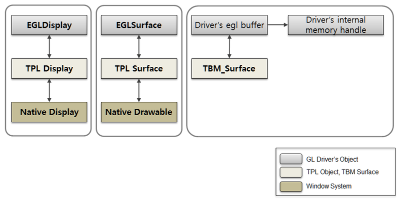

The following figure illustrates the OpenGL ES drawing API flow.

**Figure: OpenGL ES drawing API flow**

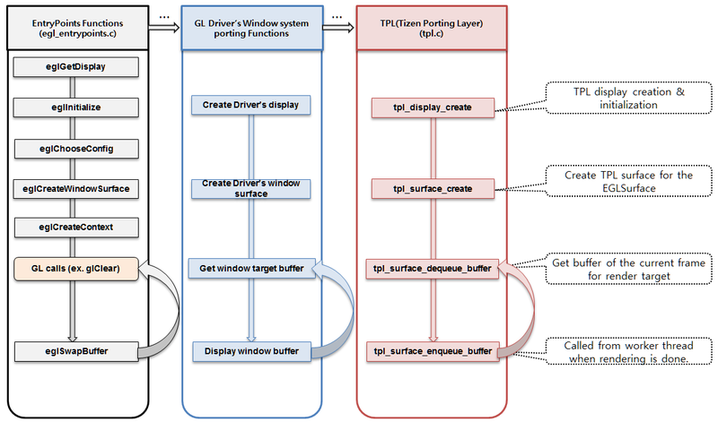

#### TPL-EGL frontend API

**Table: TPL-EGL Data Types**

| Type | Description |
| ---- | ----------- |
| `tpl_bool_t` | Boolean type (TPL_TRUE or TPL_FALSE) |
| `tpl_handle_t` | Handle to native objects (represents a handle to a native object like pixmap, window, wl_display, etc.) |
| `tpl_object_t` | Generic base class type for various TPL objects |
| `tpl_display_t` | TPL display object representing a display system |
| `tpl_surface_t` | TPL surface object representing an image which can be displayed |
| `tpl_free_func_t` | Function type used for freeing some data |
| `tpl_surface_cb_func_t` | Function type used for registering callback function |

**Table: TPL-EGL Object Types**

| Type | Description |
| ---- | ----------- |
| `TPL_OBJECT_ERROR` | Error type (-1) |
| `TPL_OBJECT_DISPLAY` | Display object type |
| `TPL_OBJECT_SURFACE` | Surface object type |
| `TPL_OBJECT_MAX` | Maximum object type |

**Table: TPL-EGL Surface Types**

| Type | Description |
| ---- | ----------- |
| `TPL_SURFACE_ERROR` | Error type (-1) |
| `TPL_SURFACE_TYPE_WINDOW` | Surface gets displayed by the display server |
| `TPL_SURFACE_TYPE_PIXMAP` | Surface is an offscreen pixmap |
| `TPL_SURFACE_MAX` | Maximum surface type |

**Table: TPL-EGL Result Types**

| Type | Description |
| ---- | ----------- |
| `TPL_ERROR_NONE` | Successful operation (0) |
| `TPL_ERROR_INVALID_PARAMETER` | Invalid parameter |
| `TPL_ERROR_INVALID_OPERATION` | Invalid operation |
| `TPL_ERROR_OUT_OF_MEMORY` | Out of memory |
| `TPL_ERROR_TIME_OUT` | Time out error |
| `TPL_ERROR_INVALID_CONNECTION` | Invalid display connection |

**TPL-EGL Object** is a base class for all TPL-EGL objects. It provides common functionalities to all TPL-EGL objects.

**Table: TPL-EGL Object functions**

| Function                     | Description                              |
| ---------------------------- | ---------------------------------------- |
| `tpl_object_reference()`     | Increases the reference count of a TPL-EGL object. All TPL-EGL objects are reference-counted with a reference count 1 on creation. When the reference count drops to 0, the object is freed. |
| `tpl_object_unreference()`   | Decreases the reference count and destroys the object if it becomes 0. |
| `tpl_object_get_reference()` | Gets the reference count of the given TPL-EGL object. |
| `tpl_object_get_type()`      | Gets the type of the object (display, surface, or buffer). |
| `tpl_object_set_user_data()` | Sets the user data to a TPL-EGL object. If the user wants to relate some data with a TPL-EGL object, this function allows them to register a pointer to such data, which can be retrieved later using the `tpl_object_get_user_data()` function. The key is the pointer value itself as a key. |
| `tpl_object_get_user_data()` | Gets the registered user data of a TPL-EGL object. |

**TPL-EGL Display** encapsulates the native display object (`Display *`, `wl_display`). Any other objects created from TPL-EGL Display inherit its backend type.

**Table: TPL-EGL Display functions**

| Function                                 | Description                              |
| ---------------------------------------- | ---------------------------------------- |
| `tpl_display_create()`                   | Creates the TPL-EGL display object for the given native display with specified backend type if there is no existing TPL-EGL display for that native display. The backend type parameter allows explicit selection of backend (Wayland, TBM, GBM, etc.). |
| `tpl_display_get()`                      | Gets the TPL-EGL display object for the given native display if one exists for it. |
| `tpl_display_get_with_backend_type()`    | Gets the TPL-EGL display object for the given native display and backend type. |
| `tpl_display_get_native_handle()`        | Gets the native display handle which the given TPL-EGL display is created for. |
| `tpl_display_query_config()`             | Queries the supported pixel formats for the given TPL-EGL display. If any pixel format values are acceptable, use the `TPL_DONT_CARE` value for the size values. |
| `tpl_display_filter_config()`            | Filters the configuration according to a given TPL-EGL display. This function modifies current config specific to the current given TPL-EGL display. |
| `tpl_display_get_backend_type()`         | Gets the backend type for the given native display. |
| `tpl_display_get_native_window_info()`   | Queries information on the given native window. |
| `tpl_display_get_native_pixmap_info()`   | Queries information on the given native pixmap. |
| `tpl_display_get_buffer_from_native_pixmap()` | Gets the native buffer from the given native pixmap. |
| `tpl_display_query_supported_buffer_count_from_native_window()` | Queries supported buffer count range for the given native window. |
| `tpl_display_query_supported_present_modes_from_native_window()` | Queries supported present modes for the given native window. |

**TPL-EGL Surface** encapsulates the native drawable object (`Window`, `Pixmap`, `wl_surface`). The main features of the class are retrieving the buffer for a frame and posting the surface to a screen.

**Table: TPL-EGL Surface functions**

| Function                                 | Description                              |
| ---------------------------------------- | ---------------------------------------- |
| `tpl_surface_create()`                   | Creates a TPL-EGL surface for the given native surface. |
| `tpl_surface_create_with_num_buffers()`  | Creates a TPL-EGL surface for the given native surface with specified number of buffers. |
| `tpl_surface_get()`                      | Gets the TPL-EGL surface object for the given native surface if one exists for it. |
| `tpl_surface_get_display()`              | Gets the TPL-EGL display where the given TPL-EGL surface was created from. |
| `tpl_surface_get_native_handle()`        | Gets the native surface handle of the given TPL-EGL surface. |
| `tpl_surface_get_type()`                 | Gets the type of the given TPL surface.  |
| `tpl_surface_get_size()`                 | Gets the current size of the given TPL-EGL surface. The size of a surface can change when a user or the server resizes the window. TPL-EGL updates the size information every time when a buffer is queried using the `tpl_surface_dequeue_buffer()` function. Note that there can still be mismatch between actual surface size and the cached one. |
| `tpl_surface_get_rotation()`             | Gets the current rotation angle of the given TPL-EGL surface. |
| `tpl_surface_validate()`                 | Validates the current frame of the given TPL-EGL surface. Call this function before getting the final render target buffer, as calling the `tpl_surface_dequeue_buffer()` function after calling this function can give output values different to earlier ones. A buffer returned after calling this function is guaranteed not to change further. |
| `tpl_surface_dequeue_buffer()`           | Gets the buffer of the current frame for the given TPL-EGL surface. Depending on the backend, communication with the server can be required. Returned buffers are used for rendering the target to draw the current frame. Returned buffers are valid until the next `tpl_surface_dequeue_buffer()` function call. If the `tpl_surface_validate()` function returns `TPL_FALSE`, the previously returned buffers must no longer be used. Instead, this function must be called again before drawing, returning a valid buffer. |
| `tpl_surface_dequeue_buffer_with_sync()` | Gets the buffer of the current frame with sync fence support for the given TPL-EGL surface. Depending on the backend, communication with the server can be required. Returned buffers are used for rendering the target to draw the current frame. Returned buffers are valid until the next `tpl_surface_dequeue_buffer()` function call. If the `tpl_surface_validate()` function returns `TPL_FALSE`, the previously returned buffers must no longer be used. Instead, this function must be called again before drawing, returning a valid buffer. This function provides synchronization through a fence that signals when the buffer is ready for use. |
| `tpl_surface_dequeue_buffer_with_sync_and_frontbuffer_info()` | Gets the buffer of the current frame with sync fence and frontbuffer information for the given TPL-EGL surface. This function provides synchronization through a fence that signals when the buffer is ready for use, and also provides frontbuffer information to optimize rendering performance. |
| `tpl_surface_enqueue_buffer()`           | Posts a given `tbm_surface`. This function requests the display server to post a frame. This is the function which can enqueue a buffer to the `tbm_surface_queue`. Make sure this function is called exactly once for a frame. Scheduling post calls on a separate thread is recommended. |
| `tpl_surface_enqueue_buffer_with_damage()` | Posts a given `tbm_surface` with region of damage. Damage information is used for reducing number of pixels composited in the compositor. Setting the `num_rects` to 0 or `rects` to `NULL` means entire area is damaged. This function requests a server to post a frame. This function is identical with the `tpl_surface_enqueue_buffer()` function except for delivering the damage information for updating. Make sure this function is called exactly once for a frame. Scheduling post calls on a separate thread is recommended. |
| `tpl_surface_enqueue_buffer_with_damage_and_sync()` | Posts a given `tbm_surface` with region of damage and sync fence. Damage information is used for reducing number of pixels composited in the compositor. Setting the `num_rects` to 0 or `rects` to `NULL` means entire area is damaged. This function requests a server to post a frame. This function is identical with the `tpl_surface_enqueue_buffer()` function except for delivering the damage information for updating. The sync fence provides synchronization between GPU and display operations. Make sure this function is called exactly once for a frame. Scheduling post calls on a separate thread is recommended. |
| `tpl_surface_set_post_interval()`        | Sets the frame interval of the given TPL-EGL surface, which ensures that only a single frame is posted within the specified vsync intervals. When a frame ends, the frame interval is set to the surface's current interval. |
| `tpl_surface_get_post_interval()`        | Gets the frame interval of the given TPL-EGL surface. |
| `tpl_surface_create_swapchain()`         | Creates a swapchain for the given TPL-EGL surface. This function creates buffers for swapchain which is binded to the given tpl surface. The swapchain provides Vulkan-style buffer management with multiple buffers for efficient rendering and presentation. |
| `tpl_surface_dequeue_buffer()`           | Gets the buffer of the current frame for the given TPL-EGL surface. Depending on the backend, communication with the server can be required. Returned buffers are used for rendering the target to draw the current frame. Returned buffers are valid until the next `tpl_surface_dequeue_buffer()` function call. If the `tpl_surface_validate()` function returns `TPL_FALSE`, the previously returned buffers must no longer be used. Instead, this function must called again before drawing, returning a valid buffer. |
| `tpl_surface_dequeue_buffer_with_sync()` | Gets the buffer of the current frame with sync fence support for the given TPL-EGL surface. |
| `tpl_surface_dequeue_buffer_with_sync_and_frontbuffer_info()` | Gets the buffer of the current frame with sync fence and frontbuffer information for the given TPL-EGL surface. |
| `tpl_surface_enqueue_buffer()`           | Posts a given `tbm_surface`. This function requests the display server to post a frame. This is the function which can enqueue a buffer to the `tbm_surface_queue`. Make sure this function is called exactly once for a frame. Scheduling post calls on a separate thread is recommended. |
| `tpl_surface_enqueue_buffer_with_damage()` | Posts a given `tbm_surface` with region of damage. Damage information is used for reducing number of pixels composited in the compositor. Setting the `num_rects` to 0 or `rects` to `NULL` means entire area is damaged. This function requests a server to post a frame. This function is identical with the `tpl_surface_enqueue_buffer()` function except for delivering the damage information for updating. Make sure this function is called exactly once for a frame. Scheduling post calls on a separate thread is recommended. |
| `tpl_surface_enqueue_buffer_with_damage_and_sync()` | Posts a given `tbm_surface` with region of damage and sync fence. |
| `tpl_surface_set_post_interval()`        | Sets the frame interval of the given TPL-EGL surface, which ensures that only a single frame is posted within the specified vsync intervals. When a frame ends, the frame interval is set to the surface's current interval. |
| `tpl_surface_get_post_interval()`        | Gets the frame interval of the given TPL-EGL surface. |
| `tpl_surface_create_swapchain()`         | Creates a swapchain for the given TPL-EGL surface. |
| `tpl_surface_destroy_swapchain()`        | Destroys a swapchain for the given TPL-EGL surface. |
| `tpl_surface_get_swapchain_buffers()`    | Gets the swapchain buffer list of the given TPL-EGL surface. |
| `tpl_surface_set_frontbuffer_mode()`     | Sets frontbuffer mode to render to only frontbuffer. |
| `tpl_surface_set_reset_cb()`             | Sets callback function to tpl_surface for receiving reset information. |
| `tpl_surface_set_rotation_capability()`  | Sets rotation capability to the given tpl_surface. |
| `tpl_surface_cancel_dequeued_buffer()`   | Cancels dequeued buffer before use. |
| `tpl_surface_fence_sync_is_available()`  | Checks if the surface can support fence sync mechanism. This function is used to determine whether the surface supports synchronization through fences, which is important for coordinating GPU and display operations. It is recommended to check fence sync availability for every frame because the results may change depending on whether frontbuffer rendering is activated or not. |
| `tpl_surface_fence_sync_is_available()`  | Checks the surface can support fence sync mechanism. |

**Table: TPL-EGL Present Mode Types**

| Present Mode | Description |
| ------------ | ----------- |
| `TPL_DISPLAY_PRESENT_MODE_MAILBOX` | The presentation engine waits for the next vertical blanking period to update the current image. Tearing cannot be observed. An internal single-entry queue is used to hold pending presentation requests. |
| `TPL_DISPLAY_PRESENT_MODE_FIFO` | The presentation engine waits for the next vertical blanking period to update the current image. Tearing cannot be observed. An internal queue is used to hold pending presentation requests. |
| `TPL_DISPLAY_PRESENT_MODE_IMMEDIATE` | The presentation engine does not wait for a vertical blanking period to update the current image, meaning this mode may result in visible tearing. |
| `TPL_DISPLAY_PRESENT_MODE_FIFO_RELAXED` | The presentation engine generally waits for the next vertical blanking period to update the current image. If a vertical blanking period has already passed since the last update of the current image then the presentation engine does not wait for another vertical blanking period for the update, meaning this mode may result in visible tearing in this case. |

The following code snippet shows a simple example of the Tizen Porting Layer:

```cpp
dpy = tpl_display_create(...);
sfc = tpl_surface_create(dpy, ...);

while (1) {
    buf = tpl_surface_dequeue_buffer(sfc);

    /* Draw something */

    tpl_surface_enqueue_buffer(sfc, buf);
}
```

In the GPU vendor driver, the GPU frame builder handles the drawing. TPL-EGL exposes the native platform buffer identifiers and managers so that the buffer can be used in other modules. Currently, `dma_buf/DRM` is supported for these purposes. The EGL porting layer calls TPL-EGL functions to execute commands requested of it, and returns the results to the GPU vendor driver. TPL-EGL performs all protocol-dependent actions. Such protocol-dependent parts can be separated into TPL-EGL backends. TPL-EGL backend can also be configured at runtime, and you can specify which type of backend to use when initializing a display object.

**EGL to TPL API Mapping Table**

#### I. Display Management Related APIs

#### 1.1 eglGetDisplay

**Function**: Get EGL display connection

| EGL API | Corresponding TPL API Call Flow |
|---------|------------------------------|
| `eglGetDisplay(native_display)` | 1. `tpl_display_get_backend_type(native_display)` - Determine backend type<br>2. `tpl_display_create(backend_type, native_display)` - Create TPL display object |

**Call Example**:
```c
// EGL side
EGLDisplay eglDpy = eglGetDisplay(native_display);

// Corresponding TPL calls
tpl_backend_type_t backend_type = tpl_display_get_backend_type(native_display);
tpl_display_t *tpl_dpy = tpl_display_create(backend_type, native_display);
```

#### 1.2 eglInitialize

**Function**: Initialize EGL display

| EGL API | Corresponding TPL API Call Flow |
|---------|------------------------------|
| `eglInitialize(display, major, minor)` | 1. `tpl_display_create(backend_type, native_display)` - Create TPL display object<br>2. `tpl_display_query_config(...)` - Query supported configurations<br>3. `tpl_display_filter_config(...)` - Filter configurations |

**Call Example**:
```c
// EGL side
EGLBoolean result = eglInitialize(display, &major, &minor);

// Corresponding TPL calls
// Step 1: Create TPL display (in winsys->new_display)
tpl_backend_type_t backend_type = tpl_display_get_backend_type(native_display);
tpl_display_t *tpl_dpy = tpl_display_create(backend_type, native_display);

// Step 2: Query configurations (in winsys->update_configs)
int red_size = 8, green_size = 8, blue_size = 8;
int alpha_size = 8, depth_size = 32;
tpl_bool_t is_slow;

tpl_display_query_config(tpl_dpy, TPL_SURFACE_TYPE_WINDOW,
                         red_size, green_size, blue_size,
                         alpha_size, depth_size, &visual_id, &is_slow);

// Step 3: Filter configuration
tpl_display_filter_config(tpl_dpy, &visual_id, alpha_size);
```

#### 1.3 eglTerminate

**Function**: Terminate EGL display

| EGL API | Corresponding TPL API Call Flow |
|---------|------------------------------|
| `eglTerminate(display)` | 1. `tpl_object_unreference(tpl_display)` - Decrease display object reference count |

**Call Example**:
```c
// EGL side
EGLDisplay display = eglGetDisplay(EGL_DEFAULT_DISPLAY);
eglInitialize(display, &major, &minor);

// Create and use surfaces and contexts
EGLSurface surface = eglCreateWindowSurface(display, config, window, NULL);
EGLContext context = eglCreateContext(display, config, EGL_NO_CONTEXT, NULL);
eglMakeCurrent(display, surface, surface, context);

// Render...
eglSwapBuffers(display, surface);

// Terminate display
EGLBoolean result = eglTerminate(display);

// Corresponding TPL calls (in delete_display)
tpl_object_unreference((tpl_object_t *)tpl_display);
```

---

#### II. Config Selection Related APIs

#### 2.1 eglChooseConfig

**Function**: Choose EGL configuration

| EGL API | Corresponding TPL API Call Flow |
|---------|------------------------------|
| `eglChooseConfig(display, attrib_list, configs, config_size, num_config)` | 1. `tpl_display_query_config()` - Query if each configuration is supported<br>2. `tpl_display_filter_config()` - Filter configurations<br>3. `tpl_display_get_native_window_info()` - Get window information |

**Call Example**:
```c
// EGL side
EGLBoolean result = eglChooseConfig(display, attrib_list, configs, config_size, &num_config);

// Corresponding TPL calls
int red_size = attrib_list_get(attrib_list, EGL_RED_SIZE);
int green_size = attrib_list_get(attrib_list, EGL_GREEN_SIZE);
int blue_size = attrib_list_get(attrib_list, EGL_BLUE_SIZE);
int alpha_size = attrib_list_get(attrib_list, EGL_ALPHA_SIZE);
int depth_size = attrib_list_get(attrib_list, EGL_DEPTH_SIZE);

tpl_display_query_config(tpl_dpy, TPL_SURFACE_TYPE_WINDOW,
                         red_size, green_size, blue_size,
                         alpha_size, depth_size, &native_visual_id, &is_slow);
```

#### 2.2 eglGetConfigAttrib

**Function**: Get configuration attribute

| EGL API | Corresponding TPL API Call Flow |
|---------|------------------------------|
| `eglGetConfigAttrib(display, config, attribute, value)` | Usually no TPL API calls needed, use cached configuration information |

---

#### III. Surface Creation Related APIs

#### 3.1 eglCreateWindowSurface

**Function**: Create window surface

| EGL API | Corresponding TPL API Call Flow |
|---------|------------------------------|
| `eglCreateWindowSurface(display, config, native_window, attrib_list)` | 1. `tpl_display_get_native_window_info()` - Get window information<br>2. `tpl_surface_create_with_num_buffers()` - Create TPL surface with specified buffer count<br>3. `tpl_object_set_user_data()` - Set user data (EGLConfig) on TPL surface<br>4. `tpl_surface_set_reset_cb()` - Set reset callback (optional) |

**Call Example**:
```c
// EGL side
EGLSurface eglSurface = eglCreateWindowSurface(display, config, native_window, attrib_list);

// Corresponding TPL calls (in new_window_surface)
int width, height;
tbm_format format;
int depth, alpha_size;

// Step 1: Get window information
tpl_display_get_native_window_info(tpl_dpy, native_window,
                                     &width, &height,
                                     &format, depth, alpha_size);

// Step 2: Create TPL surface with 2 buffers (double buffering)
int num_buffers = 2;
tpl_surface_t *tpl_sfc = tpl_surface_create_with_num_buffers(
    tpl_dpy, native_window,
    TPL_SURFACE_TYPE_WINDOW,
    format,
    num_buffers);

// Step 3: Set user data (associate EGLConfig with TPL surface)
tpl_object_set_user_data((tpl_object_t *)tpl_sfc, tpl_sfc,
                         (void *)config, NULL);

// Step 4: Optional: set reset callback
tpl_surface_set_reset_cb(tpl_sfc, (void *)surface,
                         __cb_tizen_reset_egl_surf);
```

#### 3.2 eglCreateWindowSurface with num_buffers

**Function**: Create window surface with specified buffer count

| EGL API | Corresponding TPL API Call Flow |
|---------|------------------------------|
| `eglCreateWindowSurface(...)` (using EGL_BUFFER_COUNT attribute) | 1. `tpl_display_get_native_window_info()` - Get window information<br>2. `tpl_surface_create_with_num_buffers()` - Create TPL surface with specified buffer count |

**Call Example**:
```c
// Corresponding TPL calls (specify buffer count)
int num_buffers = get_buffer_count_from_attrib_list(attrib_list);
tpl_surface_t *tpl_sfc = tpl_surface_create_with_num_buffers(
    tpl_dpy, native_window, TPL_SURFACE_TYPE_WINDOW, format, num_buffers);
```

#### 3.3 eglCreatePixmapSurface

**Function**: Create pixmap surface

| EGL API | Corresponding TPL API Call Flow |
|---------|------------------------------|
| `eglCreatePixmapSurface(display, config, native_pixmap, attrib_list)` | 1. `tpl_display_get_native_pixmap_info()` - Get pixmap information<br>2. `tpl_display_get_buffer_from_native_pixmap()` - Get pixmap buffer | |

**Call Example**:
```c
// EGL side
EGLSurface eglSurface = eglCreatePixmapSurface(display, config, native_pixmap, attrib_list);

// Corresponding TPL calls (in get_native_buffer_native_pixmap)
int width, height;
tbm_format format;

// Step 1: Get pixmap information
tpl_display_get_native_pixmap_info(tpl_dpy, native_pixmap, &width, &height, &format);

// Step 2: Get pixmap buffer (wrap external buffer as EGL color buffer)
tbm_surface_h buffer = tpl_display_get_buffer_from_native_pixmap(tpl_dpy, native_pixmap);

// Step 3: Wrap buffer as EGL color buffer for rendering
egl_color_buffer_wrap_external_planar(..., &planes, width, height, config, format, flags);
```

#### 3.4 eglDestroySurface

**Function**: Destroy surface

| EGL API | Corresponding TPL API Call Flow |
|---------|------------------------------|
| `eglDestroySurface(display, surface)` | 1. `tpl_object_unreference(tpl_surface)` - Decrease surface object reference count |

**Call Example**:
```c
// EGL side
EGLBoolean result = eglDestroySurface(display, surface);

// Corresponding TPL calls
tpl_object_unreference((tpl_object_t *)tpl_sfc);
```

---

#### IV. Buffer Operation Related APIs

#### 4.1 eglSwapBuffers (Core API)

**Function**: Swap buffers

| EGL API | Corresponding TPL API Call Flow |
|---------|------------------------------|
| `eglSwapBuffers(display, surface)` | 1. `tpl_surface_dequeue_buffer()` - Get rendering buffer<br>2. GPU renders to buffer<br>3. `tpl_surface_enqueue_buffer()` - Submit rendered buffer |

**Call Example**:
```c
// EGL side
EGLBoolean result = eglSwapBuffers(display, surface);

// Corresponding TPL call flow
// Step 1: Get buffer
tbm_surface_h buffer = tpl_surface_dequeue_buffer(tpl_sfc);

// Step 2: GPU renders to buffer (done by GPU driver)
render_to_buffer(buffer);

// Step 3: Submit buffer
tpl_surface_enqueue_buffer(tpl_sfc, buffer);
```

#### 4.2 eglSwapBuffers with Damage

**Function**: Swap buffers with damage region

| EGL API | Corresponding TPL API Call Flow |
|---------|------------------------------|
| `eglSwapBuffersWithDamageKHR(display, surface, rects, n_rects)` | 1. `tpl_surface_dequeue_buffer()` - Get rendering buffer<br>2. GPU renders to buffer<br>3. `tpl_surface_enqueue_buffer_with_damage()` - Submit buffer with damage region |

**Call Example**:
```c
// EGL side
EGLBoolean result = eglSwapBuffersWithDamageKHR(display, surface, rects, n_rects);

// Corresponding TPL call flow
tbm_surface_h buffer = tpl_surface_dequeue_buffer(tpl_sfc);
render_to_buffer(buffer);
tpl_surface_enqueue_buffer_with_damage(tpl_sfc, buffer, n_rects, rects);
```

---

#### V. Surface Query Related APIs

#### 5.1 eglQuerySurface

**Function**: Query surface attributes

| EGL API | Corresponding TPL API Call Flow |
|---------|------------------------------|
| `eglQuerySurface(display, surface, attribute, value)` | Call different TPL APIs based on attribute |

**Detailed Mapping**:

| EGL Attribute | Corresponding TPL API |
|---------------|----------------------|
| `EGL_WIDTH` | `tpl_surface_get_size(surface, &width, &height)` |
| `EGL_HEIGHT` | `tpl_surface_get_size(surface, &width, &height)` |
| `EGL_SWAP_INTERVAL` | `tpl_surface_get_post_interval(surface)` |
| `EGL_RENDER_BUFFER` | Usually no TPL API calls, use internal state |
| `EGL_HORIZONTAL_RESOLUTION` | `tpl_display_get_native_window_info()` |
| `EGL_VERTICAL_RESOLUTION` | `tpl_display_get_native_window_info()` |
| `EGL_PIXEL_ASPECT_RATIO` | `tpl_display_get_native_window_info()` |

**Call Example**:
```c
// EGL side
EGLBoolean result = eglQuerySurface(display, surface, EGL_WIDTH, &width);

// Corresponding TPL calls
tpl_surface_get_size(tpl_sfc, &width, &height);
```

#### 5.2 eglSurfaceAttrib

**Function**: Set surface attribute

| EGL API | Corresponding TPL API Call Flow |
|---------|------------------------------|
| `eglSurfaceAttrib(display, surface, attribute, value)` | Call different TPL APIs based on attribute |

**Detailed Mapping**:

| EGL Attribute | Corresponding TPL API |
|---------------|----------------------|
| `EGL_SWAP_INTERVAL` | `tpl_surface_set_post_interval(surface, interval)` |
| `EGL_RENDER_BUFFER` | Usually no TPL API calls |
| `EGL_MIPMAP_LEVEL` | Usually no TPL API calls |
| `EGL_FRONTBUFFER_MODE_TIZEN` | `tpl_surface_set_frontbuffer_mode(surface, value)` |

**Call Example**:
```c
// EGL side
EGLBoolean result = eglSurfaceAttrib(display, surface, EGL_SWAP_INTERVAL, 1);

// Corresponding TPL calls
tpl_surface_set_post_interval(tpl_sfc, 1);
```

#### VI. Present Mode Related APIs

#### 6.1 Query Supported Present Modes

**Function**: Query supported presentation modes

| EGL API | Corresponding TPL API Call Flow |
|---------|------------------------------|
| `eglQuerySurface(display, surface, EGL_PRESENT_MODE_TIZEN, value)` | 1. `tpl_display_query_supported_present_modes_from_native_window()` |

**Call Example**:
```c
// Corresponding TPL calls
int modes;
tpl_display_query_supported_present_modes_from_native_window(tpl_dpy, window, &modes);

// Return value may be combination of:
// TPL_DISPLAY_PRESENT_MODE_MAILBOX
// TPL_DISPLAY_PRESENT_MODE_FIFO
// TPL_DISPLAY_PRESENT_MODE_IMMEDIATE
// TPL_DISPLAY_PRESENT_MODE_FIFO_RELAXED
```

---

#### VII. Rotation Related APIs

#### 7.1 Query Rotation Angle

**Function**: Query surface rotation angle

| EGL API | Corresponding TPL API Call Flow |
|---------|------------------------------|
| `eglQuerySurface(display, surface, EGL_ROTATION_TIZEN, value)` | 1. `tpl_surface_get_rotation(surface, &rotation)` |

**Call Example**:
```c
// Corresponding TPL calls
int rotation;
tpl_surface_get_rotation(tpl_sfc, &rotation);

// Return value: 0, 90, 180, 270
```

#### 7.2 Set Rotation Capability

**Function**: Enable/Disable rotation capability

| EGL API | Corresponding TPL API Call Flow |
|---------|------------------------------|
| `eglSurfaceAttrib(display, surface, EGL_ROTATION_CAPABILITY_TIZEN, value)` | 1. `tpl_surface_set_rotation_capability(surface, value)` |

**Call Example**:
```c
// Corresponding TPL calls
tpl_surface_set_rotation_capability(tpl_sfc, TPL_TRUE);
```

---

#### VIII. Buffer Count Related APIs

#### 8.1 Query Supported Buffer Count

**Function**: Query supported buffer count range

| EGL API | Corresponding TPL API Call Flow |
|---------|------------------------------|
| `eglQuerySurface(display, surface, EGL_BUFFER_COUNT_RANGE_TIZEN, value)` | 1. `tpl_display_query_supported_buffer_count_from_native_window()` |

**Call Example**:
```c
// Corresponding TPL calls
int min_buffers, max_buffers;
tpl_display_query_supported_buffer_count_from_native_window(tpl_dpy, window,
                                                            &min_buffers, &max_buffers);
```

---

#### IX. Sync Fence Related APIs

#### 9.1 Check Fence Sync Support

**Function**: Check if surface supports fence synchronization

| EGL API | Corresponding TPL API Call Flow |
|---------|------------------------------|
| Check before using EGLSync | 1. `tpl_surface_fence_sync_is_available(surface)` |

**Call Example**:
```c
// Corresponding TPL calls
tpl_bool_t is_available = tpl_surface_fence_sync_is_available(tpl_sfc);
```

---

#### X. Buffer Cancellation Related APIs

#### 10.1 Cancel Dequeued Buffer

**Function**: Cancel dequeued buffer before use

| EGL API | Corresponding TPL API Call Flow |
|---------|------------------------------|
| In certain error conditions | 1. `tpl_surface_cancel_dequeued_buffer(surface, buffer)` |

**Call Example**:
```c
// Corresponding TPL calls
tpl_surface_cancel_dequeued_buffer(tpl_sfc, buffer);
```

---

#### XI. Object Management Related APIs

#### 11.1 Reference Count Management

**Function**: Manage TPL object reference counts

| EGL API | Corresponding TPL API Call Flow |
|---------|------------------------------|
| When creating/destroying objects | 1. `tpl_object_reference()` - Increase reference count<br>2. `tpl_object_unreference()` - Decrease reference count<br>3. `tpl_object_get_reference()` - Get reference count |

**Call Example**:
```c
// Increase reference
tpl_object_reference((tpl_object_t *)tpl_sfc);

// Decrease reference
tpl_object_unreference((tpl_object_t *)tpl_sfc);

// Get reference count
int ref_count = tpl_object_get_reference((tpl_object_t *)tpl_sfc);
```

#### 11.2 User Data Management

**Function**: Associate user data with TPL objects

| EGL API | Corresponding TPL API Call Flow |
|---------|------------------------------|
| When storing additional information | 1. `tpl_object_set_user_data()` - Set user data<br>2. `tpl_object_get_user_data()` - Get user data |

**Call Example**:
```c
// Set user data
tpl_object_set_user_data((tpl_object_t *)tpl_sfc, key, data, free_func);

// Get user data
void *data = tpl_object_get_user_data((tpl_object_t *)tpl_sfc, key);
```


### tbm_surface State Transitions

tbm_surface undergoes multiple state transitions during the rendering pipeline, ensuring proper synchronization and management of buffers during GPU rendering and display processes.

#### Synchronous Mode (glFinish style) State Transitions

In synchronous mode, `eglSwapBuffers` blocks waiting for GPU rendering to complete, ensuring the buffer is submitted only after rendering is fully complete.

**State Transition Flow:**
```
FREE → ACQUIRED (via tpl_surface_dequeue_buffer_with_sync)
ACQUIRED → RENDERING (GPU renders to tbm_bo)
RENDERING → QUEUED (via tpl_surface_enqueue_buffer_with_damage_and_sync)
QUEUED → DISPLAYED (Compositor displays)
DISPLAYED → FREE (via fenced_release event)
```

**State Transition Sequence Diagram:**

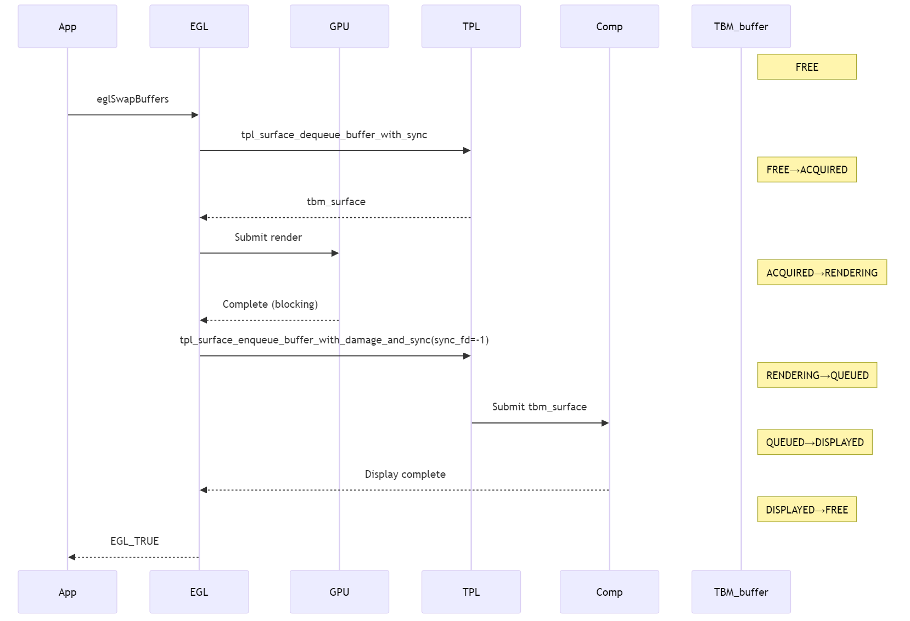


#### Asynchronous Mode (glFlush style) State Transitions

In asynchronous mode, `eglSwapBuffers` returns immediately, GPU renders in the background, and buffer is submitted via frame complete callback.

**State Transition Flow:**
```
FREE → ACQUIRED (via tpl_surface_dequeue_buffer_with_sync)
ACQUIRED → RENDERING (GPU renders to tbm_bo in background)
RENDERING → QUEUED (enqueue in callback, with acquire_fence)
QUEUED → DISPLAYED (Compositor waits for acquire_fence then displays)
DISPLAYED → FREE (via fenced_release event, with release_fence)
```

**State Transition Sequence Diagram:**

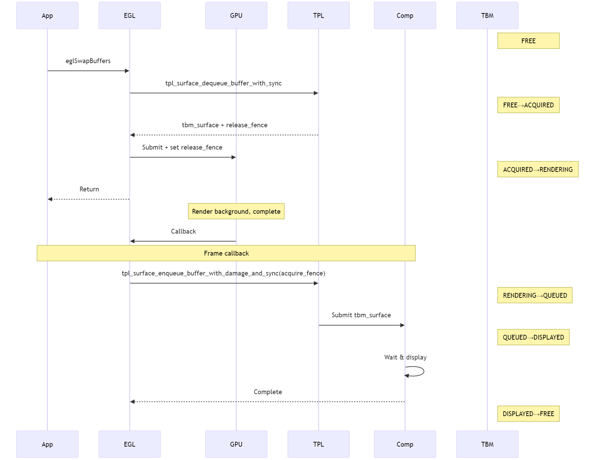


#### State Transition Key Points

1. **FREE → ACQUIRED**
   - Triggered by `tpl_surface_dequeue_buffer_with_sync()`
   - Wait for available buffer (may block)
   - Obtain release_fence_fd (if present)

2. **ACQUIRED → RENDERING**
   - GPU starts rendering to tbm_bo
   - Synchronous mode: blocks waiting for rendering completion
   - Asynchronous mode: GPU renders in background, CPU returns immediately

3. **RENDERING → QUEUED**
   - Synchronous mode: directly call `tpl_surface_enqueue_buffer_with_damage_and_sync(sync_fd=-1)`
   - Asynchronous mode: call `tpl_surface_enqueue_buffer_with_damage_and_sync(sync_fd=acquire_fence_fd)` in frame complete callback

4. **QUEUED → DISPLAYED**
   - Submit to Compositor display queue
   - Asynchronous mode: Compositor waits for acquire_fence before displaying

5. **DISPLAYED → FREE**
   - Triggered by fenced_release event
   - Generate new release_fence
   - Buffer returns to available queue

#### Selection Recommendations

**Use Synchronous Mode When:**
- Application needs immediate knowledge of rendering completion
- Need to minimize memory usage (single buffering is sufficient)
- Debugging or validating rendering correctness

**Use Asynchronous Mode When:**
- Pursuing maximum performance and throughput
- Application can tolerate some latency
- Sufficient buffers available to support multi-frame pipelining
- Both CPU and GPU have high load

---

### Sync_fd Transfer in Dequeue/Enqueue Flow

The Tizen graphics subsystem uses sync_fd (synchronization file descriptor) as a synchronization primitive provided by the Linux kernel to represent synchronization events through a file descriptor. It serves as a bridge between the GPU rendering pipeline and the display subsystem, ensuring proper coordination between the rendering and display threads.

#### Why sync_fd is Required

In modern graphics rendering systems, multiple components work in parallel: the application renders frames, the GPU processes them, and the display controller presents them on screen. Without proper synchronization, this can lead to:

- Screen Tearing: When parts of two different frames are visible simultaneously
- Flickering: When frames are displayed out of sync with the display refresh rate
- Resource Contention: When buffers are reused while still being displayed

sync_fd enables precise coordination between three key synchronization points:

- Render Completion: Signals when the GPU finishes rendering a frame
- Display Release: Signals when the compositor finishes displaying and releases a buffer
- Buffer Reuse: Signals when an application can safely reuse a buffer

By using sync_fd, the system ensures that:

- Buffers are never reused while being displayed
- Frames are presented in sync with the display refresh rate
- GPU and display operations can work efficiently in parallel
- Power consumption is optimized by avoiding unnecessary waiting

#### Dequeue Flow - Receiving sync_fd

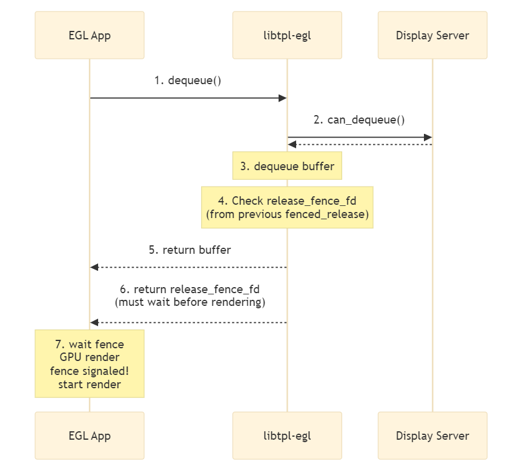

**Key Steps**

1. **EGL Calls dequeue**: EGL layer calls the dequeue function to request an available buffer
2. **Wait for Available Buffer**: Call `tbm_surface_queue_can_dequeue_wait_timeout()` to wait for an available buffer in the queue
3. **Dequeue Buffer from Queue**: Dequeue a buffer from the free queue and increment the reference count
4. **Get or Create wl_egl_buffer**: Each tbm_surface corresponds to a wl_egl_buffer object. Update buffer status to DEQUEUED
5. **Pass release_fence_fd** ⭐ *Key Point*: This is the most critical step in the Dequeue flow. The system checks if the buffer has a release_fence_fd:
   - If `wl_egl_buffer->release_fence_fd == -1`: buffer is immediately available
   - If not -1: display server has not finished displaying this buffer yet, user (EGL) must wait for this fence signal

   *Fence Source*: Received from display server's `fenced_release` event

   *Ownership Transfer*: After passing fd to EGL layer, libtpl-egl clears its own copy

6. **release_fence_fd Setting**: When Display server completes buffer display, it triggers `fenced_release` event, saves release fence, updates status to RELEASED, and releases buffer back to queue

#### Enqueue Flow - Passing sync_fd

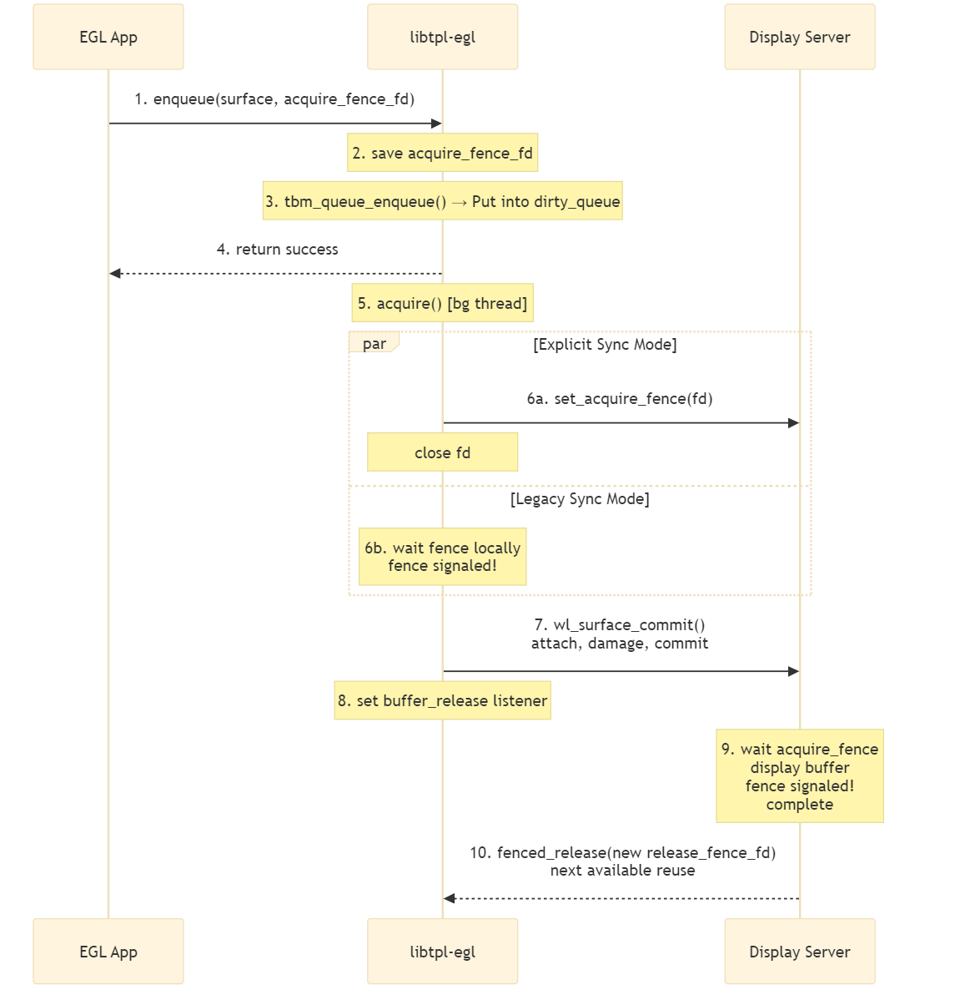

**Key Steps**

1. **EGL Calls enqueue**: EGL layer calls enqueue function, passing the completed acquire_fence_fd
2. **Validate Input**: Validate buffer validity and retrieve associated wl_egl_buffer object
3. **Save Damage Rectangles (Optional)**: Damage rectangles identify modified regions in the buffer. Compositor only needs to update these regions, improving efficiency
4. **Save acquire_fence_fd** ⭐ *Key Point*: Save acquire_fence_fd, representing when GPU completes rendering. Fence is created by EGL application (usually via EGL sync object), ownership transfers from EGL to libtpl-egl
5. **Enqueue to dirty queue**: Put buffer into dirty queue, update status to ENQUEUED, decrement reference count
6. **Acquire Flow (Background Thread Processing)**: After enqueue returns, background thread processes acquire operation. Two synchronization modes are available:
   - *Explicit Sync Mode*: Directly pass fence to compositor, no waiting. Fence will be passed via `set_acquire_fence()` during commit
   - *Legacy Sync Mode*: Wait for fence signal locally. Create gsource to listen to fence fd, when fence triggers, call callback function
7. **Legacy Mode - Fence Wait Callback**: When fence triggers, gsource schedules callback function, clears `acquire_fence_fd`, checks vblank status, then decides whether to commit
8. **Commit to Display Server**: Create wl_buffer, set acquire fence via Explicit Sync, get release listener, execute Wayland submission flow (attach, damage, commit)


#### Release Fence Lifecycle

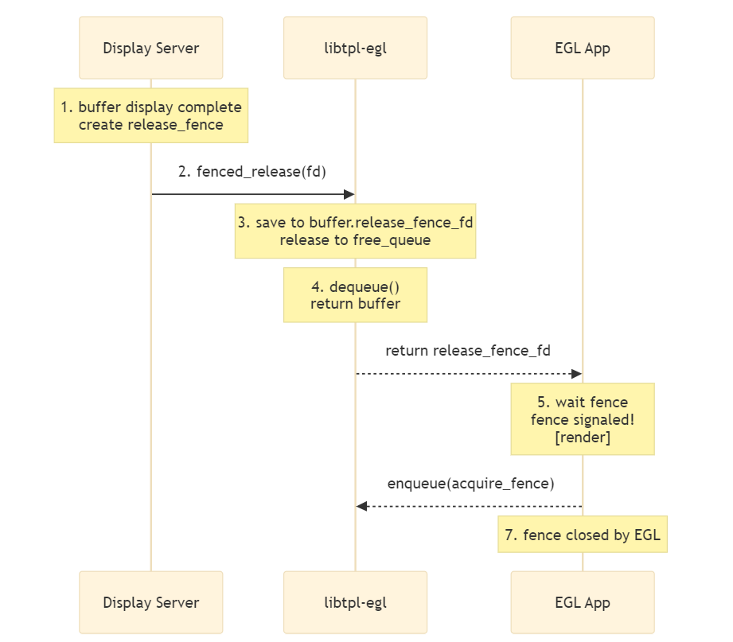

**Key Steps**

1. **Display Server Creates Release Fence**: When the display server completes displaying a buffer on screen, it creates a release fence to signal that the buffer is no longer in use
2. **Fence Transfer**: The display server sends the release fence fd to libtpl-egl via `fenced_release` event
3. **Save Fence in Buffer**: libtpl-egl saves the release fence fd to the corresponding buffer object (`buffer->release_fence_fd`)
4. **Release Buffer to Free Queue**: The buffer is moved back to the free queue and marked as available for reuse
5. **Return Fence to EGL**: When EGL calls `dequeue()`, the release fence fd is returned to the EGL application
6. **EGL Waits for Fence Signal**: The EGL application must wait for the release fence to be signaled before rendering new content into the buffer
7. **Enqueue New Buffer**: After rendering completes and EGL creates an acquire fence, it calls `enqueue()` with the new acquire_fence_fd
8. **Close Release Fence**: The release fence fd is typically closed by EGL after it has been waited on

#### Acquire Fence Lifecycle

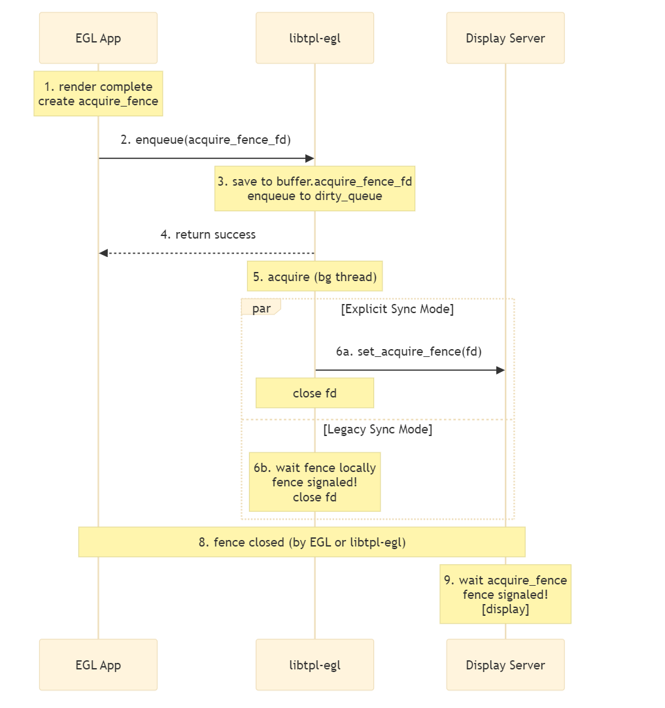

**Key Steps**

1. **EGL Creates Acquire Fence**: After GPU completes rendering a frame, EGL creates an acquire fence to signal when rendering is finished
2. **EGL Calls enqueue**: EGL application calls `enqueue(acquire_fence_fd)` to submit the buffer with the acquire fence fd
3. **Validate Input**: Validate buffer validity and retrieve associated wl_egl_buffer object
4. **Save acquire_fence_fd** ⭐ *Key Point*: This is the most critical step in the Acquire Fence lifecycle. libtpl-egl saves the acquire_fence_fd to the buffer object (`buffer->acquire_fence_fd`) and enqueues buffer to dirty queue:
   - If explicit sync mode: fence will be passed directly to compositor without waiting
   - If legacy sync mode: fence will be waited for locally in libtpl-egl thread

   *Fence Creation*: Usually created by EGL via EGL sync fence object

   *Fence Source*: GPU rendering completion signal

   *Ownership Transfer*: After EGL calls enqueue, ownership transfers from EGL to libtpl-egl
5. **Enqueue to dirty queue**: Put buffer into dirty queue, update status to ENQUEUED, decrement reference count
6. **Background Thread Acquire Processing**: After enqueue returns, libtpl-egl's background thread processes the acquire operation. Two synchronization modes are available:
   - *Explicit Sync Mode*: Directly pass fence fd to compositor via `set_acquire_fence()` during Wayland commit
   - *Legacy Sync Mode*: Create gsource to monitor fence fd, wait for fence signal locally
7. **Legacy Mode - Fence Wait**: In legacy sync mode, when the acquire fence signals, gsource triggers a callback function that clears `acquire_fence_fd`, checks vblank status, then proceeds to commit
8. **Commit to Display Server**: Create wl_buffer, set acquire fence via Explicit Sync, get release listener, execute Wayland submission flow (attach, damage, commit)

#### Key Synchronization Points

**Synchronization Point 1: Dequeue - Buffer Availability Check**

*Purpose*: Ensure the obtained buffer is no longer used by display server

*Mechanism*:
1. Check if available buffer exists in queue
2. If available buffer exists, dequeue
3. Check if buffer has release fence
4. If yes, return fence to EGL

*Fence Source*: Display server's `fenced_release` event

*EGL's Responsibility*: Must wait for `release_fence_fd` signal before reusing buffer

**Synchronization Point 2: Enqueue - Render Completion Notification**

*Purpose*: Notify compositor when rendering completes

*Mechanism*:
1. EGL calls enqueue after rendering completes
2. Save acquire fence
3. Enqueue to dirty queue

*Fence Creation*: Usually created by EGL (EGL sync fence)

*libtpl-egl's Responsibility*: Pass fence to compositor (Explicit Sync) or wait for fence locally (Legacy Sync)

**Synchronization Point 3: Acquire - Compositor Ready to Display**

*Purpose*: Ensure compositor uses buffer only after rendering completes

*Two Modes*:

*Mode 1: Explicit Sync*
- Directly pass to compositor
- Compositor manages fence directly
- Avoids extra polling
- More efficient pipeline

*Mode 2: Legacy Sync*
- Wait for fence locally
- Requires waiting in libtpl-egl thread
- Increases CPU overhead
- Less efficient than explicit sync

**Synchronization Point 4: Commit - Submit to Compositor**

*Purpose*: Submit buffer to compositor for display

*Flow*:
1. Attach buffer
2. Damage (mark update regions)
3. Commit
4. Set release listener (for next cycle)

*Key Point*: If using explicit sync, call `set_acquire_fence()` before commit

**Synchronization Point 5: Vblank - Vertical Synchronization**

*Purpose*: Synchronize frame rate with display refresh rate

*Description*:
- Prevent tearing
- Stable frame rate (e.g., 60fps)
- Can be disabled via `TPL_WAIT_VBLANK` environment variable

#### Protocol Support

**Wayland Explicit Sync Protocol**

*Protocol Name*: `zwp_linux_explicit_synchronization_v1`

*Purpose*: Provides explicit fence synchronization mechanism, replacing implicit buffer management

*Core Interfaces*:
1. **Main Protocol Object**: Obtained via wl_registry bind
2. **Surface Sync Object**: Create sync object for surface
3. **Set Acquire Fence**: Tell compositor to wait for render completion
4. **Get Release Event**: Set listener to receive release fence

**Key Functions**:

```cpp
// Set acquire fence
zwp_linux_surface_synchronization_v1_set_acquire_fence(
    surface_sync,
    acquire_fence_fd
);

// Get release event
struct zwp_linux_buffer_release_v1 *buffer_release =
    zwp_linux_surface_synchronization_v1_get_release(surface_sync);

zwp_linux_buffer_release_v1_add_listener(
    buffer_release,
    &listener,
    wl_egl_buffer
);
```

**Tizen Surface SHM Protocol**

*Protocol Name*: `tizen_surface_shm`

*Purpose*: Tizen-specific buffer flush functionality

**Presentation Time Protocol**

*Protocol Name*: `wp_presentation`

*Purpose*: Provide precise feedback on buffer display timing


#### TPL-EGL and Wayland server and client

Tizen uses the `wl_tbm` protocol instead of `wl_drm`. The `wl_tbm` protocol is designed for sharing the buffer (`tbm_surface`) between `wayland_client` and `wayland_server`. Although the `wayland_tbm_server_init` and `wayland_tbm_client_init` pair is a role for `eglBindWaylandDisplayWL`, the EGL driver is required to implement the entry points for `eglBindWaylandDisplayWL` and `eglUnbindWaylandDisplayWL` as dummy. For more information, see [https://cgit.freedesktop.org/mesa/mesa/tree/docs/specs/WL_bind_wayland_display.spec](https://cgit.freedesktop.org/mesa/mesa/tree/docs/specs/WL_bind_wayland_display.spec).

**Figure: TPL-EGL and Wayland**

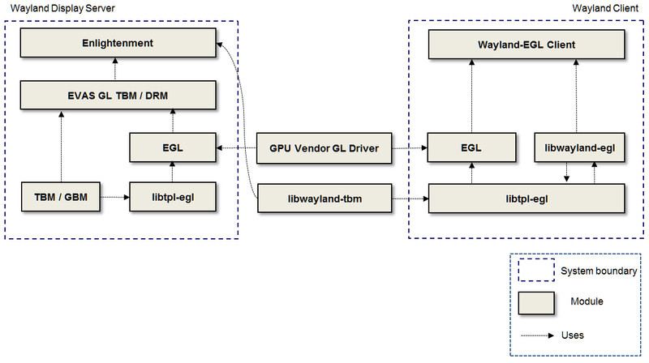

#### Buffer flow between the Wayland server and OpenGL ES/EGL driver

The following figure shows the buffer flow between the Wayland server and the OpenGL ES/EGL driver. The passed buffer is of the `tbm_surface` type.

**Figure: Buffer flow between Wayland server and OpenGL ES/EGL driver**

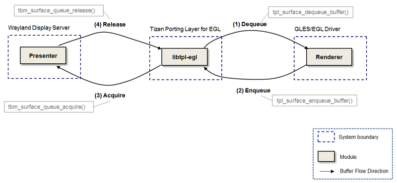

### Project Git repository

The following table lists the available project Git repositories.

**Table: Git repositories**

| Project         | Repository                               | Description                              |
| --------------- | ---------------------------------------- | ---------------------------------------- |
| `libtpl-egl`    | `platform/core/uifw/libtpl-egl`          | Tizen Porting Layer for EGL       |
| `libtbm`        | `platform/core/uifw/libtbm`              | Library for Tizen Buffer Manager  |
| `coregl`        | `platform/core/uifw/coregl`              | Injection layer of OpenGL ES/EGL    |
| `wayland-tbm`   | `platform/core/uifw/wayland-tbm`         | Protocol for graphics memory management for Tizen |
| `emulator-yagl` | `platform/adaptation/emulator/emulator-yagl` | OpenGL ES/EGL driver for the emulator  |
| `tpl-novice`    | `platform/core/uifw/ws-testcase`         | Novice test framework for TPL            |

### libtpl-egl reference driver

The Emulator YAGL (OpenGL ES/EGL driver for the emulator) is implemented by `libtpl-egl`.

The following commit explains how to port the driver with `libtpl-egl` from the traditional drm-based driver:

- Porting YAGL to the Tizen platform [https://review.tizen.org/gerrit/c/platform/adaptation/emulator/emulator-yagl/+/67921](https://review.tizen.org/gerrit/c/platform/adaptation/emulator/emulator-yagl/+/67921)
- Porting MESA to the Tizen platform [https://review.tizen.org/gerrit/c/platform/upstream/mesa/+/228724](https://review.tizen.org/gerrit/c/platform/upstream/mesa/+/228724)

### Testing and verifying OpenGL ES driver

The Khronos OpenGL ES CTS supports `wayland-egl`. `libtpl-egl` has a test case for the `libtpl-egl`. `tpl-novice` of `ws-testcase` has the sample code for `libtpl-egl`.

## Surface Queue Management

TBM provides enhanced surface queue management functionality for efficient buffer handling between producers and consumers. The surface queue supports various modes and advanced features for optimal performance.

### Surface Queue Modes

The surface queue supports different operational modes to control buffer lifecycle management:

**Table: Surface Queue Modes**

| Mode | Description |
| ---- | ----------- |
| `TBM_SURFACE_QUEUE_MODE_NONE` | Default mode with no special constraints. In this mode, when the queue is reset, all surfaces in both free and dirty queues are immediately destroyed, and surfaces that have been dequeued but not yet returned are considered lost. |
| `TBM_SURFACE_QUEUE_MODE_GUARANTEE_CYCLE` | Guarantees that dequeued surfaces must be properly enqueued, acquired, or released before queue reset. In this mode:<br><br>**When queue is reset with different width/height/format:**<br>- Surfaces in the free queue are destroyed<br>- Surfaces in the dirty queue are moved to the free queue<br>- Surfaces that have been dequeued but not yet returned are marked as "delete pending" and will be destroyed when they are eventually returned (via enqueue, acquire, release, or cancel operations)<br><br>**When surfaces are released or dequeue is cancelled in GUARANTEE_CYCLE mode:**<br>- If `num_attached > queue_size`, the surface is detached (removed from queue)<br>- Otherwise, the surface is returned to the free queue<br><br>This mode ensures proper buffer lifecycle management and prevents buffer leaks during resize or format change operations. |

### Surface Queue Basic Operations

#### Creating a Queue

Create a normal surface queue:

```cpp
tbm_surface_queue_h tbm_surface_queue_create(int queue_size, int width,
                                             int height, int format, int flags);
```

**Parameters:**
- `queue_size`: Number of buffers in the queue
- `width`: Surface width
- `height`: Surface height
- `format`: Surface format
- `flags`: Memory allocation flags

**Returns:** `tbm_surface_queue_h` on success, `NULL` on failure

#### Creating a Sequence Queue

Create a sequence surface queue with ordered buffer management:

```cpp
tbm_surface_queue_h tbm_surface_queue_sequence_create(int queue_size, int width,
                                                     int height, int format, int flags);
```

**Note:** Sequence queues ensure buffers are processed in strict order, suitable for scenarios requiring frame order preservation.

#### Destroying a Queue

Destroy the surface queue:

```cpp
void tbm_surface_queue_destroy(tbm_surface_queue_h surface_queue);
```

### Surface Queue Property Queries

Get various queue properties:

```cpp
// Get width
int tbm_surface_queue_get_width(tbm_surface_queue_h surface_queue);

// Get height
int tbm_surface_queue_get_height(tbm_surface_queue_h surface_queue);

// Get format
int tbm_surface_queue_get_format(tbm_surface_queue_h surface_queue);

// Get queue size
int tbm_surface_queue_get_size(tbm_surface_queue_h surface_queue);
```

### Surface Queue Buffer Operations

#### Dequeue Operation (Producer)

Get a surface from the queue:

```cpp
tbm_surface_queue_error_e tbm_surface_queue_dequeue(
    tbm_surface_queue_h surface_queue, tbm_surface_h *surface);
```

**Returns:**
- `TBM_SURFACE_QUEUE_ERROR_NONE`: Success
- `TBM_SURFACE_QUEUE_ERROR_EMPTY`: Queue is empty
- `TBM_SURFACE_QUEUE_ERROR_INVALID_QUEUE`: Invalid queue

#### Check if Dequeue is Possible

```cpp
int tbm_surface_queue_can_dequeue(tbm_surface_queue_h surface_queue, int wait);
```

**Parameters:**
- `wait`: If 1, the function will block until a surface is available
- `Returns`: 1 if dequeue is possible, 0 otherwise

#### Check if Dequeue is Possible with Timeout

```cpp
tbm_surface_queue_error_e tbm_surface_queue_can_dequeue_wait_timeout(
    tbm_surface_queue_h surface_queue, int ms_timeout);
```

**Parameters:**
- `ms_timeout`: Wait timeout in milliseconds

#### Enqueue Operation (Producer)

Put a surface back into the queue:

```cpp
tbm_surface_queue_error_e tbm_surface_queue_enqueue(
    tbm_surface_queue_h surface_queue, tbm_surface_h surface);
```

#### Acquire Operation (Consumer)

Get an enqueued surface from the queue:

```cpp
tbm_surface_queue_error_e tbm_surface_queue_acquire(
    tbm_surface_queue_h surface_queue, tbm_surface_h *surface);
```

#### Check if Acquire is Possible

```cpp
int tbm_surface_queue_can_acquire(tbm_surface_queue_h surface_queue, int wait);
```

**Parameters:**
- `wait`: If 1, the function will block until a surface is available for acquire

#### Release Operation (Consumer)

Release a surface back to the queue:

```cpp
tbm_surface_queue_error_e tbm_surface_queue_release(
    tbm_surface_queue_h surface_queue, tbm_surface_h surface);
```

**Important:** Only release a surface when it can be dequeued and rendering is complete. Releasing while the consumer is still using it will cause issues.

#### Cancel Dequeue

Cancel a previously dequeued surface:

```cpp
tbm_surface_queue_error_e tbm_surface_queue_cancel_dequeue(
    tbm_surface_queue_h surface_queue, tbm_surface_h surface);
```

#### Cancel Acquire

Cancel a previously acquired surface:

```cpp
tbm_surface_queue_error_e tbm_surface_queue_cancel_acquire(
    tbm_surface_queue_h surface_queue, tbm_surface_h surface);
```

### Surface Queue Management

#### Reset Queue

Reset queue parameters (width, height, format):

```cpp
tbm_surface_queue_error_e tbm_surface_queue_reset(
    tbm_surface_queue_h surface_queue, int width, int height, int format);
```

#### Flush Queue

Flush all surfaces in the queue:

```cpp
tbm_surface_queue_error_e tbm_surface_queue_flush(tbm_surface_queue_h surface_queue);
```

#### Free Flush Queue

Flush only released surfaces:

```cpp
tbm_surface_queue_error_e tbm_surface_queue_free_flush(tbm_surface_queue_h surface_queue);
```

#### Set Queue Size

Dynamically adjust queue size:

```cpp
tbm_surface_queue_error_e tbm_surface_queue_set_size(
    tbm_surface_queue_h surface_queue, int queue_size, int flush);
```

**Parameters:**
- `flush`: If 1, flush the queue before resizing

### Surface Queue Advanced Features

#### Enhanced Allocation Callback

Provides enhanced allocation callback with additional control for custom surface allocation:

```cpp
typedef tbm_surface_h (*tbm_surface_alloc_cb2)(tbm_surface_queue_h surface_queue,
                                                int width, int height, int format,
                                                int flags, void *data);

typedef void (*tbm_surface_free_cb)(tbm_surface_queue_h surface_queue,
                                     void *data, tbm_surface_h surface);

tbm_surface_queue_error_e tbm_surface_queue_set_alloc_cb2(
    tbm_surface_queue_h surface_queue,
    tbm_surface_alloc_cb2 alloc_cb2,
    tbm_surface_free_cb free_cb,
    void *data);
```

#### Standard Allocation Callback

Provides standard allocation callback for simpler surface allocation:

```cpp
typedef tbm_surface_h (*tbm_surface_alloc_cb)(tbm_surface_queue_h surface_queue,
                                               void *data);

tbm_surface_queue_error_e tbm_surface_queue_set_alloc_cb(
    tbm_surface_queue_h surface_queue,
    tbm_surface_alloc_cb alloc_cb,
    tbm_surface_free_cb free_cb,
    void *data);
```

**Important:** You must use either `tbm_surface_queue_set_alloc_cb` or `tbm_surface_queue_queue_set_alloc_cb2`, not both. Attempting to use both will result in an error.

**Callback Differences:**

- `tbm_surface_queue_set_alloc_cb`: Standard callback that receives only the queue handle and user data. Suitable for simple allocation scenarios where width, height, format, and flags are not needed for the allocation logic.

- `tbm_surface_queue_set_alloc_cb2`: Enhanced callback that receives queue handle along with width, height, format, and flags. Suitable for advanced allocation scenarios where the allocation logic needs access to surface properties.

#### Queue Mode Management

Control the operational mode of the surface queue:

```cpp
tbm_surface_queue_error_e tbm_surface_queue_set_modes(
    tbm_surface_queue_h surface_queue, int modes);
```

#### Query Next Dequeue Surface

Query the next surface that will be dequeued without actually dequeuing it:

```cpp
tbm_surface_queue_error_e tbm_surface_queue_get_next_dequeue(
    tbm_surface_queue_h surface_queue, tbm_surface_h *surface);
```

**Returns:**
- `TBM_SURFACE_QUEUE_ERROR_NONE`: Success
- `TBM_SURFACE_QUEUE_ERROR_EMPTY`: No surface available in the free queue
- `TBM_SURFACE_QUEUE_ERROR_INVALID_QUEUE`: Invalid queue

**Note:** This function allows you to peek at the next surface that will be dequeued without actually removing it from the free queue. Useful for pre-checking buffer properties before dequeue.

#### Get Surfaces in Queue

Get all surfaces currently used by the queue:

```cpp
tbm_surface_queue_error_e tbm_surface_queue_get_surfaces(
    tbm_surface_queue_h surface_queue,
    tbm_surface_h *surfaces, int *num);
```

**Note:** You must use `free()` to release the returned surfaces array.

#### Get Acquirable Surfaces

Get surfaces available for acquire in the dirty queue:

```cpp
tbm_surface_queue_error_e tbm_surface_queue_get_acquirable_surfaces(
    tbm_surface_queue_h surface_queue,
    tbm_surface_h *surfaces, int *num);
```

### Surface Queue Trace Support

TBM provides comprehensive tracing capabilities for surface queue operations:

**Table: Surface Queue Trace Types**

| Trace Type | Description |
| ---------- | ----------- |
| `TBM_SURFACE_QUEUE_TRACE_NONE` | No tracing |
| `TBM_SURFACE_QUEUE_TRACE_DEQUEUE` | Trace dequeue operations |
| `TBM_SURFACE_QUEUE_TRACE_ENQUEUE` | Trace enqueue operations |
| `TBM_SURFACE_QUEUE_TRACE_ACQUIRE` | Trace acquire operations |
| `TBM_SURFACE_QUEUE_TRACE_RELEASE` | Trace release operations |
| `TBM_SURFACE_QUEUE_TRACE_CANCEL_DEQUEUE` | Trace cancel dequeue operations |
| `TBM_SURFACE_QUEUE_TRACE_CANCEL_ACQUIRE` | Trace cancel acquire operations |

#### Trace Callback Registration

```cpp
typedef void (*tbm_surface_queue_trace_cb)(tbm_surface_queue_h surface_queue,
                                          tbm_surface_h surface,
                                          tbm_surface_queue_trace trace,
                                          void *data);

tbm_surface_queue_error_e tbm_surface_queue_add_trace_cb(
    tbm_surface_queue_h surface_queue,
    tbm_surface_queue_trace_cb trace_cb,
    void *data);

tbm_surface_queue_error_e tbm_surface_queue_remove_trace_cb(
    tbm_surface_queue_h surface_queue,
    tbm_surface_queue_trace_cb trace_cb,
    void *data);
```

### Surface Queue Callback Management

#### Destroy Callback

```cpp
typedef void (*tbm_surface_queue_notify_cb)(tbm_surface_queue_h surface_queue, void *data);

tbm_surface_queue_error_e tbm_surface_queue_add_destroy_cb(
    tbm_surface_queue_h surface_queue,
    tbm_surface_queue_notify_cb destroy_cb,
    void *data);

tbm_surface_queue_error_e tbm_surface_queue_remove_destroy_cb(
    tbm_surface_queue_h surface_queue,
    tbm_surface_queue_notify_cb destroy_cb,
    void *data);
```

#### Reset Callback

```cpp
tbm_surface_queue_error_e tbm_surface_queue_add_reset_cb(
    tbm_surface_queue_h surface_queue,
    tbm_surface_queue_notify_cb reset_cb,
    void *data);

tbm_surface_queue_error_e tbm_surface_queue_remove_reset_cb(
    tbm_surface_queue_h surface_queue,
    tbm_surface_queue_notify_cb reset_cb,
    void *data);
```

#### Dequeuable Callback

```cpp
tbm_surface_queue_error_e tbm_surface_queue_add_dequeuable_cb(
    tbm_surface_queue_h surface_queue,
    tbm_surface_queue_notify_cb dequeuable_cb,
    void *data);

tbm_surface_queue_error_e tbm_surface_queue_remove_dequeuable_cb(
    tbm_surface_queue_h surface_queue,
    tbm_surface_queue_notify_cb dequeuable_cb,
    void *data);
```

#### Acquirable Callback

```cpp
tbm_surface_queue_error_e tbm_surface_queue_add_acquirable_cb(
    tbm_surface_queue_h surface_queue,
    tbm_surface_queue_notify_cb acquirable_cb,
    void *data);

tbm_surface_queue_error_e tbm_surface_queue_remove_acquirable_cb(
    tbm_surface_queue_h surface_queue,
    tbm_surface_queue_notify_cb acquirable_cb,
    void *data);
```

#### Dequeue Callback

```cpp
tbm_surface_queue_error_e tbm_surface_queue_add_dequeue_cb(
    tbm_surface_queue_h surface_queue,
    tbm_surface_queue_notify_cb dequeue_cb,
    void *data);

tbm_surface_queue_error_e tbm_surface_queue_remove_dequeue_cb(
    tbm_surface_queue_h surface_queue,
    tbm_surface_queue_notify_cb dequeue_cb,
    void *data);
```

## Surface Internal Management

TBM provides internal surface management functions for advanced use cases.

### Surface Creation and Destruction

#### Create Surface with Flags

```cpp
tbm_surface_h tbm_surface_internal_create_with_flags(int width, int height,
                                                     int format, int flags);
```

**Parameters:**
- `width`: Surface width
- `height`: Surface height
- `format`: Surface format (e.g., `TBM_FORMAT_ARGB8888`, `TBM_FORMAT_YUV420`)
- `flags`: Memory allocation flags
  - `TBM_BO_DEFAULT`: Default memory (depends on backend)
  - `TBM_BO_SCANOUT`: Scanout memory
  - `TBM_BO_NONCACHABLE`: Non-cachable memory
  - `TBM_BO_WC`: Write-combine memory
  - `TBM_BO_VENDOR`: Vendor-specific memory

**Returns:** Surface handle on success, `NULL` on failure

#### Create Surface with Buffer Objects

```cpp
tbm_surface_h tbm_surface_internal_create_with_bos(tbm_surface_info_s *info,
                                                   tbm_bo *bos, int num);
```

**Parameters:**
- `info`: Surface information structure containing width, height, format, bpp, size, and plane data
- `bos`: Array of buffer objects to be used by the surface
- `num`: Number of buffer objects in the array

**Returns:** Surface handle on success, `NULL` on failure

#### Destroy Surface

```cpp
void tbm_surface_internal_destroy(tbm_surface_h surface);
```

#### Reference Counting

```cpp
void tbm_surface_internal_ref(tbm_surface_h surface);
void tbm_surface_internal_unref(tbm_surface_h surface);
```

### Surface Import/Export

#### Export Surface

Export surface buffer data:

```cpp
tbm_surface_buffer_data *tbm_surface_internal_export(tbm_surface_h surface,
                                                     tbm_error_e *error);
```

**Returns:** Buffer data structure containing dmabuf file descriptor array

#### Import Surface

Import surface from buffer data:

```cpp
tbm_surface_h tbm_surface_internal_import(tbm_surface_info_s *surface_info,
                                         tbm_surface_buffer_data *buffer_data,
                                         tbm_error_e *error);
```

**Note:** These functions are used for cross-process surface buffer sharing.

### Surface Property Queries

#### Get Number of Buffer Objects

```cpp
int tbm_surface_internal_get_num_bos(tbm_surface_h surface);
```

#### Get Buffer Object

```cpp
tbm_bo tbm_surface_internal_get_bo(tbm_surface_h surface, int bo_idx);
```

#### Get Surface Size

```cpp
unsigned int tbm_surface_internal_get_size(tbm_surface_h surface);
```

#### Get Plane Data

Get size, offset, and stride data for a specified plane:

```cpp
int tbm_surface_internal_get_plane_data(tbm_surface_h surface, int plane_idx,
                                        uint32_t *size, uint32_t *offset,
                                        uint32_t *pitch);
```

#### Get Plane BO Index

```cpp
int tbm_surface_internal_get_plane_bo_idx(tbm_surface_h surface, int plane_idx);
```

#### Format Related Queries

```cpp
// Get number of planes by format
int tbm_surface_internal_get_num_planes(tbm_format format);

// Get bpp by format
int tbm_surface_internal_get_bpp(tbm_format format);

// Query supported formats
int tbm_surface_internal_query_supported_formats(uint32_t **formats, uint32_t *num);
```

**Note:** The returned format array must be released using `free()`.

### Surface Damage Handling

Damage handling is used for partial update optimization:

```cpp
// Set damage region
int tbm_surface_internal_set_damage(tbm_surface_h surface, int x, int y,
                                   int width, int height);

// Get damage region
int tbm_surface_internal_get_damage(tbm_surface_h surface, int *x, int *y,
                                   int *width, int *height);
```

**Parameters:**
- `x, y`: Damage rectangle coordinates
- `width, height`: Damage rectangle dimensions

### Surface Debug Features

#### Set Debug PID

```cpp
void tbm_surface_internal_set_debug_pid(tbm_surface_h surface, unsigned int pid);
```

#### Set Debug Data

```cpp
int tbm_surface_internal_set_debug_data(tbm_surface_h surface,
                                        char *key, char *value);
```

#### Validate Surface

```cpp
int tbm_surface_internal_is_valid(tbm_surface_h surface);
```

**Returns:** 1 if surface is valid, 0 otherwise

#### Capture Buffer

Capture buffer to file:

```cpp
int tbm_surface_internal_capture_buffer(tbm_surface_h surface, const char *path,
                                       const char *name, const char *type);
```

**Supported formats:**
- ARGB/XRGB8888: type should be "png"
- YUV420, YVU420, NV12, NV21, YUYV, UYVY: type should be "yuv"

### Surface User Data Management

Add and get user data for surfaces:

```cpp
typedef void (*tbm_data_free)(void *data);

// Add user data
int tbm_surface_internal_add_user_data(tbm_surface_h surface, unsigned long key,
                                       tbm_data_free data_free_func);

// Set user data
int tbm_surface_internal_set_user_data(tbm_surface_h surface, unsigned long key,
                                       void *data);

// Get user data
int tbm_surface_internal_get_user_data(tbm_surface_h surface, unsigned long key,
                                       void **data);

// Delete user data
int tbm_surface_internal_delete_user_data(tbm_surface_h surface,
                                         unsigned long key);
```

### Surface Destroy Callback Management

Manage callbacks for surface destruction:

```cpp
typedef void (*tbm_surface_internal_destroy_handler)(tbm_surface_h surface,
                                                     void *user_data);

// Add destroy callback
int tbm_surface_internal_add_destroy_handler(tbm_surface_h surface,
                                            tbm_surface_internal_destroy_handler func,
                                            void *user_data);

// Remove destroy callback
void tbm_surface_internal_remove_destroy_handler(tbm_surface_h surface,
                                               tbm_surface_internal_destroy_handler func,
                                               void *user_data);
```

## Surface Basic API

### Surface Creation and Destruction

```cpp
// Create surface
tbm_surface_h tbm_surface_create(int width, int height, tbm_format format);

// Destroy surface
int tbm_surface_destroy(tbm_surface_h surface);
```

### Surface Mapping and Unmapping

```cpp
// Map surface
int tbm_surface_map(tbm_surface_h surface, int opt, tbm_surface_info_s *info);

// Unmap surface
int tbm_surface_unmap(tbm_surface_h surface);
```

**Map options:**
- `TBM_SURF_OPTION_READ`: Read access
- `TBM_SURF_OPTION_WRITE`: Write access

### Surface Information Queries

```cpp
// Get surface information
int tbm_surface_get_info(tbm_surface_h surface, tbm_surface_info_s *info);

// Get width
int tbm_surface_get_width(tbm_surface_h surface);

// Get height
int tbm_surface_get_height(tbm_surface_h surface);

// Get format
tbm_format tbm_surface_get_format(tbm_surface_h surface);

// Query supported formats
int tbm_surface_query_formats(uint32_t **formats, uint32_t *num);
```

## HAL-TBM Integration

TBM supports HAL-TBM integration for unified hardware abstraction.

### HAL-TBM Backend Support

The TBM module can operate in HAL-TBM mode, providing direct integration with the hardware abstraction layer:

- **Module Type**: `TBM_MODULE_TYPE_HAL_TBM`
- **Initialization**: Automatic detection and loading of HAL-TBM backend
- **DRM Integration**: Seamless integration with DRM master fd management
- **Authentication**: Built-in Wayland authentication server support

### HAL-TBM Features

- Direct hardware buffer management
- Optimized memory allocation
- Hardware-specific format support
- Enhanced performance through hardware acceleration

The HAL-TBM integration provides a unified interface for buffer management while maintaining compatibility with existing TBM backend implementations.

## Usage Examples

### Basic Surface Queue Usage

```cpp
#include <tbm_surface_queue.h>

// Create queue
tbm_surface_queue_h queue = tbm_surface_queue_create(3, 1280, 720,
                                                     TBM_FORMAT_ARGB8888,
                                                     TBM_BO_DEFAULT);

// Producer thread
tbm_surface_h surface;
tbm_surface_queue_error_e err;

// Check if dequeue is possible
if (tbm_surface_queue_can_dequeue(queue, 0)) {
    err = tbm_surface_queue_dequeue(queue, &surface);
    if (err == TBM_SURFACE_QUEUE_ERROR_NONE) {
        // Process surface (fill data)
        // ...

        // Enqueue
        err = tbm_surface_queue_enqueue(queue, surface);
    }
}

// Consumer thread
tbm_surface_h acquired_surface;

// Check if acquire is possible
if (tbm_surface_queue_can_acquire(queue, 0)) {
    err = tbm_surface_queue_acquire(queue, &acquired_surface);
    if (err == TBM_SURFACE_QUEUE_ERROR_NONE) {
        // Use surface (display)
        // ...

        // Release
        err = tbm_surface_queue_release(queue, acquired_surface);
    }
}

// Destroy queue
tbm_surface_queue_destroy(queue);
```

### Using Trace Callback

```cpp
void trace_callback(tbm_surface_queue_h queue, tbm_surface_h surface,
                   tbm_surface_queue_trace trace, void *data)
{
    switch (trace) {
        case TBM_SURFACE_QUEUE_TRACE_DEQUEUE:
            printf("Surface dequeued\n");
            break;
        case TBM_SURFACE_QUEUE_TRACE_ENQUEUE:
            printf("Surface enqueued\n");
            break;
        case TBM_SURFACE_QUEUE_TRACE_ACQUIRE:
            printf("Surface acquired\n");
            break;
        case TBM_SURFACE_QUEUE_TRACE_RELEASE:
            printf("Surface released\n");
            break;
        default:
            break;
    }
}

// Add trace callback
tbm_surface_queue_add_trace_cb(queue, trace_callback, NULL);
```

### Surface Import/Export Example

```cpp
// Export surface
tbm_error_e error;
tbm_surface_buffer_data *buffer_data = tbm_surface_internal_export(surface, &error);
if (buffer_data) {
    // Send buffer_data to another process
    // ...

    // Free after use
    free(buffer_data->fds);
    free(buffer_data);
}

// Import in another process
tbm_surface_info_s info;
tbm_surface_h imported_surface = tbm_surface_internal_import(&info, buffer_data, &error);
```

## Error Handling

### Surface Queue Error Codes

```cpp
typedef enum {
    TBM_SURFACE_QUEUE_ERROR_NONE = 0,                                     /**< Operation completed successfully */
    TBM_SURFACE_QUEUE_ERROR_INVALID_QUEUE,                                  /**< Invalid queue handle passed */
    TBM_SURFACE_QUEUE_ERROR_INVALID_SURFACE,                                /**< Invalid surface handle passed */
    TBM_SURFACE_QUEUE_ERROR_ALREADY_EXIST,                                   /**< Surface already exists in the queue (e.g., trying to enqueue a surface that's already in the queue) */
    TBM_SURFACE_QUEUE_ERROR_UNKNOWN_SURFACE,                                  /**< Unknown surface (surface not found in the queue) */
    TBM_SURFACE_QUEUE_ERROR_EMPTY,                                         /**< Queue is empty (no available surfaces) */
    TBM_SURFACE_QUEUE_ERROR_INVALID_SEQUENCE,                                  /**< Invalid sequence (e.g., trying to enqueue a surface that's already been processed) */
    TBM_SURFACE_QUEUE_ERROR_SURFACE_ALLOC_FAILED,                            /**< Failed to allocate surface memory */
    TBM_SURFACE_QUEUE_ERROR_TIMEOUT                                        /**< Operation timed out (e.g., waiting for available surface exceeded timeout) */
} tbm_surface_queue_error_e;
```

**Error Code Descriptions:**

| Error Code | Description | When Triggered |
| ---------- | ----------- | -------------- |
| `TBM_SURFACE_QUEUE_ERROR_NONE` | Operation completed successfully | Default return value for successful operations |
| `TBM_SURFACE_QUEUE_ERROR_INVALID_QUEUE` | Invalid queue handle | NULL queue handle passed or invalid queue pointer |
| `TBM_SURFACE_QUEUE_ERROR_INVALID_SURFACE` | Invalid surface handle | NULL surface handle or surface not belonging to the queue |
| `TBM_SURFACE_QUEUE_ERROR_ALREADY_EXIST` | Surface already exists | Attempting to enqueue a surface that's already in the queue (in free or dirty queue) |
| `TBM_SURFACE_QUEUE_ERROR_UNKNOWN_SURFACE` | Unknown surface | Surface not found in the queue (not allocated by the queue) |
| `TBM_SURFACE_QUEUE_ERROR_EMPTY` | Queue is empty | Trying to dequeue or acquire from an empty queue without waiting |
| `TBM_SURFACE_QUEUE_ERROR_INVALID_SEQUENCE` | Invalid sequence | Invalid operation sequence (e.g., enqueue after cancel_dequeue, or surface already processed) |
| `TBM_SURFACE_QUEUE_ERROR_SURFACE_ALLOC_FAILED` | Surface allocation failed | Backend failed to allocate surface memory |
| `TBM_SURFACE_QUEUE_ERROR_TIMEOUT` | Operation timed out | Waiting for available surface exceeded the specified timeout period |

### Surface Error Codes

```cpp
typedef enum {
    TBM_SURFACE_ERROR_NONE = TIZEN_ERROR_NONE,
    TBM_SURFACE_ERROR_INVALID_PARAMETER = TIZEN_ERROR_INVALID_PARAMETER,
    TBM_SURFACE_ERROR_INVALID_OPERATION = TIZEN_ERROR_INVALID_OPERATION,
} tbm_surface_error_e;
```

