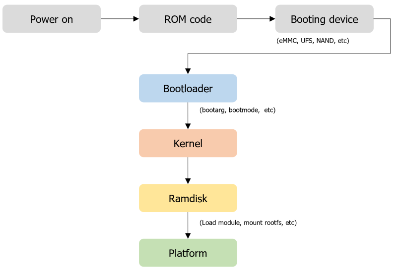
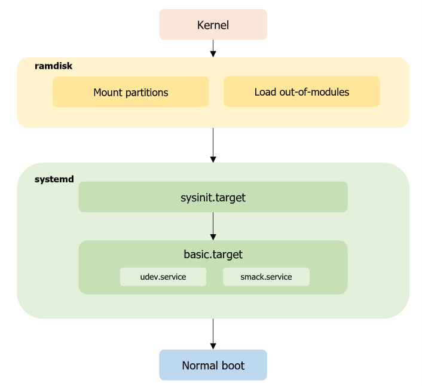
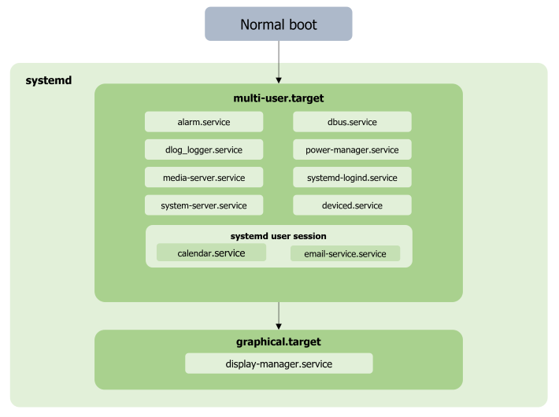
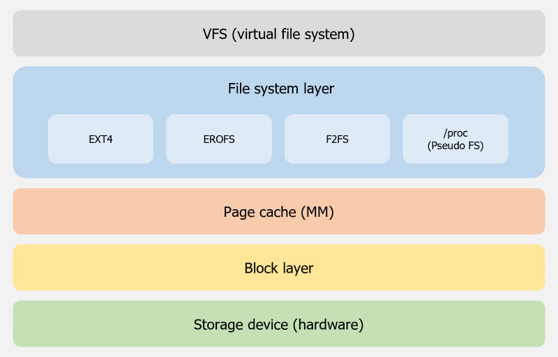
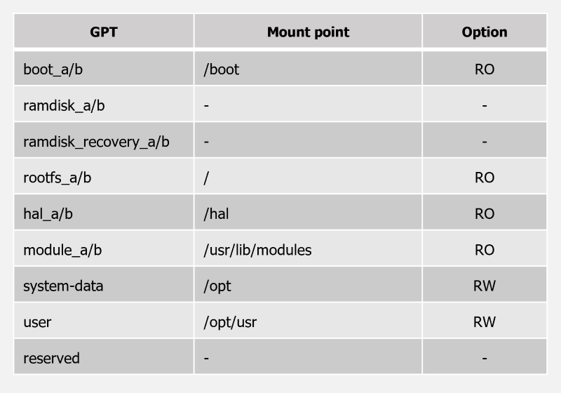
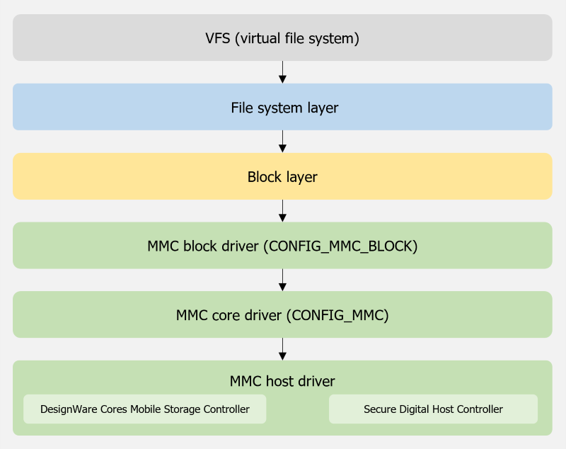

# Kernel

For information on how to set up the Tizen OS development environment, see [Setting up the Development Environment](../developing/setting-up.md).

## Prerequisite

If you want to contribute to Tizen, You need to register Tizen Account, see [Get started with Tizen](../get-started/open-source-project.md#get-started-with-tizen)

## U-Boot build

To build the Tizen U-boot for The Raspberry Pi 4 board, follow below steps:

1. Install and setup cross-compile tools on your system if the host has a different architecture than the target (such as x86 or x86_64).
2. Prepare the U-boot source code for Tizen from `platform/kernel/u-boot`:
   ```
	git clone git://review.tizen.org/git/platform/kernel/u-boot -b tizen
	```
3. If your u-boot source has been used to create binaries for another architecture, start by cleaning them up.
4. Set up the .config file for RPi4:
   ```
   make ARCH=arm tizen_rpi_4_32b_defconfig
   or
   make ARCH=arm64 tizen_rpi_4_defconfig
   ```
5. After re-configuring your needs (sush as `make ARCH=arm menuconfig`), build it:
   ```
   /* To build u-boot */
   $ make CROSS_COMPILE=/usr/bin/arm-linux-gnu- all

   /* To create boot.scr.uimg */
   $ ./tools/mkimage -A arm -T script -C none -n "Tizen RPI4 U-boot helper" -d ./tizen/bootscript/tizen-boot-rpi4.scr ./boot.scr.uimg

   /* To create uboot.env */
   $ CROSS_COMPILE=arm-linux-gnu- ./scripts/get_default_env.sh > default_env.txt
   $ ./tools/mkenvimage -s 16487 -o uboot.env default_envs.txt
   ```
6. Copy the created images (`u-boot.bin uboot.env boot.scr.uimg`) into BOOT partition of  SD-card
   ```
   /* For example, SD-card block device assumes /dev/sdb, boot partition is a first partition */
	 $ udisksctl mount -b /dev/sdb1
	 $ cp u-boot.bin /media/<your ID>/boot/
	 $ cp uboot.env /media/<your ID>/boot/
	 $ cp boot.src.uimg /media/<your ID>/boot/
   ```

## Kernel build

To build the Tizen kernel for the Raspberry Pi 4 board, follow these steps:

1. Install and set up cross-compile tools on your system if the host has a different architecture than the target (such as x86).
2. Prepare the kernel source code for Raspberry Pi 4 from `platform/kernel/linux-rpi`:
   ```
   git clone git://review.tizen.org/git/platform/kernel/linux-rpi -b tizen
   ```
3. If your kernel source has been used to create binaries for another architecture, start by cleaning them up.
4. Use the build-rpi.sh script to build Tizen Rasbperry Pi 4 kernel.
   ```
   /* 32-bit kernel build */
   $ ./build-rpi.sh arm
   or
   /* 64-bit kernel build */
   $ ./bulid-rpi.sh arm64
   ```
5. Created kernel, module and dtb files under output directory.
   ```
   $ ls output/
   bcm2711-rpi-4-b.dtb  modules.img  tizen-local-{DATE}-boot-armv7l-rpi.tar  zImage
   ```
6. Update modules.img into module partition of SD-card with sd_fusing.py script.
   ```
   $ ./sd_fusing.py -d /dev/sdb -b tizen-local-{DATE}-boot-armv7l-rpi.tar -t rpi4
   ```
 7.  Copy dtb / kernel files (`dtb, zImage or Image`) into BOOT partition of SD-card.
     ```
	 $ udisksctl mount -b /dev/sdb1
	 $ cp zImage /media/<your ID>/boot/
	 $ cp *.dtb /media/<your ID>/boot/
     ```
8. Copy dtb* files under overlays directory into BOOT partition of SD-card.
   ```
   $ cp arch/arm/boot/dts/overlays/*.dtb* /media/<your ID>/boot/overlays/
	```


For information on how to create an image using MIC, see [MIC Image Creator](../reference/mic/mic-overview.md).

> [!TIP] If use USB-PWR  Splitter, you can utilize the USB OTG function as well as the USB SDB and lthor on linux environment.

## Tizen bootup overview

This section provides a brief overview of the typical booting sequence, starting from the boot loader to the kernel and the platform.

**Figure: Tizen bootup sequence**



The Tizen bootup process is same as any other Linux kernel. Make sure that the correct device-tree and the boot arguments are passed from the boot loader.

After mounting the initial RAM disk image, `initramfs` hands over control to `systemd` as the Tizen platform system manager daemon. From this point, `systemd` is responsible for probing all remaining hardware, mounting all necessary file systems, and spawning all configured services. The system bootup process is split up into discrete steps. To synchronize points during start-up, target units (files whose names end in `.target`) are used for grouping units. The bootup process is highly parallelized in each target so that the order in which specific target units are reached is not determined. The `system-plugin-slp` is an OAL plugin for configuration settings, such as the mount point (`/etc/fstab`).

The following figure shows the early boot sequence after starting the kernel.

**Figure: Early boot sequence**



- `sysinit.target`

  Special target unit for early boot-up scripts. It has dependencies on necessary services and targets, such as `local-fs.target`. At this point, most of the file systems, such as `/opt`, `/tmp`, and `/media`, are mounted and the `systemd`-related daemons, such as `systemd-journald`, are launched.

- `basic.target`

  Special target unit for basic bootup. At this point, all necessary initialization for general purpose daemons, such as mount points, sockets, timers, and path units, is completed. Tizen-specific services (such as `vconf-setup` and `tizen-debug-level`) are also executed.

The following figure shows the overview of normal booting sequence in Tizen platform.

**Figure: Tizen platform boot sequence**



- `multi-user.target`

  Special target unit for setting up a multi-user system with non-graphical support. The Tizen platform uses the `systemd` user session for App privilege daemons. On the Tizen platform, this target is used for launching platform infrastructure daemons, such as `dbus` (system session), power manager, GPS manager, telephony daemon, WRT (Web Run Time) security daemon, and the media server. Some `systemd`-related daemons (such as `systemd-logind`) are also started in this phase.

- `graphical.target`

  Special target unit for setting up a graphical environment. Some important daemons (such as the access control and etc) that must have root permission are launched at this point.  Some daemons related to the graphics system, such as Enlightenment (window manager), are launched with the App privilege in this phase.

## BSP customization

This section covers the basic configuration, setup, and build procedure required for building the boot loader and the kernel image for ARM.

### Boot loader

The boot loader is a small piece of software that is needed to perform the basic hardware and peripheral initialization and load the kernel and proper device tree binary for the device to RAM. For the Tizen platform, the boot loader comes in 2 parts, the primary boot loader and the secondary boot loader. The primary boot loader is proprietary, and the secondary boot loader is the open source `u-boot`, customized for the Tizen platform.

If your platform is already loaded with the compatible boot loader software, you can skip this section and move directly to the kernel section.

#### Boot loader setup and build

To build the Tizen Raspberry Pi 4 boot loader, refer to [U-Boot Build](#u-boot-build)


#### Boot loader kernel parameters

Command line parameters, such as the following example, can be passed from the boot loader to the Linux kernel:

```
U-Boot> edit opts
edit: loglevel=4
U-Boot> saveenv
Saving Environment to FAT... OK
U-Boot>
```

### Kernel

The kernel is the operating system that drives the platform. In this case, the kernel refers to the open-source Linux kernel that is customized for the Tizen platform. The following section gives a brief overview of the Tizen kernel setup, configuration, and the build procedure for building a Linux kernel for your Tizen platform. The output of the kernel binary is a kernel image (`zImage or Image`) that is suitable only for a `u-boot` boot loader. If you have chosen a secure booting configuration in your boot loader, this kernel image (`zImage  or Image`) must be compatible with your boot loader.

#### Kernel configurations

To download the Tizen kernel source package, see [Kernel Build](#kernel-build). To set up or modify your kernel configuration, use the appropriate `defconfig` file from `arch/arm/configs/` (ARM CPU).

For more information on the Tizen kernel configuration and kernel building, see [Kernel Build](#kernel-build).

> [!NOTE]
> Tizen uses `INOTIFY` instead of `DNOTIFY`. You must disable `DNOTIFY` from your kernel configuration.

If you want to use `initramfs`, you can use these configurations:

- `CONFIG_INITRAMFS_SOURCE`
- `CONFIG_INITRAMFS_ROOT_UID`
- `CONFIG_INITRAMFS_ROOT_GID`
- `CONFIG_INITRAMFS_COMPRESSION_NONE/GZIP/BZIP2/LZNA/LZO`

To use Tizen Platform, Kernel has to enable some configurations. Refer to tizen-kernel-configs git repository.

```
git clone git://review.tizen.org/git/platform/kernel/tizen-kernel-configs -b tizen
```

## Tizen file system

### Virtual file system (VFS)

The virtual file system (VFS) is an abstraction layer on top of a physical file system (such as ext4, erofs, and f2fs). The VFS provides a switching layer between the SCI (System Call Interface) and the file systems supported by the kernel, as shown in the following figure.

**Figure: Tizen file system**



At the top of the VFS is a common API abstraction of functions, such as open, close, read, and write. At the bottom of the VFS are the file system abstractions that define how the upper-layer functions are implemented with respect to a specific file system.

Below the file system layer is the page cache, which provides a common set of functions to the file system layer (independent of any particular file system). This caching layer optimizes access to the physical devices by keeping data around for a short time (or speculatively reading ahead, so that the data is available when needed). Below the page cache are the device drivers, which implement the interface for the particular physical device.

#### Tizen partition layout

The following description is an example of the Tizen partition layout. The product vendor can modify the sequence or partition layout for their devices, as needed.

**Figure: Tizen partition layout**



The `boot` partition is mounted in the `/boot` directory of `rootfs` or detected from the eerpom. Here `u-boot`, and the kernel image are saved as a file format, provided as `BOOT.tar`. Depending on booting mode, one of postfix `_a` partitions or postfix `_b` partitions are used.

1. The boot partition includes the kernel image, boot loader image, and modem image. Additionally, it can have device driver modules.
2. module partition is for kernel modules (Out-of-modules will be loaded by ramdisk.)
3. Third partition is reserved for the future.
4. The `rootfs` partition is mounted on the root directory. It contains fundamental frameworks for Tizen and some general utility for Linux. It can be provided as a `rootfs.img` file.
5. The `system-data` partition is mounted in the `/opt` directory and it includes applications, libraries of applications, and the platform database. It can be provided as a `system-data.img` file.
6. The `user` partition is mounted in the `/opt/usr` directory and it includes data relevant user data. It can be provided as `user.img`.

Each image file, `rootfs.img`, `system-data.img`, and `user.img` can be zipped for downloading, for example, `<HEADED/HEADLESS>.tar.gz`.

#### Supported file systems

Tizen supports the Extended 4 (ext4) file system. The Tizen kernel has to be compiled to enable support for other file systems, such as F2FS, BTRFS, and EROFS.

The Extended 4 (ext4) file system is configured as a default file system for Tizen.

#### Configuration

The following ext4 configuration options can be enabled in the kernel configuration file:

- `CONFIG_EXT4_FS=y`
- `CONFIG_EXT4_FS_XATTR=y`
- `CONFIG_EXT4_USE_FOR_EXT23=y`
- `CONFIG_EXT4_FS_SECURITY=y`

Refer to [Kernel configurations](kernel.md#kernel-configurations)

### MMC/SD/SDIO

Tizen supports MultiMediaCard, Secure Digital, and Secure Digital I/O Support. The MMC driver is implemented on top of a host controller (such as the SDHCI controller driver) and supports MMC, SD, SD High Speed, and SDHC cards.

If MMC is your booting device, read-write APIs, partition management, and flashing must be provided at the boot loader.

**Figure: Tizen MMC architecture**



The MMC/SD/SDIO driver supports the following features:

- Driver is built in-kernel
- MMC cards, including high speed cards
- SD cards, including SD high speed and SDHC cards

The MMC subsystem code structure in the kernel is located at `/driver/mmc` and divided into 3 parts:

- MMC block device driver located at `/driver/mmc/card/`
- Protocol stack for MMC, SD, SDIO located at `/driver/mmc/core/`
- Host controller driver located at `/driver/mmc/host/`

#### Reference

The SDHCI controller is supported in the MMC/SD/SDIO interface. The mobile storage host controller is only supported in the MMC interface.

- **Kernel configuration for MMC Interface**

  `CONFIG_MMC_BLOCK`, `CONFIG_MMC`, `CONFIG_MMC_SDHCI`, `CONFIG_MMC_DW` (for Mobile Storage Interface enable)
  `sys interface: /dev/mmcblk0pX`

- **Kernel configuration for SD/SDIO Interface**

  `CONFIG_MMC_BLOCK`, `CONFIG_MMC`
  `CONFIG_MMC_SDHCI` (for SDHCI host Interface enable)
  `CONFIG_MMC_SDHCI_S3C` (for Samsung SoC)
  `CONFIG_MMC_DW` (for DesignWare Host Controler Interface enable)
  `sys interface: /dev/mmcblk1pX`

The `X` denotes the MMC partition number. Details of the partition mount point for Tizen are covered under [Tizen Partition Layout](#tizen-partition-layout).
