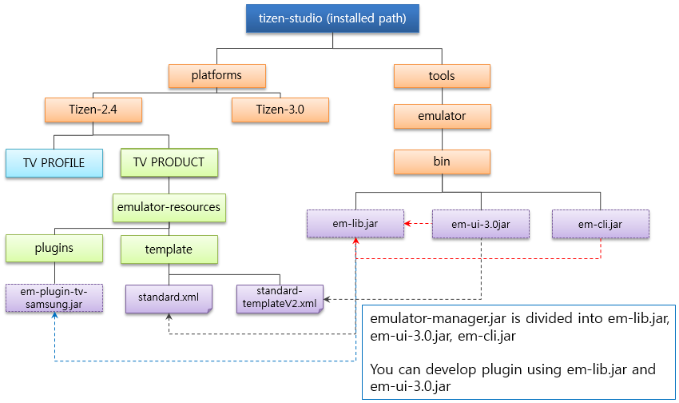
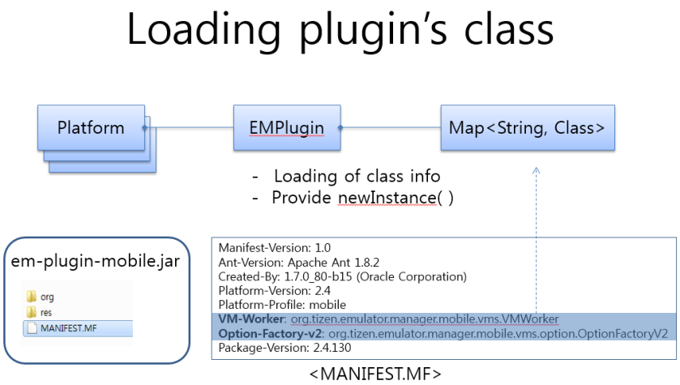
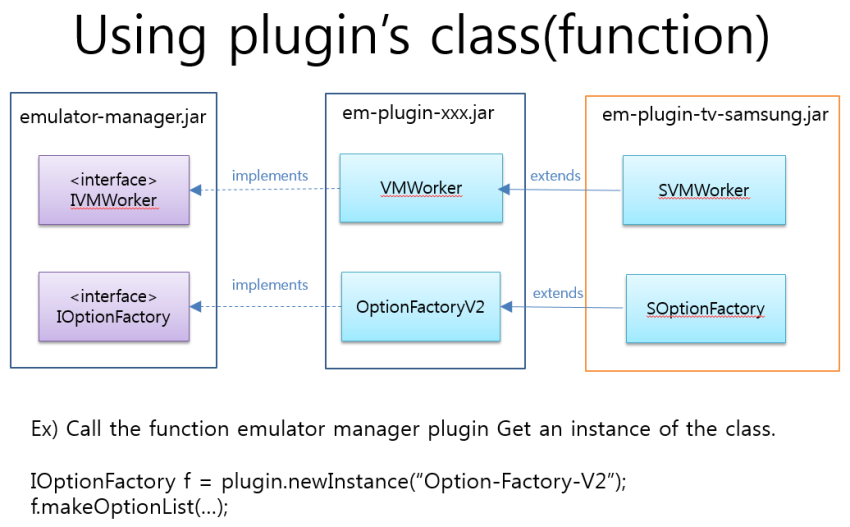

# Emulator Extension Development Guide

You can develop various extensions for the emulator: QEMU, kernel, Emulator Manager, and Emulator Control Panel extensions.

## Developing QEMU Extensions

To develop a QEMU extension:

1. Develop your extension in a separate source directory.  
   For ease of management, you can use `git submodule` to handle the `QEMU` Git repository as a subdirectory.
2. Build the extension:
    1. Add your extension source code to a subdirectory under `<QEMU>/tizen/src/`.  
        You can use `git submodule` to create the subdirectory from your source code directory, or link to it using a symbolic link.
    2. Prepare the `configure` script.  
        Use the existing `emulator_configure.sh` file in the `<QEMU>/tizen/` directory as a template.
    3. Run the `configure` script with the argument `--extension-path = [extension directory]`, where the extension directory is a relative path starting from `<QEMU>/tizen/src`.
    4. Run the `make` command with the `<QEMU>/tizen/Makefile` file.  
        If you used `git submodule` to manage the `QEMU` repository as a subdirectory, it can be convenient to create a wrapper `Makefile` in the parent directory.
3. After you have built and tested your extension, push your code to the `QEMU` Git repository.

        
## Developing Kernel Extensions

To develop a kernel extension:

1. Develop your extension in a separate source directory.  
   For ease of management, you can use `git submodule` to handle the `emulator-kernel` Git repository as a subdirectory.
2. Build the extension:
    1. Add your extension source code to a subdirectory under `<emulator-kernel>/drivers/maru/`.  
       You can use `git submodule` to create the subdirectory from your source code directory, or link to it using a symbolic link.
    2. Prepare the `defconfig` file.  
       Use the existing `defconfig` file as a template.  
       You can use a script to set the extension path at build time, or if the extension path is fixed, it can be hardcoded in the `defconfig` file `CONFIG_MARU_EXTENSION_SOURCE` and `CONFIG_MARU_EXTENSION_SOURCE_PATH` variables.
    3. Run the `make` command with the `defconfig` file.  
       If you used `git submodule` to manage the `emulator-kernel` repository as a subdirectory, it can be convenient to create a wrapper `Makefile` in the parent directory.
3. After you have built and tested your extension, push your code to the `emulator-kernel` Git repository.

## Developing Emulator Manager Extensions

Before developing Emulator Manager extensions, you must understand the structure of the Emulator Manager. The Emulator Manager has the following components:
- `em-lib.jar` manages the common parts of the UI and CLI. It loads the plugin `.jar` file and the default property `.xml` file.
- `em-3.0-ui.jar` contains the UI source, which is implemented using JavaFX. It loads the emulator UI template `.xml` file.
- `em-cli.jar` contains the CLI source.

**Figure: Emulator Manager structure**



In Emulator Manager plugins:
- Each platform has separate files for its UI items and emulator options.
- Each profile has a separate plugin.  
  For example:
  - `em-plugin-mobile.jar`
  - `em-plugin-wearable.jar`
- The `template` directory contains `.xml` files that define platform-specific UI and property values.  
  For example:
  - `X86-standard.xml` (default property)
  - `X86-standard-template-v2.xml` (UI template)

Extension points and their associated classes allow you to extend the features of the Emulator Manager:
- The `Item-Factory` class extends property view items in the UI.
  - Extension point: `org.tizen.emulator.manager.ui.item.ViewItemFactory`
- The `Option-Factory-v2` class extends launch options.
  - Extension point: `org.tizen.emulator.manager.vms.option.IOptionFactory`
- The `Platform-Resource-Selector` class selects whether to use platform resources.

You must specify the extension class in the `MANIFEST.MF` file of the plugin.

**Figure: Loading a plugin class**



The following figure describes how extension plugins implement new features in the Emulator Manager.

**Figure: Implementing a plugin class**



For example, you can create a UI extension to modify the launch options. This is implemented using the `org.tizen.emulator.manager.vms.option.Option` extension point. After creating a class instance, you can extend the `OptionFactoryV2` class by using `MakeOptionList` to add a new option to the Common option list, or `addOption` to add a new option to a specific list item.

## Developing Emulator Control Panel Extensions

The Emulator Control Panel extensions use 2 Git repositories:
- Lib, UI, and CLI code: `sdk/emulator/emulator-control-panel`
- Device code: `sdk/tools/emulator-control-panel-devices`

To build an extension:

1. Copy the external binaries.
2. Copy the following binaries from `tizen-sdk/tools/emulator/bin` to the 2 `libs` folders in your project:
    - `args4j`, `jfxrt`, `jline`, `json-simple`, and `protobuf`
3. Build the code:
   - In the case of `lib`, `ui`, and `cli` libraries, to build them all at once, enter the `ant` shell command at the top level of your project.
   - In the case of devices:
     - When building is complete, copy the built `libecp`, `emulator-control-panel.jar`, and `emulator-control-panel-cli.jar` files to `libs` in the devices project directory.
     - To build the `mobile`, `wearable`, and `tv` profiles all at once, enter the `ant` shell command at the top level of your project. To build a specific profile only, you can specify, for example, `ant -f ECP-DEVICE/build_mobile.xml`.
4. If you configure devices separately, you only need to push changes to the `emulator-control-panel-devices` repository.
5. When building is complete, move the following files:
    - `libecp.jar`, `emulator-control-panel.jar`, and `emulator-control-panel-cli.jar` to `sdk/tools/emulator/bin`
    - Device `xml` and `jar` files to `platforms/<version>/<profile>/emulator-resources/plugins`
        - You must also rename the `.jar` and `.xml` files as 'ecp-plugin-<profile>-<version>.<extension>'.

To execute the extension in Eclipse:

1. Launch the Eclipse IDE.
2. Import all the project files.
3. In the run configuration, set the main project and class.
   - Project: `ECP-UI` for UI or `ECP-CLI` for CLI
   - Main class: `org.tizen.ecp.EmulatorControlPanel` for UI or `org.tizen.cli.TizenEmulatorCli` for CLI
4. In the run configuration, set the program arguments.
   - vm_name: the name of vm instance
   - base_port: this can be found the first item from the context menu when you right click on an emulator. The port indicates the connected sdb port, so you should subtract 1 to get the base port.
   - platform_version: see below example
   - profile: see below example
   For example:
   ```
   vm_name=w-0906-1 base_port=26100 platform_version=tizen-2.3.2 profile=wearable
   ```
   The platform version and profile are used in the directory names:
   ```
   <tizen-sdk>/platforms/<platform_version>/<profile>
   ```
5. In the run configuration, add the `ECP-DEVICES` project into class path and source path.
6. In the run configuration, enter the following VM arguments. This is needed in order to change the search option to find the device xml and jar location. Basically, non-develop mode of ECP searches 3 above relative directory to find sdk.info. If it is develop mode, it searches current directory and the executable binary directory.
    - `-Ddevelop`
7. Create a symbolic link on a terminal to set target directory of tizen studio. Tizen studio base location is used to find the target device xml and jar location, including extension version and profile location.
    - `sdk.info` file is found based on the SDK installation path
    - For example: `emulator-control-panel/ECP-LIB`
      - `ln -s ~/tizen-studio/sdk.info sdk.info`

