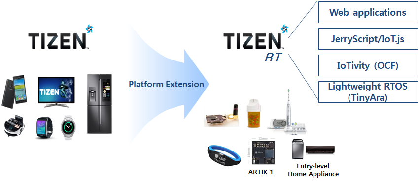
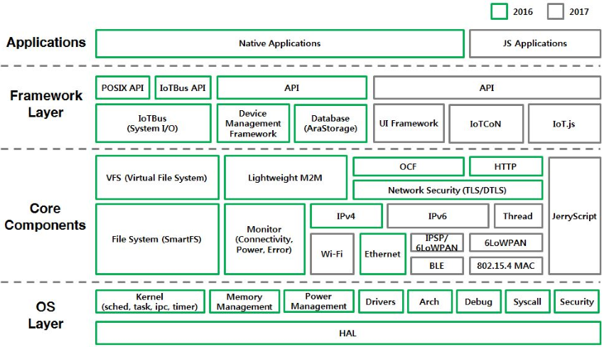

# Tizen RT

Tizen has been commercialized in smart TVs, smart phones, wearable devices (Gear S, Gear Fit), and smart home appliances. However, low-end and low-cost IoT devices, such as home appliances without LCDs and wearable bands with small LCDs, have received less attention. The goal of Tizen RT is to extend the Tizen platform device coverage to these low-end devices. Tizen RT is an RTOS-based lightweight platform that works on these devices, which typically use Cortex-M/R processors with MPU, less than 2 MB RAM, and less than 16 MB flash memory.

The typical RTOS-based development environment has several limitations:

- It cannot load additional modules at runtime.
- It can be inferior to a Linux environment.

To tackle these limitations, Tizen RT adopts Linux-style development environments, including POSIX API, BSD Socket API, Shell, and Kconfig build configuration. This helps Linux developers build their business logics easily on top of Tizen RT. In 2017, Tizen RT adopts a lightweight JavaScript environment, consisting of JerryScript and IoT.js.

Tizen RT consists of a lightweight RTOS (TinyAra), IoT protocols (such as IoTivity and LWM2M), and JerryScript/IoT.js.

**Figure: Tizen RT content**

The TinyAra project was started in 2015 based on NuttX, a real-time operating system (RTOS) with an emphasis on standards compliance and a small footprint. While maintaining the kernel architecture, TinyAra has grown by building up the IPv4/IPv6 network stack, file system, a lightweight database (AraStorage), device monitor, and IoT protocols, such as IoTivity (OCF) and LWM2M. The integration of AraStorage and IoTivity allows TinyAra to collect, store, and deliver IoT sensor data easily. The combination of the device monitor, which observes the status of connectivity, power, and errors, and the lightweight M2M promotes TinyAra as a large-scale device management solution. TinyAra evolved into Tizen RT in 2016 by stacking multiple frameworks required for IoT scenarios. In 2017, Tizen RT adopts JerryScript and IoT.js, for a lightweight JavaScript environment.

The following figure illustrates Tizen RT development over 2016 and 2017. Tizen RT was first commercialized in low-end home appliances in the first half of 2017.

**Figure: Tizen RT development**

