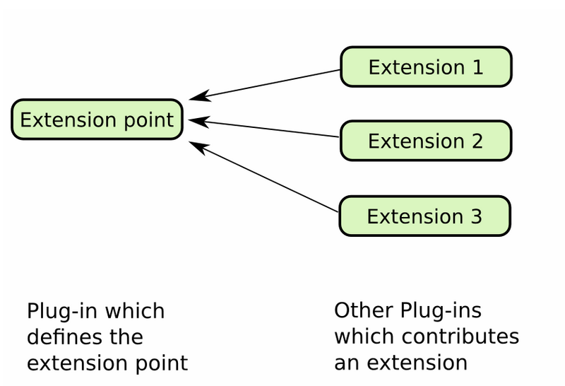
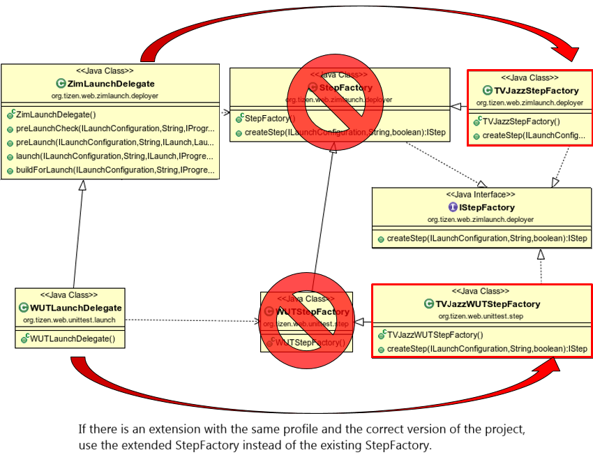

# Web/Native IDE Extension Development Guide

The Tizen IDE is based on [Eclipse](http://www.eclipse.org/) and can be extended based on Eclipse's plugin extension platform. Therefore, you can contribute to it through the extensible parts of the Eclipse platform. Technically, all of the functions of Tizen IDE that provide extension points in the Eclipse platform can be extended, added, or changed. For example, the Menu, Context Menu, Toolbar, View, and Editor can all be extended.

> **Note**
>
> The Tizen IDE has modified some of the Eclipse icon images to provide a Tizen Studio identity, and some of the Eclipse platform upstream sources to customize unused menu items and settings, so some extension points do not work properly.

Tizen IDE extensions are developed in essentially the same way as Eclipse plugins. If you are new to Eclipse plugin development or need more information, see:
- [Eclipse Official Help](https://help.eclipse.org/neon/index.jsp?topic=%2Forg.eclipse.platform.doc.isv%2Fguide%2Ffirstplugin.htm)
- [Eclipse expert Lars Vogella's blog](http://www.vogella.com/tutorials/EclipsePlugin/article.html)

To develop the Tizen IDE:

1. Prepare the default Eclipse Plugin Development Environment (PDE).
2. Clone the Tizen IDE source.

## Tizen IDE Extension Points

The following figure illustrates how Eclipse plugins can function as an extension point that can be used by other plug-ins to contribute to it.

**Figure: Extension points**

The Tizen IDE provides the following extension points for IDE functionality:

- Launch (Web)  
  Provides extension points for application launch (the **Run As** command) and unit test launch.
  - `org.tizen.web.zimlaunch.launchStepFactory`  
    Web application launch step

    **Figure: Web application launch**

    
  - `org.tizen.web.unittest.launchStepFactory`  
    Web application unit test launch step
     
- Certificate  
  Provides extension points for Tizen certificate generation. For an example, see [Modifying Certificate Manager Texts](example-web-certi-ext.md).

- Eclipse themes  
  Provides extension points for customizing the IDE:
  - `org.eclipse.ui.commands`
  - `org.eclipse.ui.handlers`
  - `org.eclipse.ui.bindings`
  - `org.eclipse.ui.menus`
  - `org.eclipse.ui.popupMenus`
  - `org.eclipse.ui.newWizards`
  - `org.eclipse.ui.editors`
  - `org.eclipse.ui.propertyPages`
  - `org.eclipse.ui.perspectiveExtensions`
  - `org.eclipse.help.toc`

  For an example, see [Modifying Eclipse Themes](example-web-theme-ext.md).

If you have additional extension points, contact us.