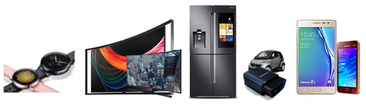
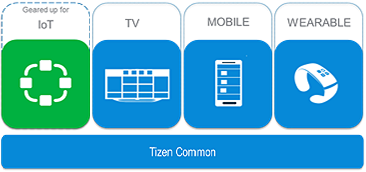
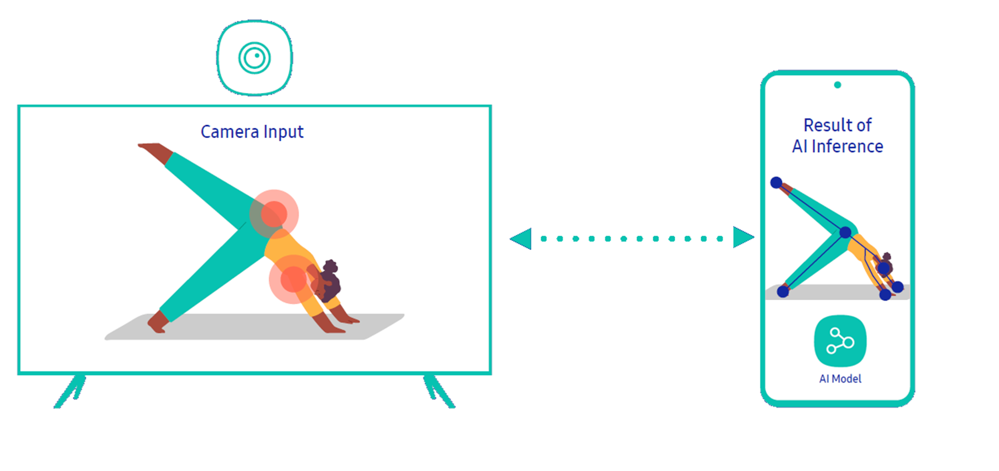
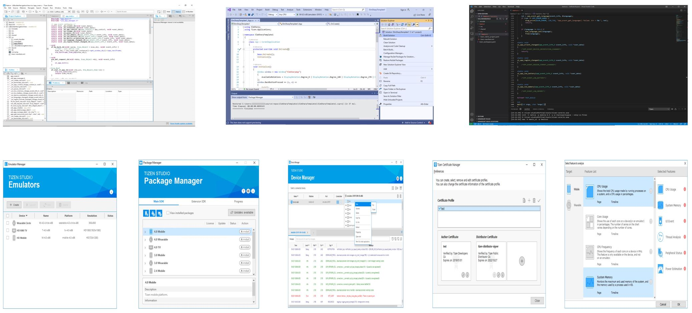

# Introduction to Tizen

Tizen is an open source operating system based on Linux, hosted by the Linux Foundation, and open to all developers.  Tizen has evolved to connect everything, from smart TVs, smart phones, and wearable devices to IoT (Internet of Things) devices. Devices powered by Tizen can provide seamless connectivity to Tizen developers and device users among various device types.

## Connect everything

As diverse devices are getting smarter and more connected, there is a strong need for a software platform for integrated services with connected products. Tizen is designed for this and has been evolving to connect everything. To support different types of devices with a seamless user experience, Tizen categorizes the features and functions as profiles. There are currently 4 profiles available - IoT, TV, Mobile, and Wearable. For the IoT profile, Tizen supports both headed and headless products. In the near future, lots of internet connected devices are anticipated to be on the market and IoT services are expected to pervade everyone's daily life. Tizen is moving forward to the future of everything connected.

**Figure: Connecting different devices**

## Openness, optimization, and opportunities

Tizen is a Linux-based, open-source software platform. Anyone can contribute and freely develop the system software and applications, which is beneficial for both device manufacturers and application developers. Furthermore, by supporting web applications with open web technologies, Tizen provides developers flexibility and extensibility. Based on the open ecosystem, the user can expect various experiences from Tizen devices and services. With its openness, Tizen can pursue continuing progress and expand the ecosystem.

Tizen is built to work on diverse devices, and profiles are defined accordingly. Currently, four profiles are supported:

- [IoT](profiles/iot.md)
- [TV](profiles/tv.md)
- [Mobile](profiles/mobile.md)
- [Wearable](profiles/wearable.md)

The features of each profile provide product-optimized functionality and performance.

Since Tizen 3.0, all profiles are built on top of a common, shared infrastructure called **Tizen Common**. Based on the common components, devices and features under new categories or profiles can be easily added for emerging technologies. Therefore, Tizen is adaptable and customizable for new products. In the foreseeable future, for example, IoT devices and services are expected to be prevalent and Tizen is taking proactive steps toward the opportunities in these new markets.

**Figure: Common infrastructure for various profiles**

## Multi device experience

Users usually use multiple smart devices in various situations. Tizen enables not only connecting those devices but also leveraging every device's capabilities for providing a differentiated experience to the users.

- **Supporting latest connectivity standards**: Tizen supports novel connectivity standards. The latest Wi-Fi standards like Wi-Fi Aware, Wi-Fi Easy Connect are supported by the platform and it adds support for new standards continuously. Matter and Thread protocols are the next generation IoT protocols for smart home devices. Especially, Tizen will support the Matter protocol from the first release (1.0) of the open source matter SDK.

  **Figure: Connectivity standards**
  
  
  
- **Services leveraging multiple devices' capabilities**: Tizen provides easy ways of implementing services which work on multiple devices. For services on multiple devices, Tizen provides methods for discovering services among connected devices and communicating with each other in an efficient way. It is not bounded to Tizen-powered devices. Cross platform APIs are available for Tizen-Android inter-working.
For AI services, Tizen provides a framework for offloading AI inference computation to connected high-end devices. Even when a device doesn't have enough computing power to run AI models, a service can find an alternative device to run the model among connected devices. With this feature, every Tizen device will be able to run AI services by leveraging the capability of peer devices.

  **Figure: AI computation offloading**
  
  
  
  In addition to these basic connectivity and MDE features, Tizen will evolve by adopting novel features for multi device experience continuously.

## AI and machine learning
### NN Runtime
NN Runtime serves as a backend for machine learning APIs for accelerating neural network inference on Tizen devices. It supports heterogeneous computing by combining CPU and GPU, and we plan to expand support to NPU in the near future. It is based on the independent open source project [ONE (On-device Neural Engine)](https://github.com/Samsung/ONE), which consists of a runtime virtual machine running on the Tizen device and a compiler toolchain running on the developer's host computer.

Runtime

- Provides an optimized execution combination of various open kernels and private kernels based on a proprietary algorithm developed in-house.
   - Kernels from open sources such as ARM Compute Library (ACL), Ruy, and XNNPACK, and customized improvements according to needs. 
- Support for dynamic tensors whose shape keeps changing during inference.
- Support for models with control flow operators. (IF, WHILE)
- Provides various executors and is expandable.
   - Linear executor.
   - Parallel executor using CPU and GPU together.
- Partitioning and multithreading of neural network models at runtime to improve overall inference throughput.

Compiler Toolchain

- Support for interworking with various neural network frameworks and their models.
   - TensorFlow & TensorFlow lite v1.x & v2.x.
   - PyTorch & ONNX v1.10.
- Defining and serving extensible universal container called ‘NN package’.
   - Accommodating circle (ONE), tflite (TensorFlow lite) model, and meta-data in JSON format under directory structure.
- Includes various development tools that use common IR (circle) as standard input/output format.
   - Graph-level neural network model optimizer.
   - Neural network model quantizer.
   - Various profiles and test scripts to evaluate performance on target.

### On-device & among-device AI pipelines for inference

NNStreamer (https://github.com/nnstreamer/nnstreamer) is a set of GStreamer plugins that allow GStreamer developers to adopt neural network models and also lets neural network developers manage neural network pipelines and their filters easily and efficiently.

- Provide neural network framework connectivities (e.g., TensorFlow, Caffe) for GStreamer streams.
  - Efficient Streaming for AI Projects: Apply efficient and flexible stream pipeline to neural networks.
  - Intelligent Media Filters: Use a neural network model as a media filter / converter.
  - Composite Models: Multiple neural network models in a single stream pipeline instance.
  - Multimodal Intelligence: Multiple sources and stream paths for neural network models.
- Provide easy methods to construct media streams with neural network models using the de-facto-standard media stream framework, GStreamer.
  - GStreamer Users: Use neural network models as if they are yet another media filter.
  - Neural Network Developers: Manage media streams easily and efficiently.

### On-device training & AI service personalization

NNTrainer is a software framework for training neural network models on embedded devices which have relatively limited resources. Rather than training whole layers of a network from scratch, NNTrainer finetunes the neural network model on a device with user data for personalization. It is based on the independent open source project NNTrainer (https://github.com/nnstreamer/nntrainer) and provides various applications.

- [NNTrainer: Personalize neural networks on devices!, Samsung Developer Conference 2021](https://www.youtube.com/watch?v=HKKowY78P1A)
- Features: https://github.com/nnstreamer/nntrainer/blob/main/README.md
- Layers:
  - Feedforward Network: Conv1D, Conv2D, Pooling2D, Flatten, Fully-Connected, etc.
  - Recurrent Layer: LSTM, GRU, RNN, Time Sequencing, etc.
  - Pre-processing: Reshape, Split, Translate, etc.
  - Activation: Tanh, Sigmoid, Relu, Softmax
  - Loss Function: Cross Entropy (Sigmoid, Softmax), MSE, Constant Derivative
  - Optimizer: SGD, Adam
  - Others: Weight_initializer, Weight_regularizer, Weight_decay, Learning Rate Scheduling, Teacher Forcing, Gradient Clipping, etc.
- Applications:
  - MNIST, Reinforcement Learning, Transfer Learning, ResNet, VGG, etc.

### MediaVision
MediaVision provides task based inference API; classification, detection, and pose landmark detection.
It also provides an easy way for a user to do the following:
- Run models with metafiles which describe model information.
- Run various types of models with Machine Learning API.
- Use H/W acceleration with NN Runtime.
## Convergence platform for the emerging era

Since 2012, Tizen has been expanding as smart gadgets have become generalized and connected. By accommodating various device types, Tizen is gearing up for the new era of convergence. As of now, there is a wide variety of Tizen devices on the market:

- Mobile phones: Samsung Z series (Z1, Z2, Z3, Z4)
- Tablets: DIGMA Plane 8501 3G
- Wearables: Samsung Galaxy Watch series (Galaxy Watch, Galaxy Watch Active, Galaxy Watch Active2, Galaxy Watch3), Gear series (Gear 2, Gear 2 Neo, Gear S, Gear S2, Gear S3)
- Smart TVs: Samsung SUHD, UHD, LED TVs
- Cameras: Samsung NX-series, Gear 360
- Smart appliances: Samsung Family Hub Fridge

As of Oct. 2021, there are about 200 million Tizen devices in the world. In addition, Samsung is holding the highest market share in the global TV market and its recent models are all based on the Tizen platform. It is expected for the Tizen platform to broaden its ecosystem with increasing market requirements and user demands.

## Productivity

To facilitate developing Tizen applications, [Tizen Studio](../../application/tizen-studio/index.md) is provided as an integrated development environment (IDE). It helps you to develop, build, debug, profile, and emulate Tizen applications. Tizen Studio is equipped with useful developer tools, including Emulator, Package Manager, Device Manager, Certificate Manager, and Dynamic Analyzer for profiling. In the integrated environment, you can enjoy the comfortable and productive development of Tizen Native and Web applications. Also, we provide two extensions for Visual Studio and Visual Studio Code. In [Visual Studio Tools for Tizen](../../application/vstools/index.md) and [Visual Studio Code extension for Tizen](../../application/vscode-ext/index.md), you can develop not only Tizen Web and Native applications but also Tizen .NET applications easily and rapidly with tools that Tizen Studio provides.

**Figure: Tizen Studio tools**

## Versions

The latest versions of the Tizen platform include the following:

- [Tizen 6.5](versions/tizen-6-5-m2.md)
- [Tizen 6.0](versions/tizen-6-0-m2.md)
- [Tizen 5.5](versions/tizen-5-5-m2.md)
- [Tizen 5.0](versions/tizen-5-0-m2.md)
- [Tizen 4.0 M2](versions/tizen-4-0-m2.md)
- [Tizen 4.0 M1](versions/tizen-4-0-m1.md)
- [Tizen 3.0](versions/tizen-3-0.md)
