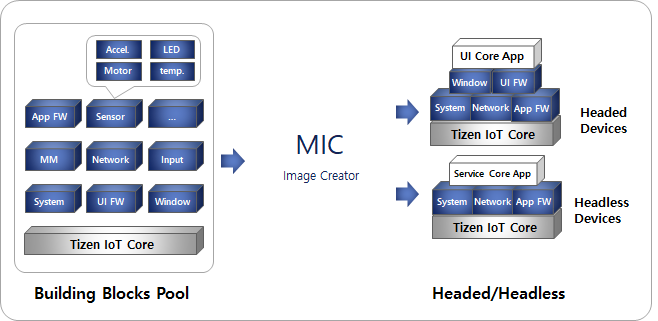

# Tizen IoT

Tizen IoT profile allows developers to make various kinds of IoT devices and develop applications for the devices.
Tizen IoT Headed and Headless binaries support any type of IoT devices based on the Linux kernel.

## Development environment for Tizen IoT
Tizen IoT supports the following environment for development:
- Hardware targets
    - Raspberry Pi 3 and 4 as the official reference boards
- Platform images
    - Headless image for IoT devices without a display
    - Headed image for IoT devices with a display

## Develop applications for Tizen IoT
To develop applications for the IoT profile:
- [Create Your First Tizen IoT .NET Application](../../../application/dotnet/get-started/iot/first-app.md)

## Create Tizen IoT images
Tizen IoT provides a building block pool of components mainly based on the [Tizen native API sets](../../../application/native/api/wearable/latest/index.html).

**Building block prsets for IoT core:**
- The minimum set of bootable modules that make up the Tizen platform image for IoT devices.
- The preset contains core components that are required for a basic system image to boot.

**Building block prsets for Headless:**
- The set of modules that make up the Tizen platform image for headless IoT devices without a display.
- The preset contains IoT core presets with other components specifically required for headless image.
- Example of specific components for headless image includes Audio modules, Bluetooth modules, and so on.

**Building block prsets for Headed:**
- The set of modules that make up the Tizen platform image for headed IoT devices with a display.
- The preset contains IoT core presets with other components specifically required for headed image.
- Example of specific components for headed image includes Notification API, graphic modules, and so on.

Custom IoT images can be created by combining API building blocks in various ways as per the requirements. Required packages are installed based on the dependencies related to the specified building blocks.

To create images for the IoT profile:
- [Creating Tizen Images with MIC](../../developing/creating.md)