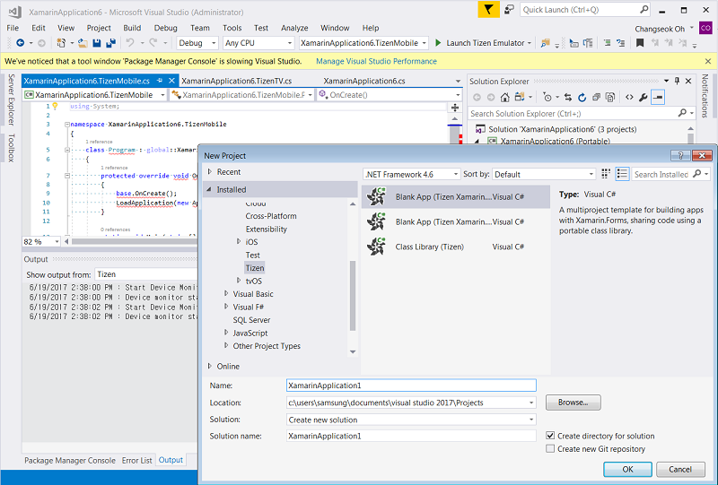
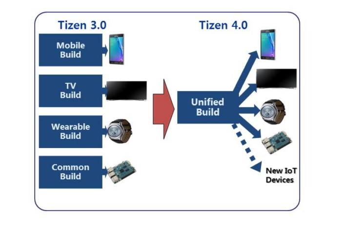

# Tizen 4.0 M1

The [first milestone (M1) of Tizen 4.0 was released](../../release-notes/tizen-4-0-m1.md) in May 2017, marking a new turning point for the platform, which is currently the most successful Linux-based embedded OS in the world.

The key changes in Tizen 4.0 are optimizations made on the platform for IoT developers to enable rapid creation and commercialization of various applications. While the existing Tizen platform was limited in distribution to devices such as TVs and smartphones, Tizen 4.0 will provide a development environment that can be refined according to the characteristics of various devices by subdividing functional modules. In addition, the Tizen 4.0 platform has been extended to Tizen RT (Real-Time) to involve high-end products such as TVs and mobile devices as well as low-end products such as thermostats, scales, bulbs, and more.

## A new development experience for a strengthened application ecosystem

While many existing OS platforms are limited due to their framework, policies, or business models, Tizen 4.0 aims to promote innovation and the expansion of the application ecosystem by giving developers more freedom and flexibility.

One way the platform accomplishes this is through the introduction of .NET. With .NET, Tizen developers can enjoy C#, the familiar, industry-leading programming language and one of the richest standard libraries.

Additionally, Tizen Open Source Project worked closely with Microsoft to develop [Visual Studio Tools for Tizen](https://news.samsung.com/global/samsungs-third-tizen-net-developer-preview-introduces-new-visual-studio-tools), which are integrated into Visual Studio, a popular IDE (Integrated Development Environment), and Xamarin.Forms, a cross-platform UI toolkit. Because Xamarin.Forms supports cross platforms, developers can build native UIs for Android, iOS, and Windows from a single, shared C# codebase, and easily port these apps to Tizen.

Since announcing its collaboration with Microsoft on .NET open-source projects last November, Tizen has steadily released preview versions of the Tizen .NET SDK to help developers build more powerful apps and to encourage their participation in the ongoing development of the Tizen application ecosystem.

Tizen .NET currently supports Microsoft's .NET Standard 2.0 and will provide a stable Tizen C# development environment with the release of Visual Studio Tools for Tizen v1.0 this fall.

The preview versions of Tizen .NET have garnered the attention of developers across the world, including those who attended the Microsoft Build 2017 held in Seattle, Microsoft Build Tour in Seoul, and Tizen App Development Seminar at Konkuk University in South Korea earlier this month.

Tizen 4.0's Voice Touch APIs also provide developers with the opportunity to implement voice-controlled application behaviors and web operations. This means that when using Tizen-based devices, users can navigate between web pages or control music playback with voice commands.

The platform's Sensor Framework has also been enhanced so that developers can easily define and utilize any physical sensor in an application, such as intrusion detection or air pollution measurement, by simply installing an application and device driver without having to upgrade firmware.

## Building an IoT device ecosystem

To help build the Tizen device ecosystem, Tizen Open Source Project worked closely with partners to improve the configurability, updatability, and IoT-readiness of Tizen 4.0.

As a result, Tizen has been significantly restructured. With the previous version of the platform, only specific types of "defined" devices – namely TVs and smartphones – were supported. But Tizen 4.0 has been configured to support various devices without the need for new build projects and infrastructure for each device type.

In other words, vendors can now configure and prototype an OS for their devices with Tizen without the need for setting up their own build infrastructure or creating yet another profile, or diverging their source codes or binaries.

Furthermore, the build environment of Tizen 4.0 M1 has been unified and the structure of and the relation between Tizen packages has been refactored significantly.

When Tizen 4.0 is completed at the end of 2017, the Platform Development Kit (PDK) will be distributed to assist device makers in creating their own IoT devices, while the Tizen Update Service will help them update their IoT services.

## Enhanced security for the IoT era

As the number of IoT devices continues to grow, and more and more things become connected to the Internet, security is of the utmost importance. To ensure that Tizen 4.0 is as secure as possible, Samsung is systematically strengthening the development process of the platform.

For example, the Tizen Open Source Project is using static code analysis tools, tightening code review, and continuously monitoring the security vulnerabilities of Tizen and related open source software and patching them regularly. Some of these patches will be tightly coupled with the Tizen code review system, with an aim to prevent vulnerable code from being merged into the Tizen code base from the first stages of development.

Building upon the platform's first milestone, M1, additional features of Tizen 4.0 will be reinforced and stabilized during the second half of this year. The final version of Tizen 4.0 (M2) will be available later this year.

