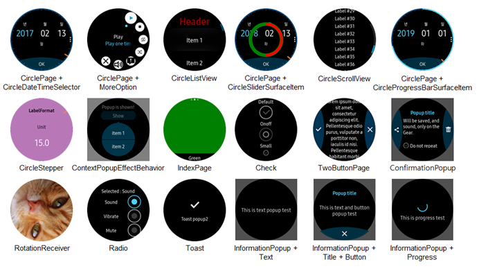
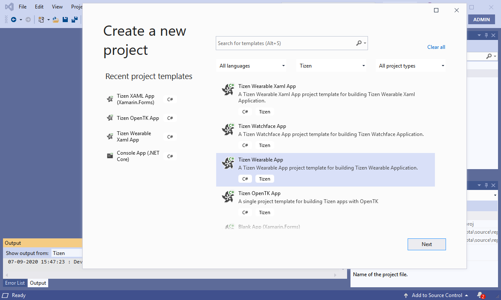
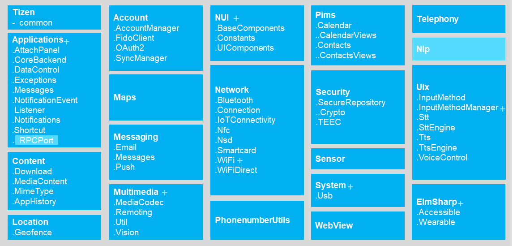

# Tizen 5.0

[The second milestone (M2) release of Tizen 5.0](../../release-notes/tizen-5-0-m2.md) was announced in October 2018. Tizen has expanded its horizon from smart devices to IoT devices. Currently, Tizen is used for various kinds of smart devices.
Tizen 5.0 adds more enhancements to the services and provides the opportunity to develop service-centric applications. With the result, the end-users will get a better experience with more enhanced applications. Tizen 5.0 provides APIs such as Tizen Interface Definition Language (TIDL) and RPC-port for easy integration of various kinds of services such as SmartThings. Many core open source components are upgraded in Tizen 5.0.

The key features of Tizen 5.0 are as follows:

- **Tizen Interface Definition Language (TIDL) and RPC-port**

    TIDL enables the service applications to communicate with other service application or service daemon and the RPC-port provides application Inter process Communication (IPC) mechanism.
Applications can expose RPC style service interface to other applications with TIDL.

- **Core Open source Upgrade**

    In Tizen 5.0, the following core open source components are upgraded:

    - Blink M56 which is the core web engine in Tizen is upgraded to M63.
        - Enhancement to follow W3C Standards such as Animated PNG, Full featured Indexed DB, CSS grid layout, web USB, MSE, EME, and so on.
        - Enhancement in standard web features WebRTC and ARIA 1.1.
        - Enhancement in web performance such as V8 : ES6 performance enhancement and Web Assembly default enabling.
    - GStreamer 1.6.1 is upgraded to 1.12.2.
    - Pulseaudio 5.0 is upgraded to 11.1.
    - EFL 1.16 is upgraded to 1.20.
    - Wayland is upgraded to 1.15.0.
    - .NET Core(Runtime) is upgraded.
        - Coreclr 2.1.1 is upgraded to 2.1.4.
        - Corefx 2.1.1 is upgraded to 2.1.4.
  - Xamarin.Forms is upgraded to 3.2.0, and so on.

- **Tizen Circular UI for Watch**

    Tizen 5.0 provides easy watch app development with Tizen Circular UI APIs and also provides Tizen Wearable App project template that eases development of the circular wearable applications.

    

    

- **C# API enhancement in TizenFX**

    New APIs are added in TizenFX, and some of the added APIs are as follows:
    - MediaController API set for playlist, event, and capabilities.
    - AudioManager API set for USB Audio output device.
    - AudioIO API set and enum for sample type and changed maximum sample rate.
    - MediaPlayer API set to set or get the video ROI area.
    - Multimedia API set for the rotation and zoom level.
    - NLP API set for new Namespace and Class.
    - InputMethod API set for floating keyboard and to hide or launch Input Method Editor (IME).
    - WiFi API set for forget access point (AP), BSSID Scan, RawSSID, CountryCode, and WPS connection cancellation.
    - NUI API set for KeyboardRepeatInfo, TextPredition, and so on.

    

For more information, see [Tizen 5.0 M1 release note](../../release-notes/tizen-5-0-m1.md) and [Tizen 5.0 M2 release note](../../release-notes/tizen-5-0-m2.md).
