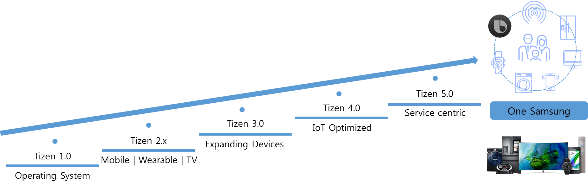
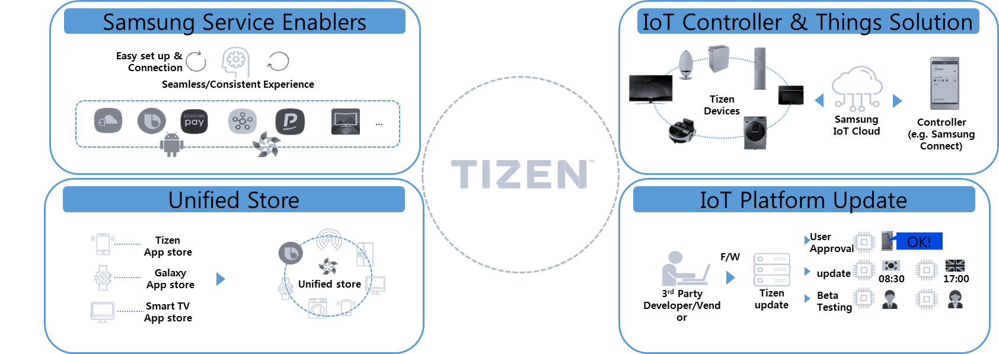
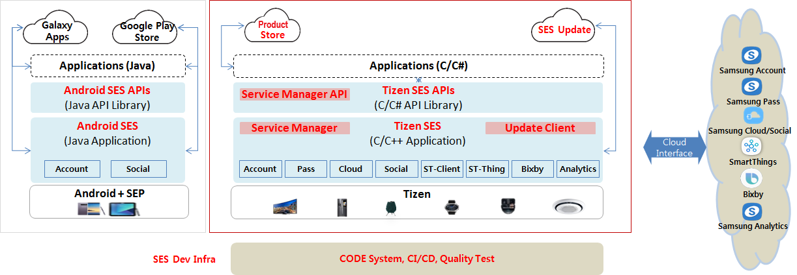
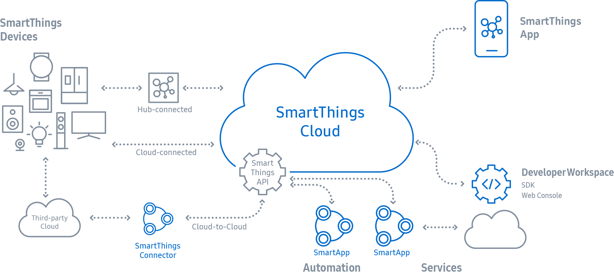

# Tizen 5.0

Adding the enhancement on service with Tizen 5.0 provides the opportunity to develop applications which are related to service centric. When it comes to users, they will get various experiences with more enhanced applications.

Tizen 5.0 would make an ecosystem for all Tizen devices and the ecosystem will provide more enhanced functionalities to the connected device called "One Samsung."

Developers will have experienced as follow:

- Cross platform and device(.NET/PWA) for the enhanced Tizen ecosystem
- End to end application development environment by providing Beta Program, various kinds of targets, application analytics, and unified store.
- Samsung service agent and SDK for Tizen
- Samsung service enabler and upgrade solution
- Device to device convergence solution for enhancing connectivity among Samsung devices

Samsung service enablers give the seamless experience to users who are using Samsung devices with Samsung common service.

IoT controller and things provide solutions in which user can control the various kinds of devices based on IoT-Cloud.

Unified store solution makes unified store for Samsung devices (TV/Mobile/Wearable/DA etc.)

IoT platform update solution will provide convenience in updating platform for IoT devices in various areas.

## Samsung Experience Service (SES)

SES provides a set of core Samsung Service APIs, crucial for app developers, which utilize Samsung Service Server APIs such as Account, Bixby, SmartThings, etc.

Common unified client APIs composed of Account, Social, Analytics, SmartThings, Bixby and other services can be used across a wide range of Tizen devices such as Smart TV, Family Hub, AI Speaker, Watch, Air Conditioner, Oven, Robot Cleaner, etc.

Simultaneous system updating of  Tizen extension SDK on the developer's computer as well as services on the Samsung devices ensure a seamless application experience for both users and developers.

## IoT Services and development environment

Tizen IoT makes IoT applications scalable in attaching new forms of devices to the networks and to be sufficient controls available from the networks. Further, from the end devices to the services, the components in the Tizen IoT platform are tightly integrated throughout the whole ecosystem.

 Tizen IoT Extension SDK supports for the developers to develop an application running on the Tizen IoT Headed and Headless binary. Also, using Tizen IoT extension SDK, the developers can develop the IoT devices which are connected easily and securely with legacy IoT ecosystems such as SmartThings&trade;.

To address IoT-specific requirements, Tizen IoT is derived from Tizen. Tizen IoT is the Tizen implementation for the [SmartThings ecosystem](https://smartthings.developer.samsung.com/develop/index.html).

Tizen IoT is composed of:

- [Lightweight OS](../../../iot/get-started/setting-up-board.md) for IoT devices,
- [Peripheral I/O API](../../../iot/guides/peripheral-io-api.md) for the access and control of the devices, and
- [Things SDK API](../../../iot/guides/things-api.md) for the integration with the [SmartThings Cloud](https://smartthings.developer.samsung.com/develop/index.html).

Connected with the Cloud, the SmartThings App on your smart phone  provides easy and convenient ways for users to manage and configure the  devices and the services. For more information about Samsung's  SmartThings solution, see [SmartThings website.](https://smartthings.developer.samsung.com/)

[Source: https://smartthings.developer.samsung.com/](https://smartthings.developer.samsung.com/)

