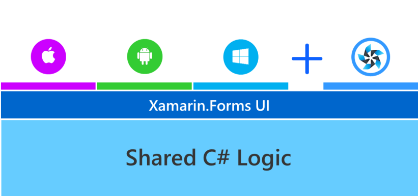
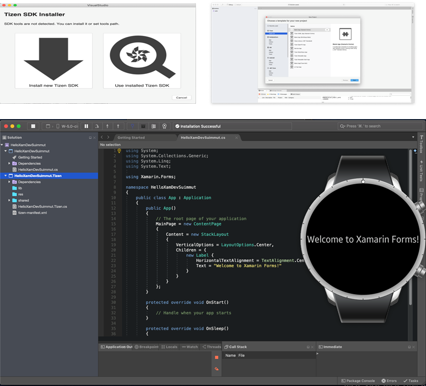
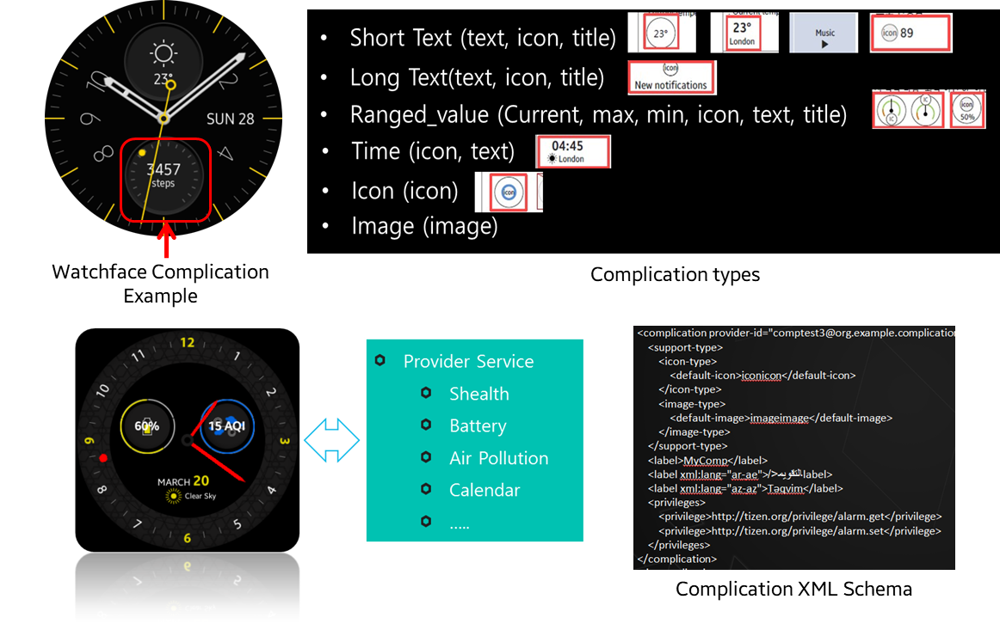
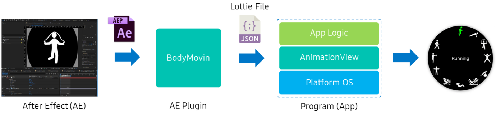
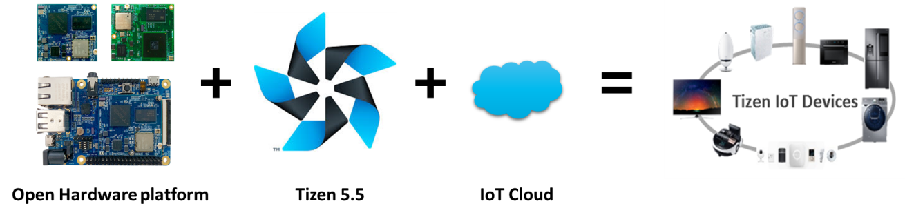

# Tizen 5.5

[The second milestone (M2) release of Tizen 5.5](../../release-notes/tizen-5-5-m2.md) was announced in October 2019.
Tizen is an open-source operating system (OS) maintained by Samsung and is developed and optimized for smart devices since 2012.
Currently, more than 130+ million Tizen-based devices such as TVs, watches, Family-Hubs, IoT based home appliances, and so on are commercialised.
The timeline for commercialisation of the various Samsung devices with Tizen OS is as follows:
- Samsung TVs (2015~)
- Galaxy Wearables (2014~)
- Family-Hub Refrigerators (2016~)
- Smart Signage (2019~)
- Air Conditioners (2019~)
- Flip board (2019~) etc.)

The key features of Tizen 5.5 are the enhancement of development environment and core, supporting AI component and the expansion of IoT profile.

## Enhancement of Development Environment and Core Component

- **Tizen.NET** :
It is the development environment for developing high quality and high performance application in C#. There is the enhancement in Tizen Development environment in Tizen 5.5.
The latest Xamarin.Forms 4.0 and the latest .NET Core 3.0 are now supported. Xamarin.Forms on Tizen .NET is a complete cross-platform UI toolkit that allows you to create native UI. The latest .NET Core supports unloading DLL, AOT, pre-loading/pre-initialization,Tiered complications and MPGO for enhancing application launching time. Also, there is memory optimization by reducing relocation of DLL files, pre-loading for resource sharing and so on. The .NET Core 3.0 Runtime is faster, lighter than its previous version. With all these enhancements, the application launching time is reduced by 28% and memory usage is reduced by 20%.
 New Tizen extension for official visual studio for Mac also is released in Tizen 5.5. The key features of Tizen extension is providing Tizen.NET  Application development environment, Tizen IDE tools  and application debugging using netcore debugger.

- **Tizen 5.5’s Watchface Complication APIs** :
These APIs in Tizen 5.5 provide an easy way to create custom complications in a watch face. These APIs provide various kinds of complication types. You can deploy various kinds of complication services such as health, battery, air pollution, and so on by using these APIs.

- **Supports Lottie animation** :
The Lottie animations are supported in Tizen 5.5. Lottie was named by AirBnB. It is a library that renders 'After Effects animations' in real time. The animation is exported as a Lottie file which has a JSON format. The file contains information about visual shapes such as rectangle, circle, path and fill methods like the traditional vector graphics elements.

- **Multi-assistant Framework** :
It aims to support various AI assistants at the same time for better usability. The framework defines a common interface for making an assistant of the multi-assistant framework. It also provides an expandable wake-up engine that recognizes invocation keyword for each assistant and supports to add a new keyword.

- **The multi-device distributed web engine** :
It is designed for both memory resource requirements mitigation and JavaScript execution speed enhancement to overcome the resource constraints of the low-end devices. With the prior multi-process design of the web engine, the memory usage of the renderers becomes significant as multiple tabs are created. CPU resource consumption of the renderer processes is also substantial as web applications get complicated.
To manage hardware resources and to make resource usage predictable in low-end devices, the multi-device distributed web engine introduces features for offloading renderer processes over the network to resource-free devices while the browser process runs on the local low-end device.

- **User Awareness Framework** :
Smart devices could provide useful services based on the user presence context. Tizen 5.5 supports User Awareness Framework based on multiple sensors. Currently, Wi-Fi, BLE, motion, and light sensors are supported and it could be extended to support other types of sensors based plug-in architecture.

## On Device AI

- **Machine Learning (ML)** : A new Tizen domain, Machine Learning (ML) is introduced along with its ML Inference API sets: “Pipeline ML API” and “Single ML API”. ML Inference API sets allows application developers to apply their machine learning mechanisms or neural network models easily and efficiently. Especially if the intelligence application has multiple sensors, multiple neural network models, and complex topology of data paths, Pipeline ML API can help implement the system efficiently with less time and effort. If developers need to use neural network models preloaded with the platform, APIs in Media Vision are appropriate because ML Inference APIs require developers to supply neural network models. In other words, for predefined special functions, Media Vision is appropriate and for general or custom functions, ML Inference is appropriate.
ML API sets are based on [NNStreamer](https://github.com/nnsuite/nnstreamer), which allow to construct GStreamer pipelines consisting of conventional GStreamer media plugins and neural network plugins. Although we plan to expand its functionality to on-device training in later releases, ML API sets of the current version of Tizen support machine learning inferences only. In ML API sets, there are two API subsets: Pipeline ML API set and Single ML API set.
Pipeline ML API set allows you to construct and execute GStreamer pipelines with the conventional GStreamer plugins and neural network plugins provided by NNStreamer. With this API set, you can construct pipelines with multiple instances of neural network models, input streams, and various stream path manipulators.

For input streams, you may use camera, mic, files, or arbitrary inputs from applications. However, your applications need to acquire appropriate privileges for the given inputs. For output streams, you may use files or callback functions of the application.
Single ML API set allows you to invoke a given neural network model (e.g., .tflite TensorFlow-lite model file) with a single instance of input buffer easily.
In Tizen 5.5, ML API sets allow TensorFlow-lite 1.13 and custom C libraries for model files. Although, NNStreamer itself supports more neural network frameworks such as TensorFlow, Caffe2, PyTorch, custom Python codes, Movidius NCSDK, and so on. However, device developers can install such frameworks and enable ML API sets to utilize such frameworks.

> **Note**
>
> Note that a few of GStreamer plugins that are white-listed are allowed with Tizen Application APIs; on the other hand, all of NNStreamer plugins are allowed.

- **Media Vision** :
Starting with BarCode recognition and generation in Tizen 2.4, features such as detection/recognition/tracking of Face and images have been added to MediaVision. These features are based on traditional computer vision technology and guarantee good execution speed on low-end hardware. With the rapid development of AI technology, the demand for DNN-based vision technologies has increased. In response to this growing trend, Media Vision has applied the AI Framework to some of the existing and new functions.
In Tizen 5.5, you can recognize the face and facial landmark via calling MediaVision API is based on AI Framework such as Caffe and TF-Lite. In addition, an interface for image classification and object detection is also provided, and it is supported to use a reference model provided by Tizen or a model trained by developer.

## Building an IoT Device Ecosystem

To build the Tizen IoT device ecosystem. Tizen open-source community worked in collaboration with other partners. With the result, Tizen IoT profile supports open hardware platforms such as RPI3 and SDTA7X2.
Several IoT Cloud solutions are also integrated in Tizen 5.5. Tizen 5.5 provides IoT Headless and IoT Headed profile based on the building blocks for supporting various purpose devices.
Tizen 5.5 provides IoT total solution of the open hardware platform, platform OS and IoT cloud.

For more information, see [IoT Partners](https://docs.tizen.org/iot/iot-partners/).
