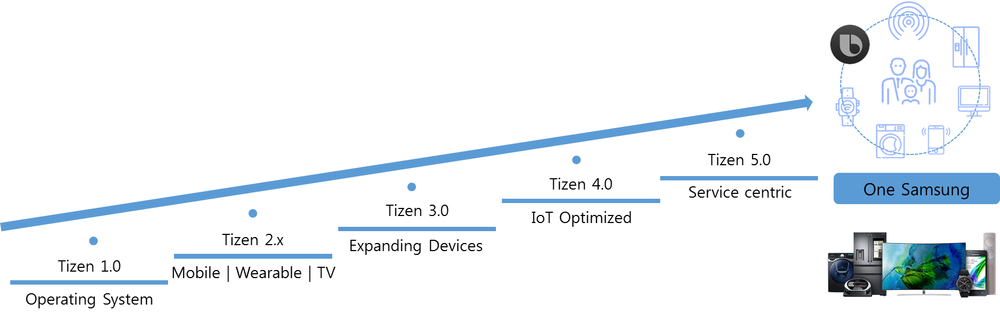

# Tizen 5.5

The target audience of this page is software engineers in HQ and Overseas R&D branches who are participating the Tizen 5.5 development.

The contents of this page includes the following informations. 

-  Tizen’s long term directionalities for the next 5 years
-  Tizen 5.5's main goals and deliverables
 

For each technical area, we are focusing on clarifying Tizen 5.5 goals, which is followed by technical details.

The approach to current technical details would be different in each area, depending on if the area is a new addition in Tizen 5.5 or something already existed in Tizen 5.0.

For a new area, we will focus on presenting overall architecture and what could be achieved in the Tizen 5.5 scope. For an existing area, we will focus on expected changes.

## Long-Term Direction

Last 5 years, Tizen’s top priority was being the Samsung’s common OS platform through all kind of Samsung products.

In Tizen 2.x, we shipped the Tizen as an Operating system of key products such as mobile phones, wearables watches, and TVs.

In Tizen 3.0, we integrated all versions of Tizen into a single, common version.

In Tizen 4.0,  we fostered Tizen platform as an IoT optimized platform.

In Tizen 5.0, Adding the enhancement on service with Tizen will provide the opportunity to develop applications which is related to service centric. When it comes to users, they will get various experiences with more enhanced applications.

In Tizen 5.5, we enhance core framework and services for next generation products based on intelligent and IoT services.

Main goal of Tizen 5.5 is as follows

- Tizen platform release for the devices which use Tizen OS such as '20 TV, Galaxy Watch 2, Family hub 4 etc.

- Core AI framework integration for various kinds of intelligent scenarios.

     - NN Runtime integration for supporting on device AI (NPU support)

     - On Device (Micro) Bixby integration etc.

- Enhancement of services based on Tizen platform such as Tizen Store development, IAP (In app purchase) APIs Etc. 

     - .NET enhancement for supporting wearable and family hub in-house C# applications.     

     - .NET core upgrade

- Core framework enhancement

    - Animation FW(Lottie)

    - 4K high resolution UI supports (Flexible UX) for Micro LED TV

    - Companion application model support

    - Win set enhancement for various UX and targets

    - Multi-Assistant Support

    - Downloadable Web Engine and EFL continuous integration support

