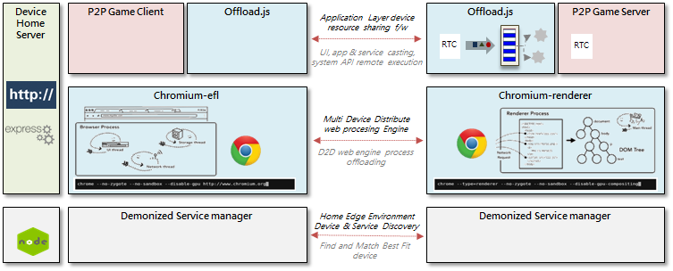
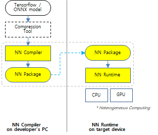
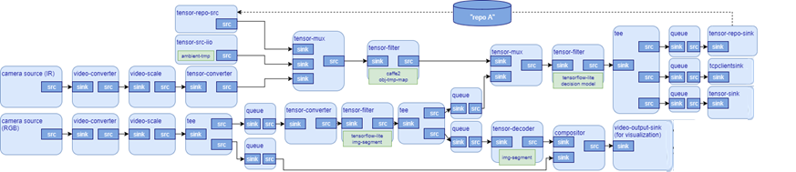

# Tizen 6.0

The second milestone (M2) release of Tizen 6.0 was announced in October 2020.
Tizen is an open-source operating system (OS) maintained by Samsung and is developed and optimized for smart devices since 2012.

The key features of Tizen 6.0 are the enhancement of the development environment, core, and AI components.

## Enhancement of development environment and core component

### Tizen.NET

Tizen supports C# development environment based on .NET Core for application development productivity.

In Tizen 6.0, the latest  .NETCore 3.1 and the latest version of cross-platform Xamarin are supported. With this update, there is a considerable advancement in the application start-up time and reduction in memory usage. The **XAML Hot Reload** beta service is supported as well.

The following is updated in Tizen 6.0:

- **.NET Core**:
     - Latest .NET Core 3.1(LTS)
     - Optimized performance
     - Diagnostics tools
- **TizenFX**:
    - Tizen platform-specific API set
    - API level 8 released
- **Xamarin**:
    -  Latest Xamarin.Forms (4.8.0)  and Xamarin.Essentials (1.5.3) are available.
    - TV UI Controls and CircularUI: New UI controls for Smart TVs and Smart Watches.
    - XAML Hot Reload: Boosting developer productivity

### Web framework

Tizen 6.0 provides a new user experience through device-to-device connectivity and interworking.

- Web-based device offloading services

As the complexity of applications in the web environment increases, a method of maximizing computational power is needed.

Tizen 6.0 provides **multi-device offloading service** technology using multiple devices.

### Lightweight Web Solution

Escargot is the Tizen JavaScript engine for the product having hardware resource restriction. It uses about 14% in binary size and 35% in memory usage for the benchmark application compared to those of Chrome's V8 JavaScript engine. Escargot supports ES6 full specification and also supports ES 10 up to a large extent:

 The following are the details for memory size and features in comparison to Chrome V8 benchmarks:

  - Memory size  (vs chrome v8) octane benchmark in Ubuntu 18.04
    - Binary size : 13.7 %
    - Average RSS : 35.1 %

  - Features
    - Support ES6 Full feature and partial support of ES10

## Machine Learning framework

NNSteamer is an on-device AI framework that makes it easy to configure complex artificial neural networks in the application by making artificial neural network configurations with Gstreamer's plugin. 	 

In Tizen 6.0, NN Runtime supports control-flow and dynamic tensor that enables voice model acceleration. In addition, by providing the NN Compiler front-end for NN Runtime, it can convert well-known models such as Tensorflow and TensorFlow-lite to be used on CE devices with insufficient resources on NN Runtime.	 

- NNStreamer 	 
 - Neural Network Pipeline. 	 
   - .NET and C APIs supported. 	 
   - Various accelerating hardware and frameworks supported. 	 	 
   - Implement AI app more easily. 	 
   - Execute AI app more efficiently. 	 

- NNTrainer 	 
 - On-Device Training. 	 
   - Transfer learning, meta learning, and reinforcement learning. 	 
   - APIs to construct and update neural network layers.

- NN Runtime 	 
 - Tizen’s default Neural Network inference framework (since v5.0).
 - CPU and GPU mixed acceleration with profiling based optimal scheduling (since v5.5).
 - Useful features for speech model support (in v6.0). 	 
   - Control-flow, Dynamic Tensor, Shape Inference, etc. 	 

- NN Compiler in Tizen SDK 	 
 - Support well known ML frameworks, and model formats. 	 
   - Tensorflow, Tensorflow-lite (preferential), Caffe, ONNX (experimental). 	 
   - Easy scalability through Common IR and NN Package.

   **Figure: NN Runtime**

   

   **Figure: NN Streamer**

   

### Core and Kernel
- TIDL Extension, Multi-package installation supported in the Application framework.
- Gesture FW and engine supported in Window and Interaction frameworks.
- DALi (3D UI Toolkit) API set of DALi has been deprecated. DALi API set has been replaced with NUI (DALi C# layer) in Graphics frameworks
- Ultra-wideband (UWB) ranging, Wi-Fi multiple interfaces are now supported in Network and Connectivity framework.
- Kernel for Raspberry Pi 4 has been upgraded to version 5.4.50.
- 64-Bit kernel and boot for Raspberry-Pi 4 has been supported.

For more information, see [Tizen 6.0 M2 release note](../../release-notes/tizen-6-0-m2.md).
