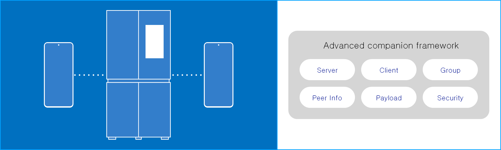
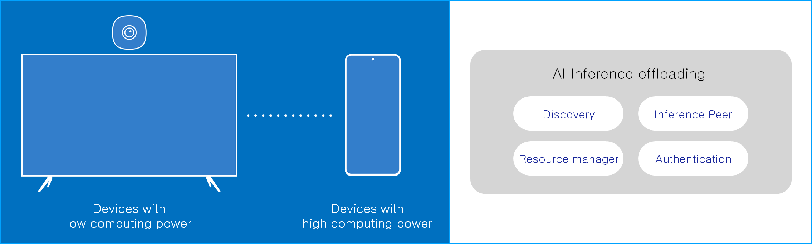
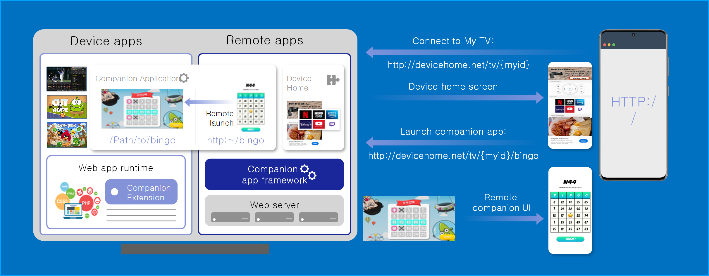
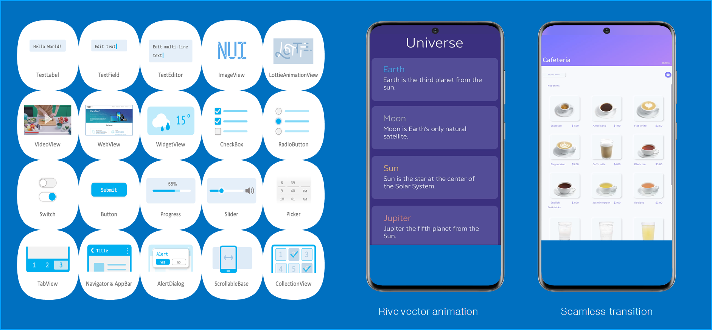
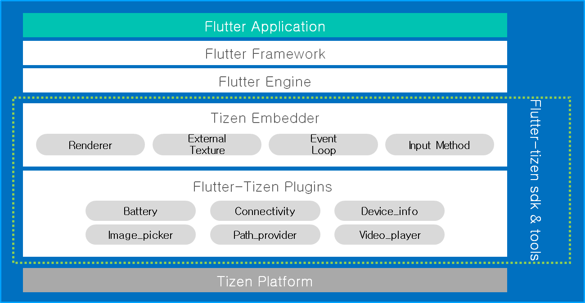
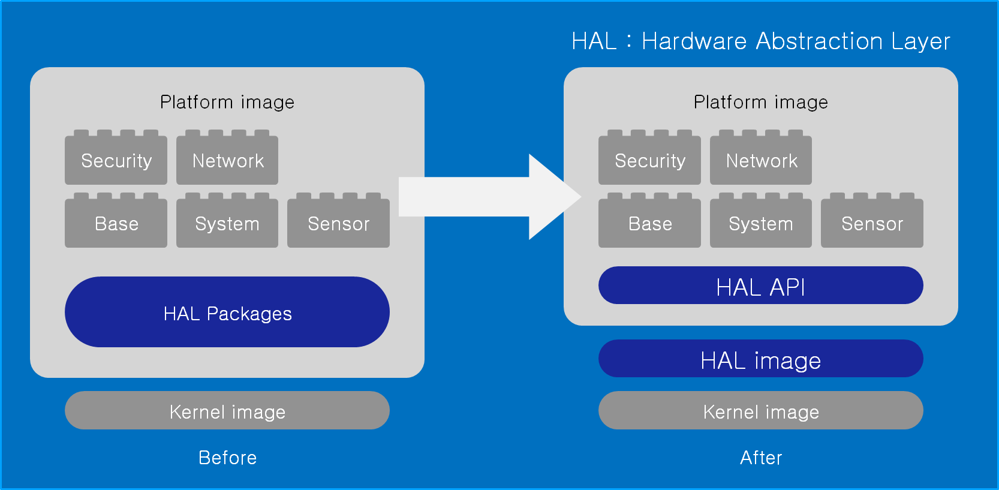
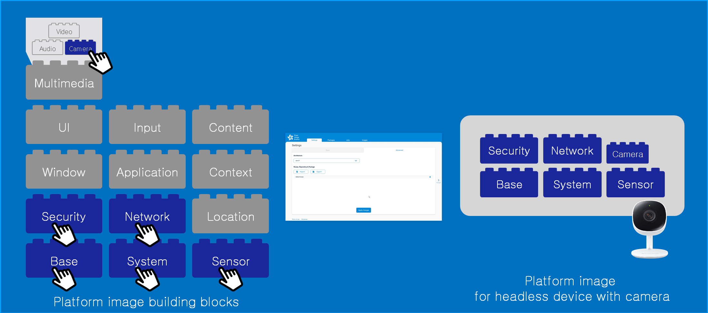

# Tizen 6.5

The second milestone (M2) release of Tizen 6.5 was announced in October 2021.
Tizen is an open-source operating system (OS) maintained by Samsung and is developed and optimized for smart devices since 2012.

Tizen 6.5 achieved to connect more devices and create intelligent services on those connected devices.
New multi-device experience frameworks are introduced in Tizen 6.5.
On top of that, Tizen app development becomes easier and more familiar by introducing new popular cross-platform framework, flutter for Tizen.
We are also enhancing previously introduced .NET and web with new updates.
We made Tizen 6.5 more flexible and adaptable to IoT devices.
With enhanced Tizen Image Creator, you can create custom Tizen image with just a few clicks.

## Multiple device experiences

- **Advanced companion framework**:

The Advanced Companion Framework facilitates multi-device application development,
providing interactive communication among devices in a local network.

It provides services to develop companion applications
  - Search & connect devices in local network
  - Share data & interact with companion applications
  - TIDL supports C, C# and Java interfaces
  - Cross platform APIs (Tizen & Android)

**Figure: Advanced Companion Framework**

- **AI Inference offloading**:

AI Inference offloading service framework enables low-end IoT devices to provide AI services
without cloud network connection.
For example, if you want to provide AI-based home training service on TV with low computing power,
you can make it happen with the help of AI Inference Offloading Framework.

It provides AI services by leveraging high-end devices in the edge network
  - Automatic discovery of optimal high-end device
  - Optimized communication protocol for exchanging inputs and results
  - Secure communication
  - Cross platform pAPIs (Tizen & Android)

**Figure: AI Inference offloading**

- **Application offloading service framework**:

Application offloading service framework remotely executes APIs and operations using in-home edge device

Application offloading Frameworks includes computation and resource offloading.

  - With computation offloading, calculation-intensive code blocks can be executed on a remote device and as a result, it achieves faster response time.
  - With resource offloading, even if your application requires a resource not available on your device. For features that require hardware support, automatically find and match device, and remotely execute required functions.

**Figure: Application offloading service framework**

- **UI Offloading service framework**:

UI Offloading service framework supports for consuming of host device’s services through the remote device web browser

It provides a way to create host application and remote application as one companion web application.
A web server is running on a host device and provides web contents to a remote device.
A remote application can be used as supplementary UIs to the host application for user convenience.

**Figure: UI Offloading service framework**

## User Interface enhancements

- **Natural User Interface**:

NUI(Natural User Interface) is the UI toolkit for building rich applications even on low-end IoT devices. It provides intuitive C# APIs, Powerful animation effect and Responsive UI. You can easily extend features and styles as you want.

  - Interactive animation & seamless transition effect
  You can add interactive animations and seamless transition effects in your NUI applications.

  - Rive vector animation : Vector animation has been enhanced. The advantage of Rive animation is it can interact with users.It also provides animation mixing and runtime customization.

  - 2D & 3D unified interface : The biggest advantage of NUI is that it is based on a 3D graphics engine, so there is no need to use external libraries or engines to display 3D.

  - UI Automation : Accessibility framework based test automation for Native & Web UI. It provides programmatic access to UI elements and manipulates the UI by means other than the standard input. You can make automated UI test scripts using the Tizen UI Automation system.

**Figure: Natural User Interface**

- **Flutter for Tizen**:

Flutter is one of the most popular cross-platform frameworks, and it can run on many OSes,
such as Android, iOS, Windows, Linux, Mac and now we introduce Flutter to Tizen by flutter-tizen.

With flutter-tizen, app developers can deploy faster, get native performance,
and easily port Flutter app from other platforms to Tizen.

We implemented Tizen embedder in order to connect Tizen platform with Flutter engine as well as plugin support for native capabilities such as battery, connectivity, video player, webview, and more.

  - Development tools support : Flutter-tizen supports Flutter developer tools for performance analysis and debugging.   It also includes hot reload, one of convenient tool for app developers,

**Figure: Flutter for Tizen**

## Full Hardware Abstraction

- **Easy version up & Easy device porting**:

The internal structure of the platform image has been improved by completely separating the hardware dependent implementation.
It offers a new, independently maintainable structure.

It is possible to upgrade only the platform part.
Conversely, when migrating to a new device, it is possible to develop only the Hal and kernel area independently.

Tizen Platform can be easily updated and ported to other devices.
This can reduce the product development cost.

**Figure: Full Hardware Abstraction**

- **Tizen image creator**:

Tizen image creator creates your own platform image with building blocks

It provides more than 450 pre-built building blocks, you can combine these blocks to build a desired platform quickly.
It is provided in a form of a Docker image, so custom image creation system can be built on your PC with very simple commands.

**Figure: Tizen image creator**

For more information, see [Tizen 6.5 M2 release note](../../release-notes/tizen-6-5-m2.md).
