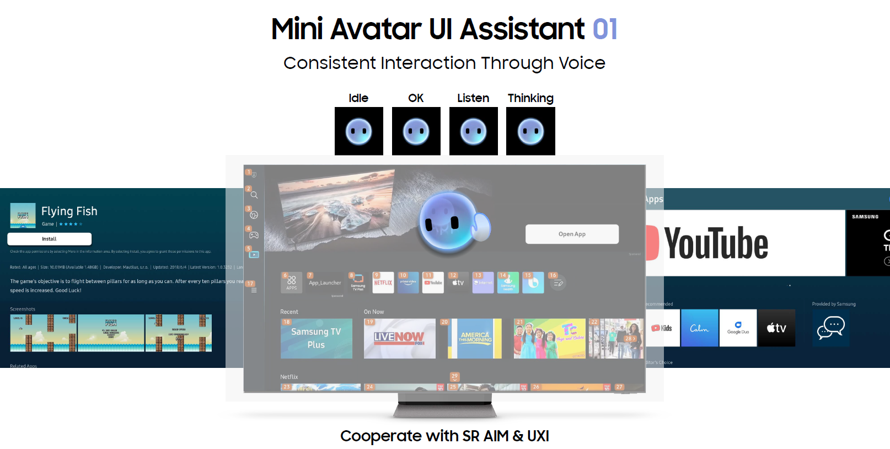
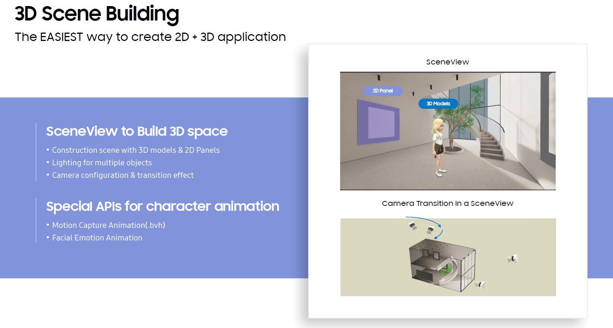
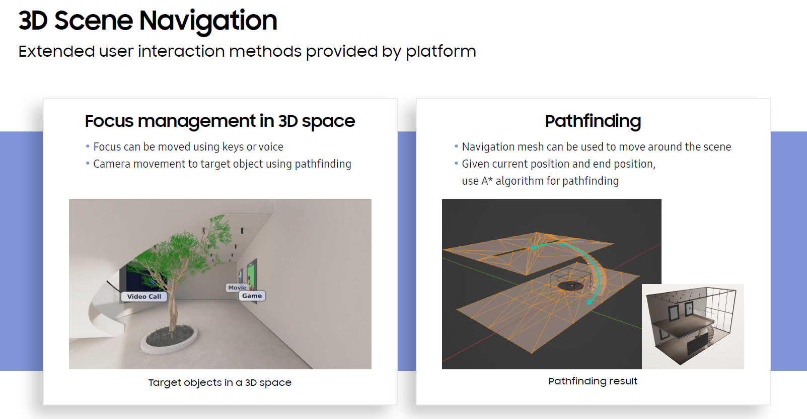
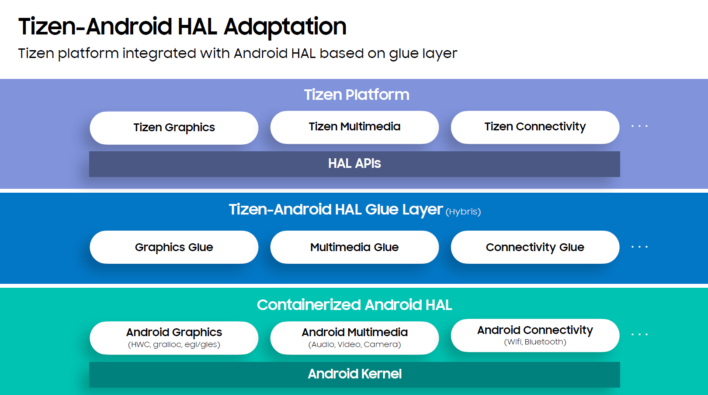
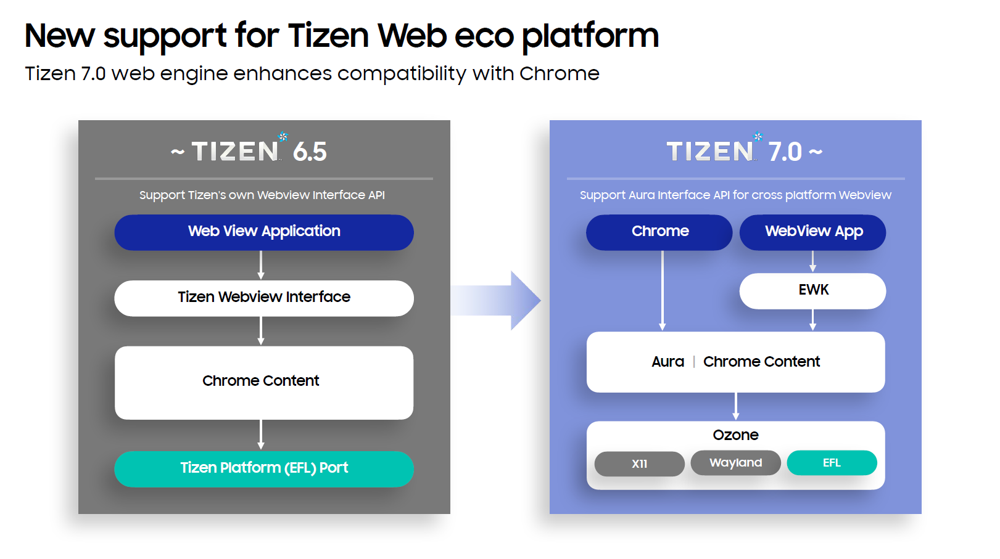
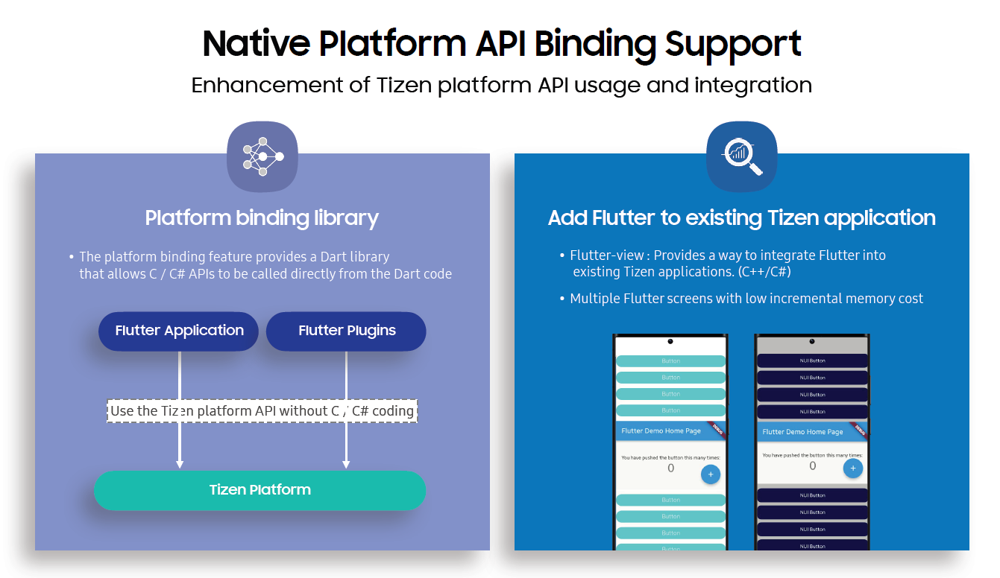
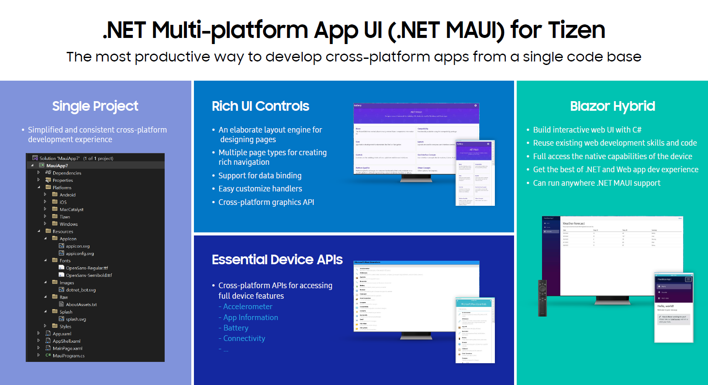
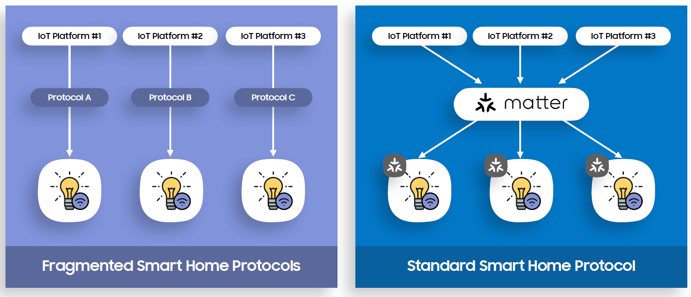

# Tizen 7.0

The second milestone (M2) release of Tizen 7.0 was announced in October 2022. 
Tizen is an open-source operating system (OS) maintained by Samsung, and it is being developed and optimized for smart devices since 2012.

The main progress of Tizen 7.0 includes work that has been done to accommodate new Tizen devices and strengthen intelligent device and service platform features. Core platform technologies are needed to prepare for our future with the Metaverse and robots.
These new enhancements include 3D rendering engine enhancement, real-time enabled kernel, and more.

## Natural user interface

- **Mini Avatar UI Assistant(Consistent Interaction Through Voice)**:

  Tizen provides UI assistance technology that allows users to control the UI through voice without additional processing in applications

  The Mini Avatar is displayed in a separate layer, and it enables more natural interaction by showing the appropriate feedback for the situation.
  It also shows automatically generated commands for all controllable UI objects, and when the user says a command, it sends events to a selected object.

  **Figure: Mini Avatar UI Assistant**

  

- **3D User Interface**:

  Tizen provides a unified rendering engine. All UI elements have depth information and they are located in a 3D space.

  As all UI elements are rendered together, we can optimize the rendering pass and minimize memory usage.

	The biggest advantage is that it reduces the complexity quite significantly for creating a 3D UI.
	This is because almost all the features used in 2D UI applications such as event handling, text input, animations, accessibility, etc., are still available in 3D

  **Figure: 3D Scene Building**

  

	**Figure: 3D Scene Navigation**

  

## Platform compatibility

- **Tizen-Android HAL Adaptation**:

  Lots of time and effort are used to develop hardware abstraction layers, so Tizen has introduced HAL APIs in Tizen 6.5.
	While we had some success with this, many SoC chipmakers only support Android. To address this issue,
	we introduced a new solution to run Tizen on Android supported SoCs by providing an adaptation bridge to Android HAL.
	
	To make Tizen run on Android HAL and Kernel, we added the open source project Libhybris and defined a new glue layer to access hardware devices through Android HAL.
  Also, to solve compatibility issues between bionic in Android and glibc in Tizen, we used separate namespaces for the Android System and HAL container.
  
  **Figure: Tizen-Android HAL Adaptation**

  

## Cross platform technology
	
> [!NOTE]
> If you are already using popular cross-platform frameworks such as Web, Flutter, or MAUI, you can deploy your services to Tizen with minimal effort.
	
- **New support for Tizen Web eco platform**:

  Web is arguably the most widely used cross-platform technology. More and more services are based on web in Tizen devices,
  so it is business critical to support up-to-date web engines. To achieve that, we had to reduce time and effort to port a new version of the open source Chromium web engine.
  A big move we took with Tizen 7.0 was re-architecting our web engine porting layer. Instead of using our thick Tizen platform port,
  we now use Chromium’s Aura window system and Ozone abstraction layer. As a result, it reduced significant porting effort, around 50% of the code was removed,
  as in LOC, which is more than 100,000 lines in total.

  **Figure: New support for Tizen Web eco platform**

  

- **Flutter Support Improvement**:

  Flutter was introduced in 2016 and has gained huge popularity among developers with more than 600,000 apps in the Google Play Store today.
  Last year, we introduced Flutter Tizen SDK at SDC 2021, and in Tizen 7.0, we continue to support more and more first party plugins such as Google Maps,
third-party plugins such as audio players, and Tizen dedicated Flutter plugins for Tizen specific feature access. Also, you can now use Google sign-in on Flutter Tizen TV apps.
  New accessibility features such as a screen reader, larger fonts, and sufficient contrast, have been added to Tizen 7.0.
  In addition, Flutter-WebRTC was introduced to capture audio/video and communicate using the popular WebRTC framework on Flutter Tizen apps.
  But we thought this was not enough to fully access the powerful features of Tizen, so we introduced native platform API bindings in Tizen 7.0.
  It provides a way to call any public Tizen native C and C# APIs from Flutter Tizen applications.

  **Figure: Native Platform API Binding Support**

  

- **.NET Multi-platform App UI (.NET MAUI) for Tizen**:

  The next advancement is the new MAUI support on Tizen. MAUI is the latest cross-platform framework by Microsoft, announced this past May. MAUI apps will be supported by Tizen 7.0.
  Based on the widely used .NET framework and Visual Studio IDE, MAUI has three key improvements over the previous version, Xamarin.
  First is single project, where MAUI provides a single project for Android, iOS, Windows, and Tizen. This makes it much simpler and cleaner than before.
  Second is the rich UI controls and easy UI customization. Third, essential device APIs are officially added to MAUI. With .NET MAUI,
  you can also take advantage of Blazor Hybrid, which provides a way to create interactive web UI with C# APIs.

  **Figure: .NET Multi-platform App UI (.NET MAUI) for Tizen**

  
  
## Tizen as IoT platform

- **Matter protocol for universal Smart Home ecosystem**:

  Matter uses thread and WiFi for data communication and Bluetooth is used for provisioning. Through Matter certification,
  Matter devices can trust each other and guarantee the correctness of behavior with other Matter devices.
  The Tizen team has actively participated in the Matter open source project and the first version of open source Matter SDK is now ready to use.
  Tizen TV already passed all the tests of the Matter specification validation event and is now ready to be Matter certified.

  **Figure: Matter**

  
  
For more information, see [Tizen 7.0 M2 Release Note](../../release-notes/tizen-7-0-m2.md).
