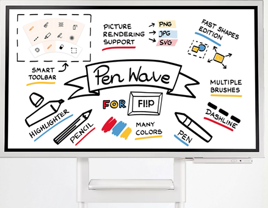
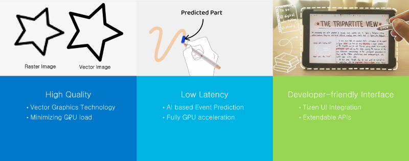
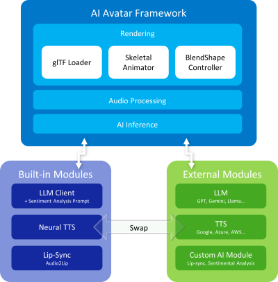
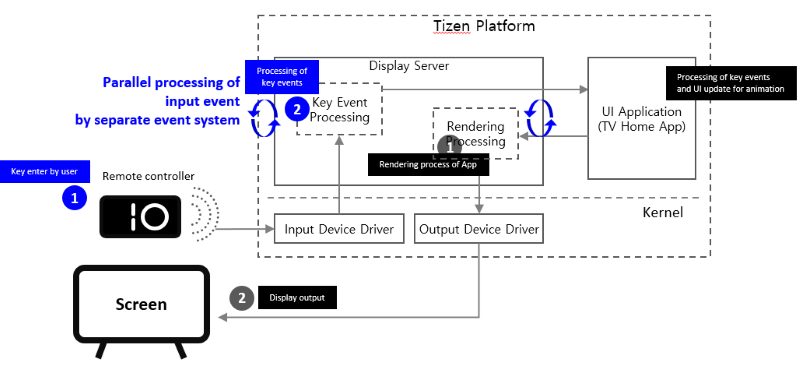
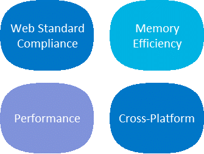

# Tizen 9.0

The second milestone (M2) release of Tizen 9.0 was announced in October 2024. Tizen is an open-source operating system (OS) maintained by Samsung, and it has been developed and optimized for smart devices since 2012. 

The key features of Tizen 9.0 are new graphics features with AI Models, improved input processing performance and Lightweight Web Engines.

## PenWave

- **Hand Drawing with PenWave**

PenWave is the new hand drawing engine added to Tizen.

The engine provides an infinite canvas, allowing users to expand their ideas without boundaries. The advanced rendering ensures every stroke is smooth and natural. Whether sketching, writing, or designing, users can freely switch between various tools to express their ideas.

**Figure: PenWave**

Here are the advantages of PenWave given below:

**Figure: Advantages of PenWave**

## AI Avatar

- **AI Avatar Framework**

Tizen offers an AI Avatar Framework that simplifies the process of creating avatar services. This framework includes a range of features to bring your avatars to life, such as 3D character rendering, multilingual TTS, and lip-sync animation. Additionally, it offers a flexible interface that allows you to replace the built-in AI solutions with external ones. This flexibility expands the capabilities of AI avatars to suit diverse environments and requirements.

**Figure: AI Avatar Framework**

Avatars provide a human-like presence that bridges the gap between users and technology. It is recommended trying out AI Avatar Framework to deliver a richer experience for users.

## Input processing performance

- **Improvement of input processing performance for Smart TVs**

In this version, Tizen’s input event handling is enhanced by more than 50%, to provide TV users with faster response times through parallel processing.

The Display Server, a platform module responsible for delivering user input device events to applications, was improved by decoupling the input event handler from the UI update and application window manager, enabling them to be processed in parallel. It has been verified that the key input processing time of the display server has improved from an average of 3.33 ms to 1.7 ms.

**Figure: Display Server Input Processing**

Furthermore, efforts were made to optimize interposes communication (IPC) for enhancing the virtual keyboard (IME) input processing performance on Smart TVs. This was achieved by optimizing the frequency of IPC calls between the virtual keyboard and the text input system module. By applying this technology, the input performance of specific text ('hello Tizen') on the TV improved by 52%, reducing the time from 5.17 seconds to 2.48 seconds.

## Lightweight Web Engines (LWE)

- **Light and efficient web engines**

Tizen’s focus is on creating web engines that are light and efficient. This ensures that services run smoothly across a wide range of Tizen devices. Currently, three web engines are developing:  LWE for web browsing, Escargot for JavaScript, and Walrus for WebAssembly. LWE integrates both Escargot and Walrus internally, combining them into a unified engine.

**Figure: Key Features of Lightweight Web Engines**

The summary of the web engines is given below:
- **LWE**
Embedded in Tizen
    - Web Standard : HTML5 / CSS3 / JavaScript
    - Tizen / Linux / Windows
    - Only 52% Memory Usage (Compared to Chrome)

- **Escargot**
[github.com/Samsung/escargot](https://github.com/Samsung/escargot)
    - Web Standard : HTML5 / CSS3 / JavaScript
    - Tizen / Linux / Windows
    - Only 52% Memory Usage (Compared to Chrome)

- **Walrus**
[github.com/Samsung/walrus](https://github.com/Samsung/walrus)
    - WebAssembly Standard : Release 1.1
    - Tizen / Linux / macOS
    - JIT Compiler
        - X86/X64/ARM/AARCH64/RISC-V
        - 5.1x Performance Improvement

For more information, see [Tizen 9.0 M2 Release Note](../../release-notes/tizen-9-0-m2.md).
