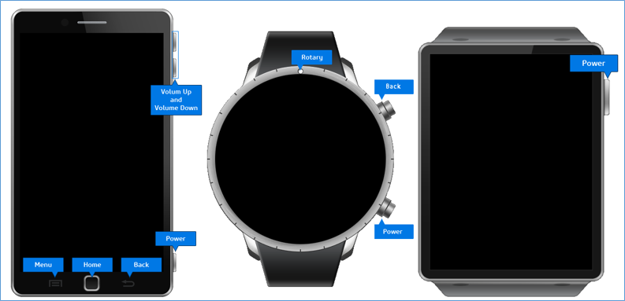
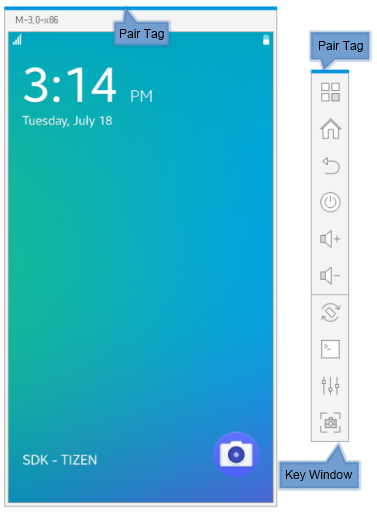
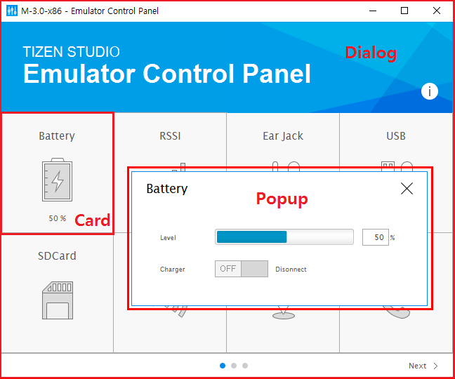
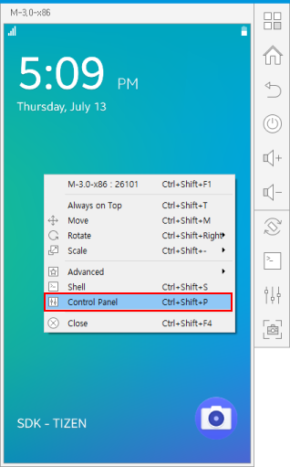
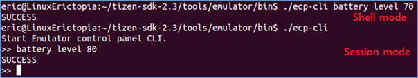

# Using Emulator Control Keys, Menu, and Panel

Before deploying your application, it is important that you test it in an environment similar to a real device.

You can run the application in the emulator, and test a variety of user scenarios, such as network access, audio input and output, and text messages. With a mouse and keyboard, you can control the application in the emulator exactly like on an actual device.

While the application is running, you can use the Emulator Control Panel to simulate events for a variety of system options that the actual device provides. For example, by manipulating the virtual battery, you can simulate the application in different charge environments.

The emulator controls consist of internal and external parts:

- The **HOME**, **Volume control** and **Back** buttons, for example, are external parts controlling the device from the outside.

  In the emulator, the external parts are called the **emulator control keys and menu**.

- Battery level and screen brightness, for example, are internal parts controlling the device from the inside. In the emulator, the internal parts are called the **Emulator Control Panel**.

## Using the Control Keys and Context Menu

The control keys are visible on the emulator when you start it. To access the context menu, right-click the emulator.

**Figure: Emulator control keys**

The emulator can use a general purpose or profile-specific skin. While the profile-specific skin provides a realistic skin and hardware keys, the general purpose skin shows a consistent frame on every state of resolution, scale, or rotation, and enables you to change the emulator display resolution to custom values. You can also see the key window.

> **Note**  
> The layout of the general purpose skin is not configurable like the profile-specific skin.

- Key window

  The key window consists of virtual hardware keys, which are embedded in profile-specific skins. You can use it as a remote controller of its main emulator window. You can move it to any position separate from the main window, or dock it to the right side of the main window. If it is docked with the main window, both windows can be moved together on the screen.

  You can make the key window appear or disappear through the context menu or a [shortcut key](keyboard-shortcuts.md#emulator).

- Pair tag

  The color of the pair tag indicates which main window is paired with which key window. The color changes every time the emulator boots.

The following figure illustrates the general purpose skin emulator.

**Figure: General purpose skin emulator**

> **Note**  
> You can create a custom resolution emulator by using the [Emulator Manager CLI](emulator-manager.md#control), and launch it with the general purpose skin. It is not guaranteed that all applications are correctly shown in the custom resolution.

### Control Keys

The following hardware keys are available on the emulator:

- **Back**

  When tapped, the emulator returns to the previous screen.

- **Power**

  You can power off the display by tapping the **Power** key in most situations. Sometimes, the display does not power off when you tap the **Power** key. This is to guarantee the operation of a current application, such as the Stopwatch in the Clock application. If you tap the **Power** or **Home** key again, the display is powered on.

### Context Menu

You can access the context menu by right-clicking on the emulator. In the menu, you can select:

- Emulator name (the top row in the menu)

  The **Detailed Info** window is displayed, showing the **Shortcut Info** and **VM Info** tabs. The **Shortcut Info** tab lists the [emulator keyboard shortcuts](keyboard-shortcuts.md#emulator) and the **VM Info** tab defines the virtual machine details.

  In macOS: To use the emulator keyboard shortcuts, open the Keyboard Setting dialog and switch your macOS function keys option to work as standard function keys.

  **Table: VM Info**

  | Feature                    | Description                              |
  |----------------------------|------------------------------------------|
  | **VM Name**                | VM name                                  |
  | **Skin Name**              | Skin name                                |
  | **CPU Arch**               | CPU architecture                         |
  | **RAM Size**               | RAM size (in MB)                         |
  | **Display**                | Target display resolution (in DPI; Dots Per Inch) |
  | **Network Connection**     | NAT (Network Address Translation) or Bridged |
  | **CPU Virtualization**     | Whether hardware virtualization is supported |
  | **GPU Virtualization**     | Whether GPU virtualization is supported  |
  | **Platform Image Version** | Version of the used platform image       |
  | **Platform Image File**    | Location of the used platform image      |
  | **Directory Sharing**      | Whether host directory sharing is used   |
  | **File Shared Path**       | Path to the shared host directory        |
  | **Kernel Log File**        | Kernel log file path                     |
  | **Emulator Log File**      | Emulator (Qemu) log file path            |
  | **Emulator Version**       | Tizen Studio version                     |

- **Always On Top**

  Select this option to keep the emulator window on top of other windows.

- **Rotate**

  Select either **Portrait**, **Landscape**, **Reverse Portrait**, or **Reverse Landscape** as the orientation of the emulator.

- **Advanced > Controller**

  Show or hide the controller window.

  > **Note**  
  > The **Controller** menu is not supported in the profile-specific skin.

- **Advanced > Screenshot**

  Capture a screenshot of the emulator.

- **Advanced > About**

  Display the emulator version and build time.

- **Advanced > Force Reboot**

  Force the emulator to reboot. Since force rebooting the emulator can cause problems, use the reboot option from the SDB shell to reboot the emulator. Use **Force Reboot** only when absolutely necessary.

- **Advanced > Force Close**

  Force the emulator to exit. Since force stopping the emulator can cause problems, use the **Close** option to exit the emulator. Use **Force Close** only when absolutely necessary.

- **Shell**

  Open a Smart Development Bridge (SDB) shell command window.

- **Control Panel**

  Control or monitor the state of the emulator dynamically.

- **Close**

  Exit the emulator.

> **Note**  
> In Ubuntu, you must change a global GNOME setting to view the menu icons:
>
> 1. In the command console, execute the `gconf-editor` command.
> 2. In the tree, navigate to `desktop > gnome > interface`.
> 3. Enable the `menus_have_icons` option.

## Using the Control Panel

With the Emulator Control Panel, you can simulate system events and perform related tasks.

The control panel consists of 3 layers:

- **Dialog** is the main Emulator Control Panel window, which shows a list of testable device cards.
- **Card** represents a peripheral device or system option, and shows the respective device or option status. By clicking a card, you can simulate an event directly or open a **Popup** to do it.
- **Popup** displays testable events for a peripheral device.

**Figure: Emulator Control Panel**

To open the control panel:

1. Launch the emulator.
2. Right-click the emulator and select **Control Panel**.  
   

The instructions for using the features are described below. You can use various [keyboard shortcuts](keyboard-shortcuts.md#ecp) for control panel tasks.

### Controlling the Network Setting

In the **Network** card, you can control the user network.

To lose the network connection, set the **Link Status** switch off. To forward a remote or local port to an inside port of the emulator, enter values in the text boxes, and click **Apply**.

### Mounting a Host Directory

In the **HDS** card, you can configure host directory sharing (HDS) to share resources and transfer files without using the SDB utility. The specified host directory is mounted to `/mnt/host`.

## Controlling the Control Panel from the Command Line

You can control and monitor the Tizen Emulator by using the Emulator Control Panel CLI instead of the control panel UI tool. The CLI supports all the functionalities of the UI. The CLI binary is located in:

- Ubuntu:

  `<TIZEN_STUDIO>/tools/emulator/bin/ecp-cli`

- Windows&reg;:

  `<TIZEN_STUDIO>\tools\emulator\bin\ecp-cli.bat`

You can use the CLI in a session mode or shell mode:

- Session mode

  You can access this mode by running the binary without any parameters. The mode keeps a session until it is exited. You can exit by entering the `exit` command.

- Shell mode

  This mode is used for one-time message handling.

**Figure: Session and shell modes**

In Ubuntu, the bash-based auto-completion is activated with the **TAB** key.

The following table lists the commands supported by the control panel CLI.

**Table: CLI common commands**
<table>
	<thead>
		<tr>
			<th>Command</th>
			<th>Syntax</th>
			<th>Description</th>
		</tr>
	</thead>
	<tbody>
		<tr>
			<td><code>help</code></td>
			<td><code>help [device]</code></td>
			<td>To get help, type the command as <code>help</code>. For a more specific device help, use the device parameter.</td>
		</tr>
		<tr>
			<td><code>keycode</code></td>
			<td><code>keycode <key-code> [period|press|release]</code></td>
			<td>To enter a key code:
			<ul>
				<li><code>114</code>: Volume down</li>
				<li><code>115</code>: Volume up</li>
				<li><code>139</code>: Home</li>
				<li><code>158</code>: Back</li>
				<li><code>169</code>: Menu</li>
			</ul>
			</td>
		</tr>
		<tr>
			<td><code>hmp</code></td>
			<td><code>hmp &lt;hmp command&gt;</code></td>
			<td>Access the QEMU human monitor protocol commands. For a list of provided commands, enter the <code>ecp-cli hmp help</code> command.</td>
		</tr>
		<tr>
			<td><code>qmp</code></td>
			<td><code>qmp &lt;qmp command&gt;</code></td>
			<td>Access the QEMU monitoring protocol. The commands are handled in JSON format, and do not require <code>{"execute": "qmp_capabilities"}</code> to be in the control mode.
			
In the shell mode, the shell does not support the double quotation mark (") as an argument. For the JSON arguments, use \" (backslash + double quotation mark) instead.

			</td>
		</tr>
		<tr>
			<td rowspan="3"><code>hds</code></td>
			<td><code>hds mount &lt;host path&gt; &lt;guest path&gt;</code></td>
			<td>Enable the host directory sharing feature between the specified <code>&lt;host path&gt;</code> and the emulator's <code>&lt;guest path&gt;</code>. The specified path must be a folder, not a file.</td>
		</tr>
		<tr>
			<td><code>hds unmount <id></code></td>
			<td>Unmount the mounted host directory sharing path. The <code>id</code> is the HDS ID and you can get it from the <code>hds status</code> command.</td>
		</tr>
		<tr>
			<td><code>hds status</code></td>
			<td>Show the current host directory sharing status.</td>
		</tr>
	</tbody>
</table>

## Related Information
* Dependencies
  - Tizen Studio 1.0 and Higher
