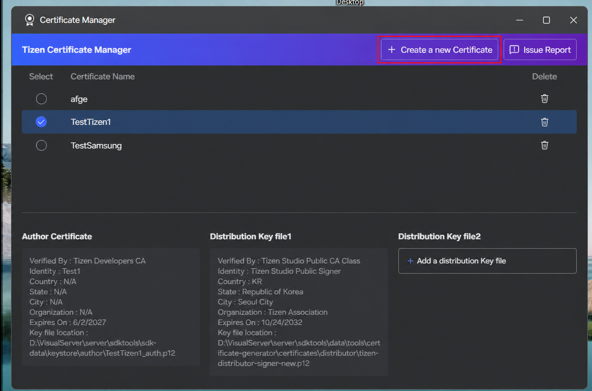
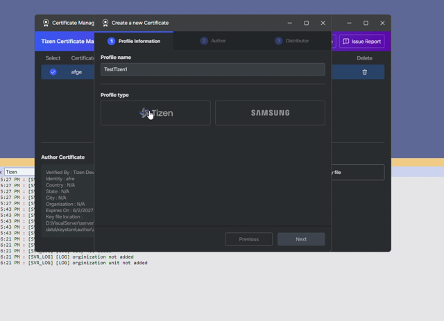
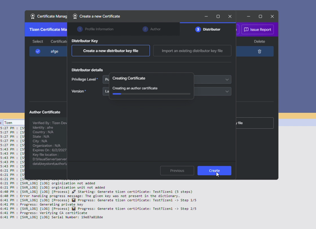

# Creating Certificates

A certificate profile contains an author certificate and a distributor certificate.

## Opening Certificate Manager

In the **Tizen** panel, under **Baseline Tools**, select **Certificate Manager**. You can also select **Certificate** under **Active Targets**.

## Create a Certificate Profile

1. Select **Create a new Certificate**.

   

2. Enter a profile name and choose either **Tizen** or **Samsung** as the certificate type.

   

3. Enter the author information, such as your name and organization.

   

4. For the distributor certificate, use the default Tizen distributor certificate or provide your own.

   

5. Confirm and save the profile.

   

The video below shows how to create a Tizen certificate profile:

<video controls height="400">
  <source src="media/create_tizen_certificate.mp4" type="video/mp4">
</video>

The video below shows how to create a Samsung certificate profile:

<video controls height="400">
  <source src="media/create_samsung_certificate.mp4" type="video/mp4">
</video>
