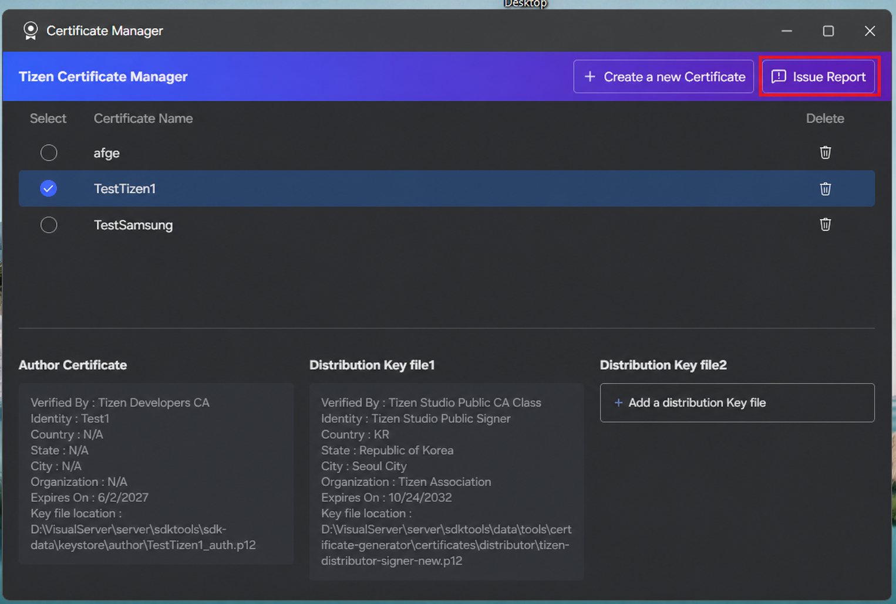

# Managing Certificate Profiles

Open Certificate Manager from **Tizen > Baseline Tools > Certificate Manager**.

## Manage Profiles

Select a profile to show its author, distributor, and expiration details in the lower panel.

Select a profile's radio button to make it active. The active profile is used for application packaging. Use the trash icon to delete a profile.

Keep certificate files and their passwords secure. Do not commit them to a source repository.

## Report an Issue

Select **Issue Report** in the upper-right corner of Certificate Manager to open the GitHub issues page and report an issue.

