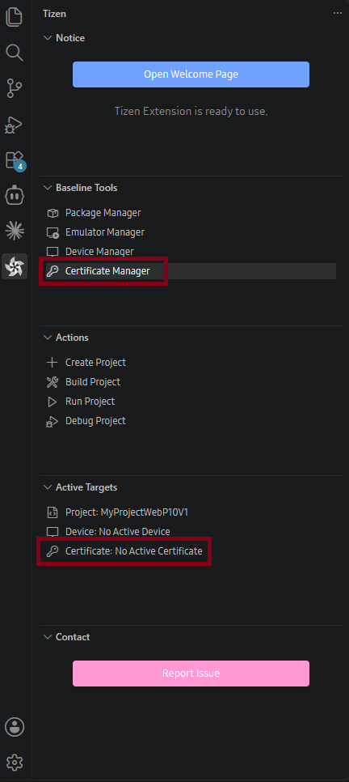

# Certificate Manager

Every Tizen application must be signed before deployment or Store submission. A certificate profile contains an author certificate that identifies the developer and one or more distributor certificates that authorize distribution.

## Opening Certificate Manager

You can open Certificate Manager in either of these ways:

- In the **Tizen** panel, under **Active Targets**, select **Certificate**.
- In the **Tizen** panel, under **Baseline Tools**, select **Certificate Manager**.

The default view of certificate manager is shown below:

Use Certificate Manager to [create a certificate profile](cert-create-profile.md) or [manage certificate profiles](cert-manage-profile.md).

Use a default certificate only for quick emulator testing. It is not valid for Store submission. Keep certificate files and their passwords secure; do not commit them to a source repository.
