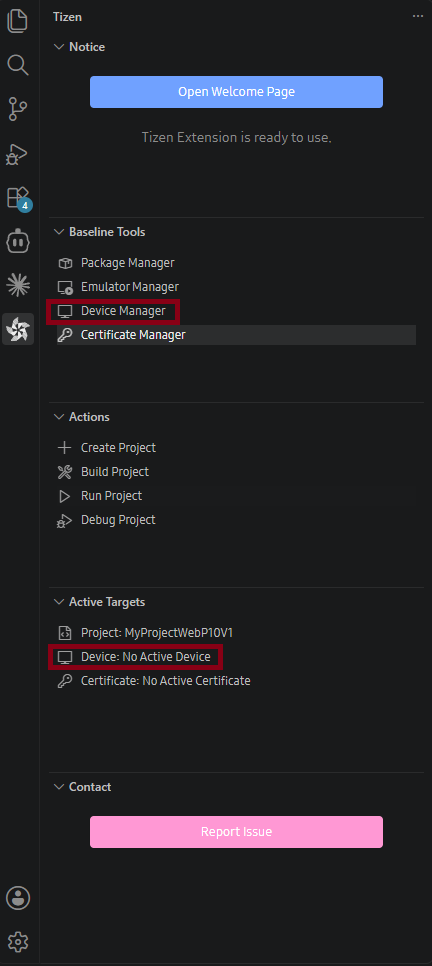
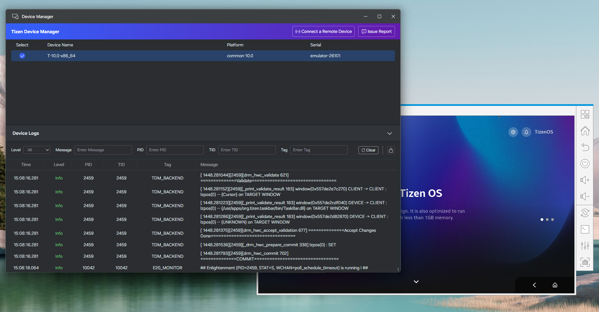
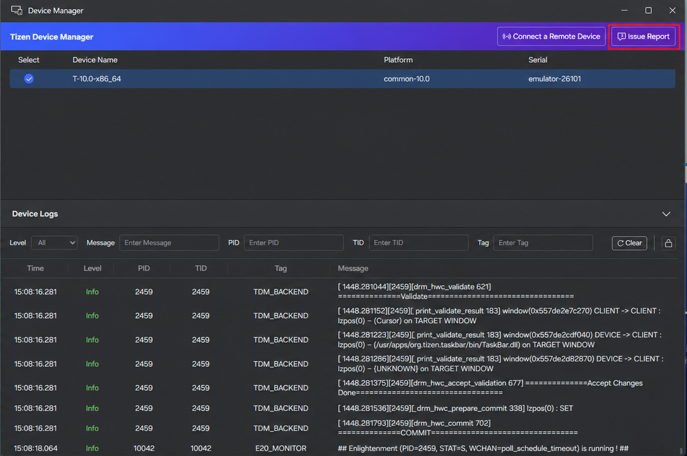

# Device Manager

Tizen Device Manager provides a unified view of connected devices and emulators, remote-device connections, and real-time platform and application logs.

## Opening Device Manager

You can open Device Manager in either of these ways:

- In the **Tizen** panel, under **Active Targets**, select **Device**.
- In the **Tizen** panel, under **Baseline Tools**, select **Device Manager**.

The upper **Connection Explorer** shows devices and emulators; the lower **Log View** shows their logs.

## Connection Explorer

Each connected target shows a selection control, device name, platform version, and serial number. Select a target to make it active for operations and deployment.

## Connect a Remote Device

1. In Device Manager, select **Connect a Remote Device** to open **Remote Device Manager**.
2. Select **Add Devices**.
3. Enter a device name, IP address, and port. The default SDB port is `26101`.
4. Select **Add**, then select **Connect**.

Use **Scan Device** to discover devices available on the local network. The Remote Device Manager also lets you connect, disconnect, edit, and delete saved devices.

## Log View

The Log View displays the time, level, PID, TID, tag, and message for each log event. It supports filtering by log level, keyword searches across messages, PIDs, TIDs, and tags, scroll lock, and clearing the current buffer.

To emit logs from a .NET application, use the methods in the [Tizen.Log](https://developer.tizen.org/dev-guide/csapi/api/Tizen.Log.html) class.

## Report an Issue

Select **Issue Report** in the upper-right corner of Device Manager to open the GitHub issues page and report an issue.

