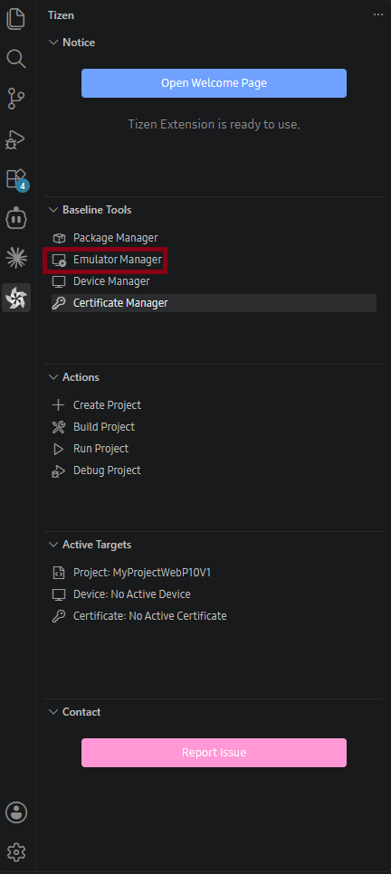
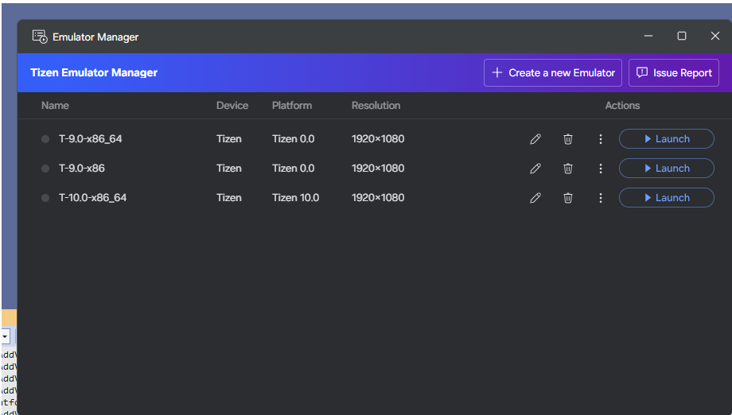
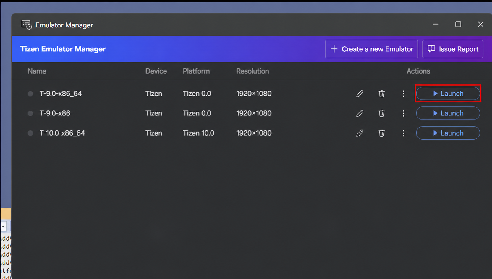

# Emulator Manager

Use Emulator Manager to create, launch, and manage Tizen emulator instances for a virtual test environment.

## Opening Emulator Manager

In the **Tizen** panel, under **Baseline Tools**, select **Emulator Manager**.

The emulator list shows each emulator's name, device type, platform version, resolution, and actions to edit, delete, launch, export, or factory-reset it.

## Install Emulator Images

Install a platform image before creating an emulator:

1. Select **Create a new Emulator**.
2. In **Select a Platform Image**, select **Download** if the required image is not listed.
3. Download the image, then continue creating the emulator.

For a custom system image, select **Import** in the **Select a Platform Image** dialog and provide its platform name, base platform, image format, and `.qcow2` or raw image file.

## Create an Emulator

1. Select **Create a new Emulator**.
2. Select a platform image. If the required image is unavailable, select **Download**. To use a custom image, select **Import** and provide a `.qcow2` or raw image.

   

3. Select a device template, such as HD1080 (1920x1080) or HD720 (1280x720).

   

4. Review the emulator properties, including its name, RAM, and CPU cores, and select **Finish**.

   

The video below shows how to create a new emulator:

<video controls height="400">
  <source src="media/create_new_emulator.mp4" type="video/mp4">
</video>

To create a custom template, select **Add Template**. Define its name, display resolution, screen size, skin file, and supported hardware features, then select **Save**.

## Launch and Manage Emulators

Select an emulator and choose **Launch**. A green status indicator identifies a running emulator. Wait for the emulator home screen to appear before deploying or debugging an application.

Use the pencil icon to edit an emulator and the trash icon to delete it. Right-click an emulator to **Reset** it or **Export As** a platform image. Only custom platforms and templates can be modified or deleted.

For hardware and virtualization requirements, see [Emulator requirements](../../baseline-sdk/setup/prerequisites.md#emulator).

## Report an Issue

Select **Issue Report** in the upper-right corner of Emulator Manager to open the GitHub issues page and report an issue.

