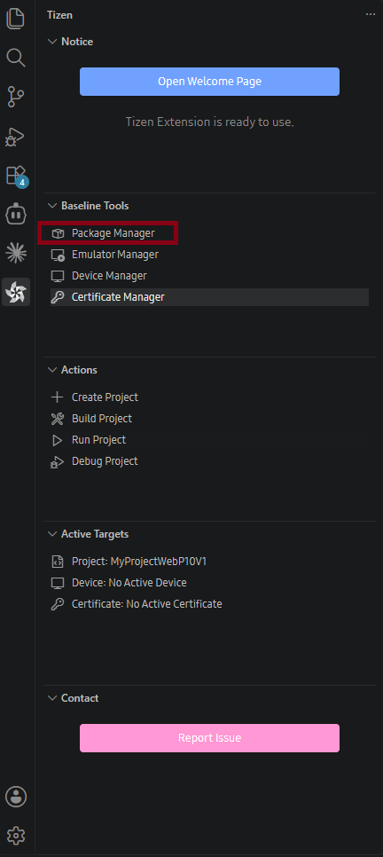

# Manage SDK packages

Use Package Manager to install, update, and remove Tizen platform packages, SDK components, extensions, and emulator images.

## Opening Package Manager

In the **Tizen** panel, under **Baseline Tools**, select **Package Manager**.

## Install or Update Packages

The **Installed Packages** tab lists installed packages by category and shows their versions. Expand a category to review its packages. When updates are available, select **Update** in the summary bar to install them.

## Install a Platform Version

Use **Advanced SDK Installation** to add or remove an entire Tizen platform version:

1. Select **Advanced SDK Installation**.
2. Select **Install** next to the platform version that you need.
3. To remove an installed version, select **Uninstall**.

The available versions include Tizen 10.0, 9.0, 8.0, 7.0, 6.5, 6.0, and TV extensions. Install the platform version and profile required by the application and target device.

## Configure Package Repositories

1. Select the **Repository** (gear) button in Package Manager.
2. Configure the Tizen repository for official SDK packages and the TV repository for TV extension packages or local ZIP files.
3. Select **Apply** after changing a repository URL.

## Report an Issue

Select **Issue Report** in the upper-right corner of Package Manager to open the GitHub issues page and report an issue.

