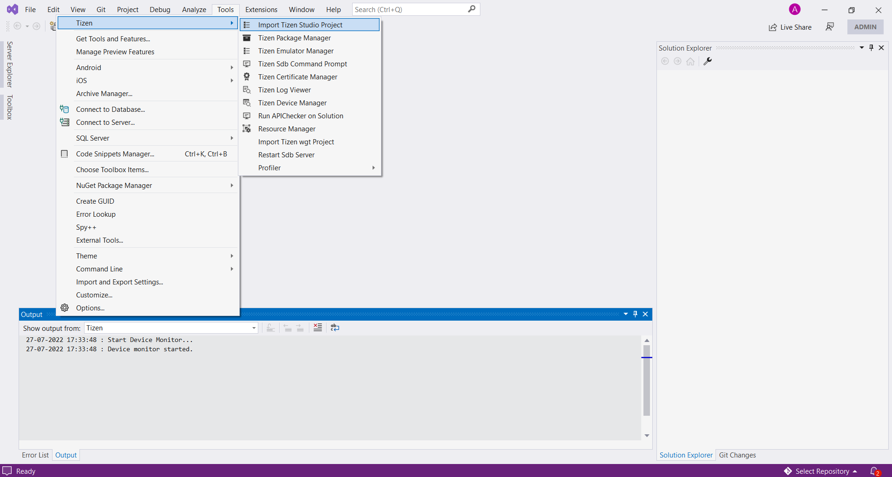
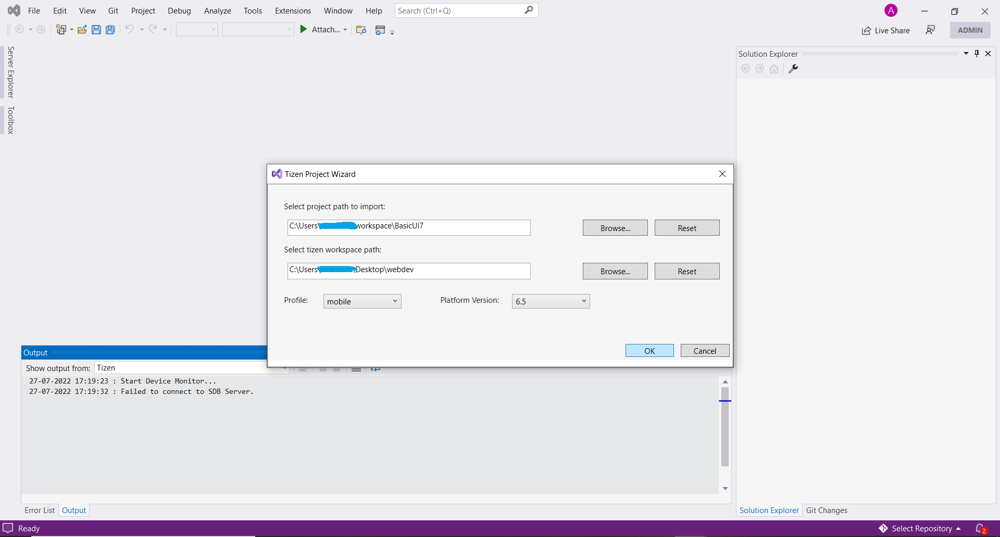
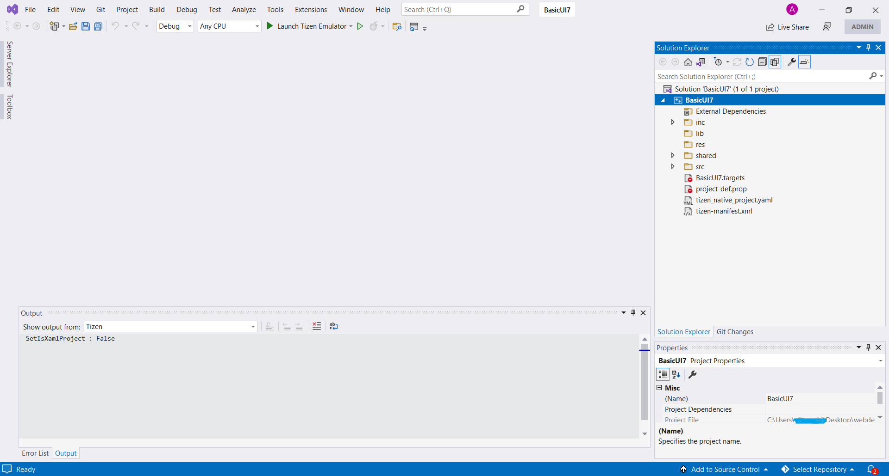

# Importing Legacy Projects

> [!IMPORTANT]
> **Tizen Studio is deprecated and no longer supported.** Do not use it for new development. This page only covers migrating existing Tizen Studio projects into Visual Studio.

The following sections explain how to use Visual Studio Tools for Tizen to import legacy projects that were created in Tizen Studio, the retired Eclipse-based IDE, into Visual Studio.

> [!NOTE]
> Ensure that the legacy Tizen Studio project was exported to CLI before importing it to Visual Studio.

1. Go to **Tools** Menu in Visual Studio, select **Tizen > Import Tizen Studio Project** from the dropdown menu. The menu item name is a legacy product UI string that refers to importing legacy Tizen Studio projects. **Tizen Project Wizard** will open.
   

2. In Wizard, browse and select the path of project to be imported.
   

3. Browse and select the path where the new workspace will be created.

4. Select the platform type (TV) and version of the project to be imported, then click **OK**.

5. The Visual Studio window with newly imported project appears on the Solution Explorer.

   
