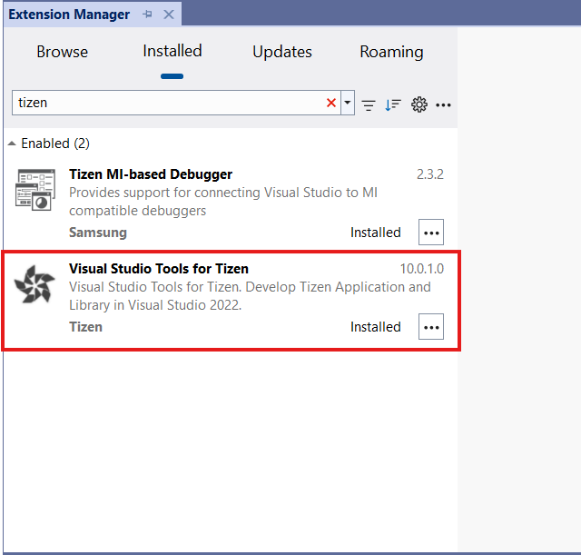
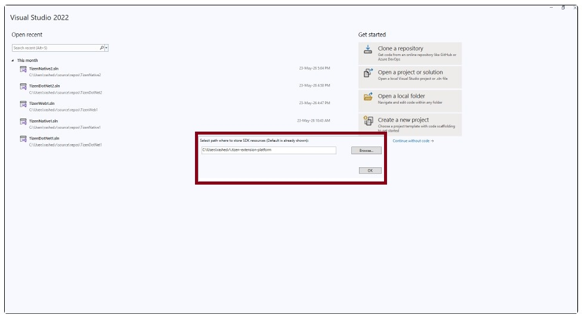
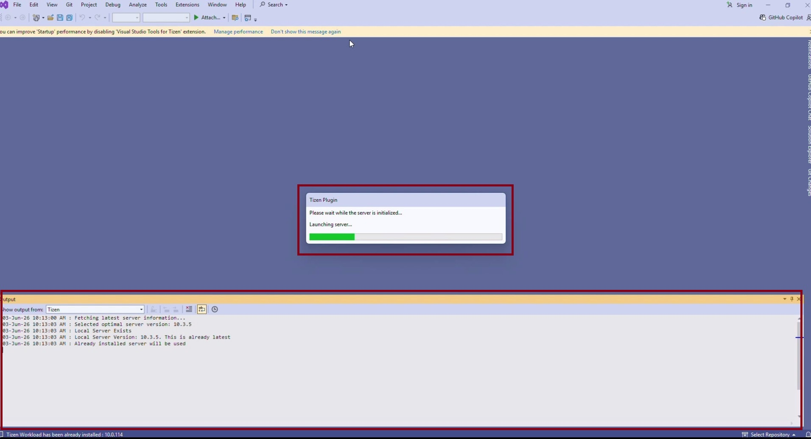

# Install the Extension
Visual Studio Tools for Tizen extension is registered in the Visual Studio Marketplace. You can install extensions from the Visual Studio Marketplace in the Visual Studio IDE:

1. In the Visual Studio IDE menu, go to **Extensions &gt; Manage Extensions**.
2. In the Visual Studio Marketplace, search for **Tizen**.

   

3. Click **Download** and close the Visual Studio IDE to complete the installation.

   The installation starts.

The video below shows how Visual Studio Tools for Tizen is installed in windows:

<video controls height="400">
  <source src="media/vstools-installation.mp4" type=video/mp4>
</video>

## Initial Setup
## Setting the SDK Resource Path
On first launch after installing the extension, you are prompted to set the SDK resource path, the directory where Tizen SDK packages and tools are stored.

- Default path: C:\Users\<username>\.tizen-extension-platform
- To use a custom location, click Browse..., select your preferred folder, then click OK.

## Wait for Core Apps installation
After you set the SDK resource path, the server and core apps are installed. Wait for this setup to complete before using **Tools > Tizen**.

The video below shows how to complete the initial setup in Windows:

<video controls height="400">
  <source src="media/vstools-init.mp4" type="video/mp4">
</video>
