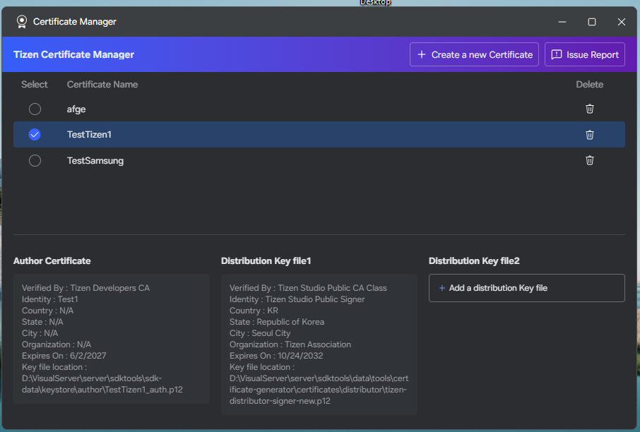
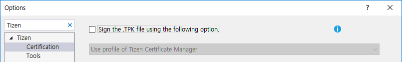
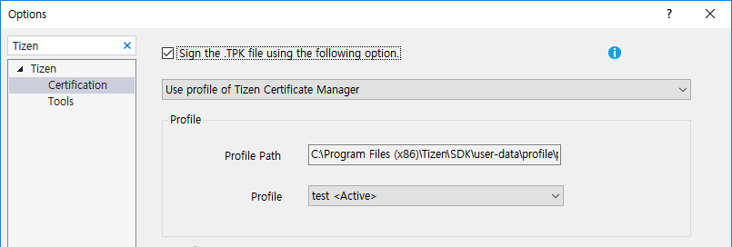
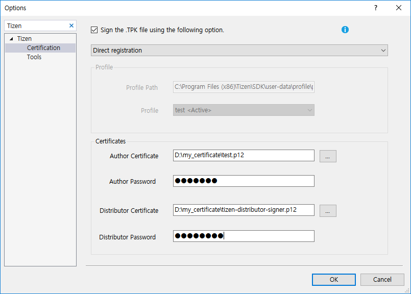
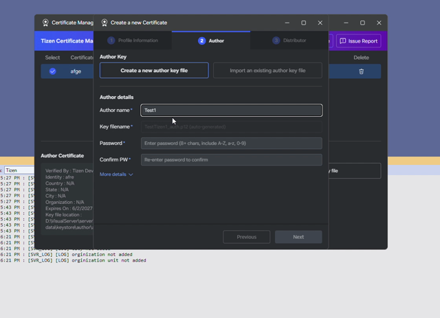
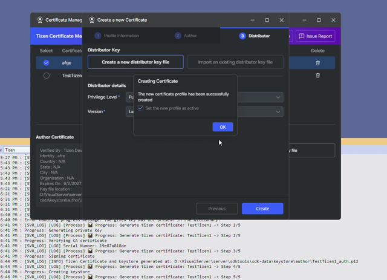
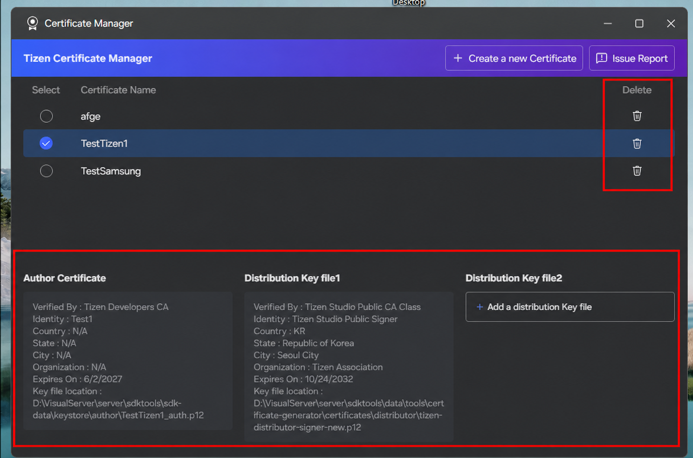

# Certificate Manager

Every Tizen application must be signed before deployment or Store submission. A certificate profile contains an author certificate that identifies the developer and one or more distributor certificates that authorize distribution.

Open Certificate Manager from **Tools > Tizen > Tizen Certificate Manager**.

## Selecting the Certificates

To select the certificates used to package your application:

1. In the Visual Studio menu, go to **Tools > Options > Tizen > Certification**.
2. Define the certificates in one of the following ways:
   - **Using the default certificates**

     If you do not need to upload your application to the store, you can use a default certificate and deploy your application in the Tizen Emulator for testing purposes.

     To use the default certificates, uncheck the **Sign the .TPK file using the following option.** checkbox.

     

   - **Using an existing certificate profile**

     If you have used Tizen Studio before and have already generated a certificate profile using the Tizen Certificate Manager, you can import the profile by selecting **Use profile of Tizen Certificate Manager** from the drop-down list.

     If you want to create a new certificate profile, see [Create a certificate profile](#create-a-certificate-profile).

     

   - **Using your own certificates**

     If you already have author and distributor certificates from another application store, you can import them by selecting **Direct registration** from the drop-down list and entering the required information.

     

3. Select **OK**.

## Create a Certificate Profile

1. Select **Create a new Certificate**.

   

2. Enter a profile name and choose either **Tizen** or **Samsung** as the certificate type.

   

3. Enter the author information, such as your name and organization.

   

4. For the distributor certificate, use the default Tizen distributor certificate or provide your own.

   

5. Confirm and save the profile.

   

The video below shows how to create a Tizen certificate profile:

<video controls height="400">
  <source src="media/create_tizen_certificate.mp4" type="video/mp4">
</video>

The video below shows how to create a Samsung certificate profile:

<video controls height="400">
  <source src="media/create_samsung_certificate.mp4" type="video/mp4">
</video>

Use a default certificate only for quick emulator testing. It is not valid for Store submission. You can also use an existing Certificate Manager profile or import custom author and distributor certificates.

## Manage Profiles

Select a profile to show author, distributor, and expiration details in the lower panel. Select its radio button to make it active; the active profile is used for packaging and is synchronized with **Tools > Options > Tizen > Certification**. Use the trash icon to delete a profile.

The following image highlights the trash controls and the certificate-details section for the selected profile.

Keep certificate files and their passwords secure. Do not commit them to a source repository.

## Issue Report

Select **Issue Report** in the upper-right corner of Certificate Manager to open the GitHub issues page and report an issue.

