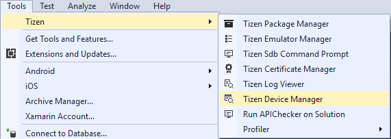
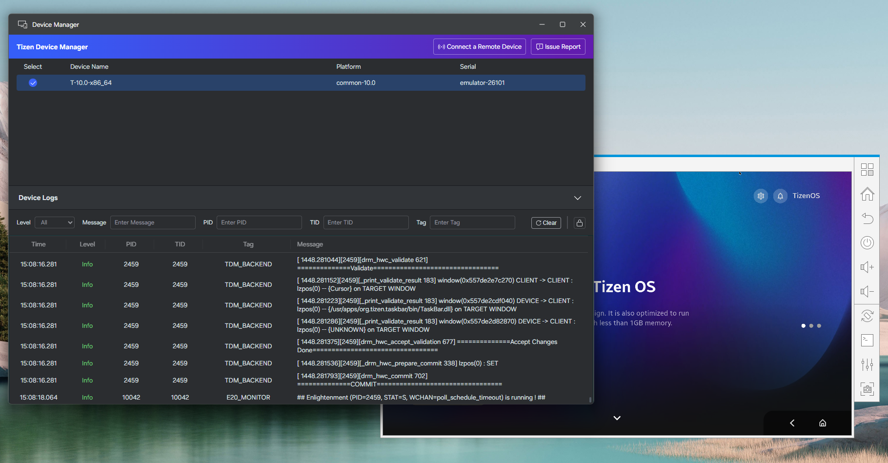
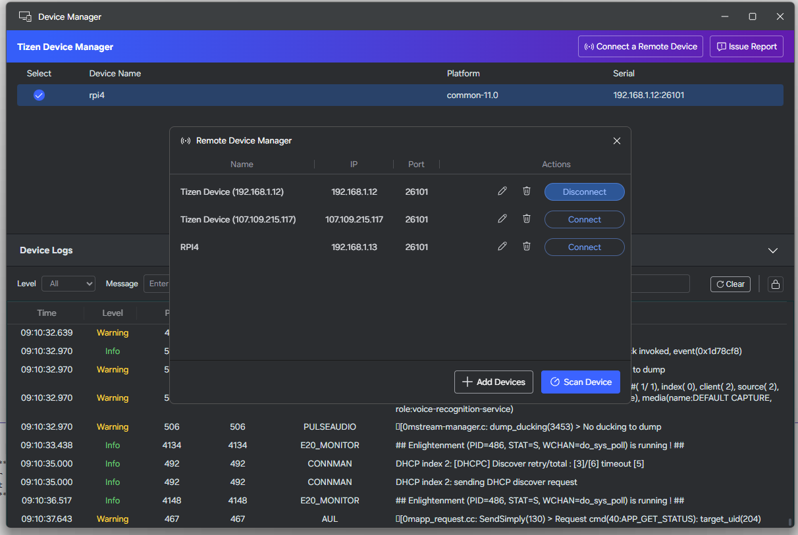
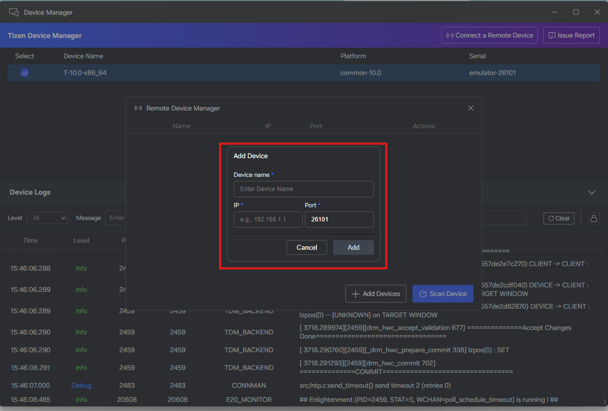
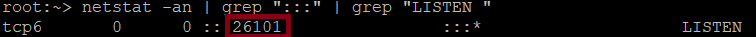
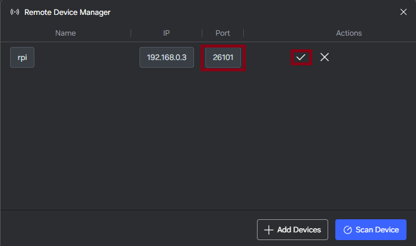
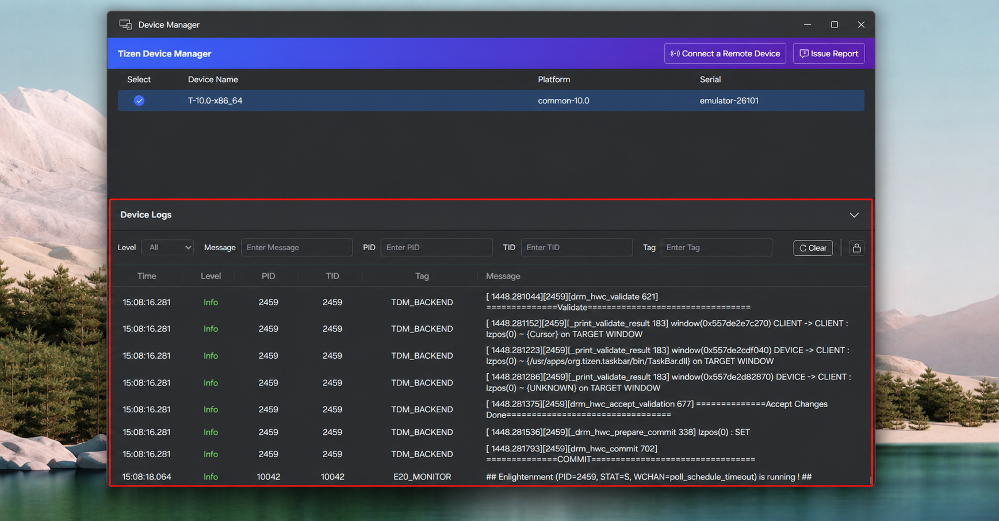
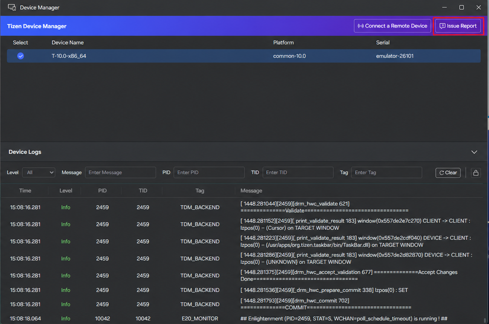

# Device Manager

Tizen Device Manager provides a unified view of connected devices and emulators, remote-device connections, and real-time platform and application logs.

## Launching the Device Manager

You can launch the Tizen Device Manager from the Visual Studio menu:

- Select **Tools > Tizen > Tizen Device Manager**.

  

The upper **Connection Explorer** shows devices and emulators; the lower **Log View** shows their logs.



## Connection Explorer

Each connected target shows a selection control, device name, platform version, and serial number. Select a target to make it active for operations and deployment.

## Connect a Remote Device

1. In Device Manager, select **Connect a Remote Device** to open **Remote Device Manager**.

   

2. Select **Add Devices**.
3. Enter a device name, IP address, and port. The default SDB port is `26101`.

   

4. Select **Add**, then select **Connect**.

The video below shows how to connect a remote device:

<video controls height="400">
  <source src="media/remote_devices_feature.mp4" type="video/mp4">
</video>

Use **Scan Device** to discover devices available on the local network. The Remote Device Manager also lets you connect, disconnect, edit, and delete saved devices.

### Troubleshooting Remote Connection Issues

When connecting a remote device, you may encounter error messages. This section explains common issues and how to resolve them.

#### Prerequisites

Before connecting a remote device, ensure the following:

- **Developer Mode is enabled** on the device
- **Remote Debugging is enabled** on the device
- The host PC and device are on the same network
- A valid network connection exists between the host PC and device
- For detailed SDB configuration and troubleshooting, refer to the [Smart Development Bridge (SDB) documentation](../../baseline-sdk/common-tools/smart-development-bridge.md)

#### Non-Standard Port Warning

**When you see this message:** "This remote device is running on a non-standard port."

**What it means:** The remote device is using a port other than the default SDB port **26101**.

**How to resolve:**

1. Verify the actual port number used by the device. On the device, run the following command and read the port number from the `:::<port>` line:

   ```
   netstat -an | grep ":::" | grep "LISTEN "
   ```

   

2. In the **Remote Device Manager** popup window, click the **Edit** icon for the device and modify the port to match the correct port number.

   

3. Ports other than 26101 are allowed and commonly used for security reasons.

#### No IP Address Error

**When you see this message:** "There is no IP address, please check the physical connection."

**What it means:** Device Manager cannot detect the device's IP address, indicating a network connectivity issue.

**How to resolve:**

1. On the device, navigate to Settings to find the device's IP address
2. From the host PC, run a ping test to verify the device is reachable: `ping <device_ip>`
3. Ensure the host PC and device are on the same network
4. Check your firewall settings to ensure the SDB port is not blocked

<a name="logview"></a>
## Log View

The Log View displays the time, level, PID, TID, tag, and message for each log event. It supports:

- filtering by log level;
- keyword searches across messages, PIDs, TIDs, and tags;
- scroll lock to pause automatic scrolling;
- clearing the current buffer.

To emit logs from a .NET application, use the methods in the [Tizen.Log](https://developer.tizen.org/dev-guide/csapi/api/Tizen.Log.html) class.

The following image highlights the Device Logs panel and its filtering controls.



The video below shows the Device Manager workflow:

<video controls height="400">
  <source src="media/device_manager.mp4" type="video/mp4">
</video>

## Issue Report

Select **Issue Report** in the upper-right corner of Device Manager to open the GitHub issues page and report an issue.


