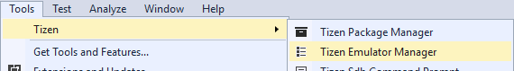
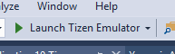
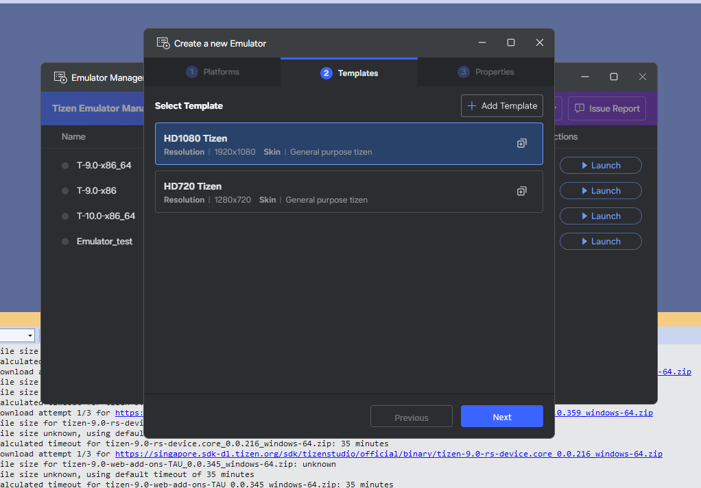
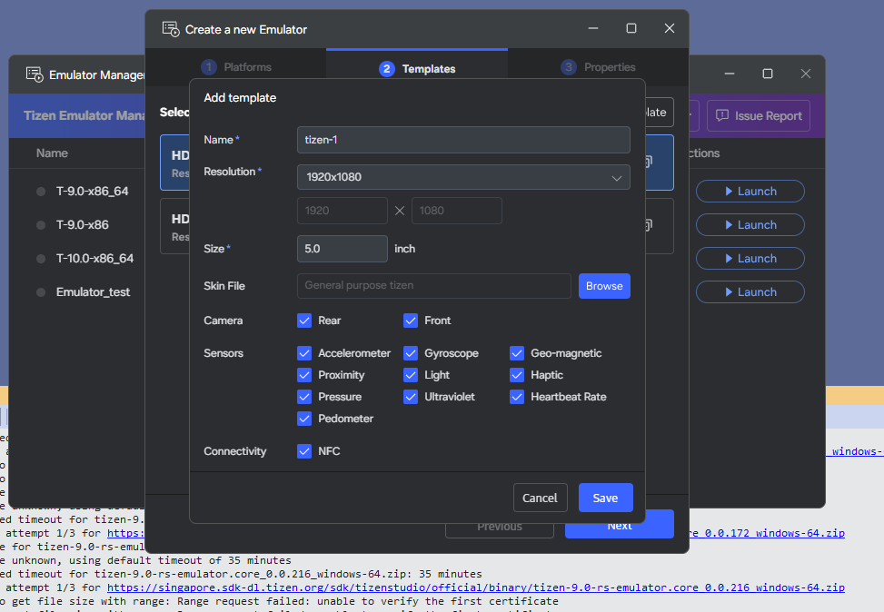
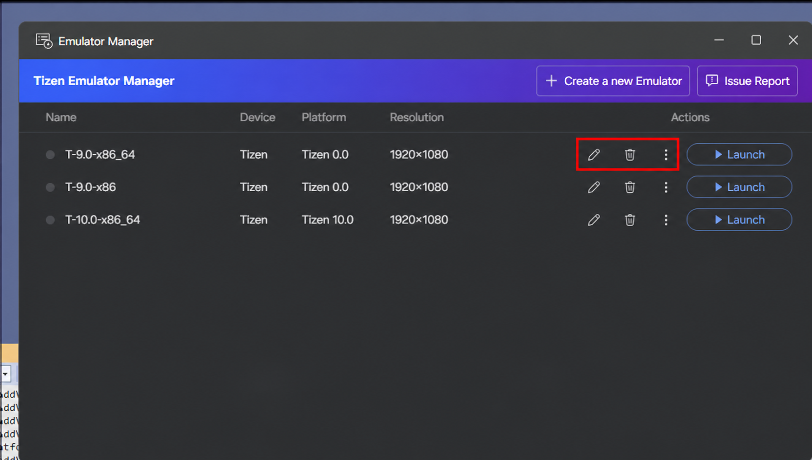
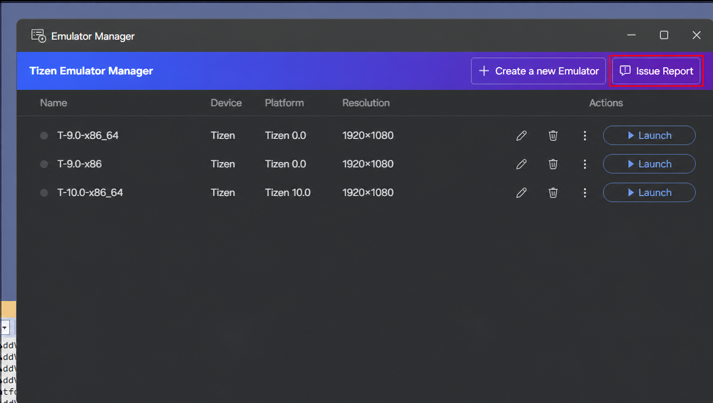

# Emulator Manager

You can use emulators to run your application in a virtual environment.

In order to test the application in a variety of environments, you need a variety of emulators. The Emulator Manager helps you easily create and manage emulator instances. Basically, the Emulator Manager allows you to generate emulator instances from a predefined platform and template. In addition, you can define the settings of the virtual device, such as skin, resolution, and hardware devices.

The main features of the Emulator Manager are:

- Defining a new emulator instance or hardware profile
- Editing an existing emulator instance or hardware profile
- Deleting an emulator instance or hardware profile
- Starting and stopping the emulator instance

## Accessing the Emulator Manager

If you do not have the Emulator Manager installed, install it using the Visual Studio Tools for Tizen installer.

You can access the Emulator Manager from Visual Studio in two ways:

- In the Visual Studio menu, go to **Tools > Tizen > Tizen Emulator Manager**.

  

- On the Visual Studio toolbar, select **Launch Tizen Emulator**.

  

The emulator list shows each emulator's name, device type, platform version, resolution, and actions to edit, delete, launch, export, or factory-reset it.

## Create an Emulator

1. Select **Create a new Emulator**.
2. Select a platform image. If the required image is unavailable, select **Download**; to use a custom image, select **Import** and provide a `.qcow2` or raw image.

   

3. Select a device template, such as HD1080 (1920x1080) or HD720 (1280x720).

   

4. Review the emulator properties, including its name, RAM, and CPU cores, and select **Finish**.

   

The video below shows how to create a new emulator:

<video controls height="400">
  <source src="media/create_new_emulator.mp4" type="video/mp4">
</video>

To create a custom template, select **Add Template**. Define its name, display resolution, screen size, skin file, and supported hardware features, then select **Save**.

## Launch and Manage Emulators

Select an emulator and choose **Launch**. A green status indicator identifies a running emulator. Wait for the emulator home screen to appear before deploying or debugging an application.

The following image highlights the **Launch** control for the selected emulator.

Use the pencil icon to edit an emulator and the trash icon to delete it. Right-click an emulator to **Reset** it or **Export As** a platform image. Only custom platforms and templates can be modified or deleted.

The following image highlights the **Edit**, **Delete**, and **More actions** controls.

For hardware and virtualization requirements, see [Emulator requirements](../prequisite.md#emulator-requirements).

## Issue Report

Select **Issue Report** in the upper-right corner of Emulator Manager to open the GitHub issues page and report an issue.

