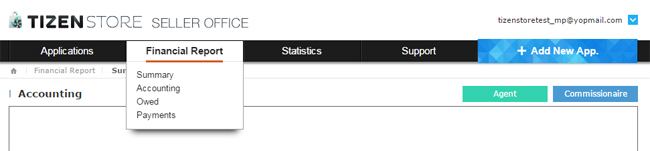

# Tizen Seller Office Overview

## Introduction to Seller Office

- The Seller Office site supports those who would like to sell their apps on Tizen Store, so that they can easily register, manage and promote their apps, as well as see statistics and payment details. ( [http://seller.tizenstore.com](http://seller.tizenstore.com/) )
- If seller want to register app for Samsung Gear Apps, the app have to be registered on the Gear Seller Office. ([http://seller.samsungapps.com](http://seller.samsungapps.com/))

## Add New Application

- Click the blue button (Add New Application) on the right to register a new app you would like to sell. If you are trying to modify a previously registered app, then you should go to Applications > My Applications.
- For more information about how to register an app, refer to the Application Registration Guide posted on Seller Office.
  **(Support> Guide Download> Application Registration Guide)**
  

## Manage Application

- In this tab, you can check the verification status of your registered apps, update (modify) them, and stop selling them. You can also issue coupons and apply discounts in order to promote your apps, or manage existing promotions.
  

## Financial Report

- You can check sales, finance, and payment information related to the apps that you currently have on sale
  1. Summary : You can see the profit generated via Tizen Store.
  2.  Accounting : You can receive reports about your monthly revene. (Monthly revenue is uesd in accounting to calculate the actual revenue).
  3. Owed : You can receive reports about the accumulated amount of unsettled payments for the current month out of the total sales amount.
  4. Payment : You can receive monthly reports about the amounts that are paid to you when sales exceeding the minimum amount for transfer have been made.
  
  

## Statistics

- You can see download and sales information about each of your registered apps and the countries in which it is sold. You can also export this information as an Excel file.
  

## Support

- This tab provides functions that make it easier to use the Seller Office. The available functions are Notice, FAQ, My Q&A, Flag Inapporopriate, Buyer Comments, Guide Download.
  