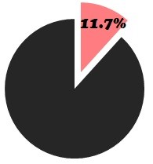
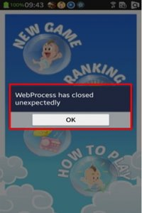

# Back Key Malfunction

  

 Not in compliance with the following Validation guidelines.

  - Application should not crash or cause malfunctions due toH/W usage. (e.g. MENU, HOME, BACK, VOLUME, HOLD key)

  - H/W key itself should work as user can normally expectwhen user executes application. 

  
## Defect Examples

   

- Back Key does not work.
   - Defect: Application does not work properly with Back Key event.
   - Solution: Application should go to the previous pageor be terminated with Back key interruption.

- Malfunction of Back Key.
   - Defect: Application is terminated by force when user presses Back key.
   - Defect: Application gets frozen when user presses Back key.
   - Defect: Application shows pop-up or error message when user presses Back key.

   
## Self-check List

- [4-6] Application should operate without any problems when user presses H/W KEY while application is running (BACK, CAMERA, etc.).


## TIP to Solve This Issue:

- Since Tizen 2.2, the physical Menu and Back keys are mandatory part of Tizen. Therefore, your application should be built on higher than SDK 2.2 version to handle physical keys properly.

- For web application, you can bind event handlers on the 'tizenhwkey' event to handle physical Menu and Back key. Please refer to below code example.

  ```
  // Javascriptcode
  $( window).on( "tizenhwkey", function ( ev ) {
      if ( ev.originalEvent.keyName === "back" ) {
          //call browser back if webApp dev. wants back behavior
          window.history.back(); 
          //add script if there is a need to add another behavior 
          // on H/W back key press
      }
  }
  ```

- For native application, you can use the EFL Extension functions which let visible objects without focus get events from the Menu and Back keys. To use the functions and data types of the Efl Extension API, include the <efl_extension.h> header file in your application. 

- For more details on how to handle Menu and Back key on the target device, please refer to the [Managing Menu and Back Key Events](https://developer.tizen.org/development/guides/native-application/user-interface/efl/hardware-input-handling/managing-menu-and-back-key-events). And also it would be helpful to check how to handle [Efl extension Event](https://developer.tizen.org/development/api-references/native-application?redirect=https://developer.tizen.org/dev-guide/2.4.0/org.tizen.native.mobile.apireference/group__EFL__EXTENSION__EVENTS__GROUP.html).

