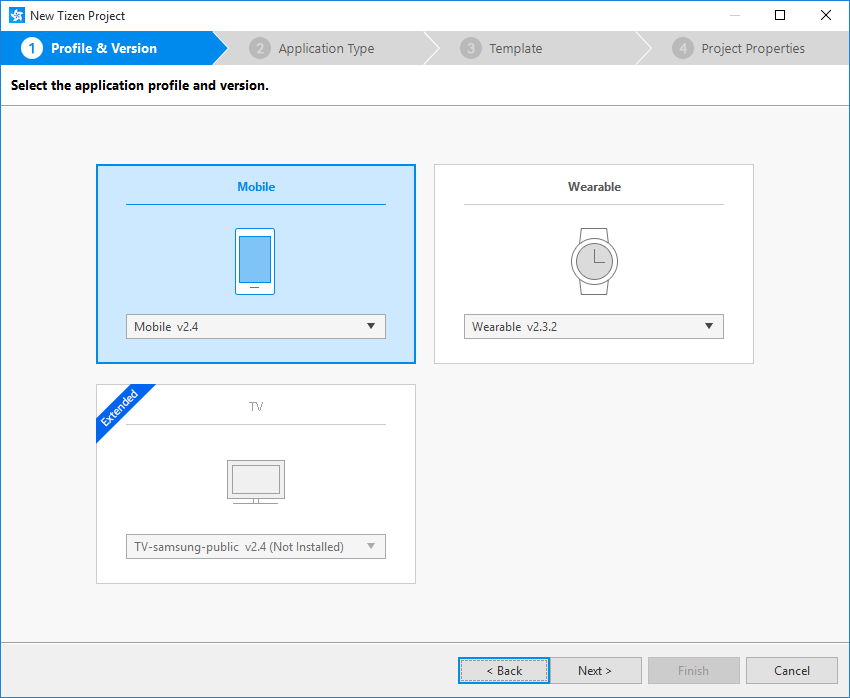
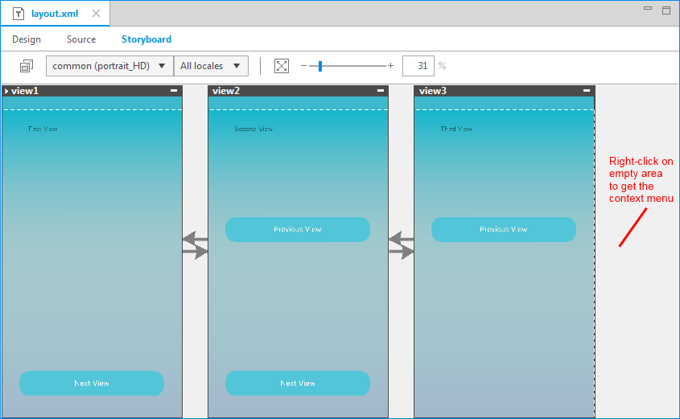
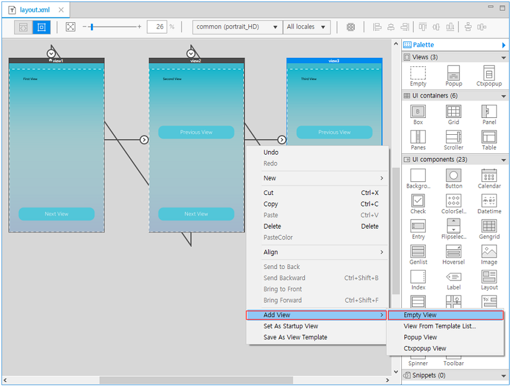
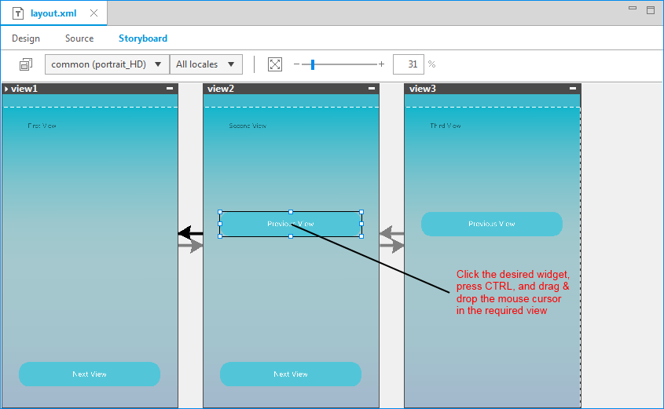
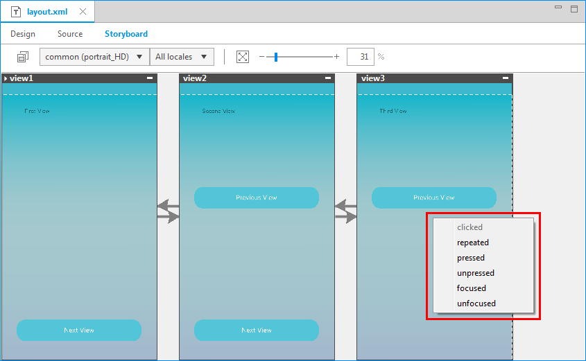
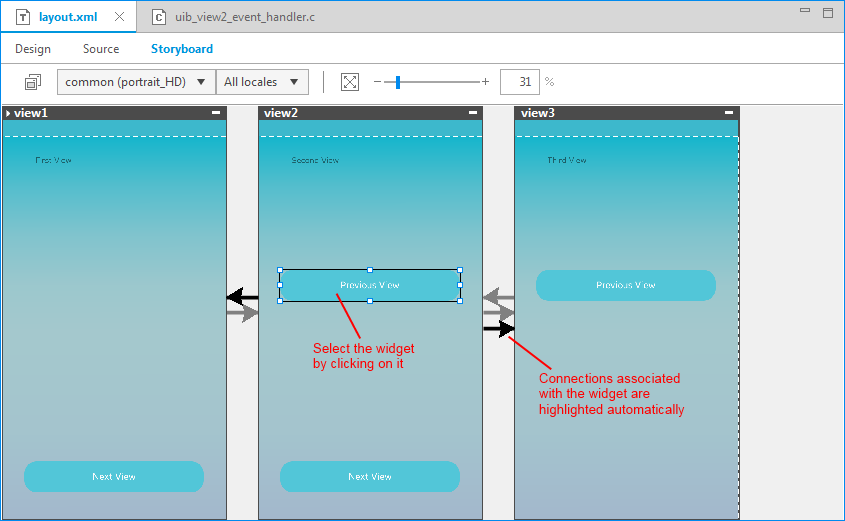
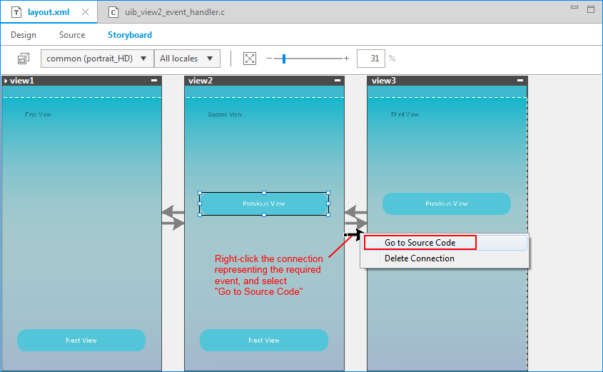
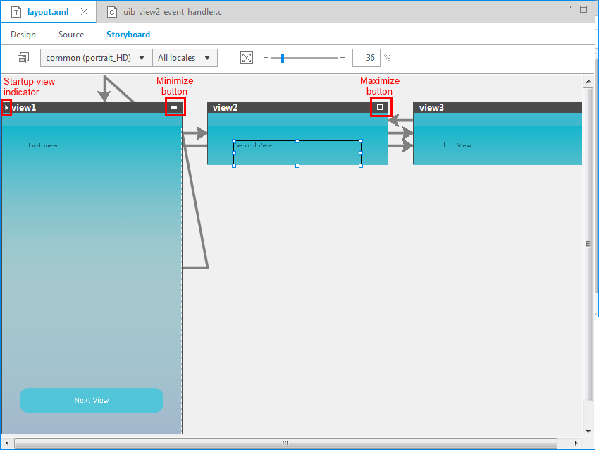

# Defining Page Transitions with the Storyboard
## Dependencies

- Tizen Studio 1.0 and Higher

The Tizen Storyboard is an additional tab in the UI Builder WYSIWYG editor. It provides an interactive view to help in the design of the page transitions.

The Storyboard provides a bird's eye picture of all the views present in the application, along with a flowchart of event-based transitions between views. You can visualize page transition in the native application, and form a better understanding of the application functionality. You can also use the Storyboard as a control panel to manage the application views.

The Storyboard consists of a collection of the application views, inter-connected by arrows depicting the change of the view when an event is fired by a user action on a UI component. The Storyboard automatically generates the necessary logic to handle the view transformation, and also provides you auto-generated stubs for defining event handlers for various events of the existing UI components.

The Storyboard is available for applications created with a UI Builder template.

## Creating a Storyboard Application

To use the Storyboard, you must create a Tizen native project using a UI Builder template:

1. In the Project Wizard, select the application profile and version.

   

2. Select the native application type.

   

3. Select one of the UI Builder templates.

   

## Adding Views

When you select the **Storyboard** tab in the WYSIWYG editor, the Storyboard graphical viewer opens. If the **UI Builder - Navigation View** application template is used, the viewer contains 3 default views with some default connections between them. Otherwise, the viewer contains a single view.

**Figure: Views shown in the Storyboard tab**

To add a new view, right-click the editor, select **Add View**, and select the view type you want. Alternatively, you can add a new view in the **Navigation** view and drag and drop the view from the **Navigation** view to the **Storyboard** tab.

**Figure: Adding a new view**

You can move the views in the viewer by selecting the black label containing the view name and dragging the view to a new position.

## Creating Connections

To create a connection between 2 views:

1. Press the **Ctrl** key and click the UI component from which the page transition is to happen.

2. Drag the component to the page where the transition is supposed to lead.

   

3. When the dragging is finished, a context menu opens listing the corresponding events of the object. If a connection already exists for some event of the UI component, that event is shown as disabled.

   Select an appropriate event from the menu.

   

   After you select the event, the new connection is displayed and code is generated in the `layout.xml` file. The event handler code is also generated in the C file.

   

4. To edit the event code, right-click the connection, and select **Go to Source Code**.To delete the connection, select **Delete Connection**.

5. In the source code, 2 functions are generated:

   - `view1_button1_onclicked()` is called before the transition is performed to the target view.
   - `view1_button1_onclicked_post()` is called after the transition has been performed.

   Write whatever operation you want to perform during the pre and post transition.

   

## Changing Component and Connection Properties

When you select a component or connection in the Storyboard, the editable properties related to it are displayed in the **Properties** view. You can view the transition properties and change the connection target view and title.

**Figure: Component properties**

**Figure: Connection properties**

## Maximizing and Minimizing Views

You can maximize and minimize a set of views in the **Storyboard** tab by toggling the icon in the upper-right corner of the respective views.

Use this feature to reduce the clutter of multiple views present in the application without compromising on losing the overall sight of the application project.

The startup view can be identified by an arrow symbol in the upper-left corner of the view.

**Figure: Maximizing and minimizing views**

