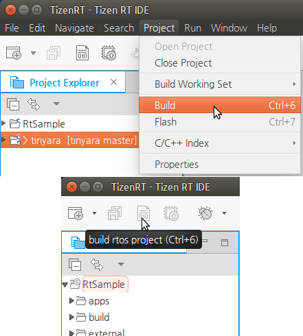
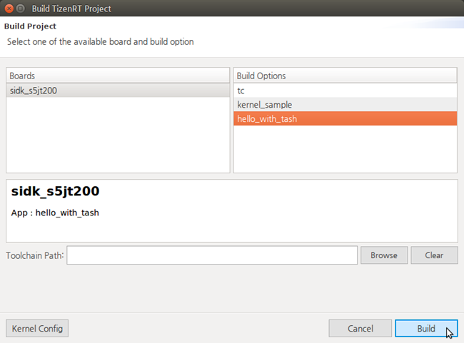
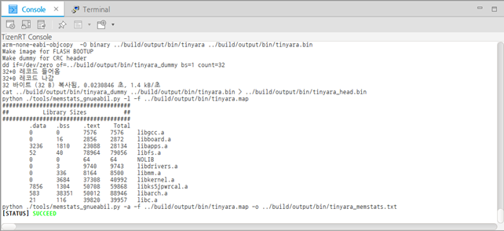
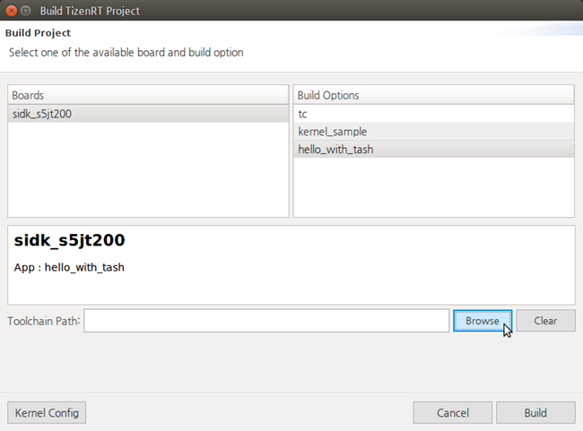
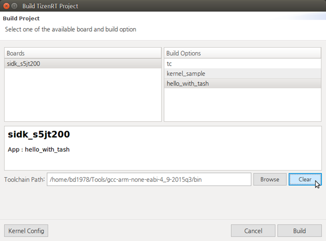
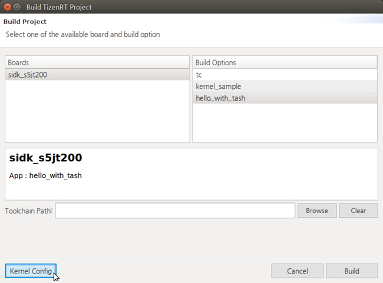

# Building the Project
## Dependencies

- Ubuntu Only

You must build your project before flashing it.

To build the Tizen RT project:

1. Select the project in the **Project Explorer** view.

2. To build the selected project, use one of the following:

   - In the Tizen Studio for RT menu, select **Project > Build**.
   - In the Tizen Studio for RT toolbar, click the **Build** icon ().

   

3. In the Build TizenRT Project Wizard, select the board and build option for building your project, and click **Build**.

You can check the build logs in the **Console** view.

**Figure: Build logs**

## Selecting the Toolchain Path

In the Build TizenRT Project Wizard, you can change the toolchain for the build:

1. Click **Browse** next to the **Toolchain Path** field.
2. Select a new path for your own toolchain and click **OK**.

If you set a new toolchain, the toolchain path is displayed in the Build TizenRT Project Wizard as shown below. If you want to clear the toolchain setting and return to the default value, click **Clear**.

**Figure: New toolchain**

## Modifying the Kernel Config

In the Build TizenRT Project Wizard, you can modify the kernel configuration for the build.

**Note**
Before modifying the kernel configuration, you must install Kconfig:
1. Download the Kconfig frontend from [http://ymorin.is-a-geek.org/projects/kconfig-frontends](http://ymorin.is-a-geek.org/projects/kconfig-frontends).
2. Configure and build the frontend with the following commands:`./configure --enable-conf --enable-mconf --disable-shared --enable-staticmakesudo make install`
3. If the frontend does not work, troubleshoot it as follows:
  - In case of a `configure` command error: can not find gperf
    Run the `sudo apt-get install gperf` command.
  - In case of a `configure` command error: can not find a lexer generator (such as lex or flex)
    Run the `sudo apt-get install flex` command.
  - In case of a `configure` command error: can not find a parser generator (such as yacc or bison)
    Run the `sudo apt-get install bison` command.
  - In case of a `configure` command error: could not find curses headers (frontends: mconf/nconf)
    Run the `sudo apt-get install libncurses5-dev` command.
  - If you still get an error after the above fixes:
      - Run the `ls /usr/local/lib` command and make sure that it shows 3 files:`libkconfig-parser-[.la .so -3.12.0.so]`
      - If those 3 files exist, run the `sudo vi /etc/ld.so.conf` command and save the file.If not, run the `sudo apt-get install ldconfig` command to install the ldconfig module.

To modify the kernel configuration:

1. Click **Kernel Config**.
2. Change the settings, **Save**, and **Exit**.