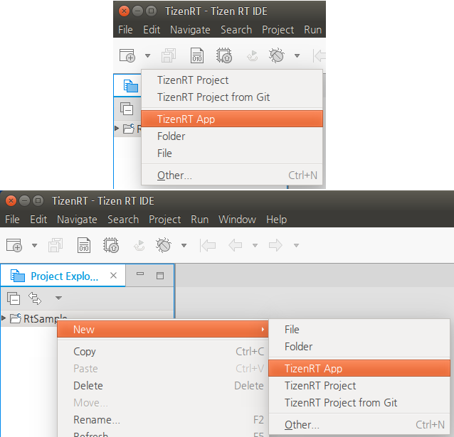
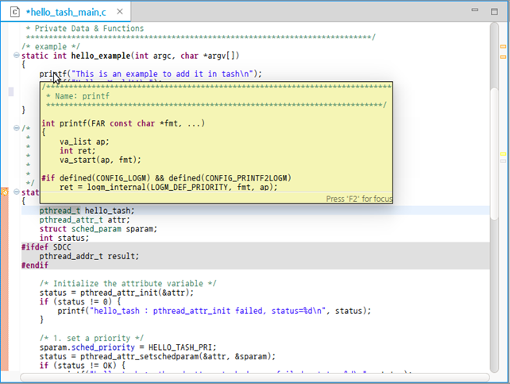

# Creating Your Application
## Dependencies

- Ubuntu Only

The Tizen RT App Wizard is a Tizen Studio for RT tool that is used to create RT application resources.

When you create a new application, the basic file sets needed for application development are added.

To create a new application with a template within a selected project:

1. Select the project to which you want to add the application.

2. To open the Tizen RT App Wizard, use one of the following:

   - In the Tizen Studio for RT menu, select **File > New > TizenRT App**.
   - In the Tizen Studio for RT toolbar, click the **New** icon () drop-down list and select **TizenRT App**.
   - Right-click in the **Project Explorer** view, and select **New > TizenRT App**.

   

3. In the New TizenRT App Wizard, set the application name and click **Finish**.

The created application template is shown in the **Project Explorer** view within the project.

**Figure: New application template**

You can code the required application features within the added template. Open the project sources in the Code Editor.

**Figure: Code Editor**

The Tizen Studio for RT provides various features to ease code writing and improve code productivity when you develop your applications:

- The API assist helps you to write code quickly by completing the names of the APIs automatically when writing a part of the API name.
- The API hover displays information about API functions, API-related types, and macros for the native framework.
- The API link helps you to check the original content of a linked API quickly.
- The **Outline** view allows you to see the structure of the code currently open in the Code Editor.

## Using API Assist

When you write code, the API assist feature provides API suggestions to complete the code faster.

To receive the API suggestions manually, type at least one letter of content, and press **Ctrl + Space**. The suggestion list appears. Use the arrow keys to select a suggestion from the list, and press **Enter** to complete the code.

**Figure: API assist suggestion list**

If you already use the **Ctrl + Space** shortcut key in the Ubuntu system for other purposes, such as the keyboard input source change, you must change to another shortcut, or you can change the API assist key in the Tizen Studio menu: **Window > Preference > General > Keys > Content Assist**.

## Using API Hover

When you hover over an API function in the Code Editor, a popup window appears below the function. In that window, you get detailed information about the API function, such as a brief description, defined parameters, return value type, and exception information.

**Figure: API hover popup**

## Using API Link

When you hover over an API function in the Code Editor, you can move to the original content of the hovered API by pressing the **F3** key or **Ctrl + Mouse Left Click**.

**Figure: Moving with API link**

## Using Outline View

The **Outline** view displays the structure of the code currently open in the Code Editor view.

**Figure: Outline view**

