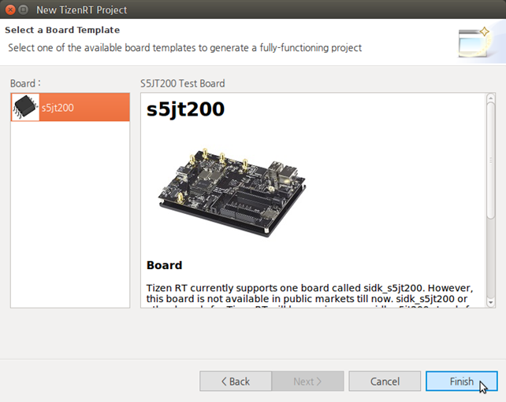
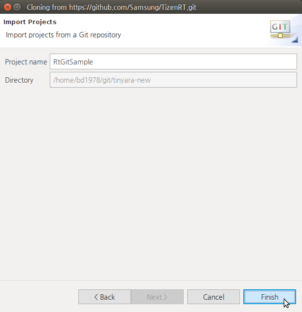

# Creating a Project
## Dependencies

- Ubuntu Only

The Tizen RT Project Wizard is a Tizen Studio for RT tool that is used to create an RT project.

When you create a new project, you can select a specific template, which the Tizen RT Project Wizard uses to automatically create basic functionalities for the application. The default project files and folders are also created.

You can create projects from a local template or remote git.

## Creating Projects from a Local Template

To create a project from a local template:

1. To open the Tizen RT Local Project Wizard, use one of the following:

   - In the Tizen Studio for RT menu, select **File > New > TizenRT Project**.
   - In the Tizen Studio for RT toolbar, click the **New** icon () drop-down list and select **TizenRT Project**.
   - Right-click in the **Project Explorer** view, and select **New > TizenRT Project**.

   

2. In the New TizenRT Project Wizard, set the project name and click **Next**.

3. Select the board template and click **Finish**.

The new project is shown in the **Project Explorer** view.

**Figure: New project from a local template**

## Creating Projects from a Remote Git

To create a project from a remote git:

1. To open the Tizen RT Git Project Wizard, use one of the following:

   - In the Tizen Studio for RT menu, select **File > New > TizenRT Project from Git**.
   - In the Tizen Studio for RT toolbar, click the **New** icon () drop-down list and select **TizenRT Project from Git**.
   - Right-click in the **Project Explorer** view, and select **New > TizenRT Project from Git**.

   

2. In the New TizenRT Project Wizard, you can select the git import method:

   - If you want to import from a new repository, [clone its URI](#clone).
   - If you already cloned the git you want, use an [existing local repository](#repository).

### Using the Clone URI Option

To import a project from a new repository:

1. Select **Clone URI** and click **Next**.
2. Set basic location information to connect to the git repository and click **Next**.You can use a public git URL, such as [https://github.com/Samsung/TizenRT.git](https://github.com/Samsung/TizenRT.git) or git://github.com/Samsung/TizenRT.
3. Select branches to clone from the remote repository and click **Next**.
4. Configure the local storage location and initial branch, and click **Next**.
5. Select the specific directory under the Working Tree to use for importing the project, and click **Next**.If you want to import the overall Working Tree as a new project, select the root (`Working Tree`) directory.
6. Set the project name and click **Finish**.

The new project is shown in the **Project Explorer** view.

**Figure: New project from a remote git**

### Using the Existing Local Repository Option

To import a project from an existing repository:

1. Select **Existing local repository** and click **Next**.
2. Add local repositories by clicking **Add**.
3. Search for local Git repositories on the file system by clicking **Browse** to set the directory and clicking **Search**.After the search, select the repositories and click **Finish**.
4. Select the repository to clone and click **Next**.
5. Select the specific directory under the Working Tree to use for importing the project, and click **Next**.If you want to import the overall Working Tree as a new project, select the root (`Working Tree`) directory.
6. Set the project name and click **Finish**.

The new project is shown in the **Project Explorer** view.

**Figure: New project from a remote git**

