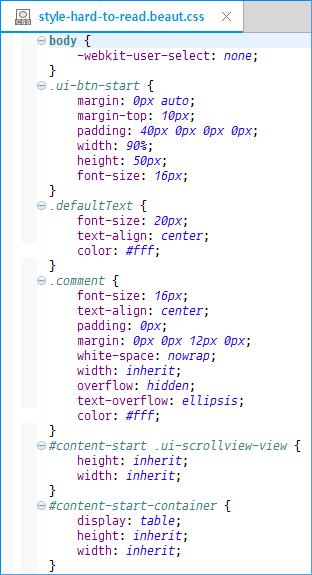
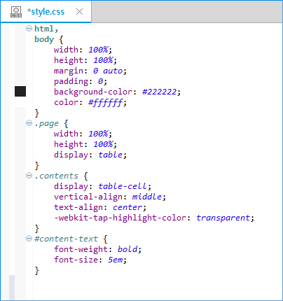

# Cleaning Up Your Code

## Dependencies

- Tizen Studio 1.0 and Higher

The Tizen Studio provides features to assist with productive development. This topic describes the **Code Beautifier** and **Code Minifier** features in the Tizen Web Editor.

## Using the Code Beautifier

The Code Beautifier is a tool that can help you understand code by making it easier to read. For example, by inserting indentations and alignments automatically, you can code more efficiently without compromising readability.

The Code Beautifier has the following features for beautifying HTML, CSS, and JavaScript:

- Beautifying code from a minified form
- Inserting indentation
- Inserting carriage returns

You can use the Code Beautifier in 3 ways:

- In the **Project Explorer** view, right-click an HTML, CSS, or JavaScript file in the project and select **Code Beautifier**.	 

  A beautified file with the `.beaut.<extension>` extension is generated, and a notification popup appears in the Tizen Studio.

- In the **Source Editor** view, right-click the code and select **Code Beautifier**.

- In the **Source Editor** or **Project Explorer** view, use the **Ctrl + 6** hotkey.

If you use the Code Beautifier in the **Source Editor** view, no new file is generated. The original file is changed instead.

**Figure: Code Beautifier with CSS file - before beautifying**

**Figure: Code Beautifier with CSS file - after beautifying**

## Using the Code Minifier

Minification is the process of compressing the code from its original size to the smallest size, without affecting its operation. The Code Minifier is a smart compression tool which removes or modifies unnecessary characters from the code.

The Code Minifier removes characters, such as white space, line breaks, and commented-out code. It then places all of the code on 1 line.

The Code Minifier has the following features:

- Minifying HTML   
  - Removing comments
  - Replacing multiple white space characters and line breaks with spaces
  - Compressing inline CSS code
  - Compressing inline JavaScript code
- Minifying CSS   
  - Removing comments and white space
  - Removing the final semicolon
  - Removing extra semicolons
  - Removing empty declarations
  - Removing, for example, zero values, floats, and color values
- Minifying JavaScript   
  - Removing comments
  - Removing extra white space
  - Replacing identifiers
  - Performing micro-optimizations

You can use the Code Minifier in 3 ways:

- In the **Project Explorer** view, right-click an HTML, CSS, or JavaScript file in the project and select **Code Minifier**.	

  A minified (compressed) file with the `.min.<extension>` extension is generated, and a notification popup appears in the Tizen Studio.

- In the **Source Editor** view, right-click the code and select **Code Minifier**.

- In the **Source Editor** or **Project Explorer** view, use the **Ctrl + 5** hotkey.

If you use the Code Minifier in the **Source Editor** view, no new file is generated. The original file is changed instead.

**Figure: Code Minifier with CSS file - before minifying**

**Figure: Code Minifier with CSS file - after minifying**

