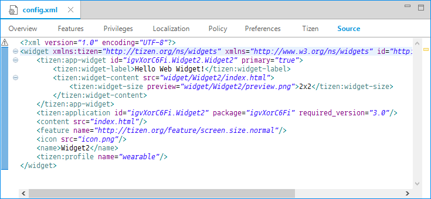
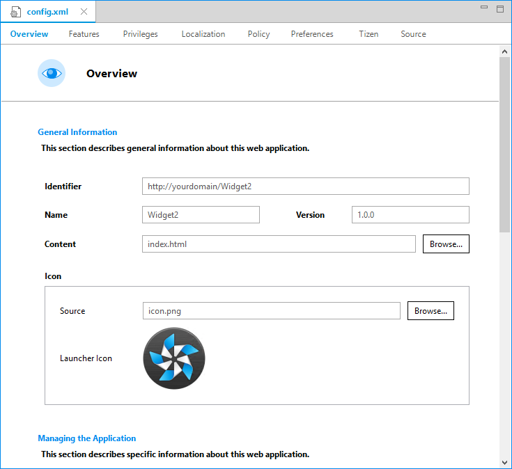

# Configuring Applications
## Dependencies
- Tizen Studio 1.0 and Higher

The Tizen Web application configuration file is composed of XML elements, including the `<widget>` element as its root and other elements. These elements represent application information, such as [configuration elements](#elements) and Tizen extending configuration elements for [mobile](#mw_extend) and [wearable](#ww_extend) applications.

This configuration information is used when you install or run the Tizen Web application on the Tizen platform. The Tizen Web application project must have the `config.xml` file in the project root directory.

The configuration file can be easily edited with the [Web application configuration editor](#edit) (form editor), or you can modify the XML structure directly using the configuration source editor. With the form editor, you can set the project configuration (manifest), even if you have no experience with developing a Tizen Web application project. If you are fluent with the configuration file XML structure, you can create the configuration file directly through the configuration source editor.

**Note**	The `config.xml` must conform to both the XML file format and the W3C specification requirements. Editing the file XML structure with the configuration source editor is intended for advanced users only. 

## Editing the config.xml File

There are 2 different ways to edit the `config.xml` file:

- Use the **Source** tab:	 

  1. Double-click the `config.xml` file in the **Project Explorer** view.

  2. Select the **Source** tab.

     **Figure: Source tab**

     

- Use the form tabs: 

  1. Double-click the `config.xml` file in the **Project Explorer** view.

  2. Select one of the form tabs (**Overview**, **Features**, **Privileges**, **Localization**, **Policy**, **Preferences**, **Tizen**).

     **Figure: Form tabs**

  

## Configuration Element Hierarchy

The Tizen Web application configuration file consists of XML elements organized in a hierarchy. The following tree structure shows the relationship between the elements of the `config.xml` file.

| `<widget>` |                                          |                           |                       |
| ---------- | ---------------------------------------- | ------------------------- | --------------------- |
|            | `<access>`                               |                           |                       |
|            |                                          | `<tizen:icon>`            |                       |
|            |                                          | `<tizen:display-name>`    |                       |
|            |                                          | `<tizen:capability>`      |                       |
|            | `<tizen:account>` (in mobile only)       |                           |                       |
|            | `<tizen:allow-navigation>` (in [mobile](#mw_navigation) or [wearable](#ww_allownavigation)) |                           |                       |
|            | `<tizen:app-control>` (in [mobile](#mw_appcontrol) or [wearable](#appcontrol)) |                           |                       |
|            |                                          | `<tizen:src>`             |                       |
|            |                                          | `<tizen:operation>`       |                       |
|            |                                          | `<tizen:uri>`             |                       |
|            |                                          | `<tizen:mime>`            |                       |
|            | `<tizen:application>` (in [mobile](#mw_application) or [wearable](#ww_application)) |                           |                       |
|            | `<tizen:app-widget>` (in wearable only)  |                           |                       |
|            |                                          | `<tizen:widget-label>`    |                       |
|            |                                          | `<tizen:widget-content>`  |                       |
|            |                                          |                           | `<tizen:widget-size>` |
|            |                                          | `<tizen:widget-metadata>` |                       |
|            | `<author>`                               |                           |                       |
|            |                                          | ``                  |                       |
|            | `<tizen:background-category>` (in [mobile](#mw_bg_category) or [wearable](#ww_bg_category)) |                           |                       |
|            | `<tizen:category>` (in wearable only)    |                           |                       |
|            | `<content>`                              |                           |                       |
|            | `<tizen:content>` (in [mobile](#mw_webapp) or [wearable](#ww_tizencontent)) |                           |                       |
|            | `<tizen:content-security-policy>` (in [mobile](#mw_sec) or [wearable](#ww_contentsecpolicy)) |                           |                       |
|            | `<tizen:content-security-policy-report-only>` (in [mobile](#mw_secreport) or [wearable](#ww_contentsecpolicyreport)) |                           |                       |
|            | `<description>`                          |                           |                       |
|            |                                          | ``                  |                       |
|            | `<feature>` (in [mobile](#mw_feature) or [wearable](#ww_feature)) |                           |                       |
|            |                                          | `<param>`                 |                       |
|            | `<icon>`                                 |                           |                       |
|            | `<tizen:ime>` (in wearable only)         |                           |                       |
|            |                                          | `<tizen:uuid>`            |                       |
|            |                                          | `<tizen:languages>`       |                       |
|            |                                          |                           | `<tizen:language>`    |
|            | `<license>`                              |                           |                       |
|            |                                          | ``                  |                       |
|            | `<tizen:metadata>` (in [mobile](#mw_metadata) or [wearable](#ww_metadata)) |                           |                       |
|            | `<name>`                                 |                           |                       |
|            |                                          | ``                  |                       |
|            | `<preference>`                           |                           |                       |
|            | `<tizen:privilege>` (in [mobile](#mw_privilege) or [wearable](#ww_privilege)) |                           |                       |
|            | `<tizen:profile>` (in [mobile](#mw_profile) or [wearable](#ww_profile)) |                           |                       |
|            | `<tizen:service>` (in wearable only)     |                           |                       |
|            |                                          | `<tizen:name>`            |                       |
|            |                                          | `<tizen:icon>`            |                       |
|            |                                          | `<tizen:content>`         |                       |
|            |                                          | `<tizen:description>`     |                       |
|            |                                          | `<tizen:metadata>`        |                       |
|            |                                          | `<tizen:category>`        |                       |
|            | `<tizen:setting>` (in [mobile](#mw_setting) or [wearable](#ww_setting)) |                           |                       |

## Configuration Elements

The following tables summarize the W3C configuration elements used in the `config.xml` file of a Web application. For more information on the W3C element details, see [Widget Packaging and XML Configuration](https://www.w3.org/TR/2011/REC-widgets-20110927/) (the details of the Tizen extending configuration elements are described in [Extending Configuration Elements in Mobile Applications](#mw_extend) and [Extending Configuration Elements in Wearable Applications](#ww_extend)). For a quick view of the element hierarchy, see [Configuration Element Hierarchy](#hierarchy).

| `<widget>` element                       |
| ---------------------------------------- |
| Represents the root element of a configuration document.  **Expected children:** `<access>`, `<tizen:account>`, `<tizen:app-control>`, `<tizen:application>`, `<author>`, `<content>`, `<tizen:content>`, `<description>`, `<feature>`, `<icon>`, `<license>`, `<name>`, `<preference>`, `<tizen:privilege>`, `<tizen:profile>`, and `<tizen:setting>` **Attributes:** -`xml:lang` -`dir` -`id` -`version`      Specific version of the Tizen package. The expected value is `[0-255].[0-255].[0-65535]`. -`height` -`width` -`viewmodes` -`defaultlocale` |

| `<access>` element                       |
| ---------------------------------------- |
| Used to control network access from within a Web application and to request access to certain network resources from the user agent.  **Attributes:** -`origin` -`subdomains` |

| `<author>` element                       |
| ---------------------------------------- |
| Represents the person who created the Web application.  **Expected children:** `` and `<text node>` **Attributes:** -`xml:lang` -`dir` -`href` -`email` |

| `<content>` element                      |
| ---------------------------------------- |
| Represents the boot-strapping mechanism used to point to the main file of the Web application.   **Attributes:** -`xml:lang` -`dir` -`encoding` -`src` -`type` |

| `<description`> element                  |
| ---------------------------------------- |
| Represents text describing the purpose of the Web application.  **Expected children:** `` and `<text node>` **Attributes:** -`xml:lang` -`dir` |

| `<icon>` element                         |
| ---------------------------------------- |
| Represents the Web application icon.   **Attributes:** -`xml:lang` -`dir` -`src` -`width` -`height` |

| `<license>` element                      |
| ---------------------------------------- |
| Represents the license under which the Web application is distributed.  **Expected children:** `` and `<text node>` **Attributes:** -`xml:lang` -`dir` -`href` |

| `<name>` element                         |
| ---------------------------------------- |
| Represents the Web application name used, for example, in the application menu.  **Expected children:** `` and `<text node>` **Attributes:** -`xml:lang` -`dir` -`short` |

| `<param>` element                        |
| ---------------------------------------- |
| Used to declare parameters to be used with a feature in [mobile](#mw_feature) and [wearable](#ww_feature) applications.   **Attributes:** -`xml:lang` -`dir` -`name` -`value` |

| `<preference>` element                   |
| ---------------------------------------- |
| Used to declare preferences as key-value pairs for the Web application for use at runtime.  **Attributes:** -`name` The maximum length can be limited to 80 bytes.  In that case, leftover bytes are ignored. -`value` The maximum length can be limited to 8192 bytes.  In that case, leftover bytes are ignored. -`readonly` |

| `` element                         |
| ---------------------------------------- |
| Represents the generic container used mainly for internationalization.  **Expected children:** `` and `<text node>` **Attributes:** -`xml:lang` -`dir` |

## Extending Configuration Elements in Mobile Applications

The following sections show additional configuration elements used in the `config.xml` file of a Web application, but not included in the [Widget Packaging and XML Configuration guidelines](https://www.w3.org/TR/2011/REC-widgets-20110927/). For a quick view of the entire element hierarchy, see [Configuration Element Hierarchy](#hierarchy).

**Note**	The extension elements are denoted as though the `xmlns:tizen="http://tizen.org/ns/widgets"` namespace declaration is in effect.	  

The maximum length of the attribute and the element (except `<tizen:metadata>`, W3C preference element) can be limited to 2048 bytes. In this case, leftover bytes are ignored.

### Tizen Account

| `<tizen:account/>` element               |
| ---------------------------------------- |
| Used to register account provider information.       **Occurrences:**  -0 or more **Expected children:**  -`icon`  Mandatory. Since the icons are used on the device under **Settings > Accounts**, place them in a shared directory. **Attributes:**   -`Account`: File path of the account provider icon. The icon size is 72 x 72 pixels.   -`AccountSmall`: File path of the account provider small icon. The icon size is 45 x 45 pixels.  -`display-name`  Mandatory; display name of the account provider -`capability` Optional; capability of the account provider. Capabilities are defined in the `http://<VENDOR_INFORMATION>/accounts/capability/<NAME>` IRI format. **Attributes:**  -`multiple-account-support`  Mandatory; indicates whether multiple accounts are supported (available values: `true`, `false`) **Example:** `<tizen:account multiple-account-support="false">   <tizen:icon section="Account">account_provider_icon.png</tizen:icon>   <tizen:icon section="AccountSmall">account_provider_small_icon.png</tizen:icon>    <tizen:display-name xml:lang="en">AccountProviderExample</tizen:display-name>   <tizen:capability>http://tizen.org/account/capability/contact</tizen:capability></tizen:account>` |

### Tizen Navigation Policy

| `<tizen:allow-navigation/>` element      |
| ---------------------------------------- |
| Used to define a list of URL domains that are allowed to be navigated in using the Web application.       **Occurrences:**  -0 or more         If more than 1, the first occurrence is applied. **Example:**  `<tizen:allow-navigation>tizen.org *.tizen.org<tizen:allow-navigation/>` |

### Tizen Application Control

| `<tizen:app-control/>` element           |
| ---------------------------------------- |
| Used to indicate that the Web application can handle a specific operation with the specified MIME type and URI. For more information, see [Application Information and Controls](https://developer.tizen.org/development/guides/web-application/application-management/application-information-and-controls/application-controls).       **Occurrences:**  -0 or more **Expected children:** - `src`			   Attributes:   -`name`  Mandatory; page handling the requests    -`reload`  Optional; sets whether the page is reloaded when it is already loaded (available values: `enable` (default), `disable`) **Since: 2.4** **Note**	 The `reload` attribute is supported since Tizen 2.4. If the `required_version` in the application's `config.xml` file is set to a version older than Tizen 2.4, and the `reload` attribute is used, the application installation fails. - `operation`  Mandatory; string that defines the action to be performed -`uri` and `mime` Optional; additional parameters used for resolving application control requests **Example:**  `<tizen:app-control>   <tizen:src name="view.html" reload="disable"/>   <tizen:operation name="http://tizen.org/appcontrol/operation/view"/>   <tizen:uri name="http"/>   <tizen:mime name="image/jpeg"/></tizen:app-control>` |

### Tizen Application ID

| `<tizen:application/>` element           |
| ---------------------------------------- |
| Used to uniquely identify a Tizen application.       **Occurrences:**  -1 **Attributes:** - `id` Mandatory; Tizen application ID, which is a combination of the Tizen package ID and project name. The application ID is unique among applications on the device.The project name is a set of characters (0-9, a-z, A-Z) randomly generated by the Tizen Studio. The minimum value is 1 byte and the maximum value is 52 bytes. -`package`  Mandatory; Tizen package ID generated by the Tizen Studio, consisting of 10 characters (0-9, a-z, A-Z). The package ID is unique in the Tizen Store. -`required_version`  Mandatory; Tizen API version required for running the Web application -`launch_mode`  Optional; sets which launch mode is supported (available values: `single` (default), `group`, `caller`)   -`single`: launched as a main application   -`group`: launched as a sub application   -`caller`: caller application defines the launch mode with the `app_control_set_launch_mode()` method **Since: 2.4** **Note**	The `launch_mode` attribute is supported since Tizen 2.4. If the `required_version` in the application's `config.xml` file is set to a version older than Tizen 2.4, and the `launch_mode` attribute is used, the application installation fails.  **Example:** `<tizen:application id="1234abcDEF.projectname"                   package="1234abcDEF"                   required_version="2.4"                   launch_mode="caller"/>` |

### Tizen Background Category

| `<tizen:background-category/>` element   |
| ---------------------------------------- |
| Used to represent the category of an application that is allowed to run in the background.  **Note**	In addition to declaring the `<background-category>` element, you must [set the `<tizen:setting background-support>` attribute to `enable`](#mw_setting) to run Web applications in the background.  **Occurrences:**  -0 or more **Attributes:**  -`value`  Mandatory; [background category](https://developer.tizen.org/development/guides/native-application/application-management/applications/ui-application#allow_bg_table) **Example:** `<tizen:background-category value="media"/>` |

### Tizen-hosted Web Application

| `<tizen:content/>` element               |
| ---------------------------------------- |
| Used to point to a document which is hosted on an external server and acts as the Web application start page. The Tizen WRT allows the start page to be hosted on an external server.       If the start page is contained in the widget package, it is defined with the [`<content>` W3C element](#content_element). If both `<content>` and `<tizen:content/>` elements are defined, the `<tizen:content/>` element is used. **Occurrences:**  -0 or more         If more than 1 `<tizen:content/>` element is specified, the first instance of the element is used. **Attributes:** -`src` Mandatory; URI of the external start page **Example:**  `<tizen:content src="https://www.tizen.org/"/>` |

### Tizen Content Security Policy

| `<tizen:content-security-policy/>` element |
| ---------------------------------------- |
| Used to define an additional content security policy for a packaged or hosted application.       **Occurrences:**  -0 or more         If more than 1, the first occurrence is applied. **Example:**  `<tizen:content-security-policy>script-src 'self'</tizen:content-security-policy>` |

### Tizen Content Security Policy Report Only

| `<tizen:content-security-policy-report-only/>` element |
| ---------------------------------------- |
| Used to define an additional content security policy, for monitoring purposes, for a packaged or hosted application.       **Occurrences:**  -0 or more         If more than 1, the first occurrence is applied. **Example:**  `<tizen:content-security-policy-report-only>   script-src 'self'; report-uri="http://example.com/report.cgi"</tizen:content-security-policy-report-only>` |

### Tizen Feature

| `<feature/>` element                     |
| ---------------------------------------- |
| Used to define hardware and software components for a Tizen application. This attribute is only used in the Tizen Store for filtering purposes. It is ignored by the Web Runtime installation procedure.  **Note**	Even though the `<feature/>` element is defined in the Widget Packaging and XML Configuration guidelines, an extended version is used in Tizen.  **Occurrences:**  -0 or more **Attributes:**  -`name`  Mandatory; [feature key](https://developer.tizen.org/development/training/web-application/application-development-process/setting-project-properties#feature) URI **Example:**  `<feature name="http://tizen.org/feature/network.bluetooth"/>` |

### Tizen Metadata

| `<tizen:metadata/>` element              |
| ---------------------------------------- |
| Used to define metadata information shared with other Web applications. The defined metadata can be accessed (read-only) through the Tizen [Application](https://developer.tizen.org/dev-guide/latest/org.tizen.web.apireference/html/device_api/mobile/tizen/application.html) API.       **Occurrences:**  -0 or more **Attributes:**  -`key`             Mandatory; unique key string. The maximum length can be limited to 80 bytes.  In this case, leftover bytes are ignored. -`value`             Optional; string. The maximum length can be limited to 8192 bytes.  In this case, leftover bytes are ignored. **Example:**  `<tizen:metadata key="key1"/><tizen:metadata key="key2" value="value/>` |

### Tizen Privilege

| `<tizen:privilege/>` element             |
| ---------------------------------------- |
| Used to get the required API access privileges for a Web application.       **Occurrences:**  -0 or more (if duplicates, the first occurrence is considered and all others ignored) **Attributes:**  -`name`  Mandatory; URI of the Device API privilege **Example:**  `<tizen:privilege name="http://tizen.org/privilege/application.launch"/>` |

### Tizen Profile

| `<tizen:profile/>` element               |
| ---------------------------------------- |
| Used to define the application profile.	   **Occurrences:**  -1 **Attributes:**  -`name`  Mandatory; string **Example:**  `<tizen:profile name="mobile"/>` |

### Tizen Settings

| `<tizen:setting/>` element               |
| ---------------------------------------- |
| Used to define additional application settings.       **Occurrences:**  -0 or more **Attributes:**  -`screen-orientation` Optional; viewport orientation lock (available values: `portrait` (default), `landscape`), auto-rotation If the system auto rotation setting is on, the Web application viewport orientation is changed accordingly by default. -`context-menu`  Optional; context menu is displayed when the user clicks, for example, an image, text, or link (available values: `enable` (default), `disable`) -`background-support`	    Optional; application execution continues when it is moved to the background (available values: `enable` (execution continues in the background), `disable` (default; application is suspended)) **Note**	Since Tizen 2.4, the system manages background processes more tightly. Even if the `background-support` attribute is set to `enable`, a Web application process can be suspended in the background. To guarantee that the application runs in the background, [add at least one background category](#mw_bg_category) for the application with the `<tizen:background-category>` element. Only the background categories declared in the system can be used.  -`encryption`  Optional; Web application resources (HTML, JavaScript, and CSS files) are stored encrypted (available values: `enable`, `disable` (default)) -`install-location`  Optional; application installation location (available values: `auto` (default), `internal-only`, `prefer-external`)   -`auto`: the system defines the installation location   -`internal-only`: the application is installed in the device's internal storage   -`prefer-external`: the application is installed in the external storage (if available) -`hwkey-event`  Optional; a hardware key event is sent to the Web application when the user presses the hardware key (available values: `enable` (default), `  disable`) If this option is enabled, the `tizenhwkey` custom event is sent to the Web application. The `tizenhwkey` event object has a `keyName` attribute (available values: `menu` and `back`). **Example:**  `<!--Viewport orientation is locked to "landscape"--><tizen:setting screen-orientation="landscape"/><!--Context menu is not displayed--><tizen:setting context-menu="disable"/><!--Web application execution is not suspended--><!--when the application is sent to the background--><tizen:setting background-support="enable"/><!--Web applications resources are stored encrypted by the WRT--><tizen:setting encryption="enable"/><!--Installation location is set to "internal-only"--><tizen:setting install-location="internal-only"/><!--Hardware key event is sent to the Web application when the hardware key is pressed--><tizen:setting hwkey-event="enable"/>` |

## Extending Configuration Elements in Wearable Applications

The following sections show additional configuration elements used in the `config.xml` file of a Web application, but not included in the [Widget Packaging and XML Configuration guidelines](https://www.w3.org/TR/2011/REC-widgets-20110927/). For a quick view of the entire element hierarchy, see [Configuration Element Hierarchy](#hierarchy).

**Note**	The extension elements are denoted as though the `xmlns:tizen="http://tizen.org/ns/widgets"` namespace declaration is in effect.	  The maximum length of the attribute and the element (except `tizen:metadata`, W3C preference element) can be limited to 2048 bytes. In that case, leftover bytes are ignored.

### Tizen Navigation Policy

| `<tizen:allow-navigation/>` element      |
| ---------------------------------------- |
| Used to define a list of URL domains that are allowed to be navigated in using the Web application.	   **Occurrences:** -0 or more	     If more than 1, the first occurrence is applied. **Example:**  `<tizen:allow-navigation>tizen.org *.tizen.org<tizen:allow-navigation/>` |

### Tizen Application Control

| `<tizen:app-control/>` element           |
| ---------------------------------------- |
| Used to indicate that the Web application can handle a specific operation with the specified MIME type and URI. For more information, see [Application Information and Controls](https://developer.tizen.org/development/guides/web-application/application-management/application-information-and-controls/application-controls).       **Occurrences:**  -0 or more **Expected children:**  -`src`		  Attributes:   -`name`  Mandatory; page handling the requests    -`reload`  Optional; sets whether the page is reloaded when it is already loaded (available values: `enable` (default), `disable`) **Since: 2.4** **Note**	The `reload` attribute is supported since Tizen 2.4. If the `required_version` in the application's `config.xml` file is set to a version older than Tizen 2.4, and the `reload` attribute is used, the application installation fails.  -`operation`  Mandatory; string that defines the action to be performed -`uri` and `mime` Optional; additional parameters used for resolving application control requests **Example:** `<tizen:app-control>   <tizen:src name="view.html" reload="disable"/>   <tizen:operation name="http://tizen.org/appcontrol/operation/view"/>   <tizen:uri name="http"/>   <tizen:mime name="image/jpeg"/></tizen:app-control>` |

### Tizen Web Widget

| `<tizen:app-widget/>` element            |
| ---------------------------------------- |
| Used to define the basic information for a Web widget.       **Occurrences:**  -0 or more **Expected children:**  -[`<tizen:widget-label/>`](#ww_widget-label) -[`<tizen:widget-content/>`](#ww_widget-content) -[`<tizen:widget-metadata/>`](#ww_widget-metadata) **Attributes:**  -`id`  Mandatory; unique ID of the Web widget in the `<TIZEN_APPLICATION_ID>.<STRING>` format, where `<STRING>` consists of 1 or more characters (0~9, a~z, A~Z) -`primary`  Mandatory; defines a primary Web widget among the Web widgets in a Web application  (available values: `true`, `false`) -`max-instance`  Optional; limits the number of widget instances concurrently executable for a Web application. When omitted or its value is 0, unlimited number of widget instances are supported. The expected value is `integer`. **Example:**  `<tizen:app-widget id="EHtuCWfzcr.Widget.Widget" primary="true" max-instance="0">   <tizen:widget-label>Hello Web Widget!</tizen:widget-label>   <tizen:widget-content src="index.html">      <tizen:widget-size preview="preview.png">2x2</tizen:widget-size>   </tizen:widget-content>   <tizen:widget-metadata key="index" value="2"/></tizen:app-widget>` |

| `<tizen:widget-label/>` element          |
| ---------------------------------------- |
| Used to define the name of the Web widget.	   **Occurrences:**  -1 or more **Attributes:** -`xml:lang`  Optional; specifies the language of the box label (for available values, see [the IANA Language Subtag](http://www.iana.org/assignments/language-subtag-registry)) |

| `<tizen:widget-content/>` element        |
| ---------------------------------------- |
| Used to define the starting page of the Web widget.	   **Occurrences:**  -1 **Expected children:**  -[`<tizen:widget-size/>`](#ww_widget-size) **Attributes:**  -`src`  Mandatory; local file path, relative to the source Web application directory of the widget starting page |

| `<tizen:widget-size/>` element           |
| ---------------------------------------- |
| Used to define the size of the Web widget.	   **Occurrences:**  -1 **Attributes:**  -`preview`  Mandatory; image file path, relative to the source Web application directory of the box content displayed in the widget viewer |

| `<tizen:widget-metadata/>` element       |
| ---------------------------------------- |
| Used to define a (key, value) pair that can be read by a Web widget through the WidgetService API. Its main use is to allow you to define a constant to be read by a Web widget.	   **Occurrences:**  -1 or more **Attributes:**  -`key`  Mandatory; string.`value` Mandatory; string. |

### Tizen Application

| `<tizen:application/>` element           |
| ---------------------------------------- |
| Used to uniquely identify a Tizen wearable application.	   **Occurrences:**  -1 **Attributes:**  -`id`  Mandatory;  Tizen application ID, which is a combination of the Tizen wearable package ID and project name. The application ID is unique among applications on the device. The project name is a set of characters (0~9, a~z, A~Z) randomly generated by the Tizen Studio. The minimum value is 1 byte and the maximum value is 52 bytes. -`package`  Mandatory;  Tizen wearable package ID generated by the Tizen Studio, consisting of 10 characters (0~9, a~z, A~Z). The package ID is unique in the Samsung Apps. -`required_version`  Mandatory; Tizen API version required for running the Web application -`ambient_support`  Optional; sets whether the Web application supports the ambient mode (available values: `enable`, `disable` (default)) If this option is enabled, the application can be shown in the ambient mode. **Since: 2.3.1**  **Note**	The `ambient_support` option is only used for watch applications, and ignored in all non-watch applications.	   The `ambient_support` attribute is supported since Tizen 2.3.1. If the `required_version` in the application's `config.xml` file is set to a version older than Tizen 2.3.1, and the `ambient_support` attribute is used, the application installation fails. -`launch_mode`  Optional; sets which launch mode is supported (available values: `single` (default), `group`, `caller`)   -`single`: launched as a main application   -`group`: launched as a sub application   -`caller`: caller application defines the launch mode with the `app_control_set_launch_mode()` method **Since: 2.4** **Note**	The `launch_mode` attribute is supported since Tizen 2.4. If the `required_version` in the application's `config.xml` file is set to a version older than Tizen 2.4, and the `launch_mode` attribute is used, the application installation fails.  **Example:**  `<tizen:application id="1234abcDEF.projectname"                   package="1234abcDEF"                   required_version="2.4"                   ambient_support="enable"/>` |

### Tizen Background Category

| `<tizen:background-category/>` element   |
| ---------------------------------------- |
| Used to represent the category of an application that is allowed to run in the background.  **Note**	In addition to declaring the `<background-category>` element, you must [set the `` attribute to `enable`](#ww_setting) to run Web applications in the background.  **Occurrences:**  -0 or more **Attributes:**  -`value`  Mandatory; [background category](https://developer.tizen.org/development/guides/native-application/application-management/applications/ui-application#allow_bg_table) **Example:**  `<tizen:background-category value="media"/>` |

### Tizen Category

| `<tizen:category/>` element              |
| ---------------------------------------- |
| Used to define the categories to which the service application belongs.           **Occurrences:**  -0 or more **Attributes:**  -`name`  Mandatory; string **Example:**  `<tizen:category name="http://tizen.org/category/wearable_clock"/>` |

### Tizen Content

| `<tizen:content/>` element               |
| ---------------------------------------- |
| Used to define a start page hosted on an external server.	   **Occurrences:**  -0 or moreIf more than 1, the first occurrence is considered and all others ignored. **Attributes:** -`src`  Mandatory; URI of an external start page **Example:**  `<tizen:content src="https://www.tizen.org"/>` |

### Tizen Content Security Policy

| `<tizen:content-security-policy/>` element |
| ---------------------------------------- |
| Used to define an additional content security policy for a packaged or hosted application.	   **Occurrences:**  -0 or more	     If more than 1, the first occurrence is applied. **Example:**  `<tizen:content-security-policy>script-src 'self'</tizen:content-security-policy>` |

### Tizen Content Security Policy Report Only

| `<tizen:content-security-policy-report-only/>` element |
| ---------------------------------------- |
| Used to define an additional content security policy, for monitoring purposes, for a packaged or hosted application.	   **Occurrences:**  -0 or more	     If more than 1, the first occurrence is applied. **Example:**  `<tizen:content-security-policy-report-only>   script-src 'self'; report-uri="http://example.com/report.cgi"</tizen:content-security-policy-report-only>` |

### Tizen Feature

| `<feature/>` element                     |
| ---------------------------------------- |
| Used to define the hardware and software components for a Tizen wearable Web application. This attribute is only used in the Samsung Apps for filtering purposes. It is ignored by the Web Runtime installation procedure.  **Note**	Even though the `<feature/>` element is defined in the Widget Packaging and XML Configuration guidelines, an extended version is used in Tizen.  **Occurrences:**  -0 or more **Attributes:** -`name`  Mandatory; [feature key](https://developer.tizen.org/development/training/web-application/application-development-process/setting-project-properties#feature) URI **Example:**  `<feature name="http://tizen.org/feature/network.bluetooth"/>` |

### Tizen IME

| `<tizen:ime/>` element                   |
| ---------------------------------------- |
| Used to define the properties of an IME (Input Method Editor) type application, which is used when you want to create your own keyboard module for the Tizen platform.  **Note**`<tizen:category name="http://tizen.org/category/ime"/>` must be defined to activate `<tizen:ime>`.  **Occurrences:**  -0 or 1 **Expected children:**  -`uuid`  Mandatory; universally unique, a unique identifier that distinguishes an IME from each other, displayed in the form of a standard UUID (8-4-4-4-12 for a total of 36 characters) -`languages`  Mandatory; list of input languages that the current IME supports **Note**`<tizen:language/>` elements are provided as the child elements of this element.  **Example:**  `<tizen:ime>   <tizen:uuid>6135122a-a428-40d2-8feb-a75f462c202c</tizen:uuid>   <tizen:languages>      <tizen:language>en-us</tizen:language>      <tizen:language>de-de</tizen:language>   </tizen:languages></tizen:ime><tizen:category name="http://tizen.org/category/ime"/>` |

| `<tizen:language/>` element              |
| ---------------------------------------- |
| Used to define the supported input language of the current IME type application.	   **Occurrences:**  -1 or more **Example:**  `<tizen:languages>   <tizen:language>en-us</tizen:language>   <tizen:language>de-de</tizen:language></tizen:languages>` |

### Tizen Metadata

| `<tizen:metadata/>` element              |
| ---------------------------------------- |
| Used to define metadata information shared with other Web applications. The defined metadata can be accessed (read-only) through the Tizen [Application](https://developer.tizen.org/dev-guide/latest/org.tizen.web.apireference/html/device_api/wearable/tizen/application.html) API.	   **Occurrences:** -0 or more **Attributes:**  -`key`             Mandatory; unique key string.The maximum length can be limited to 80 bytes. In that case, leftover bytes are ignored. -`value`             Optional; string.The maximum length can be limited to 8192 bytes. In that case, leftover bytes are ignored. **Example:**  `<tizen:metadata key="key1"/><tizen:metadata key="key2" value="value/>` |

### Tizen Privilege

| `<tizen:privilege/>` element             |
| ---------------------------------------- |
| Used to get the required API access privileges for the Web application.	   **Occurrences:**  -0 or more **Attributes:**  -`name`  Mandatory; URI of the Device API privilege **Example:**  `<tizen:privilege name="http://tizen.org/privilege/application.launch"/>` |

### Tizen Profile

| `<tizen:profile/>` element               |
| ---------------------------------------- |
| Used to define the application profile.	   **Occurrences:**  -1 **Attributes:**  -`name`  Mandatory; string **Example:**  `<tizen:profile name="wearable"/>` |

### Tizen Settings

| `<tizen:setting/>` element               |
| ---------------------------------------- |
| Used to define additional application settings.	   **Occurrences:**  -0 or more **Attributes:**  -`background-support`	    Optional; application execution continues when it is moved to the background (available values: `enable` (execution continues in the background), `disable` (default; application is suspended)) **Note**	Since Tizen 2.4, the system manages background processes more tightly. Even if the `background-support` attribute is set to `enable`, a Web application process can be suspended in the background. To guarantee that the application runs in the background, [add at least one background category](#ww_bg_category) for the application with the `<tizen:background-category>` element. Only the background categories declared in the system can be used.  -`context-menu`  Optional; sets whether the context menu is shown (available values: `enable` (default), `disable`)If this option is enabled, the context menu is visible to the user. -`encryption`  Optional; sets whether Web application resources are encrypted (available values: `enable`, `disable` (default))If this option is enabled, the application resources (HTML, JS and CSS files) are encrypted. -`screen-orientation`  Optional; sets whether it locks the orientation of the Web application (available values: `portrait` (default), `landscape`, `auto-rotation`)   -`portrait` or `landscape`: orientation is locked to portrait or landscape respectively   -`auto-rotation`: follows the device orientation setting -`install-location`  Optional; application installation location (available values: `auto` (default), `internal-only`, `prefer-external`)   -`auto`: the system defines the installation location   -`internal-only`: the application is installed in the device's internal storage   -`prefer-external`: the application is installed in the external storage (if available) -`hwkey-event`  Optional; a hardware key event is sent to the Web application when the user presses the hardware key (available values: `enable` (default), `disable`) If this option is enabled, the `tizenhwkey` custom event is sent to the Web application. The `tizenhwkey` event object has a `keyName` attribute (available value: `back`). **Example:**  `<tizen:setting background-support="enable"/><tizen:setting context-menu="disable"/><tizen:setting encryption="enable"/><tizen:setting screen-orientation="landscape"/><tizen:setting install-location="internal-only"/><tizen:setting hwkey-event="enable"/>` |

### Tizen Service

| `<tizen:service/>` element               |
| ---------------------------------------- |
| Used to define a Web service application.	   **Occurrences:**  -0 or more **Expected children:**  -[`<tizen:content/>`](#ww_service-content) -[`<tizen:name/>`](#ww_service-name) -[`<tizen:icon/>`](#ww_service-icon) -[`<tizen:description/>`](#ww_service-description) -[`<tizen:metadata/>`](#ww_service-metadata) -[`<tizen:category/>`](#ww_service-category) **Attributes:**  -`id`  Mandatory; Tizen service ID, which is a combination of the Tizen wearable package ID and service name. The service ID is a set of characters (0~9, a~z, A~Z) and unique among service applications on the device. The minimum value is 1 byte and the maximum value is 52 bytes. -`on-boot`  Optional; sets whether the service application is launched automatically on device boot (available values: `true`, `false` (default)) **Note**    This attribute is not supported on Tizen wearable devices. Since Tizen 2.4, this attribute is not supported on all Tizen devices.  -`auto-restart`  Optional; sets whether the service application is relaunched automatically when it is terminated (available values: `true`, `false` (default)) **Note**    This attribute is not supported on Tizen wearable devices. Since Tizen 2.4, this attribute is not supported on all Tizen devices.  **Example:**  `<tizen:service id="webService.application" auto-restart="true" on-boot="false">   <tizen:content src="service/service.js"/>   <tizen:name>WebService</tizen:name>   <tizen:icon src="service-icon.png"/>   <tizen:description>Web Service Application</tizen:description>   <tizen:metadata key="key1" value="value1"/>   <tizen:category name="http://tizen.org/category/service"/><tizen:service>` |

| `<tizen:content/>` element               |
| ---------------------------------------- |
| Used to define the start page of the Web service application.	   **Occurrences:**  -1 **Attributes:**  -`src`  Mandatory; start JavaScript file path of the Web service application. The path is relative to the source Web application directory. |

| `<tizen:name/>` element                  |
| ---------------------------------------- |
| Used to define the name of the Web service application.	   **Occurrences:**  -1 or more **Attributes:**  -`xml:lang`  Optional; specifies the language of the service name (for available values, see [the IANA Language Subtag](http://www.iana.org/assignments/language-subtag-registry)) |

| `<tizen:icon/>` element                  |
| ---------------------------------------- |
| Used to define the icon for the Web service application.	   **Occurrences:**  -0 or 1 **Attributes:**  -`src`  Mandatory; file path of the Web service application icon. The path is relative to the source Web application directory. |

| `<tizen:description/>` element           |
| ---------------------------------------- |
| Used to define the description for the Web service application.	   **Occurrences:**  -0 or 1 |

| `<tizen:metadata/>` element              |
| ---------------------------------------- |
| Used to define metadata information shared with other Web applications. The defined metadata can be accessed (read-only) through the Tizen Application API.	   **Occurrences:**  -0 or more **Attributes:**  -`key`  Mandatory; unique key string -`value`  Optional; string |

| `<tizen:category/>` element              |
| ---------------------------------------- |
| Used to define the categories that the service application belongs to.	   **Occurrences:**  -0 or more **Attributes:**  -`name`  Mandatory; string |