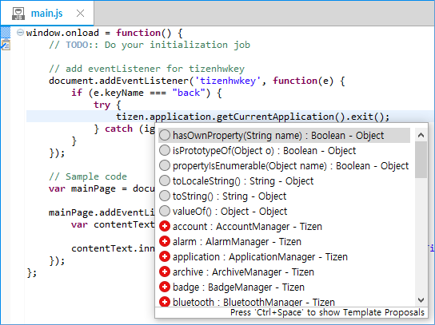

# Speeding Up Typing with Content Assist
## Dependencies
- Tizen Studio 1.0 and Higher

Content assist is a function provided in parts of the Tizen Studio to help you write code faster and more efficiently.

Content assist allows you to quickly type names in the context of the code. For example, you can simply type in the first letter as lowercase (or uppercase for a type or variable name), and press **Ctrl + Space** to be offered all the choices that match the entered letters and are valid for the current context (class name, interface name, variable, or field names).

The Tizen Studio supports Web API, W3C API, jQuery API, and jQuery Mobile API. The content assist functionality can be expanded with support for user-defined and third party APIs.

**Figure: Content assist in the JavaScript editor**

## Using the Content Assist

To use the content assist in the source editor (JavaScript editor, CSS editor or HTML editor):

1. Press **Ctrl + Space** to complete the code. 

   A list of available content assist options appear.

2. Press **Enter** or click on the selected line to insert the selection in the editor. 

   Navigate and select lines in the list with the arrow keys or by scrolling the mouse. This displays the JSDoc information for the selected line.

## Adding User-defined APIs

To activate the content assist for user-defined and third-party APIs:

1. Prepare an API definition document using the WIDL (Web Interface Definition Language) standard. 

   The Tizen Studio supports the `.xml` and `.widlprocxml` files.

2. Add the definition file in the `config.xml` file. 

   For more information, see [Specifying Privileges in the Privilege Tab](https://developer.tizen.org/development/training/web-application/application-development-process/setting-project-properties#privilege).