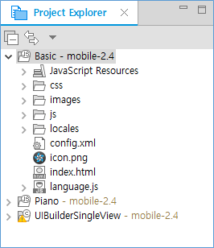
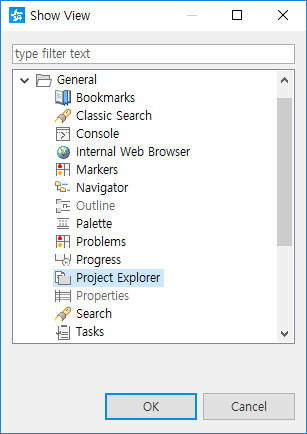
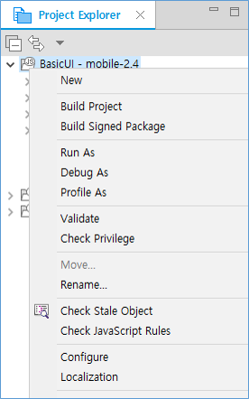

# Managing Tizen Projects with Project Explorer View
## Dependencies
- Tizen Studio 1.0 and Higher

The **Project Explorer** view allows you to view and manage Tizen projects. You can view and change the resources of a project in the view, and build, export, and convert projects through the view.

**Figure: Project Explorer**

 

In this view, you can:

- Browse the file elements
- Open files in the editor view
- Open projects in a new window
- Create new projects, classes, files, or folders
- Manage existing files (cut, paste, delete, move, or rename files)
- Restore deleted files from local history
- Import or export files and projects

## Opening the Project Explorer View

Usually, the **Project Explorer** view is located in the upper-left side of the Tizen Studio. You can change the position by dragging and dropping it. If you close the view, you can show it again by selecting **Project Explorer** in **Window > Show View > Other > General**.

**Figure: Opening the view**

 

## Using the Project Explorer View

The files that you select in the **Project Explorer** view affect the information that is displayed in the other views. You can execute and set some operations and configurations by clicking the icons () in the toolbar.

**Figure: Executing operations**

 

To execute operations, such as copying, moving, creating new resources, and comparing resources with each other, right-click on any resource in the **Project Explorer** view, and select the desired action in the context menu. The items in the context menu depend on the focused item. Different folder and file types have different action options.

**Table: Project Explorer toolbar**

| Icon                                     | Name                 | Description                              |
| ---------------------------------------- | -------------------- | ---------------------------------------- |
|  | **Collapse all**     | Collapses the tree expansion state of all resources in the view. |
|  | **Link with editor** | Toggles whether the view selection is linked to the active editor. When this option is selected, changing the active editor automatically updates the selection to the resource being edited. |
|  | **Menu**             | Click the icon to open a menu of items specific to the view:  **Project Presentation**	  Display projects in a flat or hierarchical form. **Top Level Elements**	  Show working sets or projects as top-level elements.  Choosing working sets allows easy grouping of projects in large workspaces. **Folder Presentation**	  Display folders in a flat or grouped form. **Select Working Set**	  Open a dialog to select a working set for the view. **Deselect Working Set**	  Deselect the current working set. **Edit Active Working Set**	  Open a dialog to change the current working set. **Customize View**	  Allow customization of view filters and content modules. The filters allow you to suppress the display of certain types of files while the content modules allow entirely new types of content to be shown in the view. **Link Editor**	  See the toolbar item description above. |

**Table: Project Explorer context menu**

| Menu                         | Description                              |
| ---------------------------- | ---------------------------------------- |
| **New**                      | Allows you to create a new resource in the workbench. Select the type of resource to create from the submenu. |
| **Copy**                     | Copies the selected resource to the clipboard. |
| **Paste**                    | Pastes resources on the clipboard into the selected project or folder. If a resource is selected, the resources on the clipboard are pasted as siblings of the selected resource. |
| **Delete**                   | Deletes the selected resource from the workspace. |
| **Move**                     | Moves the selected resource to another location. A dialog appears, prompting for the destination location to which the resource are to be moved. |
| **Rename**                   | Allows you to specify a new name for the selected resource. |
| **Import**                   | Opens the import wizard and allows you to select the resources to import into the workbench. |
| **Export**                   | Opens the export wizard and allows you to export the resources to an external location. |
| **Export to CLI project**    | Exports the Tizen Studio native project to a CLI (command line interface) project. This option also makes or converts some files. |
| **Build Signed Package**     | Makes a 'signed' package. This option requires a certificate profile. You can create a certificate profile in **Tools > Certificate Manager**. |
| **Localization**             | Opens the localization view and allows you to add or update languages and localize the string or resources. |
| **Refresh**                  | Refreshes the **Workbench** view of the selected resource and its children. For example, this is used when you create a new file for an existing project outside the **Workbench** and want the file to appear in the **Project Explorer** view. |
| **Close Project**            | Closes the selected project (visible when an open project is selected). |
| **Close Unrelated Projects** | Closes any project unrelated to the selected project. |
| **Open Project**             | Opens the selected project (visible when a closed project is selected). |
| **Team**                     | Menu items in the **Team** sub-menu are related to version control management and are determined by the version control management system that is associated with the project. Eclipse provides the special menu item **Share Project...** for projects that are not under version control management. This command presents a wizard that allows you to share the project with any version control management systems that have been added to Eclipse. Eclipse ships with support for CVS. |
| **Compare With**             | Allows you to do one of the following types of compares:     - Compare 2 or 3 selected resources with each other.   - Compare the selected resource with remote versions (if the project is associated with a version control management system).   - Compare the selected resource with a local history state.	 After you select the type of compare you want to do, you either see a compare editor or a compare dialog. In the compare editor, you can browse and copy various changes between the compared resources.  In the compare dialog, you can only browse through the changes. |
| **Replace With**             | Allows you to replace the selected resource with another state from the local history. If the project is under version control management, there can be additional items supplied by the version control management system as well. |
| **Properties**               | Displays the properties of the selected resource. The displayed properties depend on what type of resource is selected. Resource properties can include (but are not limited to):     - Path relative to the project in which it is held   - Type of the resource   - Absolute file system path, or name of the path variable when using linked resources   - Resolved path variable when using a path variable for a linked resource   - Size of the resource   - Last modified date   - Read-only status   - Derived resource status   - Execution arguments, if it is an executable resource   - Program launchers, if it is able to be launched   - Project dependencies, if any |