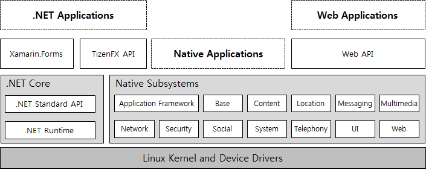
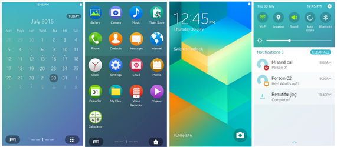
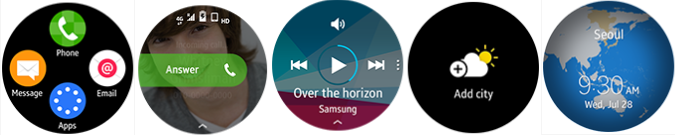

# Training 

**Welcome to Tizen!**

Tizen is a user-interactive and service-oriented open source project
that allows you to create feature-rich applications for multiple device
categories.

Tizen is designed to be equally friendly to embedded systems developers
and Web developers alike, and its flexible nature encourages its use on
an array of devices, including TVs, smart phones, watches, tablets,
in-vehicle infotainment systems, and smart appliances. Tizen provides a
Native API that provides the benefits of building software for embedded
systems in C; it also provides a Web API that allows you to create
simple programs using only HTML5, CSS, and JavaScript.

To get started with the development of your own Tizen applications:

-   [Create your first simple native
    application](native/getting-started-n.md), and learn about the main
    features available for implementing your dream application.
-   [Create your first simple Web
    application](web/getting-started-w.md), and learn about the main
    features available for implementing your dream application.
-   [Create your first Tizen .NET application](dotnet/first-app.md),
    and learn about the main features available for implementing your
    dream application.

## Tizen Application Types

The Tizen platform supports 3 primary application types:

-   [Native application](native/cover-page-n.md) is developed using C
    and can access more advanced device-specific features, such as
    camera, GPS, and accelerometer in addition to more advanced system
    settings and functionality.

    The native applications use the Native API, which provides all of
    the memory management and performance benefits that come with
    building applications for Linux in C. The Native API is extremely
    helpful, as it includes dozens of API modules that cover a large
    range of capabilities. It provides numerous interfaces to much of
    the hardware that is found in modern mobile and wearable devices,
    and does so in an environment that is tailored for
    limited resources.

-   [Web application](web/cover-page-w.md) is essentially a Web site
    stored on your device and built using Web-native languages, such as
    HTML5, CSS, and JavaScript. The Web application uses the Tizen Web
    Framework to interact with the native subsystems.

    The Web applications use the Web API, which is a standard Web
    application project structure with basic elements. The Web API is
    designed to allow you to easily build applications using
    Web-native languages.

    A program built using the Web API is laid out much like a standard
    Web site. It has an `index.html` file that serves as the root, and
    separate directories for resources, such as JavaScript, CSS, images,
    and sound resources. This approach makes Web application development
    in Tizen extremely intuitive for developers with a background in Web
    development, and makes it easy to quickly write simple applications
    using high-level languages.

-   [Tizen .NET application](dotnet/overview.md) is a new way to
    develop applications for the Tizen operating system, running on 50
    million Samsung devices, including TVs, wearables, mobile devices,
    and many other IoT devices around the world. The existing Tizen
    frameworks are either C-based with no advantages of a managed
    runtime, or HTML5-based with fewer features and lower performance
    than the C-based solution.

    With Tizen .NET, you can use the C\# programming language and the
    Common Language Infrastructure standards and benefit from a managed
    runtime for faster application development, and efficient, secure
    code execution.

The following figure illustrates the Tizen architecture model supporting
the 3 application types.

**Figure: Tizen architecture**

The Tizen platform also allows you to develop a hybrid application
package where native and Web applications are packaged together to make
more powerful applications. The Tizen platform ensures that all Tizen
applications have consistent look and feel, regardless of whether you
use the native or Web framework to create them.

Tizen Profiles 
Tizen is built to work on a wide variety of platforms with a focus on
embedded devices. In order to accommodate the various types of devices,
a set of profiles has been defined to make it easier to develop
applications for specific purposes and device types. Since Tizen 3.0,
there are 3 profile types you can choose from: mobile, wearable, and TV.
The mobile profile is designed for smart phones, the wearable profile is
designed for smart watches, and the TV profile is designed for smart
TVs.

Both mobile and wearable profiles are supported in native and Web
application types. The TV profile is supported in the Web application
type only.

**Figure: Applications using the mobile profile**

**Figure: Applications using the wearable profile**

**Figure: Applications using the TV profile**

## Tizen Documentation 

To make the most of your Tizen applications, get familiar with the Tizen
documentation:

-   [Training](./cover-page.md)

    The training section provides overall information you need to become
    familiar with Tizen programming and the Tizen application model. Its
    Getting Started sections also walk you through creating your first
    Tizen application.

-   [Guides](../guides/cover-page.md)

    The Tizen guides introduce the various features that you can use in
    creating Tizen applications, and teach you how to incorporate them
    into your application. They also instruct you in planning and
    developing a user interface for your application. The guides contain
    detailed code examples to help you write the required code
    in practice.

-   [API References](../../org.tizen.web.apireference/html/cover_page.htm)

    The Tizen API References provide descriptions of all the Tizen API
    domains, subdomains, classes, interfaces, functions, and methods.

-   [Samples](https://developer.tizen.org/development/sample)

    The Tizen sample descriptions introduce the sample applications
    provided in the Tizen Studio.

-   [Tizen Studio](../tizen-studio/cover-page.md)

    The Tizen Studio introduces the Tizen development environment and
    related tools you can use when developing your Tizen application.

-   [Visual Studio Tools for Tizen](../vstools/download.md)

    The Visual Studio Tools for Tizen introduces the Tizen development
    environment and related tools you can use when developing your Tizen
    .NET application.

When using the Tizen documentation, look for the profile icons in the
upper-right corner of each page. The icons (listed in the following
table) indicate which profiles the topic applies to. "N" in the icon
stands for the native application profiles and "W" for the Web
application profiles.

**Table: Tizen profiles**

| Profile                 | Icon                                     |
| ----------------------- | ---------------------------------------- |
| Mobile native and Web   |         |
| Wearable native and Web |     |
| Mobile native           |  or  |
| Wearable native         |  or  |
| Mobile Web              |  or  |
| Wearable Web            |  or  |
| TV Web                  |  or  |

**Note**  
> In Tizen native APIs and Web Device APIs, there are 2 types of APIs: mandatory and optional. The fully gray profile icon (as shown in the table above) refers to an optional API.

The mandatory APIs are always available on all Tizen devices. The optional APIs provide functionality that depends on the available device
hardware or software capabilities, and they may not be available on all Tizen devices.

To become familiar with some terms that you encounter throughout this site, see [Glossary](https://developer.tizen.org/development/getting-started/glossary).
To see the trademark notice list, see [Trademarks](https://developer.tizen.org/development/training/trademarks).
