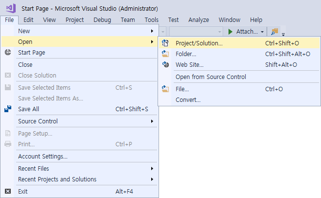
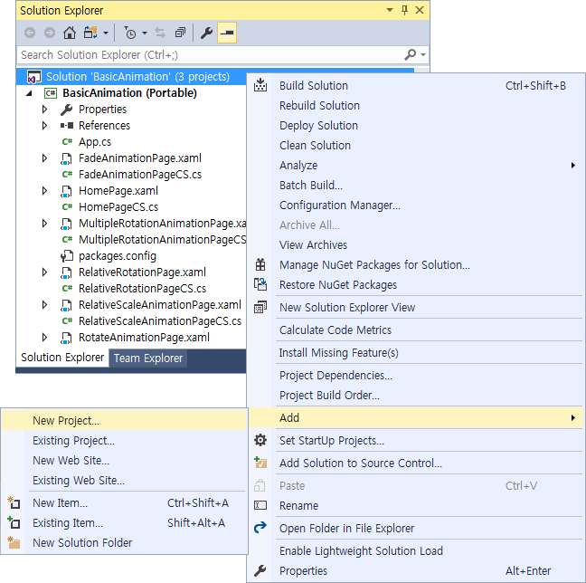
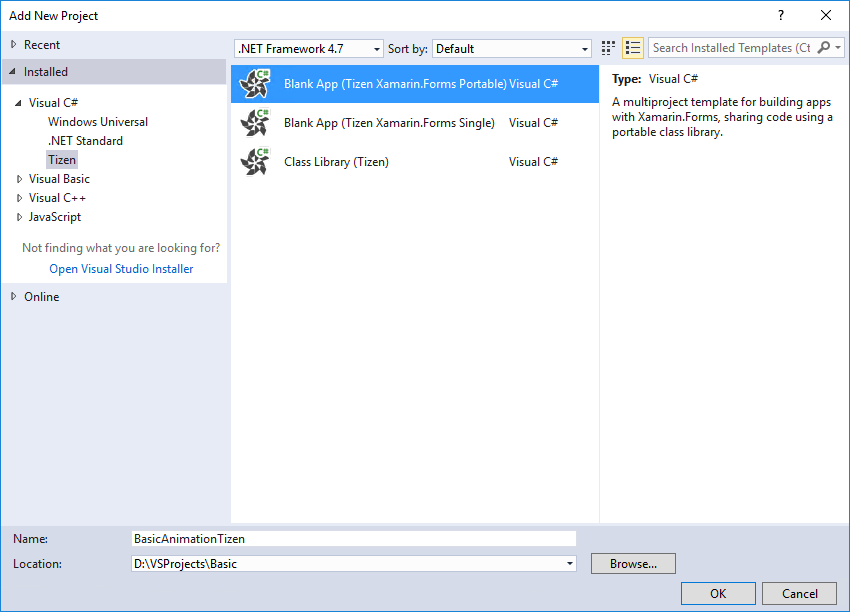
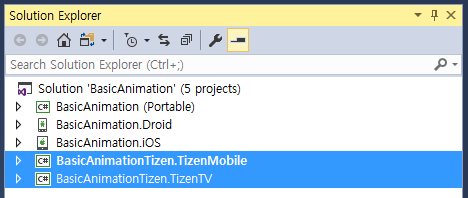
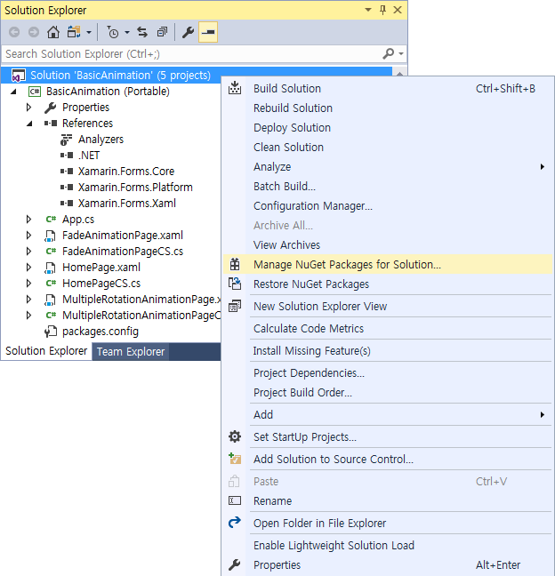
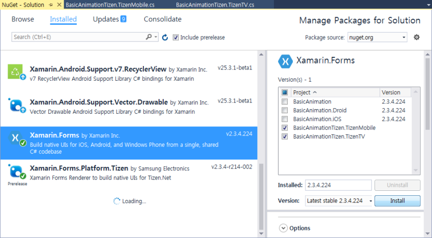
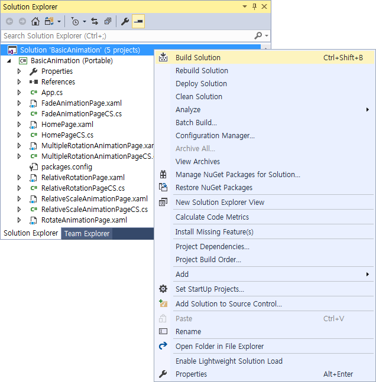
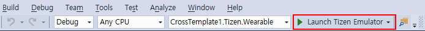
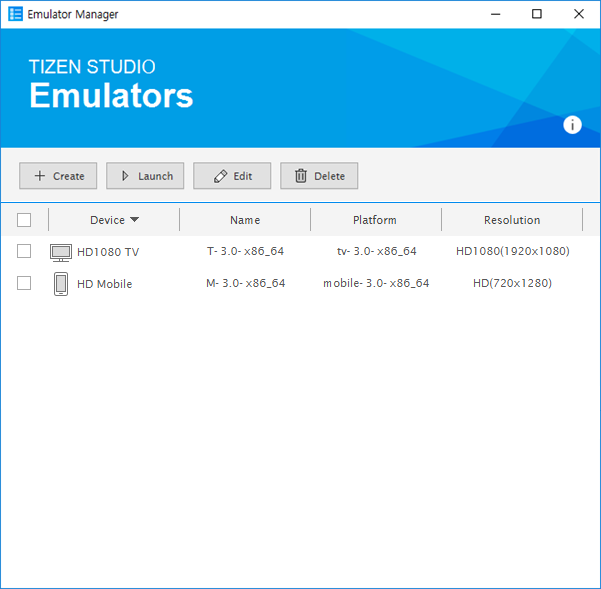
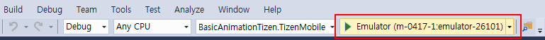

Porting Xamarin.Forms Applications to Tizen
===========================================

As Tizen embraces .NET and Xamarin.Forms for better development
environments, it creates opportunities for cross-platform application
developers. To manage cross-platform development, you must be able to
port existing Xamarin.Forms applications to the Tizen OS. In practice,
this means that you can add a Tizen-specific project for an existing
cross-platform solution, which already contains projects for, for
example, Android, iOS, and Universal Windows Platform (UWP). When
developing the Tizen-specific project, you can reuse the shared
Xamarin.Forms code from the portable project within the solution.

**Note** Before porting, make sure that [Visual Studio Tools for
Tizen](../../../vstools/html/download.htm) is installed on your system.

The following sections describe how to port a Xamarin Forms sample
application to Tizen.

Opening a Xamarin.Forms Sample Application 
------------------------------------------

You can find various sample applications at [Xamarin.Forms
Samples](https://developer.xamarin.com/samples/xamarin-forms/all/).
Among them, the [Basic
Animation](https://developer.xamarin.com/samples/xamarin-forms/UserInterface/Animation/Basic/)
application shows the implementation of simple animations, such as
rotating, scaling, and fading. The sample consists of a shared project
and multiple platform-dependent projects for Android, iOS, and Universal
Windows Platform (UWP).

To open the sample application in Visual Studio:

1.  Download and extract the [source code of the Basic Animation
    sample](https://developer.xamarin.com/samples/xamarin-forms/UserInterface/Animation/Basic/Basic.zip)
    from the Xamarin sample site.
2. Launch Visual Studio.
3. In the Visual Studio menu, go to **File &gt; Open &gt;
    Project/Solution** and select `BasicAnimation.sln` from within the
    extracted sample.

    

Adding a Tizen-dependent Project 
--------------------------------

By reusing the shared code from the sample solution in a new Tizen
project, you can build the Basic Animation application for Tizen with
minimal coding.

To add a Tizen-dependent project to the sample application solution:

1.  In the **Solution Explorer** view, right-click the solution and
    select **Add &gt; New Project**.

    

2. Select **Visual C\# &gt; Tizen &gt; Blank App (Tizen
    Xamarin.Forms Portable)**, enter a name and location for the Tizen
    project, and click **OK**.

    

3. In the Tizen Project Wizard, select the applicable profiles and
    click **OK**.

    

    The **Solution Explorer** shows that new profile-specific Tizen
    projects are added to the existing Xamarin.Forms solution. In this
    case, since 2 profiles were selected, 2 new projects are added.

    **Figure: Added Tizen projects**

    

4. Since the Tizen projects have dependencies with the Xamarin.Forms
    NuGet package version, you must install the Xamarin.Forms NuGet
    package that has the same version as Xamarin.Forms.Platform.Tizen.
    Mismatched NuGet versions can cause build or packaging problems.
    a.  Right-click **Solution 'BasicAnimation'** and select **Manage
        NuGet Packages for Solution**.

        

    b.  In the **Installed** tab, select **Xamarin.Forms**. If there are
        mismatched versions between the PCL (Portable Class Library)
        project and the newly-added projects, install the latest
        Xamarin.Forms version.
        
        

5. To build the solution, in the main menu of Visual Studio, select
    **Build &gt; Build Solution**.

    Alternatively, you can right-click the solution in the **Solution
    Explorer** and select **Build Solution**.

    

6. Copy the necessary image file for the animation from the Android
    project (`Droid/Resources/drawable/monkey.png`) to the Tizen
    projects (`BasicAnimationTizen.TizenMobile/res` and
    `BasicAnimationTizen.TizenTV/res`).

Deploying and Running the Application 
-------------------------------------

To run the application, you must first deploy it to the target: either a
device or an emulator. Deploying means transferring the package file
(`.tpk`) to the target and invoking the Tizen package manager to install
it.

To deploy and run the application on the emulator:

1.  In the Visual Studio menu, select **Tools &gt; Tizen &gt; Tizen
    Emulator Manager**.

    Alternatively, you can launch the Tizen emulator using the Visual
    Studio toolbar as shown in the following figure:

    

2. In the Emulator Manager, select an emulator instance from the list
    and click **Launch**.

    If no applicable emulator instance exists, [create
    one](../tools/emulator_manager.htm#create).

    

3. Once you launch an emulator instance, you can run the application by
    clicking the emulator instance in the Visual Studio toolbar.

    

    The following figure shows the Basic Animation Xamarin.Forms sample
    application running on the Tizen mobile emulator.

    **Figure: Basic Animation sample application**

    

Sample UI on Various Platforms 
------------------------------

The following screenshots display the UI of the Basic Animation sample
on different mobile platforms and the Tizen TV emulator. Since Tizen
.NET supports the TV profile, you can port the Xamarin applications to
the Tizen TV as well as the Tizen mobile profile in the Tizen Project
Wizard.

**Figure: Basic Animation sample on different platforms**

