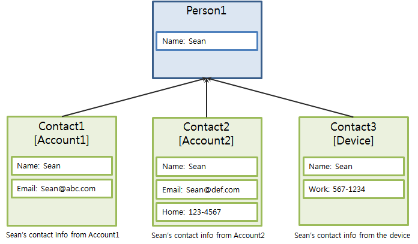

# Basic Concepts

To be able to use contact features in your application, you must first
understand how the basic concepts of **contact** and **person** are
related, and how the contact information is stored in the Contacts
database using records and views.

<a name="contacts"></a>
## Contacts and Persons

The contact and person are 2 different concepts:

-   A contact object is a collection of information related to a
    physical person, such as their name, phone numbers, addresses, email
    addresses, birthday, and organizations. A contact object is always
    associated with a specific address book. When a contact is
    successfully added, a contact ID, which is unique within the address
    book, is given to the contact.

-   A person object is an aggregation of 1 or more contacts associated
    with the same physical person. A person is created automatically
    when a contact record is inserted in the Contacts database. A person
    record cannot be created directly, and every contact must be linked
    to at least 1 person.

The following figure illustrates the contact structure. The example
shows 3 instances of the same contact stored in different address books.
Person1 is an aggregation of all 3 instances (Contact1, Contact2, and
Contact3).

**Figure: Contact structure**



<a name="records"></a>
## Records and Views

Records and views are important concepts in the Contacts API. Although a
record represents an actual record in the internal database, you can
consider it a piece of information, like an address, a phone number, or
a group of contacts. A record can be a complex set of data, containing
other data. For example, an address record contains country, region, and
street information.

Records contain properties of basic types:

-   `integer`
-   `string`
-   `boolean`
-   `long integer`
-   `long long integer` (`lli`)
-   `double`

The following table lists the functions for setting and getting
different record property types.

**Table: Functions for specific record property types**

| Property type       | Setter function                | Getter function                |
| ------------------- | ------------------------------ | ------------------------------ |
| `string`            | `contacts_record_set_str()`    | `contacts_record_get_str()`    |
| `integer`           | `contacts_record_set_int()`    | `contacts_record_get_int()`    |
| `boolean`           | `contacts_record_set_bool()`   | `contacts_record_get_bool()`   |
| `long long integer` | `contacts_record_set_lli()`    | `contacts_record_get_lli()`    |
| `double`            | `contacts_record_set_double()` | `contacts_record_get_double()` |

A view is a structure describing the record properties, where the
property elements have their data types and names. For example, the
`_contacts_contact` view describes the properties of the contact record,
part of which is listed in the following table.

**Table: Some contact record properties**

| Property ID    | Type      | Description                              |
| -------------- | --------- | ---------------------------------------- |
| `uri`          | `string`  | Identifier of this contact view          |
| `id`           | `integer` | Database record ID of the contact        |
| `display_name` | `string`  | Display name of the contact              |
| `is_favorite`  | `boolean` | `boolean` value indicating whether the contact is a favorite |
| `name`         | Record    | `_contacts_name` child record containing the contact name details |
| `company`      | Record    | `_contacts_company` child record containing the contact's company details |
| `address`      | Record    | `_contacts_address` child record containing the contact address details |

Every view has a special field (`_uri`) that uniquely identifies the
view. In many cases, you must provide the `_uri` value to indicate what
type of record you want to operate on. The following example code
creates a contact record and obtains the record handle using the
`_contacts_contact._uri` property:

```c++
contacts_record_h contact = NULL;

contacts_record_create(_contacts_contact._uri, &contact);
```
