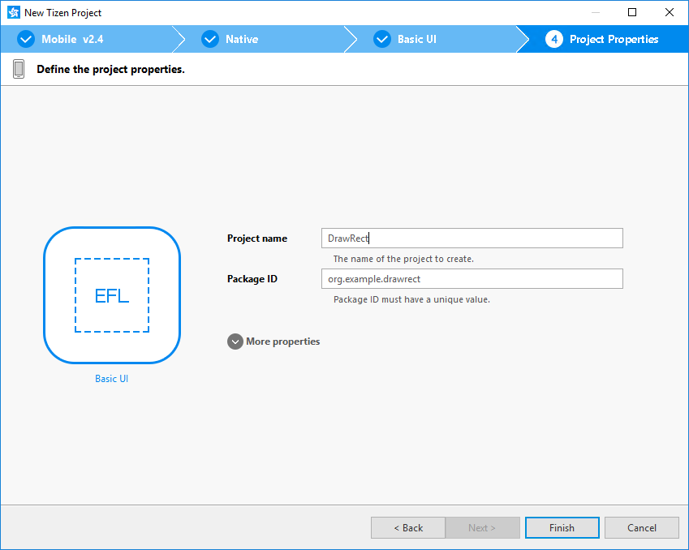
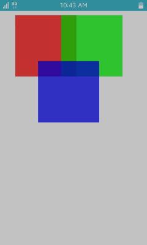

Squares on the Canvas
=====================

To handle simple graphics elements in your application, start by
learning how to draw a square on the screen. When you add multiple
squares that overlap each other, you can see how their colors change due
to the semi-transparent colors and overlays.

To draw squares on the screen, you need to use a canvas. In EFL, the
Evas library provides the canvas. All shapes drawn on Evas are created
as Evas objects.

The following example is created using the **Basic UI** template as a
source code. To create a new project:

1.  In the Tizen Studio menu, select **File &gt; New &gt; Tizen
    Project**.

    

2. In the Project Wizard, select **Template** as the project type,
    **MOBILE** profile and applicable version, **Native Application**
    type, and **Basic UI** template.
3. Enter **DrawRect** in the **Project name** field.

    

4. Click **Finish**.

After the project is created, modify the template to create the
application with 3 squares:

1.  Open the `.c` source file in the `src` folder and add the new code
    to the `create_base_gui()` function.

    The following functions are used to create the squares:

    -   `evas_object_evas_get()` retrieves the Evas handler from the
        window object, which is embedded into the Evas object parameter.
    -   `evas_object_rectangle_add()` creates a rectangle object on
        a canvas.
    -   `evas_object_color_set()` specifies a color for a shape. The
        parameters are Red, Green, Blue, and semi-transparency. For
        example, entering `255, 0, 0, 192` creates a
        semi-transparent red.
    -   `evas_object_move()` moves objects to a given location. The
        first parameter indicates the object, and the second and third
        parameters indicate the horizontal and vertical position.
    -   `evas_object_resize()` changes the size of the object. The first
        parameter indicates the object, and the second and third
        parameters indicates the width and height.

    The label is not used in this example, so annotate it.

    ```
    /*
       Conformant
       Create and initialize elm_conformant
       elm_conformant is mandatory for the base GUI to have a proper size
       when the indicator or virtual keypad is visible
    */
    ad->conform = elm_conformant_add(ad->win);
    elm_win_indicator_mode_set(ad->win, ELM_WIN_INDICATOR_SHOW);
    elm_win_indicator_opacity_set(ad->win, ELM_WIN_INDICATOR_OPAQUE);
    evas_object_size_hint_weight_set(ad->conform, EVAS_HINT_EXPAND, EVAS_HINT_EXPAND);
    elm_win_resize_object_add(ad->win, ad->conform);
    evas_object_show(ad->conform);
    /*
       Label
       Create an actual view of the base GUI
       Modify this part to change the view
    */
    #if 0 /* _NOT_USED */
        ad->label = elm_label_add(ad->conform);
        elm_object_text_set(ad->label, "<align=center>Hello Tizen</align>");
        evas_object_size_hint_weight_set(ad->label, EVAS_HINT_EXPAND, EVAS_HINT_EXPAND);
        elm_object_content_set(ad->conform, ad->label);
    #endif

    /* Evas */
    Evas  *evas = evas_object_evas_get(ad->conform);

    /* Add a rectangle to the given Evas */
    Evas_Object *rect = evas_object_rectangle_add(evas);
    /* Set the general/main color of the Evas object to the given one */
    evas_object_color_set(rect, 255, 0, 0, 192);
    /* Move the Evas object to the given location inside its canvas viewpoint */
    evas_object_move(rect, 50, 50);
    /* Change the size of the Evas object */
    evas_object_resize(rect, 200, 200);
    /* Make the Evas object visible */
    evas_object_show(rect);

    Evas  *evas2 = evas_object_evas_get(ad->conform);
    Evas_Object *rect2 = evas_object_rectangle_add(evas2);
    evas_object_color_set(rect2, 0, 255, 0, 192);
    evas_object_move(rect2, 200, 50);
    evas_object_resize(rect2, 200, 200);
    evas_object_show(rect2);

    Evas *evas3 = evas_object_evas_get(ad->conform);
    Evas_Object *rect3 = evas_object_rectangle_add(evas3);
    evas_object_color_set(rect3, 0, 0, 255, 192);
    evas_object_move(rect3, 125, 200);
    evas_object_resize(rect3, 200, 200);
    evas_object_show(rect3);

    /* Show the window after the base GUI is set up */
    evas_object_show(ad->win);
    ```

2. Build and run the application.

    The 3 squares are displayed on the screen. The colors of the
    overlaid areas change to their intermediate colors because
    semi-transparency has been applied.

    


